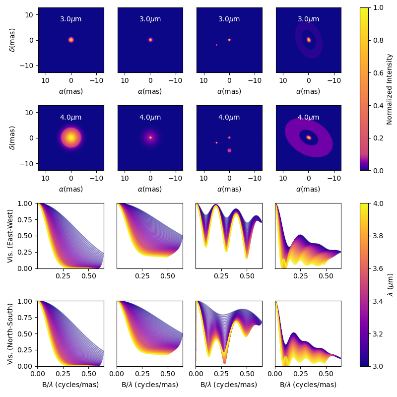
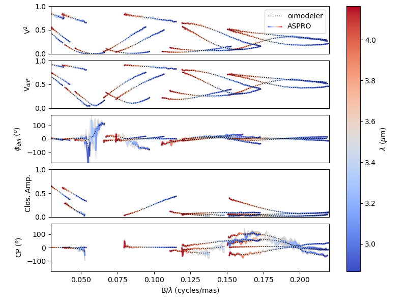

# oimodeler

#### A modular modelling tool for optical interferometry

See full documentation [here](https://oimodeler.readthedocs.io/en/latest/)

Modules:
* **oimModel** : Create models with various components as bricks 
* **oimData** :  Handle interferometric, spectroscopic and photometric data
* **oimDataFilter** : Filtering and modifying data (wavlengths range cut, smoothing, removing flags...)  
* **oimSimulator** : Main class holding evertyhing together and producing final results :plots, tables...
* **oimFitter** : Define and perform model-fitting   
* **oimPlot** : Plotting tools
* **oimUtils** : Various utility for optical-interferometry

>:warning: In early development. Partially implemented:     
>* oimModel: Fourier and image plans components. Chromaticity and time dependence of components and parameters. 
>* oimData: only interferometric data   
>*oimDataFilter: Wavlengths range cut, datatype selection
>* oimSimulator: Simulated data and chi2 computation with filtering
>* oimPlot: Basics plots of oifits data (see example below)    
>* oimUtils: mainly helpers for oifits format (get information, create new tables...)

#### Various example scripts are available in the examples directory. 

Here is the resulting plot from the createModelChromatic.py script.

 
Here is the resulting plot from the oimodel_Create_simulator_data.py script.    
It plots data of a partly resolved binary created with:
- the [ASPRO](https://www.jmmc.fr/english/tools/proposal-preparation/aspro/) software from JMMC (including realistic noise)
- oimodeler using a shifted uniform disk + unresolved component

Here is a plot showing a model consisting of a fast rotating star plus a uniform disk. Chromatic images of fast rotator are computed with an external function encapsulated into a oimodeler component. The uniform disk is a simple Fourier-based component. The code is in the createCustomComponentImageFastRotator.py

