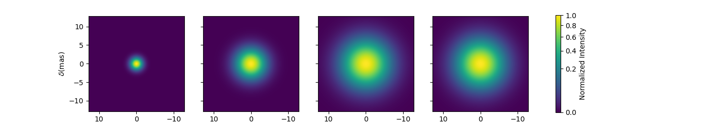
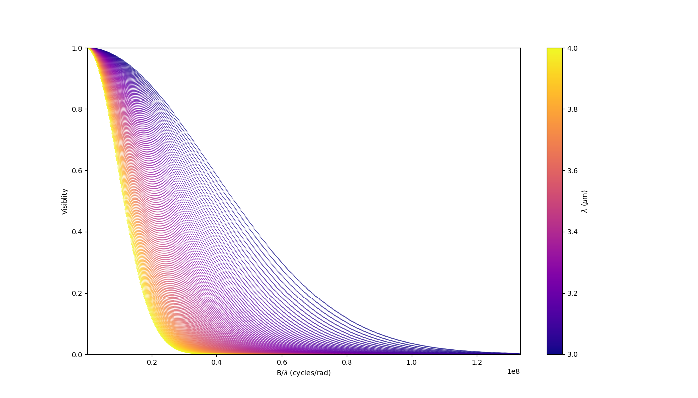
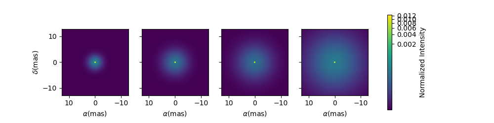
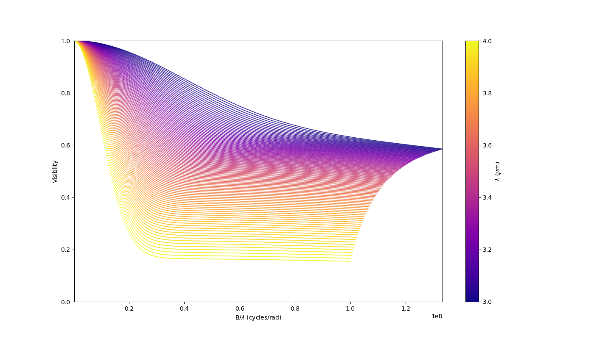
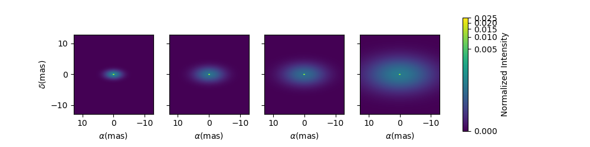
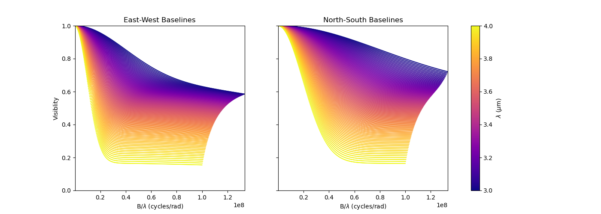
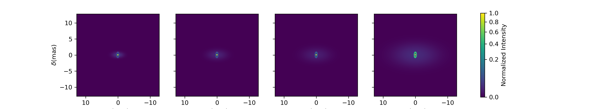
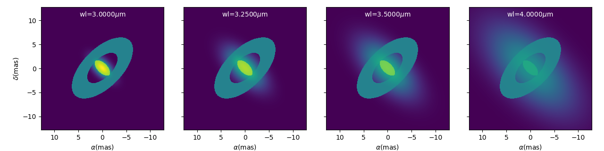
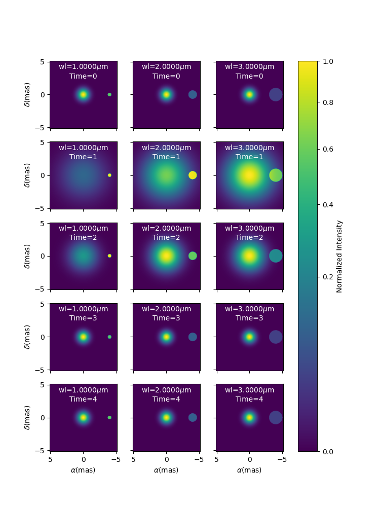

..  _advancedExamples:

Advanced Examples
-----------------

Building Complex models
^^^^^^^^^^^^^^^^^^^^^^^

In the example `complexModel.py <https://github.com/oimodeler/oimodeler/blob/main/examples/BasicExamples/complexModels.py>`_ we create and play with more complex Fourier-based models with includes:

- flatenning of some components
- linked parameters between components
- Chromaticity of some parameters

First we import the useful packages and create a set of spatial frequencies and wavelengths to be used to generate visibilities.

.. code-block:: python

    import oimodeler as oim
    import numpy as np
    import matplotlib.pyplot as plt
    
    
    
    nB=100 #number of baselines 
    nwl=100 #number of walvengths

    #Create some spatial frequencies
    wl=np.linspace(3e-6,4e-6,num=nwl)
    B=np.linspace(0,150,num=nB)
    Bs=np.tile(B,(nwl,1)).flatten()
    
    wls=np.transpose(np.tile(wl,(nB,1))).flatten()
    spf=Bs/wls
    
Unlike in the previous example with the grey data, we create a 2D-array for the spatial frequencies of ``nB`` baselines by ``nwl`` wavelengths. The wavlength vector is tiled itself to have the same length as the spatial frequency vector. Finally, we flatten the vector to be passed to the getComplexCoherentFlux method.

Let's create our first chromatic components. Chromaticity can added to grey Fourier-based model by using the oimInterpWl when creating a new component.

.. code-block:: python

    g=oim.oimGauss(fwhm=oim.oimInterpWl([3e-6,4e-6],[2,8]))
    
We have created a Gaussian component with a fwhm growing from 2 mas at 3 microns to 8 mas at 4 microns.
We can access to the interpolated value of the parameters using the call operator ().

.. code-block:: python

    print(g.params['fwhm']([3e-6,3.5e-6,4e-6,4.5e-6]))

.. code-block:: python
    
    >>[2. 5. 8. 8.]
    
The values are interpolated within the wavelength range [3e-6,4e-6] and fixed beyond this range.

Let's build a simple model with this component and plot the images at few wavelengths and the visibilities for the baselines we created before.

.. code-block:: python

    vis=np.abs(mg.getComplexCoherentFlux(spf,spf*0,wls)).reshape(len(wl),len(B))
    vis/=np.outer(np.max(vis,axis=1),np.ones(nB))

    figGv,axGv=plt.subplots(1,1,figsize=(14,8))
    sc=axGv.scatter(spf,vis,c=wls*1e6,s=0.2,cmap="plasma")
    figGv.colorbar(sc, ax=axGv,label="$\\lambda$ ($\\mu$m)")
    axGv.set_xlabel("B/$\\lambda$ (cycles/rad)")
    axGv.set_ylabel("Visiblity")
    axGv.margins(0,0)
    

Now let's add a second component: a uniform disk with a chromatic flux.

.. code-block:: python
    
    ud=oim.oimUD(d=0.5,f=oim.oimInterpWl([3e-6,4e-6],[2,0.2]))
    m2=oim.oimModel([ud,g])

    fig2im,ax2im,im2 = m2.showModel(256,0.1,wl=[3e-6,3.25e-6,3.5e-6,4e-6],figsize=(3.5,2.5))
    vis=np.abs(m2.getComplexCoherentFlux(spf,spf*0,wls)).reshape(len(wl),len(B))
    vis/=np.outer(np.max(vis,axis=1),np.ones(nB))

    fig2v,ax2v=plt.subplots(1,1,figsize=(14,8))
    sc=ax2v.scatter(spf,vis,c=wls*1e6,s=0.2,cmap="plasma")
    fig2v.colorbar(sc, ax=ax2v,label="$\\lambda$ ($\\mu$m)")
    ax2v.set_xlabel("B/$\\lambda$ (cycles/rad)")
    ax2v.set_ylabel("Visiblity")
    ax2v.margins(0,0)
    ax2v.set_ylim(0,1)

    

Now let's create a similar model but with elongated components. We will replace the uniform disk by an ellipse and the Gaussian by an elongated Gaussian.

.. code-block:: python

    eg=oim.oimEGauss(fwhm=oim.oimInterpWl([3e-6,4e-6],[2,8]),elong=2,pa=90)
    el=oim.oimEllipse(d=0.5,f=oim.oimInterpWl([3e-6,4e-6],[2,0.1]),elong=2, pa=90)

    m3=oim.oimModel([el,eg])
    fig3im,ax3im,im3 = m3.showModel(256,0.1,wl=[3e-6,3.25e-6,3.5e-6,4e-6],figsize=(3.5,2.5),normPow=0.2)

Now that our model is no more circular, we need to take care of the baselines orientations. Let's plot both North-South and East-West baselines.

.. code-block:: python

    fig3v,ax3v=plt.subplots(1,2,figsize=(14,5),sharex=True,sharey=True)

    # East-West
    vis = np.abs(m3.getComplexCoherentFlux(spf, spf*0, wls)).reshape(len(wl), len(B))
    vis /= np.outer(np.max(vis, axis=1), np.ones(nB))
    ax3v[0].scatter(spf, vis, c=wls*1e6, s=0.2, cmap="plasma")
    ax3v[0].set_title("East-West Baselines")
    ax3v[0].margins(0, 0)
    ax3v[0].set_ylim(0, 1)
    ax3v[0].set_xlabel("B/$\\lambda$ (cycles/rad)")
    ax3v[0].set_ylabel("Visiblity")

    # North-South
    vis = np.abs(m3.getComplexCoherentFlux(spf*0, spf, wls)).reshape(len(wl), len(B))
    vis /= np.outer(np.max(vis, axis=1), np.ones(nB))
    sc = ax3v[1].scatter(spf, vis, c=wls*1e6, s=0.2, cmap="plasma")
    ax3v[1].set_title("North-South Baselines")
    ax3v[1].set_xlabel("B/$\\lambda$ (cycles/rad)")
    fig3v.colorbar(sc, ax=ax3v.ravel().tolist(), label="$\\lambda$ ($\\mu$m)")
    

  
  
Let's have a look at our last model free parameters.

.. code-block:: python

    print(m3.getFreeParameters())
    
   
.. code-block::   
  
    >>{'c1_eUD_f_interp1': oimParam at 0x23d9e7194f0 : f=2 ± 0  range=[-inf,inf] free=True ,
    'c1_eUD_f_interp2': oimParam at 0x23d9e719520 : f=0.2 ± 0  range=[-inf,inf] free=True ,
    'c1_eUD_elong': oimParam at 0x23d9e7192e0 : elong=2 ± 0  range=[-inf,inf] free=True ,
    'c1_eUD_pa': oimParam at 0x23d9e719490 : pa=90 ± 0 deg range=[-inf,inf] free=True ,
    'c1_eUD_d': oimParam at 0x23d9e7193a0 : d=0.5 ± 0 mas range=[-inf,inf] free=True ,
    'c2_EG_f': oimParam at 0x23d9e7191c0 : f=1 ± 0  range=[-inf,inf] free=True ,
    'c2_EG_elong': oimParam at 0x23d9e7191f0 : elong=2 ± 0  range=[-inf,inf] free=True ,
    'c2_EG_pa': oimParam at 0x23d9e719220 : pa=90 ± 0 deg range=[-inf,inf] free=True ,
    'c2_EG_fwhm_interp1': oimParam at 0x23d9e7192b0 : fwhm=2 ± 0 mas range=[-inf,inf] free=True ,
    'c2_EG_fwhm_interp2': oimParam at 0x23d9e719340 : fwhm=8 ± 0 mas range=[-inf,inf] free=True }
  
We see here that for the Ellipse (C1_eUD) the f parameter has been replaced by two independent parameters called ``c1_eUD_f_interp1`` and ``c1_eUD_f_interp2``. They represent the value of the flux at 3 and 4 microns. We could have added more reference wavelengths in our model and would have ended with more parameters. The same happens for the elongated Gaussian (C2_EG) fwhm.

Currently our model has 10 free parameters. In certain cases we might want to link or share two or more parameters. In our case, we might consider that the two components have the same ``pa`` and ``elong``. This can be done easily. To share a parameter you can just replace one parameter by another.

.. code-block:: python
   
    eg.params['elong']=el.params['elong']
    eg.params['pa']=el.params['pa']
    
    print(m3.getFreeParameters())
    
.. code-block::  

    {'c1_eUD_f_interp1': oimParam at 0x23d9e7194f0 : f=2 ± 0  range=[-inf,inf] free=True ,
    'c1_eUD_f_interp2': oimParam at 0x23d9e719520 : f=0.2 ± 0  range=[-inf,inf] free=True ,
    'c1_eUD_elong': oimParam at 0x23d9e7192e0 : elong=2 ± 0  range=[-inf,inf] free=True ,
    'c1_eUD_pa': oimParam at 0x23d9e719490 : pa=90 ± 0 deg range=[-inf,inf] free=True ,
    'c1_eUD_d': oimParam at 0x23d9e7193a0 : d=0.5 ± 0 mas range=[-inf,inf] free=True ,
    'c2_EG_f': oimParam at 0x23d9e7191c0 : f=1 ± 0  range=[-inf,inf] free=True ,
    'c2_EG_fwhm_interp1': oimParam at 0x23d9e7192b0 : fwhm=2 ± 0 mas range=[-inf,inf] free=True ,
    'c2_EG_fwhm_interp2': oimParam at 0x23d9e719340 : fwhm=8 ± 0 mas range=[-inf,inf] free=True }
    
    
That way we have reduced our number of free parameters to 8. If you change the eg.params['elong'] or el.params['elong'] values it will change both parameters are they are actually the same instance of the oimParam class.

Let's create a new model which include a elongated ring perpendicular to the Gaussian and Ellipse pa and with a inner and outer radii equals to 2 and 4 times the ellipse diameter, respectively.

.. code-block:: python

    er = oim.oimERing()

    er.params['elong']=eg.params['elong']
    er.params['pa']=oim.oimParamLinker(eg.params["pa"],"add",90)
    er.params['din']=oim.oimParamLinker(el.params["d"],"mult",2)
    er.params['dout']=oim.oimParamLinker(el.params["d"],"mult",4)

    m4= oim.oimModel([el, eg,er])

    fig4im,ax4im,im4 = m4.showModel(256, 0.1, wl=[3e-6, 3.25e-6, 3.5e-6, 4e-6], normPow=0.2,figsize=(3.5,2.5))
       
 

    
Although quite complex this models only have 9 free parameters. If we change the ellipse diameter and its position angle, the components will scale (except the Gaussian that fwhm is independent) and rotate.

.. code-block:: python

    el.params['d'].value = 4
    el.params['pa'].value = 45
        
    m4.showModel(256, 0.1, wl=[3e-6, 3.25e-6, 3.5e-6, 4e-6], normPow=0.2,figsize=(3.5,2.5))    
      

You can also add time dependent parameters to your model using oimInterpTime class which works similarly to the oimInterpWl class.

Here we create a two-components model with a time dependent Gaussian fwhm and a wavelength dependent uniform disk diameter.

.. code-block:: python

    gd1=oim.oimGauss(fwhm=oim.oimInterpTime(t=[0,1,3],value=[1,4,1]))
    ud1=oim.oimUD(d=oim.oimInterpWl(wl=[1e-6,3e-6],value=[0.5,2]),x=-4,y=0,f=0.1)

    m5=oim.oimModel(gd1,ud1)

    wls=np.array([1,2,3])*1e-6
    times=[0,1,2,3,4]

    fig5im,ax5im,im5 = m5.showModel(256,0.04,wl=wls,t=times,legend=True,figsize=(2.5,2))

