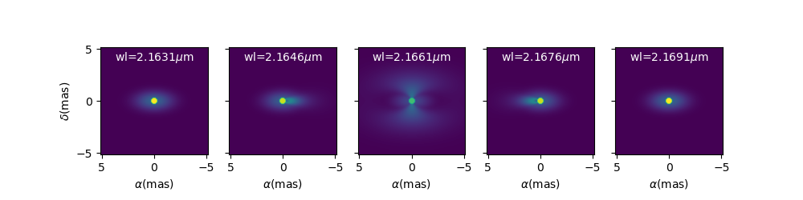

..  _advancedExamples:

Advanced Examples
-----------------

Building Complex models
^^^^^^^^^^^^^^^^^^^^^^^

In the example `complexModel.py <https://github.com/oimodeler/oimodeler/blob/main/examples/AdvancedExamples/complexModels.py>`_
we create and play with more complex Fourier-based models which includes:

- Flatenning of some components
- Linked parameters between components
- Chromaticity of some parameters

First, we import the useful packages and create a set of spatial frequencies and
wavelengths to be used to generate visibilities.

.. code-block:: python

    from pathlib import Path
    from pprint import pprint

    import numpy as np
    import oimodeler as oim

    fromFT = False
    nB = 500  # number of baselines
    nwl = 100  # number of walvengths

    wl = np.linspace(3e-6, 4e-6, num=nwl)
    B = np.linspace(1, 400, num=nB)
    Bs = np.tile(B, (nwl, 1)).flatten()
    wls = np.transpose(np.tile(wl, (nB, 1))).flatten()
    spf = Bs/wls
    spf0 = spf*0
    
    
Unlike in the previous example with the grey data, we create a 2D-array for the spatial
frequencies of ``nB`` baselines by ``nwl`` wavelengths. The wavlength vector is tiled
itself to have the same length as the spatial frequency vector. Finally, we flatten the
vector to be passed to the ``getComplexCoherentFlux`` method.

Let's create our first chromatic components. Linearly chromatic parameter can added to
grey Fourier-based model by using the :func:`oimInterp <oimodeler.oimParam.oimInterp>`
macro with the parameter ``"wl"`` when creating a new component. 

.. code-block:: python

    g = oim.oimGauss(fwhm=oim.oimInterp("wl" wl=[3e-6, 4e-6], values=[2, 8]))

    
We have created a Gaussian component with a ``fwhm`` growing from 2 mas at 3 microns
to 8 mas at 4 microns.

.. Note::
    Parameter interpolators are described in details in the :ref:`following example <paramInterpolatorExample>`.

We can access to the interpolated value of the parameters using the ``__call__``
operator of the :func:`oimParam <oimodeler.oimParam.oimParam>` class with values
passed for the wavelengths to be interpolated:

.. code-block:: python

    pprint(g.params['fwhm']([3e-6, 3.5e-6, 4e-6, 4.5e-6]))

.. code-block:: python
    
    ... [2. 5. 8. 8.]

    
The values are interpolated within the wavelength range [3e-6, 4e-6] and fixed beyond
this range.

Let's build a simple model with this component and plot the images at few wavelengths
and the visibilities for the baselines we created before.

.. code-block:: python

    vis = np.abs(mg.getComplexCoherentFlux(
        spf, spf*0, wls)).reshape(len(wl), len(B))
    vis /= np.outer(np.max(vis, axis=1), np.ones(nB))

    figGv, axGv = plt.subplots(1, 1, figsize=(14, 8))
    sc = axGv.scatter(spf, vis, c=wls*1e6, s=0.2, cmap="plasma")
    figGv.colorbar(sc, ax=axGv, label="$\\lambda$ ($\\mu$m)")
    axGv.set_xlabel("B/$\\lambda$ (cycles/rad)")
    axGv.set_ylabel("Visiblity")
    axGv.margins(0, 0)
    

.. image:: ../../images/complexModel_chromaticGaussian.png
  :alt: Alternative text 

.. image:: ../../images/complexModel_chromaticGaussianVis.png
  :alt: Alternative text 

Now let's add a second component: An uniform disk with a chromatic flux.

.. code-block:: python
    
    ud = oim.oimUD(d=0.5, f=oim.oimInterp("wl", wl=[3e-6, 4e-6], values=[2, 0.2]))
    m2 = oim.oimModel([ud, g])
    fig2im, ax2im, im2 = m2.showModel(256, 0.1, wl=[3e-6, 3.25e-6, 3.5e-6, 4e-6],
                                      swapAxes=True, normPow=0.2, figsize=(3.5, 2.5),
                                      fromFT=fromFT, normalize=True,
                                      savefig=save_dir / "complexModel_UDAndGauss.png")

    vis = np.abs(m2.getComplexCoherentFlux(
        spf, spf*0, wls)).reshape(len(wl), len(B))
    vis /= np.outer(np.max(vis, axis=1), np.ones(nB))

    fig2v, ax2v = plt.subplots(1, 1, figsize=(14, 8))
    sc = ax2v.scatter(spf, vis, c=wls*1e6, s=0.2, cmap="plasma")
    fig2v.colorbar(sc, ax=ax2v, label="$\\lambda$ ($\\mu$m)")
    ax2v.set_xlabel("B/$\\lambda$ (cycles/rad)")
    ax2v.set_ylabel("Visiblity")
    ax2v.margins(0, 0)
    ax2v.set_ylim(0, 1)

.. image:: ../../images/complexModel_UDAndGauss.png
  :alt: Alternative text 

.. image:: ../../images/complexModel_UDAndGaussVis.png
  :alt: Alternative text 

Now let's create a similar model but with elongated components. We will replace the
uniform disk by an ellipse and the Gaussian by an elongated Gaussian.

.. code-block:: python

    eg = oim.oimEGauss(fwhm=oim.oimInterp(
        "wl", wl=[3e-6, 4e-6], values=[2, 8]), elong=2, pa=90)
    el = oim.oimEllipse(d=0.5, f=oim.oimInterp(
        "wl", wl=[3e-6, 4e-6], values=[2, 0.2]), elong=2, pa=90)

    m3 = oim.oimModel([el, eg])
    fig3im, ax3im, im3 = m3.showModel(256, 0.1, wl=[3e-6, 3.25e-6, 3.5e-6, 4e-6],
                                      figsize=(3.5, 2.5), normPow=0.5, fromFT=fromFT, normalize=True,
                                      savefig=save_dir / "complexModel_Elong.png")

.. image:: ../../images/complexModel_Elong.png
  :alt: Alternative text

Now that our model is no more circular, we need to take care of the baselines
orientations. Let's plot both North-South and East-West baselines.

.. code-block:: python

    fig3v, ax3v = plt.subplots(1, 2, figsize=(14, 5), sharex=True, sharey=True)

    # East-West
    vis = np.abs(m3.getComplexCoherentFlux(
        spf, spf*0, wls)).reshape(len(wl), len(B))
    vis /= np.outer(np.max(vis, axis=1), np.ones(nB))
    ax3v[0].scatter(spf, vis, c=wls*1e6, s=0.2, cmap="plasma")
    ax3v[0].set_title("East-West Baselines")
    ax3v[0].margins(0, 0)
    ax3v[0].set_ylim(0, 1)
    ax3v[0].set_xlabel("B/$\\lambda$ (cycles/rad)")
    ax3v[0].set_ylabel("Visiblity")

    # North-South
    vis = np.abs(m3.getComplexCoherentFlux(
        spf*0, spf, wls)).reshape(len(wl), len(B))
    vis /= np.outer(np.max(vis, axis=1), np.ones(nB))
    sc = ax3v[1].scatter(spf, vis, c=wls*1e6, s=0.2, cmap="plasma")
    ax3v[1].set_title("North-South Baselines")
    ax3v[1].set_xlabel("B/$\\lambda$ (cycles/rad)")
    fig3v.colorbar(sc, ax=ax3v.ravel().tolist(), label="$\\lambda$ ($\\mu$m)")
    

.. image:: ../../images/complexModel_ElongVis.png
  :alt: Alternative text
  
  
Let's have a look at our last model's free parameters.

.. code-block:: python

    pprint(m3.getFreeParameters())
    
   
.. code-block::
  
    ... {'c1_eUD_f_interp1': oimParam at 0x23d9e7194f0 : f=2 ± 0  range=[-inf,inf] free=True ,
         'c1_eUD_f_interp2': oimParam at 0x23d9e719520 : f=0.2 ± 0  range=[-inf,inf] free=True ,
         'c1_eUD_elong': oimParam at 0x23d9e7192e0 : elong=2 ± 0  range=[-inf,inf] free=True ,
         'c1_eUD_pa': oimParam at 0x23d9e719490 : pa=90 ± 0 deg range=[-inf,inf] free=True ,
         'c1_eUD_d': oimParam at 0x23d9e7193a0 : d=0.5 ± 0 mas range=[-inf,inf] free=True ,
         'c2_EG_f': oimParam at 0x23d9e7191c0 : f=1 ± 0  range=[-inf,inf] free=True ,
         'c2_EG_elong': oimParam at 0x23d9e7191f0 : elong=2 ± 0  range=[-inf,inf] free=True ,
         'c2_EG_pa': oimParam at 0x23d9e719220 : pa=90 ± 0 deg range=[-inf,inf] free=True ,
         'c2_EG_fwhm_interp1': oimParam at 0x23d9e7192b0 : fwhm=2 ± 0 mas range=[-inf,inf] free=True ,
         'c2_EG_fwhm_interp2': oimParam at 0x23d9e719340 : fwhm=8 ± 0 mas range=[-inf,inf] free=True }
  

We see here that for the Ellipse (``C1_eUD``) the f parameter has been replaced by two
independent parameters called ``c1_eUD_f_interp1`` and ``c1_eUD_f_interp2``. They
represent the value of the flux at 3 and 4 microns. We could have added more reference
wavelengths in our model and would have ended with more parameters. The same happens for
the elongated Gaussian (``C2_EG``) fwhm.

Currently our model has 10 free parameters. In certain cases we might want to link or
share two or more parameters. In our case, we might consider that the two components have
the same ``pa`` and ``elong``. This can be done easily. To share a parameter you can just
replace one parameter by another.

.. code-block:: python
   
    eg.params['elong'] = el.params['elong']
    eg.params['pa'] = el.params['pa']
    
    pprint(m3.getFreeParameters())

    
.. code-block::

    ... {'c1_eUD_f_interp1': oimParam at 0x23d9e7194f0 : f=2 ± 0  range=[-inf,inf] free=True ,
         'c1_eUD_f_interp2': oimParam at 0x23d9e719520 : f=0.2 ± 0  range=[-inf,inf] free=True ,
         'c1_eUD_elong': oimParam at 0x23d9e7192e0 : elong=2 ± 0  range=[-inf,inf] free=True ,
         'c1_eUD_pa': oimParam at 0x23d9e719490 : pa=90 ± 0 deg range=[-inf,inf] free=True ,
         'c1_eUD_d': oimParam at 0x23d9e7193a0 : d=0.5 ± 0 mas range=[-inf,inf] free=True ,
         'c2_EG_f': oimParam at 0x23d9e7191c0 : f=1 ± 0  range=[-inf,inf] free=True ,
         'c2_EG_fwhm_interp1': oimParam at 0x23d9e7192b0 : fwhm=2 ± 0 mas range=[-inf,inf] free=True ,
         'c2_EG_fwhm_interp2': oimParam at 0x23d9e719340 : fwhm=8 ± 0 mas range=[-inf,inf] free=True }
    
    
That way we have reduced our number of free parameters to 8. If you change the,
for instance, the ``params['elong']`` or ``el.params['elong']`` values it will change
both parameters are they are actually the same instance of the 
:func:`oimParam <oimodeler.oimParam.oimParam>` class.

Let's create a new model which include a elongated ring perpendicular to the Gaussian
and Ellipse ``pa`` and with a inner and outer radii equals to 2 and 4 times the ellipse
diameter, respectively.

.. code-block:: python

    er = oim.oimERing()
    er.params['elong'] = eg.params['elong']
    er.params['pa'] = oim.oimParamLinker(eg.params["pa"], "add", 90)
    er.params['din'] = oim.oimParamLinker(el.params["d"], "mult", 2)
    er.params['dout'] = oim.oimParamLinker(el.params["d"], "mult", 4)

    m4 = oim.oimModel([el, eg, er])

    fig4im, ax4im, im4 = m4.showModel(256, 0.1, wl=[3e-6, 3.25e-6, 3.5e-6, 4e-6],
                                      figsize=(3.5, 2.5), normPow=0.5, fromFT=fromFT,
                                      normalize=True,
                                      savefig=save_dir / "complexModel_link.png")

 
.. image:: ../../images/complexModel_link.png
  :alt: Alternative text 

    
Although quite complex this models only have 9 free parameters. If we change the ellipse
diameter and its position angle, the components will scale (except the Gaussian that fwhm
is independent) and rotate.

.. code-block:: python

    el.params['d'].value = 4
    el.params['pa'].value = 45
        
    m4.showModel(256, 0.1, wl=[3e-6, 3.25e-6, 3.5e-6, 4e-6], normPow=0.5, figsize=(3.5, 2.5))    
      

.. image:: ../../images/complexModel_linkRotScale.png
  :alt: Alternative text  

You can also add time dependent parameters to your model using 
:func:`oimInterpTime <oimodeler.oimParam.oimInterp` class which works similarly to the
:func:`oimInterpWl <oimodeler.oimParam.oimInterpWl>` class.

Here, we create a two-components model with a time dependent Gaussian fwhm and a
wavelength dependent uniform disk diameter.

.. code-block:: python

    gd1 = oim.oimGauss(fwhm=oim.oimInterp('time', mjd=[0, 1, 3], values=[1, 4, 1]))
    ud1 = oim.oimUD(d=oim.oimInterp("wl", wl=[1e-6, 3e-6], values=[0.5, 2]), x=-4, y=0, f=0.1) 

    m5 = oim.oimModel(gd1, ud1)

    wls=np.array([1,2,3])*1e-6
    times=[0,1,2,3,4]

    fig5im, ax5im, im5 = m5.showModel(256, 0.04, wl=wls, t=times, legend=True, figsize=(2.5, 2))

.. image:: ../../images/complexModel_time.png
  :alt: Alternative text  

.. _imageCubeFits:

Precomputed chromatic image-cubes
^^^^^^^^^^^^^^^^^^^^^^^^^^^^^^^^^

In the `FitsImageCubeModels.py.py <https://github.com/oimodeler/oimodeler/tree/main/examples/AdvancedExamples/FitsImageCubeModels.py>`_
script, we demonstrate the capability of building models using pre-computed chromatic
image-cubes in the fits format.

In this example we will use a chromatic image-cube computed around the 
:math:`Br\,\gamma` emission line for a classical Be Star circumstellar disk. The model,
detailed in `Meilland et al. (2012) <https://ui.adsabs.harvard.edu/abs/2012A%26A...538A.110M/abstract>`_
was taken form the `AMHRA <https://amhra.oca.eu/AMHRA/bedisk/input.htm>`_ service of
the JMMC. 

.. note::

    AMHRA develops and provides various online astrophysical models dedicated
    to the scientific exploitation of high angular and high spectral facilities.
    Currently available models are : semi-physical gaseous disk of classical Be stars
    and dusty disk of YSO, Red-supergiant and AGB, binary spiral for WR stars, physical
    limb-darkening models, kinematics gaseous disks, and a grid of supergiant B[e] stars
    models.

    
Let's start by importing ``oimodeler`` as well as useful packages.

.. code-block:: python

    from pathlib import Path
    from pprint import pprint

    import matplotlib.colors as colors
    import matplotlib.cm as cm
    import numpy as np
    import oimodeler as oim
    from matplotlib import pyplot as plt
    
    
The fits-formatted image-cube we will use, `KinematicsBeDiskModel.fits`, is located in
the `./examples/AdvancedExamples` directory.
    
.. code-block:: python

    path = Path(__file__).parent.parent.parent
    file_name = path / "examples" / "AdvancedExamples" / "KinematicsBeDiskModel.fits"

We build our model using a single component of the type
:func:`oimComponentFitsImage <oimodeler.oimComponent.oimComponentFitsImage>` which
allows to load fits images or image-cubes.    

.. code-block:: python

    c = oim.oimComponentFitsImage(file_name)
    m = oim.oimModel(c)  
    
    
We can now plot images of the model through the :math:`Br\gamma` emission line
(21661 :math:`\mu` m).

.. code-block:: python

    wl0, dwl, nwl = 2.1661e-6, 60e-10, 5
    wl = np.linspace(wl0-dwl/2, wl0+dwl/2, num=nwl)
    m.showModel(256, 0.04, wl=wl, legend=True, normPow=0.4, colorbar=False,
                figsize=(2, 2.5),
                savefig=save_dir / "FitsImageCube_BeDiskKinematicsModel_images.png")

  
  
We now compute the visibility for a series of North-South and East-West baselines ranging
between 0 and 100m and with the wavelength ranging through the emission line. 

.. code-block:: python

    nB = 1000
    nwl = 51
    wl = np.linspace(wl0-dwl/2, wl0+dwl/2, num=nwl)

    B = np.linspace(0, 100, num=nB//2)

    # 1st half of B array are baseline in the East-West orientation
    Bx = np.append(B, B*0)
    By = np.append(B*0, B)  # 2nd half are baseline in the North-South orientation

    Bx_arr = np.tile(Bx[None, :], (nwl, 1)).flatten()
    By_arr = np.tile(By[None, :], (nwl,  1)).flatten()
    wl_arr = np.tile(wl[:, None], (1, nB)).flatten()

    spfx_arr = Bx_arr/wl_arr
    spfy_arr = By_arr/wl_arr

    vc = m.getComplexCoherentFlux(spfx_arr, spfy_arr, wl_arr)
    v = np.abs(vc.reshape(nwl, nB))
    v = v/np.tile(v[:, 0][:, None], (1, nB))

Finally, we plot the results as a function of the wavelength and with a colorscale
in terms of the baseline length.

.. code-block:: python

    fig, ax = plt.subplots(1, 2, figsize=(8, 4))
    titles = ["East-West Baselines", "North-South Baselines"]

    for iB in range(nB):
        cB = (iB % (nB//2))/(nB//2-1)
        ax[2*iB//nB].plot(wl*1e9, v[:, iB],
                          color=plt.cm.plasma(cB))

    for i in range(2):
        ax[i].set_title(titles[i])
        ax[i].set_xlabel(r"$\lambda$ (nm)")
    ax[0].set_ylabel("Visibility")
    ax[1].get_yaxis().set_visible(False)

    norm = colors.Normalize(vmin=np.min(B), vmax=np.max(B))
    sm = cm.ScalarMappable(cmap=plt.cm.plasma, norm=norm)
    fig.colorbar(sm, ax=ax, label="B (m)")

.. image:: ../../images/FitsImageCube_BeDiskKinematicsModel_visibility.png
  :alt: Alternative text 

As expected, for a rotating disk (see `Meilland et al. (2012) <https://ui.adsabs.harvard.edu/abs/2012A%26A...538A.110M/abstract>`_
for more details), the visibility for the baselines along the major-axis show a W-shaped
profile through the line, whereas the visibliity along the minor-axis of the disk show
a V-shaped profile.

.. _paramInterpolatorExample:

Parameters Interpolators
^^^^^^^^^^^^^^^^^^^^^^^^

In the previous example, we have introduction parameters interpolators that allow to
create chromatic and/or time-dependent models. Here we present in more details these
interpolators. This example can be found in the  `paramInterpolators.py <https://github.com/oimodeler/oimodeler/blob/main/examples/AdvancedExamples/paramInterpolators.py>`_ script.

The following table summarize the available interpolators and their parameters. Most of
them will be presented in this example.

+----------------------------+---------------+-----------------------+---------------------------+
|Class name                  |oimInterp macro|Description            | Parameters                |
+============================+===============+=======================+===========================+
|oimParamInterpolatorWl      |"wl"           |Interp between key wl  |wl, values                 |
+----------------------------+---------------+-----------------------+---------------------------+
|oimParamInterpolatorTime    |"time"         |Interp between key time|mjd, values                |
+----------------------------+---------------+-----------------------+---------------------------+
|oimParamGaussianWl          |"GaussWl"      |Gaussian in wl         |val0, value, x0, fwhm      |
+----------------------------+---------------+-----------------------+---------------------------+
|oimParamGaussianTime        |"GaussTime"    |Gaussian in time       |val0, value, x0, fwhm      |
+----------------------------+---------------+-----------------------+---------------------------+
|oimParamMultipleGaussianWl  |"mGaussWl"     |Multiple Gauss. in wl  |val0 and value, x0, fwhm   |
+----------------------------+---------------+-----------------------+---------------------------+
|oimParamMultipleGaussianTime|"mGaussTime"   |Multiple Gauss. in time|val0 and value, x0, fwhm   |
+----------------------------+---------------+-----------------------+---------------------------+
|oimParamCosineTime          |"cosTime"      |Asym. Cosine in Time   |T0, P, values (optional x0)|
+----------------------------+---------------+-----------------------+---------------------------+
|oimParamPolynomialWl        |"polyWl"       |Polynomial in wl       |coeffs                     |
+----------------------------+---------------+-----------------------+---------------------------+
|oimParamPolynomialTime      |"polyTime"     |Polynomial in time     |coeffs                     |
+----------------------------+---------------+-----------------------+---------------------------+

We start by importing the standard packages.

.. code-block:: python

    from pathlib import Path
    from pprint import pprint

    import matplotlib.pyplot as plt
    import matplotlib.colors as colors
    import matplotlib.cm as cm
    import numpy as np
    import oimodeler as oim

In order to simplify plotting the various interpolators we define a plotting
function that can works for either a chromatic or a time-dependent model. With some
baseline length, wavelength, time vectors passed and some model and interpolated
parameter, the function will plot the interpolated parameters as a function of the
wavelength or time, and the corresponding visibilities.

.. code-block:: python

    def plotParamAndVis(B, wl, t, model, param, ax=None, colorbar=True):
        nB = B.size

        if t is None:
            n = wl.size
            x = wl*1e6
            y = param(wl, 0)
            xlabel = r"$\lambda$ ($\mu$m)"
        else:
            n = t.size
            x = t-60000
            y = param(0, t)
            xlabel = "MJD - 60000 (days)"

        Bx_arr = np.tile(B[None, :], (n, 1)).flatten()
        By_arr = Bx_arr*0

        if t is None:
            t_arr = None
            wl_arr = np.tile(wl[:, None], (1, nB)).flatten()
            spfx_arr = Bx_arr/wl_arr
            spfy_arr = By_arr/wl_arr
        else:
            t_arr = np.tile(t[:, None], (1, nB)).flatten()
            spfx_arr = Bx_arr/wl
            spfy_arr = By_arr/wl
            wl_arr = None

        v = np.abs(model.getComplexCoherentFlux(
            spfx_arr, spfy_arr, wl=wl_arr, t=t_arr).reshape(n, nB))

        if ax is None:
            fig, ax = plt.subplots(2, 1)
        else:
            fig = ax.flatten()[0].get_figure()

        ax[0].plot(x, y, color="r")

        ax[0].set_ylabel("{} (mas)".format(param.name))
        ax[0].get_xaxis().set_visible(False)

        for iB in range(1, nB):
            ax[1].plot(x, v[:, iB]/v[:, 0], color=plt.cm.plasma(iB/(nB-1)))

        ax[1].set_xlabel(xlabel)
        ax[1].set_ylabel("Visibility")

        if colorbar == True:
            norm = colors.Normalize(vmin=np.min(B[1:]), vmax=np.max(B))
            sm = cm.ScalarMappable(cmap=plt.cm.plasma, norm=norm)
            fig.colorbar(sm, ax=ax, label="Baseline Length (m)")

        return fig, ax, v

        
We will need a baseline length vector (here 200 baselines between 0 and 60m) and we will
build for each model either a length 1000 wavelength or time vector.

.. code-block:: python

    nB = 200
    B = np.linspace(0, 60, num=nB)

    nwl = 1000
    nt = 1000

Now, let's start with our first interpolator: A Gaussian in wavelength (also available
for time). It can be used to model spectral features like atomic lines or molecular bands
in emission or absorption. 

It has 4 parameters :

- A central wavelength ``x0``
- A value outside the Gaussian (or offset) : ``val0``
- A value at the maximum of the Gaussian : ``value``
- A full width at half maximum : ``fwhm``

To create such an interpolator, we use the class 
:func:`oimInterp <oimodeler.oimParam.oimInterp>` class and specify 
``GaussWl`` as the type of interpolator. In our example below we create a Uniform Disk
model with a diameter interpolated between 2 mas (outside the Gaussian range) and 4 mas
at the top of the Gaussian. The central wavelength is set to 2.1656 microns (Brackett
Gamma hydrogen line) and the fwhm to 10nm.

.. code-block:: python

    c1 = oim.oimUD(d=oim.oimInterp('GaussWl', val0=2, value=4, x0=2.1656e-6, fwhm=1e-8))
    m1 = oim.oimModel(c1)
    
Finally, we can define the wavelength range and use our custom plotting function.

.. code-block:: python

    wl = np.linspace(2.1e-6, 2.3e-6, num=nwl)
    fig, ax, im = plotParamAndVis(B, wl, None, m1, c1.params['d'])
    fig.suptitle("Gaussian interpolator in $\lambda$ on a uniform disk diameter", fontsize=10) 

.. image:: ../../images/interp1.png
  :alt: Alternative text  

The parameters of the interpolator can be accessed using the ``params`` attribute of the
:func:`oimParamInterpolator <oimodeler.oimParam.oimParamInterpolator>`:

.. code-block:: python

    pprint(c1.params['d'].params)

.. code-block::

    ... [oimParam at 0x2610e25e220 : x0=2.1656e-06 ± 0 m range=[0,inf] free=True ,
         oimParam at 0x2610e25e250 : fwhm=1e-08 ± 0 m range=[0,inf] free=True , 
         oimParam at 0x2610e25e280 : d=2 ± 0 mas range=[-inf,inf] free=True , 
         oimParam at 0x2610e25e2b0 : d=4 ± 0 mas range=[-inf,inf] free=True ]

Each one can also be accessed using their name as an attribute:

.. code-block:: python

    pprint(c1.params['d'].x0)  

.. code-block::

    ... oimParam x0 = 2.1656e-06 ± 0 m range=[0,inf] free 

    
These parameters will behave like normal free or fixed parameters when performing model
fitting. We can get the full list of parameters from our model using the
``getParameter`` method.

.. code-block:: python

    pprint(m1.getParameters())

.. code-block::

    ... {'c1_UD_x': oimParam at 0x2610e25e100 : x=0 ± 0 mas range=[-inf,inf] free=False ,
         'c1_UD_y': oimParam at 0x2610e25e130 : y=0 ± 0 mas range=[-inf,inf] free=False ,
         'c1_UD_f': oimParam at 0x2610e25e160 : f=1 ± 0  range=[-inf,inf] free=True ,
         'c1_UD_d_interp1': oimParam at 0x2610e25e220 : x0=2.1656e-06 ± 0 m range=[0,inf] free=True ,
         'c1_UD_d_interp2': oimParam at 0x2610e25e250 : fwhm=1e-08 ± 0 m range=[0,inf] free=True ,
         'c1_UD_d_interp3': oimParam at 0x2610e25e280 : d=2 ± 0 mas range=[-inf,inf] free=True ,
         'c1_UD_d_interp4': oimParam at 0x2610e25e2b0 : d=4 ± 0 mas range=[-inf,inf] free=True }

In the dictionary returned by the ``getParameters`` method, the four interpolator parameters
are called ``c1_UD_d_interpX``.

The second interpolator presented here is the multiple Gaussian in wavelength (also
available for time). It is a generalisation of the first interpolator but with
multiple values for ``x0``, ``fwhm`` and ``values``.

.. code-block:: python 

    c2 = oim.oimUD(f=0.5, d=oim.oimInterp("mGaussWl", val0=2, values=[4, 0, 0],
                                          x0=[2.05e-6, 2.1656e-6, 2.3e-6],
                                          fwhm=[2e-8, 2e-8, 1e-7]))
    pt = oim.oimPt(f=0.5)
    m2 = oim.oimModel(c2, pt)

    c2.params['d'].values[1] = oim.oimParamLinker(
        c2.params['d'].values[0], "mult", 3)
    c2.params['d'].values[2] = oim.oimParamLinker(
        c2.params['d'].values[0], "add", -1)

    wl = np.linspace(1.9e-6, 2.4e-6, num=nwl)

    fig, ax, im = plotParamAndVis(B, wl, None, m2, c2.params['d'])
    fig.suptitle(
        "Multiple Gaussian interpolator in $\lambda$ on a uniform disk diameter", fontsize=10)

.. image:: ../../images/interp2.png
  :alt: Alternative text    

  
Here, to reduce the number of free parameters of the model with have linked the second
and third ``values`` of the interpolator to the first one.
 
Let's look at our third interpolator: An asymmetric cosine interpolator in time. As it
is cyclic it might be used to simulated a cyclic variation, for example a pulsating star. 

It has 5 parameters :

- The Epoch (mjd) of the minimum value: ``T0``.
- The period of the variation in days ``P``.
- The mini and maximum values of the parameter as a two-elements array : ``value``.
- Optionally, the asymmetry : ``x0``  (x0=0.5 means no assymetry, x0=0 or 1 maximum asymmetry).

.. code-block:: python

    c3 = oim.oimGauss(fwhm=oim.oimInterp(
        "cosTime", T0=60000, P=1, values=[1, 3], x0=0.8))
    m3 = oim.oimModel(c3)

    t = np.linspace(60000, 60006, num=nt)
    wl = 2.2e-6

    fig, ax, im = plotParamAndVis(B, wl, t, m3, c3.params['fwhm'])
    fig.suptitle(
        "Assym. Cosine interpolator in Time on a Gaussian fwhm", fontsize=10)

  
.. image:: ../../images/interp3.png
  :alt: Alternative text    
  
  
Now, let's have a look at the classic wavelength interpolator (also available for time).
jIt has two parameters:

- A list of reference wavelengths: ``wl``.
- A list of values at the reference wavelengths: ``values``.

Values will be interpolated in the range, using either linear (default), quadratic, or
cubic interpolation set by the keyword ``kind``. Outside the range of defined wavelengths
the values will be either fixed (default)  or extrapolated depending on the value of the
``extrapolate`` keyword.

Here, we present examples with the three kind of interpolation and with or without
extrapolation.

.. code-block:: python

    c4 = oim.oimIRing(d=oim.oimInterp("wl", wl=[2e-6, 2.4e-6, 2.7e-6, 3e-6], values=[2, 6, 5, 6],
                                      kind="linear", extrapolate=True))
    m4 = oim.oimModel(c4)
    wl = np.linspace(1.8e-6, 3.2e-6, num=nwl)
    fig, ax = plt.subplots(2, 6, figsize=(18, 6), sharex=True, sharey="row")

    plotParamAndVis(B, wl, None, m4, c4.params['d'], ax=ax[:, 0], colorbar=False)
    c4.params['d'].extrapolate = False
    plotParamAndVis(B, wl, None, m4, c4.params['d'], ax=ax[:, 1], colorbar=False)

    c4.params['d'].extrapolate = True
    c4.params['d'].kind = "quadratic"
    plotParamAndVis(B, wl, None, m4, c4.params['d'], ax=ax[:, 2], colorbar=False)
    c4.params['d'].extrapolate = False
    plotParamAndVis(B, wl, None, m4, c4.params['d'], ax=ax[:, 3], colorbar=False)

    c4.params['d'].extrapolate = True
    c4.params['d'].kind = "cubic"
    plotParamAndVis(B, wl, None, m4, c4.params['d'], ax=ax[:, 4], colorbar=False)
    c4.params['d'].extrapolate = False
    plotParamAndVis(B, wl, None, m4, c4.params['d'], ax=ax[:, 5], colorbar=False)

    plt.subplots_adjust(left=0.05, bottom=0.1, right=0.99, top=0.9,
                        wspace=0.05, hspace=0.05)
    for i in range(1, 6):
        ax[0, i].get_yaxis().set_visible(False)
        ax[1, i].get_yaxis().set_visible(False)

    fig.suptitle("Linear, Quadratic and Cubic interpolators (with extrapolation"
                 r" or fixed values outside the range) in $\lambda$ on a uniform"
                 " disk diameter", fontsize=18)

                     
.. image:: ../../images/interp4.png
  :alt: Alternative text    

  
Finally, we can also use a polynominal interpolator in time (also available for
wavelength). Its free parameters are the coefficients of the polynomial. The parameter
``x0`` allows to shift the reference time (in mjd) from 0 to an arbitrary date.

.. code-block:: python

    c5 = oim.oimUD(d=oim.oimInterp('polyTime', coeffs=[1, 3.5, -0.5], x0=60000))
    m5 = oim.oimModel(c5)

    wl = 2.2e-6
    t = np.linspace(60000, 60006, num=nt)

    fig, ax, im = plotParamAndVis(B, wl, t, m5, c5.params['d'])
    fig.suptitle(
        "Polynomial interpolator in Time on a uniform disk diameter", fontsize=10)

.. image:: ../../images/interp5.png
  :alt: Alternative text   

  
As for other part of the oimodeler software, **oimParamInterpolator** was designed so that users can easily create their own interoplators using inheritage. See the :ref:`create_interp` example.

Fitting a chromatic model
^^^^^^^^^^^^^^^^^^^^^^^^^

In the example `chromaticModelFit.py <https://github.com/oimodeler/oimodeler/blob/main/examples/AdvancedExamples/chromaticModelFit.py>`_
we will show how to perform model-fitting with a simple chromatic model.

We will use some ASPRO-simulated data that were computed using a chromatic image-cubes
exported from the same ``oimodeler`` model used for model fitting. 

Let's first start by importing packages and setting the path to the data directory.

.. code-block:: python

    from pathlib import Path
    from pprint import pprint

    import numpy as np
    import oimodeler as oim

    path = Path(__file__).parent.parent.parent
    data_dir = path / "examples" / "data" / "ASPRO_CHROMATIC_SKWDISK"
    save_dir = path / "images"
    product_dir = path / "examples" / "data" / "IMAGES"
    if not save_dir.exists():
        save_dir.mkdir(parents=True)
    if not product_dir.exists():
        product_dir.mkdir(parents=True)

We will build a model mimicing a star (uniform disk) and the inner rim of a dusty disk
(Skewed ring). The flux ratio between the two components will depend on the wavelength
as well as the outer radius of the skewed ring.

.. code-block:: python

    star = oim.oimUD(d=1, f=oim.oimInterp(
        "wl", wl=[3e-6, 4e-6], values=[0.5, 0.1]))
    ring = oim.oimESKRing(din=8, dout=oim.oimInterp(
        "wl", wl=[3e-6, 4e-6], values=[9, 14]), elong=1.5, skw=0.8, pa=50)
    ring.params['f'] = oim.oimParamNorm(star.params['f'])
    ring.params["skwPa"] = oim.oimParamLinker(ring.params["pa"], "add", 90)
    model = oim.oimModel(star, ring)

We used the :func:`oimInterp <oimodeler.oimParam.oimInterp>` class with the ``"wl"`` option
to build a linear interpolator for the parameter ``f`` of the uniform disk with two
reference wavlengths at 3 and 4 microns with a value of the flux of 0.5 and 0.1,
respectively. We also link the flux of the skewed ring so that the total flux is
normalized. The ring outer radius ``dout`` is also interpolated between 9 mas at
3 microns and 14 at 4 microns. Finally, we set the ring skweness position angle
``skwPa`` to be perpendicular to the ring major-axis (set with the ``pa`` parameter).

We can have a look at our model at three wavelengths 3, 3.5 and 4 microns.

.. code-block:: python 
    
    model.showModel(256, 0.06, wl=np.linspace(3., 4, num=3)*1e-6, legend=True,
                    normalize=True, normPow=1, fromFT=True,
                    savefig=save_dir / "chromaticModelFitImageInit.png")

.. image:: ../../images/chromaticModelFitImageInit.png
  :alt: Alternative text
  
   
The simulated data that we will use where created with fits-formated image-cube
computed with this image using the ``getImage`` method with the ``toFits=True`` option.
Here we simulate 50 wavelengths for the cube as ASPRO doesn't interpolate between
wavelengths of imported image-cube yet.

.. code-block:: python 
 
    img = model.getImage(256, 0.06, toFits=True, fromFT=True,
                         wl=np.linspace(3, 4, num=50)*1e-6)
    img.writeto(product_dir / "skwDisk.fits", overwrite=True)

Using this model and the ASPRO software, we have simulated 3 MATISSE observations:
One with each of the available standard configuration of the ATs telescopes at VLTI:
**small**, **medium** and **large**. The three observations were exported as a single
OIFITS file. 

Let's load it into a :func:`oimData <oimodeler.oimData.oimData>` object, and apply an
filter from the :mod:`oimDataFilter <oimodeler.oimDataFilter>` module that will keep
only VISDATA2 and T3PHI more the model-fitting process.

.. code-block:: python 

    files = list(map(str, data_dir.glob("*.fits")))
    data = oim.oimData(files)
    f1 = oim.oimRemoveArrayFilter(targets="all", arr=["OI_VIS", "OI_FLUX"])
    f2 = oim.oimDataTypeFilter(targets="all", dataType=["T3AMP"])
    data.setFilter(oim.oimDataFilter([f1, f2]))

Let's have a look at our model's free parameters:

.. code-block:: python 

    params = model.getFreeParameters()
    pprint(params)

    
.. code-block::

    ... {'c1_UD_d': oimParam at 0x2a0edc241c0 : d=1 ± 0 mas range=[-inf,inf] free=True ,
         'c1_UD_f_interp1': oimParam at 0x2a0edc242b0 : f=0.5 ± 0  range=[-inf,inf] free=True ,
         'c1_UD_f_interp2': oimParam at 0x2a0edc242e0 : f=0.1 ± 0  range=[-inf,inf] free=True ,
         'c2_SKER_din': oimParam at 0x2a0edc24220 : din=8 ± 0 mas range=[-inf,inf] free=True ,
         'c2_SKER_dout_interp1': oimParam at 0x2a0edc24e80 : dout=9 ± 0 mas range=[-inf,inf] free=True ,
         'c2_SKER_dout_interp2': oimParam at 0x2a0edc24e50 : dout=14 ± 0 mas range=[-inf,inf] free=True ,
         'c2_SKER_elong': oimParam at 0x2a0edc24310 : elong=1.5 ± 0  range=[-inf,inf] free=True ,
         'c2_SKER_pa': oimParam at 0x2a0edc24400 : pa=50 ± 0 deg range=[-inf,inf] free=True ,
         'c2_SKER_skw': oimParam at 0x2a0edc24460 : skw=0.8 ± 0  range=[-inf,inf] free=True }

Here, we see that the flux of the uniform disk and the outer radius of the skewed ring
have both been replaced by two parameters representing thir respective values at the
reference wavelengths: ``c1_UD_f_interp1`` is the flux at 3 microns and
``c1_UD_f_interp2`` the flux at 4 microns.

Before running the fit we need to set the parameter space for all free parameters:

.. code-block:: python 

    params['c1_UD_f_interp1'].set(min=0.0, max=1)
    params['c1_UD_f_interp2'].set(min=-0.0, max=1)
    params['c1_UD_d'].set(min=0, max=5, free=True)
    params['c2_SKER_pa'].set(min=0., max=180)
    params['c2_SKER_elong'].set(min=1, max=3)
    params['c2_SKER_din'].set(min=5, max=20.)
    params['c2_SKER_skw'].set(min=0, max=1.5)
    params['c2_SKER_dout_interp1'].set(min=5., max=30.)
    params['c2_SKER_dout_interp2'].set(min=5., max=30.)
    
    
Now we can perform the model-fitting using the `emcee <https://emcee.readthedocs.io/en/stable/>`
-based fitter with 30 walkers, 2000 steps and starting at a random position within the
parameter space.

.. code-block:: python     

    fit = oim.oimFitterEmcee(data, model, nwalkers=50)
    fit.prepare(init="random")
    fit.run(nsteps=3000, progress=True)

Plotting the walkers and the corner plot (discarding the first half of the steps of the
run).

.. code-block:: python  

    figWalkers, axeWalkers = fit.walkersPlot()
    figCorner, axeCorner = fit.cornerPlot(discard=1000)

.. image:: ../../images/chromaticModelFitWalkers.png
  :alt: Alternative text
  
  
.. image:: ../../images/chromaticModelFitCorner.png
    :alt: Alternative text
  

Finally, getting the best parameters and the uncertainties and plotting the fit data.

.. code-block:: python  

    median, err_l, err_u, err = fit.getResults(mode='best', discard=1000)
    fit.simulator.plot(["VIS2DATA", "T3PHI"])

  
.. image:: ../../images/chromaticModelFitVisCP.png
  :alt: Alternative text    

