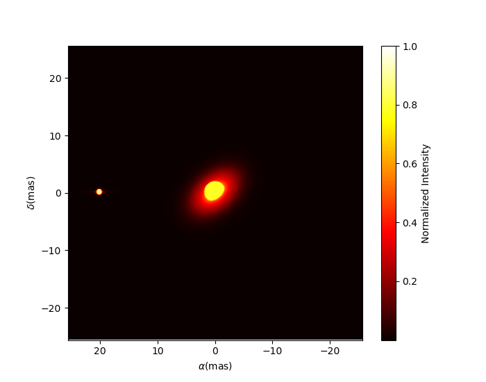

..  _basicExamples:

Basic Examples
--------------

In this section we presents script showing the basic functionalities
of the ``oimodeler`` software.

..  _exampleOimData:

Loading oifits data
^^^^^^^^^^^^^^^^^^^

The `exampleOimData.py <https://github.com/oimodeler/oimodeler/blob/main/examples/BasicExamples/exampleOimData.py>`_
script shows how to create a :func:`oimData <oimodeler.oimData.oimData>` object from
a list of OIFITS files and how the data is organized in an
:func:`oimData <oimodeler.oimData.oimData>` instance.

.. code-block:: python

    from pathlib import Path
    from pprint import pprint

    import matplotlib.pyplot as plt
    import numpy as np

    import oimodeler as oim

    path = Path(__file__).parent.parent.parent
    data_dir = path / "examples" / "testData" / "FSCMa_MATISSE"
    files = list(map(str, data_dir.glob("*.fits")))

    data=oim.oimData(files)

The OIFITS data, stored in the ``astropy.io.fits.hdulist`` format, can be accessed
using the ``oimData.data`` attribute.

.. code-block:: python

    pprint(data.data)

    
.. code-block::

    ... [[astropy.io.fits.hdu.image.PrimaryHDU object at 0x000002657CBD7CA0>, <astropy.io.fits.hdu.table.BinTableHDU object at 0x000002657E546AF0>, <astropy.io.fits.hdu.table.BinTableHDU object at 0x000002657E3EA970>, <astropy.io.fits.hdu.table.BinTableHDU object at 0x000002657E3EAAC0>, <astropy.io.fits.hdu.table.BinTableHDU object at 0x000002657E406520>, <astropy.io.fits.hdu.table.BinTableHDU object at 0x000002657E402EE0>, <astropy.io.fits.hdu.table.BinTableHDU object at 0x000002657E406FD0>, <astropy.io.fits.hdu.table.BinTableHDU object at 0x000002657E4600D0>],
        [<astropy.io.fits.hdu.image.PrimaryHDU object at 0x000002657E458F70>, <astropy.io.fits.hdu.table.BinTableHDU object at 0x0000026500769BE0>, <astropy.io.fits.hdu.table.BinTableHDU object at 0x000002650080EA60>, <astropy.io.fits.hdu.table.BinTableHDU object at 0x00000265007EA430>, <astropy.io.fits.hdu.table.BinTableHDU object at 0x00000265007EAAF0>, <astropy.io.fits.hdu.table.BinTableHDU object at 0x000002650080EC40>, <astropy.io.fits.hdu.table.BinTableHDU object at 0x000002657E4DC820>, <astropy.io.fits.hdu.table.BinTableHDU object at 0x000002657E4ECFD0>],
        [<astropy.io.fits.hdu.image.PrimaryHDU object at 0x000002657E4DCCA0>, <astropy.io.fits.hdu.table.BinTableHDU object at 0x0000026500B7EB50>, <astropy.io.fits.hdu.table.BinTableHDU object at 0x000002657E9F79D0>, <astropy.io.fits.hdu.table.BinTableHDU object at 0x000002657E5913A0>, <astropy.io.fits.hdu.table.BinTableHDU object at 0x000002657E591A60>, <astropy.io.fits.hdu.table.BinTableHDU object at 0x000002657E591B20>, <astropy.io.fits.hdu.table.BinTableHDU object at 0x000002657E5B7790>, <astropy.io.fits.hdu.table.BinTableHDU object at 0x000002657E5BAEB0>]]
    
    
.. note::

    See the `OIFITS <https://www.aanda.org/articles/aa/pdf/2017/01/aa26405-15.pdf>`_
    standard for its conventions and the 
    `astropy.oi.fits <https://docs.astropy.org/en/stable/io/fits/index.html>`_
    documentation to learn how it is implemented.

To use the data efficiently in the
:func:`oimSimulator <oimodeler.oimSimulator.oimSimulator>` class or any of the
fitters contained in the :mod:`oimFitter <oimodeler.oimFitter.oimFitter>` module
they need to be optimized in a simpler vectorial/structure.
This step is done automatically when using the simulator or fitter but can be done
manually using the following command:
    
.. code-block:: python
    
    data.prepareData()

    
For instance, this create single vectors for the data coordinates:

- The u-axis of the spatial frequencies ``data.vect_u``
- The v-axis of the spatial frequencies ``data.vect_v``
- The wavelength data ``data.vect_wl``

If we now print these we can see their structure:

.. code-block:: python

    pprint(data.vect_u)
    pprint(data.vect_v)   
    pprint(data.vect_wl)  

    pprint(data.vect_u.shape)

    
.. code-block::
    
    ... [0. 0. 0. ... 0. 0. 0.]
        [0. 0. 0. ... 0. 0. 0.]
        [4.20059359e-06 4.18150239e-06 4.16233070e-06 ... 2.75303296e-06
        2.72063039e-06 2.68776785e-06]

        (5376,)

    
..  _basicModel:
    
Basic models
^^^^^^^^^^^^

The `basicModel.py <https://github.com/oimodeler/oimodeler/blob/main/examples/BasicExamples/basicModel.py>`_
script demonstrates the basic functionalities of the
:func:`oimModel <oimodeler.oimModel.oimModel>` and 
:func:`oimComponents <oimodeler.oimComponent.oimComponent>` objects.

First we import the relevant packages:

.. code-block:: python

    from pathlib import Path
    from pprint import pprint

    import matplotlib.pyplot as plt
    import numpy as np
    import oimodeler as oim

A model is a collection of components. All components are derived from the
:func:`oimComponent <oimodeler.oimComponent.oimComponent>` class.
The components may be described in the image plane, by their intensity distribution,
or directly in the Fourier plane, for components with known analytical Fourier transforms.
In this example we will only focus on the latter type which are all derived from
the :func:`oimComponentFourier <oimodeler.oimComponent.oimComponentFourier>` class.

In the table below is a list of the current, from the
:func:`oimComponentFourier <oimodeler.oimComponent.oimComponentFourier>` derived,
components.

+---------------+-------------------------------------+---------------------------------------------+
| Class         | Description                         | Parameters                                  |
+===============+=====================================+=============================================+
| oimPt         | Point source                        | x, y, f                                     |
+---------------+-------------------------------------+---------------------------------------------+
| oimBackground | Background                          | x, y, f                                     |
+---------------+-------------------------------------+---------------------------------------------+
| oimUD         | Uniform Disk                        | x, y, f, d                                  |
+---------------+-------------------------------------+---------------------------------------------+
| oimEllipse    | Uniform Ellipse                     | x, y, f, d, pa, elong                       |
+---------------+-------------------------------------+---------------------------------------------+
| oimGauss      | Gaussian Disk                       | x, y, f, fwhm                               |
+---------------+-------------------------------------+---------------------------------------------+
| oimEGauss     | Elliptical Gaussian Disk            | x, y, f, fwhm, pa, elong                    |
+---------------+-------------------------------------+---------------------------------------------+
| oimIRing      | Infinitesimal Ring                  | x, y, f, d                                  |
+---------------+-------------------------------------+---------------------------------------------+
| oimEIRing     | Elliptical Infinitesimal Ring       | x, y, f, d, pa, elong                       |
+---------------+-------------------------------------+---------------------------------------------+
| oimESKIRing   | Skewed Infinitesimal Elliptical Ring| x, y, f, d, skw, skwPa, pa, elong           |
+---------------+-------------------------------------+---------------------------------------------+
| oimRing       | Ring defined with din and dout      | x, y, f, din, dout                          |
+---------------+-------------------------------------+---------------------------------------------+
| oimERing      | Elliptical Ring with din and dout   | x, y, f, din, dout, pa, elong               |
+---------------+-------------------------------------+---------------------------------------------+
| oimESKRing    | Skewed Elliptical Ring              | x, y, f, din, dout, skw, skwPa, pa, elong   |
+---------------+-------------------------------------+---------------------------------------------+
| oimRing2      | Ring defined with d and dr          | x, y, f, d, dr                              |
+---------------+-------------------------------------+---------------------------------------------+
| oimERing2     | Elliptical Ring  with d and dr      | x, y,f, d, dr, pa, elong                    |
+---------------+-------------------------------------+---------------------------------------------+
| oimLinearLDD  | Linear Limb Darkened Disk           | x, y, f, d, a                               |
+---------------+-------------------------------------+---------------------------------------------+
| oimQuadLDD    | Quadratic Limb Darkened Disk        | x, y, f, d, a1, a2                          |
+---------------+-------------------------------------+---------------------------------------------+
| oimLorentz    | Pseudo-Lorenztian                   | x, y, fwhm                                  |
+---------------+-------------------------------------+---------------------------------------------+
| oimELorentz   | Elliptical Pseudo-Lorenztian        | x, y, f, fwhm, pa, elong                    |
+---------------+-------------------------------------+---------------------------------------------+
| oimConvolutor | Convolution between 2 components    | Parameters from the 2 components            |
+---------------+-------------------------------------+---------------------------------------------+

To create models we must first create the components.
Let's create a few simple components.

.. code-block:: python

    pt = oim.oimPt(f=0.1)
    ud = oim.oimUD(d=10, f=0.5)
    g  = oim.oimGauss(fwhm=5, f=1)
    r  = oim.oimIRing(d=5, f=0.5)

    
Here, we have create a point source components, a 10 mas uniform disk, a Gaussian
distribution with a 5 mas fwhm and a 5 mas infinitesimal ring. 

Note that the model parameters which are not set explicitly during the components creation
are set to their default values (i.e., f=1, x=y=0).

We can print the description of the component easily:

.. code-block:: python

    pprint(ud)

.. code-block::
    
    ... Uniform Disk x=0.00 y=0.00 f=0.50 d=10.00

Or if you want to print the details of a parameter:

.. code-block:: python

    pprint(ud.params['d'])

 
.. code-block::
    
    ... oimParam d = 10 ± 0 mas range=[-inf,inf] free

Note that the components parameters are instances of the
:func:`oimParam <oimodeler.oimParam.oimParam>` class which hold not only the
parameter value stored in the ``oimParam.value`` attribute, but in addition to it
the following attributes: 

- ``oimParam.error``: the parameters uncertainties (for model fitting).
- ``oimParam.unit``: the unit as a ``astropy.units`` object.
- ``oimParam.min``: minimum possible value (for model fitting).
- ``oimParam.max``: minimum possible value (for model fitting).
- ``oimParam.free``: Describes a free parameter for ``True``
  and a fixed parameter for ``False`` (for model fitting).
- ``oimParam.description``: A string that describes the model parameter.

We can now create our first models using the
:func:`oimModel <oimodeler.oimModel.oimModel>` class.

.. code-block:: python

    mPt   = oim.oimModel(pt)
    mUD   = oim.oimModel(ud)
    mG    = oim.oimModel(g)
    mR    = oim.oimModel(r)
    mUDPt = oim.oimModel(ud, pt)
    

Now, we have four one-component models and one two-component model.

We can get the parameters of our models using the 
:func:`oimModel.getParameter <oimodeler.oimModel.oimModel.getParameter>`
method.

.. code-block:: python
    
    params = mUDPt.getParameters()
    pprint(params)
        

.. code-block::

    ... {'c1_UD_x': oimParam at 0x23de5c62fa0 : x=0 ± 0 mas range=[-inf,inf] free=False ,
         'c1_UD_y': oimParam at 0x23de5c62580 : y=0 ± 0 mas range=[-inf,inf] free=False , 
         'c1_UD_f': oimParam at 0x23de5c62400 : f=0.5 ± 0  range=[-inf,inf] free=True ,
         'c1_UD_d': oimParam at 0x23debc1abb0 : d=10 ± 0 mas range=[-inf,inf] free=True , 
         'c2_Pt_x': oimParam at 0x23debc1a8b0 : x=0 ± 0 mas range=[-inf,inf] free=False , 
         'c2_Pt_y': oimParam at 0x23debc1ab80 : y=0 ± 0 mas range=[-inf,inf] free=False , 
         'c2_Pt_f': oimParam at 0x23debc1ac10 : f=0.1 ± 0  range=[-inf,inf] free=True }

The method returns a dict of all the model component's parameters.
The keys are defined as ``x{num of component}_{short Name of component}_{param name}``.

Alternatively, we can get the free parameters using the
:func:`getFreeParameters <oimodeler.oimModel.oimModel.getFreeParameters>` method:

.. code-block:: python
    
    freeParams = mUDPt.getParameters()
    pprint(freeParams)

        
.. code-block::

    ... {'c1_UD_f': oimParam at 0x23de5c62400 : f=0.5 ± 0  range=[-inf,inf] free=True ,
         'c1_UD_d': oimParam at 0x23debc1abb0 : d=10 ± 0 mas range=[-inf,inf] free=True ,
         'c2_Pt_f': oimParam at 0x23debc1ac10 : f=0.1 ± 0  range=[-inf,inf] free=True }

The :func:`oimModel <oimodeler.oimModel.oimModel>` class can return an image of the
model using the :func:`oimModel.getImage <oimodeler.oimModel.oimModel.getImage>` method.
It takes two arguments, the image's size in pixels and the pixel size in mas.

.. code-block:: python
    
    im = mUDPt.getImage(512, 0.1)
    plt.figure()
    plt.imshow(im**0.2)

.. image:: ../../images/basicModel_imshow.png
  :alt: Alternative text   
  

We plot the image with a 0.2 power-law to make the uniform disk components visible:
Both components have the same total flux but the uniform disk is spread on many more
pixels.

The image can also be returned as an ``astropy hdu`` object (instead of a ``numpy array``)
setting the ``toFits`` keyword to ``True``.
The image will then contained a header with the proper fits image keywords
(NAXIS, CDELT, CRVAL, etc.).

.. code-block:: python
    
    im = mUDPt.getImage(256, 0.1, toFits=True)
    pprint(im)
    pprint(im.header)
    pprint(im.data.shape)
    
    
.. code-block::
  
    ... <astropy.io.fits.hdu.image.PrimaryHDU object at 0x000002610B8C22E0>
    
    SIMPLE  =                    T / conforms to FITS standard                      
    BITPIX  =                  -64 / array data type                                
    NAXIS   =                    2 / number of array dimensions                     
    NAXIS1  =                  256                                                  
    NAXIS2  =                  256                                                  
    EXTEND  =                    T                                                  
    CDELT1  = 4.84813681109536E-10                                                  
    CDELT2  = 4.84813681109536E-10                                                  
    CRVAL1  =                    0                                                  
    CRVAL2  =                    0                                                  
    CRPIX1  =                128.0                                                  
    CRPIX2  =                128.0                                                  
    CUNIT1  = 'rad     '                                                            
    CUNIT2  = 'rad     '                                                            
    CROTA1  =                    0                                                  
    CROTA2  =                    0                                                 
    
    (256, 256)
    

.. note::

    Currently only **regular** grids in wavelength and time are allowed when exporting
    to fits-image format. If specified, the `wl` and `t` vectors need to be regularily
    sampled. The easiest way is to use the 
    `numpy.linspace <https://numpy.org/doc/stable/reference/generated/numpy.linspace.html>`_
    function.

    If their sampling is irregular an error will be raised.

    
Using the :func:`oimModel.saveImage <oimodeler.oimModel.oimModel.saveImage>` method
will also return an image in the fits format and save it to the specified fits file. 

.. code-block:: python
   
    im = mUDPt.saveImage("modelImage.fits", 256, 0.1)

.. note::

    The returned image in fits format will be 2D, if  time and wavelength are not
    specified, or if they are numbers, 3D if one of them is an array, and 4D if both
    are arrays.

Alternatively, we can use the :func:`oimModel.showModel <oimodeler.oimModel.oimModel.showModel>`
method which take the same argument as the getImage, but directly create a plot with
proper axes and colorbar.

.. code-block:: python

    figImg, axImg = mUDPt.showModel(512, 0.1, normPow=0.2)

.. image:: ../../images/basicModel_showModel.png
  :alt: Alternative text  

In other examples, we use :func:`oimModel <oimodeler.oimModel.oimModel>` and
:func:`oimData <oimodeler.oimData.oimData>` to create data
objects and pass them to a :func:`oimSimulator <oimodeler.oimSimulator.oimSimulator>`
instance to simulate interferometric quantities from the model at the spatial frequencies
from our data. Without the :func:`oimSimulator <oimodeler.oimSimulator.oimSimulator>`
class, the :func:`oimModel <oimodeler.oimModel.oimModel>`
can only produce complex coherent flux (i.e., non normalized complex visibility)
for a vector of spatial frequecies and wavelengths. 

.. code-block:: python

    wl = 2.1e-6
    B = np.linspace(0.0, 300, num=200)
    spf = B/wl

Here, we have created a vector of 200 spatial frequencies, for baselines ranging from
0 to 300 m at an observing wavelength of 2.1 microns.

We can now use this vector to get the complex coherent flux (CCF) from our model. 
    

.. code-block:: python

    ccf = mUDPt.getComplexCoherentFlux(spf, spf*0) 

    
The :func:`oimModel.getComplexCoherentFlux <oimodeler.oimModel.oimModel.getComplexCoherentFlux>`
method takes four parameters: The spatial frequencies along the
East-West axis, the spatial frequencies along the North-South axis, and optionally,
the wavelength and time (mjd). Here, we are dealing with grey and
time-independent models so we don't need to specify the wavelength. And,
as our models are circular, we don't care about the baseline orientation.
That why we set the North-South component of the spatial frequencies to zero.

We can now plot the visibility from the CCF as the function of the spatial frequencies:

.. code-block:: python

    v = np.abs(ccf)
    v = v/v.max()
    plt.figure()
    plt.plot(spf, v)
    plt.xlabel("spatial frequency (cycles/rad)")
    plt.ylabel("Visbility")

.. image:: ../../images/basicModel_vis0.png
  :alt: Alternative text  

Let's finish this example by creating a figure with the image and visibility
for all the previously created models.

.. code-block:: python

    models = [mPt, mUD, mG, mR, mUDPt]
    mNames = ["Point Source", "Uniform Disk", "Gausian", "Ring",
              "Uniform Disk + Point Source"]

    fig, ax = plt.subplots(2, len(models), figsize=(
        3*len(models), 6), sharex='row', sharey='row')

    for i, m in enumerate(models):
        m.showModel(512, 0.1, normPow=0.2, axe=ax[0, i], colorbar=False)
        v = np.abs(m.getComplexCoherentFlux(spf,  spf*0))
        v = v/v.max()
        ax[1, i].plot(spf, v)
        ax[0, i].set_title(mNames[i])
        ax[1, i].set_xlabel("sp. freq. (cycles/rad)")

.. image:: ../../images/basicModel_all.png
  :alt: Alternative text 

.. _imageFits:

Precomputed fits-formated image
^^^^^^^^^^^^^^^^^^^^^^^^^^^^^^^

In the `FitsImageModel.py <https://github.com/oimodeler/oimodeler/tree/main/examples/BasicExamples/FitsImageModel.py>`_ script, we demonstrate the capability of building models using precomputed  image in fits format.

In this example, we will use a semi-physical model for a classical Be star and its
circumstellar disk. The model, detailed in 
`Vieira et al. (2015) <https://ui.adsabs.harvard.edu/abs/2015MNRAS.454.2107V/abstract>`_
was taken from the `AMHRA <https://amhra.oca.eu/AMHRA/disco-gas/input.htm>`_ service of
the JMMC. 

.. note::

    AMHRA develops and provides various astrophysical models online, dedicated to the
    scientific exploitation of high-angular and high-spectral facilities.

    Currently available models are:

    - Semi-physical gaseous disk of classical Be stars and dusty
      disk of YSO.
    - Red-supergiant and AGB.
    - Binary spiral for WR stars.
    - Physical limb darkening models.
    - Kinematics gaseous disks.
    - A grid of supergiant B[e] stars models.

Let's start by importing oimodeler as well as useful packages.

.. code-block:: python

    from pathlib import Path
    from pprint import pprint

    import matplotlib.colors as colors
    import matplotlib.cm as cm
    import numpy as np
    import oimodeler as oim
    from matplotlib import pyplot as plt
    
    
The fits-formatted image-cube ``BeDisco.fits`` that we will use is located
in the ``examples/basicExamples`` directory.
    
.. code-block:: python

    path = Path(__file__).parent.parent.parent
    file_name = path / "examples" / "BasicExamples" / "BeDISCO.fits"

    save_dir = path / "images"
    if not save_dir.exists():
        save_dir.mkdir(parents=True)

The class for loading fits-images and image-cubes is named
:func:`oimComponentFitsImage <oimodeler.oimBasicFourierComponents.oimComponentFitsImage>`.
It derives from the :func:`oimComponentImage <oimodeler.oimComponent.oimComponentImage>`
(i.e., the partially abstract class for all components defined in the image plane).
:func:`oimComponentImage <oimodeler.oimComponent.oimComponentImage>` derives from the
fully abstract :func:`oimComponent <oimodeler.oimComponent.oimComponent>` (i.e. the
parent class of all ``oimodeler`` components).

.. note::

   To learn more on the image-based models built with the :func:`oimComponent <oimodeler.oimComponent.oimComponent>`
   class check the :ref:`advancedExamples` and the
   :ref:`expandingSoftware` tutorials.

    
There are two ways to load a fits image into a :func:`oimComponentFitsImage <oimodeler.oimComponentFourier.oimComponentFitsImage>` object.
The first one is to open the fits file using the ``astropy.io.fits`` module of the ``astropy``
package and then passing it to the 
:func:`oimComponentFitsImage <oimodeler.oimBasicFourierComponents.oimComponentFitsImage>`
class.

.. code-block:: python

    im = fits.open(file_name)
    c = oim.oimComponentFitsImage(im) 

    
A simplier way, if the user doesn’t need to access directly to the content of ``im``,
is to pass the filename to the :func:`oimComponentFitsImage <oimodeler.oimBasicFourierComponents.oimComponentFitsImage>`
class.

.. code-block:: python

    c = oim.oimComponentFitsImage(file_name)

Finally, we can build our model with this unique component:

.. code-block:: python

    m = oim.oimModel(c)

    
We can now plot the model image. 

.. code-block:: python

    m.showModel(512, 0.05, legend=True, normalize=True, normPow=1, cmap="hot")

                 
.. image:: ../../images/FitsImage_Disco_image.png
  :alt: Alternative text        

.. note::       

    Although the image was computed for a specific wavelength (i.e., 1.5 microns),
    our model is achromatic as we use a single image to generate it.
    An example with chromatic model buit on a chromatic image-cube is available
    :ref:`here <imageCubeFits>`.

    
We now create spatial frequencies for a thousand baselines ranging from 0 to 120 m,
in the North-South and East-West orientation and at an observing wavlength of 1.5 microns.

.. code-block:: python
 
   wl, nB = 1.5e-6, 1000
   B = np.linspace(0, 120, num=nB)

   spfx = np.append(B, B*0)/wl # 1st half of B array are baseline in the East-West orientation
   spfy = np.append(B*0, B)/wl # 2nd half are baseline in the North-South orientation

We compute the complex coherent flux and then the absolute visibility

.. code-block:: python

   ccf = m.getComplexCoherentFlux(spfx, spfy)
   v = np.abs(ccf)
   v = v/v.max()

and, finally, we can plot our results:
 
.. code-block:: python
  
    plt.figure()
    plt.plot(B , v[0:nB],label="East-West")
    plt.plot(B , v[nB:],label="North-South")
    plt.xlabel("B (m)")
    plt.ylabel("Visbility")
    plt.legend()
    plt.margins(0)

.. image:: ../../images/FitsImage_Disco_visibility.png
  :alt: Alternative text

  
Let's now have a look at the model's parameters:
    
.. code-block:: python
    
    pprint(m.getParameters())

    
.. code-block::

    ... {'c1_Fits_Comp_dim': oimParam at 0x19c6201c820 : dim=128 ± 0  range=[1,inf] free=False ,
         'c1_Fits_Comp_f': oimParam at 0x19c6201c760 : f=1 ± 0  range=[0,1] free=True ,
         'c1_Fits_Comp_pa': oimParam at 0x19c00b9bbb0 : pa=0 ± 0 deg range=[-180,180] free=True ,
         'c1_Fits_Comp_scale': oimParam at 0x19c6201c9d0 : scale=1 ± 0  range=[-inf,inf] free=True ,
         'c1_Fits_Comp_x': oimParam at 0x19c6201c6a0 : x=0 ± 0 mas range=[-inf,inf] free=False ,
         'c1_Fits_Comp_y': oimParam at 0x19c6201c640 : y=0 ± 0 mas range=[-inf,inf] free=False }

In addition to the `x`, `y`, and `f` parameters, common to all components,
the 
:func:`oimComponentFitsImage <oimodeler.oimComponent.oimComponentFitsImage>`
have three additional parameters:

* `dim`: The fixed size of the internal fits image (currently only square images are
  compatible).
* `pa`: The position of angle of the component (used for rotating the component).
* `scale`: A scaling factor for the component.

The position angle `pa` and the `scale` are both free parameters (as default) and
can be used for model fitting.

Let's try to rotate and scale our model and plot the image again.

.. code-block:: python

    c.params['pa'].value = 45
    c.params['scale'].value = 2
    m.showModel(256, 0.04, legend=True, normPow=0.4, colorbar=False)

    
.. image:: ../../images/FitsImage_Disco_image2.png
  :alt: Alternative text 

  
The :func:`oimComponentFitsImage <oimodeler.oimBasicFourierComponents.oimComponentFitsImage>`
can be combined with any kind of other component. Let's add a companion
(i.e., uniform disk) for our Be star model.  

.. code-block:: python

    c2 = oim.oimUD(x=20, d=1, f=0.03)
    m2 = oim.oimModel(c, c2)

    
We add a 1 mas companion located at 20 mas West of the central object with a flux
of 0.03. We can now plot the image of our new model.

.. code-block:: python

    m2.showModel(256, 0.2, legend=True, normalize=True, fromFT=True, normPow=1, cmap="hot")

 

    
To finish this example, let's plot the visibility along North-South and East-West
baseline for our binary Be-star model.  
  
.. code-block:: python

    ccf = m2.getComplexCoherentFlux(spfx, spfy)
    v = np.abs(ccf)
    v = v/v.max()

    plt.figure()
    plt.plot(B, v[0:nB], label="East-West")
    plt.plot(B, v[nB:], label="North-South")
    plt.xlabel("B (m)")
    plt.ylabel("Visbility")
    plt.legend()
    plt.margins(0)  

    
.. image:: ../../images/FitsImage_Disco_visibility2.png
  :alt: Alternative text 

.. _createSimulator:

Data/model comparison
^^^^^^^^^^^^^^^^^^^^^

In the `exampleOimSimulator.py <https://github.com/oimodeler/oimodeler/tree/main/examples/BasicExamples/exampleOiSimulator.py>`_ 
script, we use the 
:func:`oimSimulator <oimodeler.oimSimulator.oimSimulator>` class to compare some
OIFITS data with a model.
We will compute the :math:`\chi^2_r` and plot the comparison between the data an the
simulated data from the model.

Let's start by importing the needed modules and setting the variable ``files`` to the
list of the same OIFITS files as in the :ref:`exampleOimData` example. 

.. code-block:: python

    from pathlib import Path
    from pprint import pprint

    import oimodeler as oim

    path = Path(__file__).parent.parent.parent
    data_dir = path / "examples" / "testData" / "ASPRO_MATISSE2"
    save_dir = path / "images"
    if not save_dir.exists():
        save_dir.mkdir(parents=True)

    files = list(map(str, data_dir.glob("*.fits")))

These OIFITS were simulated with ASPRO as a MATISSE observation of a partly resolved
binary star. 

We make a model of a binary star where one of the components is resolved.
It consists of two components: A uniform disk and a point source.

.. code-block:: python

    ud = oim.oimUD(d=3, f=1, x=10, y=20)
    pt = oim.oimPt(f=0.5)
    model = oim.oimModel([ud, pt])

We now create an 
:func:`oimSimulator <oimodeler.oimSimulator.oimSimulator>` object and feed it
with the data and our model.

The data can either be:

- A previously created :func:`oimData <oimodeler.oimData.oimData>`.
- A list of previously opened `astropy.io.fits.hdulist <https://docs.astropy.org/en/stable/io/fits/api/hdulists.html#astropy.io.fits.HDUList>`_.
- A list of paths to the OIFITS files (list of strings).

.. code-block:: python

    sim = oim.oimSimulator(data=files, model=model)

    
When creating the simulator, it automatically calls the :func:`oimData.prepareData <oimodeler.oimData.oimData.prepareData>`
method of the created :func:`oimData <oimodeler.oimData.oimData>` instance within
the simulator instance. This calls the
:func:`oimData.prepare <oimodeler.oimData.oimData.prepare>` method of :func:`oimData <oimodeler.oimData.oimData>`
The function is used to create vectorized coordinates for the data (spatial frequencies
in x and y and wavelengths) to be passed to the :func:`oimModel <oimodeler.oimModel.oimModel>`
instance to compute the Complex Coherent Flux (CCF) using the 
:func:`oimModel.getComplexCoherentFlux <oimodeler.oimModel.oimModel.getComplexCoherentFlux>`
method, and some structures to go back from the ``ccf`` to the measured interferometric
quantities contained in the OIFITS files: VIS2DATA, VISAMP, VISPHI, T3AMP, T3PHI,
and FLUXDATA.

Once the data is prepared, we can call the :func:`oimSimulator.compute <oimodeler.oimSimulator.oimSimulator.compute>`
method to compute the :math:`\chi^2` and the simulated data.

.. code-block:: python

    sim.compute(computeChi2=True, computeSimulatedData=True)
    pprint("Chi2r = {}".format(sim.chi2r))

.. code-block::

    ... Chi2r = 11356.162973124885

Our model isn't fitting the data well. Let's take a closer look and 
plot the data-model comparison for all interferometric quantities contained
in the OIFITS files.

.. code-block:: python

    fig0, ax0= sim.plot(["VIS2DATA", "VISAMP", "VISPHI", "T3AMP", "T3PHI"])
  
  
.. image:: ../../images/ExampleOimSimulator_model0.png
  :alt: Alternative text  

You can now try to fit the model "by hand", or go to the next example
where we use a fitter from the :mod:`oimFitter <oimodeler.oimFitter>`
module to automatically find a good fit (and thus well fitting parameters).

Running a mcmc fit
^^^^^^^^^^^^^^^^^^

In the `exampleOimFitterEmcee.py <https://github.com/oimodeler/oimodeler/blob/main/examples/BasicExamples/exampleOimFitterEmcee>`_
script, we perform a complete `emcee <https://emcee.readthedocs.io/en/stable/>`_ run to
determine the values of the parameters of the same binary as in the 
(previous) :ref:`createSimulator` example.

We start by setting up the script with imports, a data list and a binary model.
We don't need to specify values for the biary parameters as they will be fitted.

.. code-block:: python

    from pathlib import Path
    from pprint import pprint

    import oimodeler as oim

    path = Path(__file__).parent.parent.parent
    data_dir = path / "examples" / "testData" / "ASPRO_MATISSE2"
    save_dir = path / "images"
    if not save_dir.exists():
        save_dir.mkdir(parents=True)

    files = list(map(str, data_dir.glob("*.fits")))

    ud = oim.oimUD()
    pt = oim.oimPt()
    model = oim.oimModel([ud,pt])

Before starting the run, we need to specify which parameters are free and what their 
ranges are. By default, all parameters are free, but the components `x` and
`y` coordinates. For a binary, we need to release them for one of the components.
As we only deal with relative fluxes, we can set the flux of one of the components
to be fixed to one.

.. code-block:: python

    ud.params['d'].set(min=0.01, max=20)
    ud.params['x'].set(min=-50, max=50, free=True)
    ud.params['y'].set(min=-50, max=50, free=True)
    ud.params['f'].set(min=0., max=10.)
    pt.params['f'].free = False
    pprint(model.getFreeParameters())
    

.. code-block::

    ... {'c1_UD_x': oimParam at 0x23d940e4850 : x=0 ± 0 mas range=[-50,50] free=True, 
         'c1_UD_y': oimParam at 0x23d940e4970 : y=0 ± 0 mas range=[-50,50] free=True,
         'c1_UD_f': oimParam at 0x23d940e4940 : f=0.5 ± 0  range=[0.0,10.0] free=True,
         'c1_UD_d': oimParam at 0x23d940e4910 : d=3 ± 0 mas range=[0.01,20] free=True}

We have 4 free-parameters, the position (`x`, `y`), the flux `f` and
the diameter `d` of the uniform disk component.

Now, we can create a fitter with our model and a list of OIFITS files.
We use the emcee fitter that has only one parameter, the number of walkers that
will explore the parameter space.

.. code-block:: python
    
    fit = oim.oimFitterEmcee(files, model, nwalkers=32)

.. note::

   If you are not confident with emcee, you should have a look at the documentation
   `here <https://emcee.readthedocs.io/en/stable/>`_.
    

We need to initialize the fitter using its :func:`oimFitterEmcee.prepare <oimodeler.oimFitter.oimFitterEmcee>`
method. This is setting the initial values of the walkers.
The default method is to set them to random values within the parameters' ranges.

.. code-block:: python
    
    fit.prepare(init="random")
    pprint(fit.initialParams)

    
.. code-block::
 
    ... [[-37.71319618 -49.22761731   9.3299391   15.51294277]
        [-12.92392301  17.49431852   7.76169304   9.23732472]
        [-31.62470824 -11.05986877   8.71817772   0.34509237]
        [-36.38546264  33.856871     0.81935324   9.04534926]
        [ 45.30227534 -38.50625408   4.89978551  14.93004   ]
        [-38.01416866  -6.24738348   5.26662714  13.16349304]
        [-21.34600438 -14.98116997   1.20948714   8.15527356]
        [-17.14913499  10.40965493   0.37541088  18.81733973]
        [ -9.61039318 -12.02424002   6.81771974  16.22898422]
        [ 49.07320952 -34.48933488   1.75258006  19.96859116]]
       
 
We can now run the fit. We choose to run 2000 steps as a start and interactively show
the progress with a progress bar. The fit should take a few minutes on a standard computer
to compute around 64000 models (``nwalkers`` x ``nsteps``).

.. code-block:: python

    fit.run(nsteps=2000, progress=True)

 
The :func:`oimFitterEmcee <oimodeler.oimFitter.oimFitterEmcee>` instance stores
the emcee sampler as an attribute: ``oimFitterEmcee.sampler``. You can, for example,
access the chain of walkers and the logrithmic of the probability directly.  

.. code-block:: python

    sampler = fit.sampler
    chain   = fit.sampler.chain
    lnprob  = fit.sampler.lnprobability

    
We can manipulate these data. The :func:`oimFitterEmcee <oimodeler.oimFitter.oimFitterEmcee>`
implements various methods to retrieve and plot the results of the mcmc run.

The walkers position as the function of the steps can be plotted using the
:func:`oimFitterEmcee.walkersPlot <oimodeler.oimFitter.oimFitterEmcee.walkersPlot>`
method.

.. code-block:: python

    figWalkers, axeWalkers = fit.walkersPlot(cmap="plasma_r")

.. image:: ../../images/exampleOimFitterEmceeWalkers.png
  :alt: Alternative text  

After a few hundred steps most walkers converge to a position with a good
:math:`\chi^2_r`. However, from that figure will clearly see that:

- Not all walkers have converged after 2000 steps.
- Some walkers converge to a solution that gives significantly worse :math:`\chi^2`.

In optical interferometry there are often local minimas in the :math:`\chi^2` and it
seems that some of our walkers are locked in such minimas.
In our case, this minimum is due to the fact that object is almost symmetrical
if not for the fact than one of the component is resolved.
Neverless, the :math:`\chi^2` of the local minimum is about 20 times
worse than the one of the global minimum.

We can plot the "famous" corner plot containing a 1D and 2D density distribution. 
The ``oimodeler`` package uses the `corner <https://corner.readthedocs.io/en/latest/>`_
library for that purpose. We will discard the first 1000 steps as most of the walkers
have converged after that. By default, the corner plot also remove the data with a :math:`\chi^2`
20 times greater than those of the best model. The cutoff can be set with the 
``chi2limfact`` keyword of the :func:`oimFitter.cornerPlot <oimodeler.oimFitter.oimFitter.cornerPlot>`
method.

.. code-block:: python

    figCorner, axeCorner=fit.cornerPlot(discard=1000)
    
   
.. image:: ../../images/exampleOimFitterEmceeCorner.png
  :alt: Alternative text  
  
  
We now can get the result of our fit. The 
:func:`oimFitterEmcee <oimodeler.oimFitter.oimFitterEmcee>` fitter can return either
the ``best``, the ``mean`` or the ``median`` model. It return uncertainties
estimated from the density distribution (see `emcee <https://emcee.readthedocs.io/en/stable/>`_'
for more details).

.. code-block:: python
    
    median, err_l, err_u, err = fit.getResults(mode='median', discard=1000)

To compute the median and mean model we have to remove, as in the corner plot,
the walkers that didn't converge with the ``chi2limitfact`` keyword (default is 20)
and remove the steps of the bruning phase with the ``discard`` option.

When procuring the results, the simulated data is simultaneously calculated
in the fitter's internal simulator. We can again plot the data/model and compute the
final :math:`\chi^2_r`:

.. code-block:: python 
    
    figSim, axSim=fit.simulator.plot(["VIS2DATA", "VISAMP", "VISPHI", "T3AMP", "T3PHI"])
    pprint("Chi2r = {}".format(fit.simulator.chi2r))

    
.. image:: ../../images/ExampleOimFitterEmcee_fittedData.png
  :alt: Alternative text 

