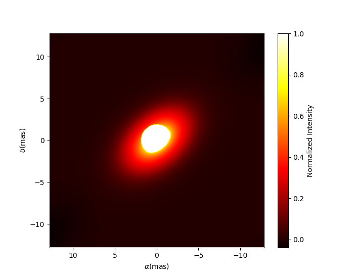

..  _basicExamples:

Basic Examples
--------------

In this section we presents script we presents showing the basic functionalities of the oimodeler software.

..  _exampleOimData:

Loading oifits data
^^^^^^^^^^^^^^^^^^^

The `exampleOimData.py <https://github.com/oimodeler/oimodeler/blob/main/examples/BasicExamples/exampleOimData.py>`_ script show how to create a oimData object from a list of oifits files and how the data in organized in the oimData instance.

.. code-block:: python

    import oimodeler as oim
    import os

    path = os.path.dirname(oim.__file__)
    pathData=os.path.join(path,os.pardir,"examples","testData","FSCMa_MATISSE")
    files=[os.path.abspath(os.path.join(pathData,fi)) for fi in os.listdir(pathData)]

    data=oim.oimData(files)

The oifits data, stored in the ``astropy.io.fits.hdulist`` format, can be accessed using the ``oimData.data`` variable

.. code-block:: python

    print(data.data)
    
.. code-block:: python

    >>[[<astropy.io.fits.hdu.image.PrimaryHDU object at 0x000002657CBD7CA0>, <astropy.io.fits.hdu.table.BinTableHDU object at 0x000002657E546AF0>, <astropy.io.fits.hdu.table.BinTableHDU object at 0x000002657E3EA970>, <astropy.io.fits.hdu.table.BinTableHDU object at 0x000002657E3EAAC0>, <astropy.io.fits.hdu.table.BinTableHDU object at 0x000002657E406520>, <astropy.io.fits.hdu.table.BinTableHDU object at 0x000002657E402EE0>, <astropy.io.fits.hdu.table.BinTableHDU object at 0x000002657E406FD0>, <astropy.io.fits.hdu.table.BinTableHDU object at 0x000002657E4600D0>],
    [<astropy.io.fits.hdu.image.PrimaryHDU object at 0x000002657E458F70>, <astropy.io.fits.hdu.table.BinTableHDU object at 0x0000026500769BE0>, <astropy.io.fits.hdu.table.BinTableHDU object at 0x000002650080EA60>, <astropy.io.fits.hdu.table.BinTableHDU object at 0x00000265007EA430>, <astropy.io.fits.hdu.table.BinTableHDU object at 0x00000265007EAAF0>, <astropy.io.fits.hdu.table.BinTableHDU object at 0x000002650080EC40>, <astropy.io.fits.hdu.table.BinTableHDU object at 0x000002657E4DC820>, <astropy.io.fits.hdu.table.BinTableHDU object at 0x000002657E4ECFD0>],
    [<astropy.io.fits.hdu.image.PrimaryHDU object at 0x000002657E4DCCA0>, <astropy.io.fits.hdu.table.BinTableHDU object at 0x0000026500B7EB50>, <astropy.io.fits.hdu.table.BinTableHDU object at 0x000002657E9F79D0>, <astropy.io.fits.hdu.table.BinTableHDU object at 0x000002657E5913A0>, <astropy.io.fits.hdu.table.BinTableHDU object at 0x000002657E591A60>, <astropy.io.fits.hdu.table.BinTableHDU object at 0x000002657E591B20>, <astropy.io.fits.hdu.table.BinTableHDU object at 0x000002657E5B7790>, <astropy.io.fits.hdu.table.BinTableHDU object at 0x000002657E5BAEB0>]]
    
    
To learn more on the astropy.i OIFITS2

To be used in the oimSimulator and oiFitter data need to be optimized in a simpler vectorial/structure. Tis step is done automatically when using the simulator or fitter but can be done manually using the following command:
    
.. code-block:: python
    
    data.prepareData()
    
For instance this create single vectors fgor the data coordinate : ``data.vect_u``, ``data.vect_v``, ``data.vect_wl``

.. code-block:: python

    print(data.vect_u)
    print(data.vect_v)   
    print(data.vect_wl)  
    print(data.vect_u.shape)
    
.. code-block:: python
    
    [0. 0. 0. ... 0. 0. 0.]
    [0. 0. 0. ... 0. 0. 0.]
    [4.20059359e-06 4.18150239e-06 4.16233070e-06 ... 2.75303296e-06
     2.72063039e-06 2.68776785e-06]
    (5376,)
    
..  _basicModel:
    
Basic models
^^^^^^^^^^^^

The `basicModel.py <https://github.com/oimodeler/oimodeler/blob/main/examples/BasicExamples/basicModel.py>`_ script demonstrate the basic functionalities of the oimModel and oimComponents objects.

First we import oimodeler, numpy and pyplot.

.. code-block:: python

    import oimodeler as oim
    import numpy as np
    import matplotlib.pyplot as plt
    
A model is a collection of components. All components derived from the oimComponent class. The components may be described in the image plan by their intensity distribution or directly in the Fourier plan for components with known analytical Fourier transforms. In these example we will only focus on this later type of component which all derived from the oimFourierComponent class. In the table below is a list of the currently implemented oimFourierComponents:

+---------------+-------------------------------------+-----------------------------------+
| class         | description                         | parameters                        |
+===============+=====================================+===================================+
| oimPt         | Point source                        | x,y,f                             |
+---------------+-------------------------------------+-----------------------------------+
| oimBackground | Background                          | x,y,f                             |
+---------------+-------------------------------------+-----------------------------------+
| oimUD         | Uniform Disk                        | x,y,f,d                           |
+---------------+-------------------------------------+-----------------------------------+
| oimEllipse    | Uniform Ellipse                     | x,y,f,d,pa,elong                  |
+---------------+-------------------------------------+-----------------------------------+
| oimGauss      | Gaussian Disk                       | x,y,f,fwhm                        |
+---------------+-------------------------------------+-----------------------------------+
| oimEGauss     | Point source                        | x,y,f,fwhm,pa,elong               |
+---------------+-------------------------------------+-----------------------------------+
| oimIRing      | Infinitesimal Ring                  | x,y,f,d                           |
+---------------+-------------------------------------+-----------------------------------+
| oimEIRing     | Ellitical infinitesimal ring        | x,y,f,d,pa,elong                  |
+---------------+-------------------------------------+-----------------------------------+
| oimRing       | Ring defined with din and dout      | x,y,f,din,dout                    |
+---------------+-------------------------------------+-----------------------------------+
| oimERing      | Ellitical ring with din and dout    | x,y,f,din,dout,pa,elong           |
+---------------+-------------------------------------+-----------------------------------+
| oimRing2      | Ring defined with d and dr          | x,y,f,d,dr                        |
+---------------+-------------------------------------+-----------------------------------+
| oimERing2     | Ellitical Ring  with d and dr       | x,y,f,d,dr,pa,elong               |
+---------------+-------------------------------------+-----------------------------------+
| ESKIRing      | Skewed infinitesimal Ellitical ring | x,y,f,d,skw,skwPa,pa,elong        |
+---------------+-------------------------------------+-----------------------------------+
| ESKRing       | Skewed Ellitical ring               | x,y,f,din,dout,skw,skwPa,pa,elong |
+---------------+-------------------------------------+-----------------------------------+
| oimLinearLDD  | Linear Limb Darkened Disk           | x,y,f,d,a                         |
+---------------+-------------------------------------+-----------------------------------+
| oimQuadLDD    | Quadratic Limb Darkened Disk        | x,y,f,d,a1,a2                     |
+---------------+-------------------------------------+-----------------------------------+
| oimLorentz    | Pseudo-Lorenztian                   | x,y,fwhm                          |
+---------------+-------------------------------------+-----------------------------------+
| oimELorentz   | Ellitical Pseudo-Lorenztian         | x,y,f,fwhm,pa,elong               |
+---------------+-------------------------------------+-----------------------------------+
| oimConvolutor | Convolution between 2 components    | Parameters from the 2 components  |
+---------------+-------------------------------------+-----------------------------------+

To create models we must first create the components. Let's create a few simple components.

.. code-block:: python

    pt = oim.oimPt(f=0.1)
    ud = oim.oimUD(d=10,f=0.5)
    g  = oim.oimGauss(fwhm=5,f=1)
    r  = oim.oimIRing(d=5,f=0.5)

    
Here we have create a point source components, a 10 mas uniform disk, a Gaussian distribution with a 5 mas fwhm and a 5 mas infinitesimal ring. 

Note that the model parameters which are not set explicitly during the components creation are set to their default values (i.e., f=1 x=y=0).

We can print the description of the component easily

.. code-block:: python

    print(ud)

.. code-block::
    
    >>Uniform Disk x=0.00 y=0.00 f=0.50 d=10.00

Or you want to print the details of a parameter:

.. code-block:: python

    print(ud.params['d'])
 
.. code-block:: 
    
    >>oimParam d = 10 ± 0 mas range=[-inf,inf] free

Note that the components parameters are instances of the oimParam class which hold not only the parameter value stored in oimParam.value but also : 

- oimParam.error : the parameters uncertainties (for model fitting)
- oimParam.unit : the unit as a astropy.unit object
- oimParam.min : minimum possible value (for model fitting)
- oimParam.max : minimum possible value (for model fitting)
- oimParam.free : True=free parameter and False=fixed parameter (for model fitting)
- oimParam.description : A string that describes the model parameter

We can now create our first models using the oimModel class.

.. code-block:: python

    mPt   = oim.oimModel(pt)
    mUD   = oim.oimModel(ud)
    mG    = oim.oimModel(g)
    mR    = oim.oimModel(r)
    mUDPt = oim.oimModel(ud,pt)
    

we now have four one-component models and one two-components models.

We can get the parameters of our models using the getParameter method of the oimModel class. 

.. code-block:: python
    
    params=mUDPt.getParameters()
    print(params)
        

.. code-block::

    {'c1_UD_x': oimParam at 0x23de5c62fa0 : x=0 ± 0 mas range=[-inf,inf] free=False ,
    'c1_UD_y': oimParam at 0x23de5c62580 : y=0 ± 0 mas range=[-inf,inf] free=False , 
    'c1_UD_f': oimParam at 0x23de5c62400 : f=0.5 ± 0  range=[-inf,inf] free=True ,
    'c1_UD_d': oimParam at 0x23debc1abb0 : d=10 ± 0 mas range=[-inf,inf] free=True , 
    'c2_Pt_x': oimParam at 0x23debc1a8b0 : x=0 ± 0 mas range=[-inf,inf] free=False , 
    'c2_Pt_y': oimParam at 0x23debc1ab80 : y=0 ± 0 mas range=[-inf,inf] free=False , 
    'c2_Pt_f': oimParam at 0x23debc1ac10 : f=0.1 ± 0  range=[-inf,inf] free=True }

getParameters returns a dict of all parameters of the components of the model. The keys are defined as x{num of component}_{short Name of component}_{param name}.

Alternatively we can get the free parameters using the getFreeParameters method:

.. code-block:: python
    
    freeParams=mUDPt.getParameters()
    print(freeParams)
        
.. code-block::

    {'c1_UD_f': oimParam at 0x23de5c62400 : f=0.5 ± 0  range=[-inf,inf] free=True ,
    'c1_UD_d': oimParam at 0x23debc1abb0 : d=10 ± 0 mas range=[-inf,inf] free=True ,
    'c2_Pt_f': oimParam at 0x23debc1ac10 : f=0.1 ± 0  range=[-inf,inf] free=True }

The oiModel can return an image of the model using the getImage method. It takes two arguments, the image size in pixels and the pixel size in mas.

.. code-block:: python
    
    
    im=mUDPt.getImage(512,0.1)
    plt.figure()
    plt.imshow(im**0.2)

.. image:: ../../images/basicModel_imshow.png
  :alt: Alternative text   
  

We plot the image with a 0.2 power-law to make the uniform disk components visible: both components have the same total flux but the UD is spread on much more pixels.

The image can also be returned not a a simple numpy array but as a astropy hdu object using the option ``toFits==True``. The image will then contained a header with the proper fits image keywords (NAXIS, CDELT, CRVAL...). 

.. code-block:: python
    
    im = mUDPt.getImage(256,0.1,toFits=True)
    print(im)
    print(im.header)
    print(im.data.shape)
    
    
.. code-block::  
  
    <astropy.io.fits.hdu.image.PrimaryHDU object at 0x000002610B8C22E0>
    
    SIMPLE  =                    T / conforms to FITS standard                      
    BITPIX  =                  -64 / array data type                                
    NAXIS   =                    2 / number of array dimensions                     
    NAXIS1  =                  256                                                  
    NAXIS2  =                  256                                                  
    EXTEND  =                    T                                                  
    CDELT1  = 4.84813681109536E-10                                                  
    CDELT2  = 4.84813681109536E-10                                                  
    CRVAL1  =                    0                                                  
    CRVAL2  =                    0                                                  
    CRPIX1  =                128.0                                                  
    CRPIX2  =                128.0                                                  
    CUNIT1  = 'rad     '                                                            
    CUNIT2  = 'rad     '                                                            
    CROTA1  =                    0                                                  
    CROTA2  =                    0                                                 
    
    (256, 256)
    
.. note::
    Currently only regular grid in wavelength and time are allowed when exporting to fits image format. If specified the wl and t vectors need to be regularily sampled. The easiest way is to used the ``numpy.linspace`` function. If their sampling is irregular an error will be raised.
    
Using the method ``saveImage`` from the **oimModel** class will also return image in the fits format and also save it in a specified fits file. 

.. code-block:: python
   
    im = mUDPt.saveImage("modelImage.fits",256,0.1)

.. note::
    The returned image in fits format will be 2D if  time and wavelength are not specified or if they are numbers, 3D if one of them is an array, and 4D if both are arrays.

Alternatively we can use the method showModel which take the same argument as the getImage, but directly create a plot with proper axes and colorbar.

.. code-block:: python

    figImg,axImg=mUDPt.showModel(512,0.1,normPow=0.2)

.. image:: ../../images/basicModel_showModel.png
  :alt: Alternative text  

In other examples, we use oimModel and oimData objects within a oimSimulator to simulate interferometric quantities from the model at the spatial frequencies from our data. Without the oimSimulator the oimModel can only produce complex coherent flux (i.e. non normalized complex visibility) for a vector of spatial frequecies and wavelengths. 

.. code-block:: python

    wl=2.1e-6
    B=np.linspace(0.0,300,num=200)
    spf=B/wl

Here we have create a vector of 200 spatial frequencies for baselines ranging from 0 to 300 m  and for an observing wavelength of 2.1 microns.

    We can now use this vector to get the complex coherent flux (CCF) from our model. 
    

.. code-block:: python

    ccf = mUDPt.getComplexCoherentFlux(spf,spf*0) 
    
The getComplexCoherentFlux take four parameters : the spatial frequencies along the east-west axis, the spatial frequencies along the North-South axis, and optionally, the wavelength and the time (mjd). Here we are dealing with grey and time-independent models so we don't need to specify the wavelength. And, as our models are circular, we don't care about the baseline orientation. That why we set the North-South component of the spatial frequencies to zero.

We can now plot the visibility from the CCF as the function of the spatial frequencies:

.. code-block:: python

    
    v = np.abs(ccf)
    v=v/v.max()
    plt.figure()
    plt.plot(spf , v)
    plt.xlabel("spatial frequency (cycles/rad)")
    plt.ylabel("Visbility")

.. image:: ../../images/basicModel_vis0.png
  :alt: Alternative text  

Let's finish this example by creating a figure with the image and visibility for all the previously created models.

.. code-block:: python

    models = [mPt,mUD,mG,mR,mUDPt]
    mNames=["Point Source","Uniform Disk","Gausian","Ring",
                  "Uniform Disk + Point Source"]

    fig,ax=plt.subplots(2,len(models),figsize=(3*len(models),6),sharex='row',sharey='row')

    for i, m in enumerate(models):
        m.showModel(512,0.1,normPow=0.2,axe=ax[0,i],colorbar=False)
        
        v = np.abs(m.getComplexCoherentFlux(spf,spf*0)) 
        v=v/v.max()
        ax[1,i].plot(spf , v)
        
        ax[0,i].set_title(mNames[i])
        ax[1,i].set_xlabel("sp. freq. (cycles/rad)")
        

.. image:: ../../images/basicModel_all.png
  :alt: Alternative text 

.. _imageFits:

Precomputed fits-formated image
^^^^^^^^^^^^^^^^^^^^^^^^^^^^^^^

In the `FitsImageModel.py <https://github.com/oimodeler/oimodeler/tree/main/examples/BasicExamples/FitsImageModel.py>`_ script, we demonstrate the capability of building models using precomputed  image in fits format.

In this example we will use a semi-physical model for a classical Be star and its circumstellar disk. The model, detailed in `Vieira et al. (2015) <https://ui.adsabs.harvard.edu/abs/2015MNRAS.454.2107V/abstract>`_ was taken form the `AMHRA <https://amhra.oca.eu/AMHRA/disco-gas/input.htm>`_ service of the JMMC. 

.. note::
    AMHRA develops and provides various online astrophysical models dedicated to the scientific exploitation of high angular and high spectral facilities. Currently available models are : semi-physical gaseous disk of classical Be stars and dusty disk of YSO, Red-supergiant and AGB, binary spiral for WR stars, physical limb-darkening models, kinematics gaseous disks, and a grid of supergiant B[e] stars models.

    
Let's start by importing oimodeler as well as useful packages.

.. code-block:: python

    import oimodeler as oim
    from matplotlib import pyplot as plt
    import numpy as np
    import os
    from astropy.io import fits
    
    
The fits-formatted image-cube we will use, ``BeDisco.fits``, is located in the ``./examples/basicExamples`` directory.
    
.. code-block:: python

    path = os.path.dirname(oim.__file__)
    pathData=os.path.join(path,os.pardir,"examples","BasicExamples")
    filename=os.path.join(pathData,"BeDisco.fits")

The class for loading fits-images and image-cubes is named **oimComponentFitsImage**. It derives from the **oimComponentImage**, i.e. the partially abstract class for all components defined in the image plan. **oimComponentImage** derives from the fully abstract **oimComponent**, i.e. the parent class of all oimodeler components.

.. note::
    To learn more on the image-based model built with oimComponentImage, check the advanced models and the expanding software sections of these tutorials
    
There are two ways to load fits image into a oimComponentFitsImage object. The first one is to open the fits file using the fits module of the astropy package and then passing it to the oimComponentFitsImage class.

.. code-block:: python

    im=fits.open(filename)
    c=oim.oimComponentFitsImage(im) 
    
A simplier way, if the user doesn’t need to access directly to the content of im, is to pass the filename to the oimComponentFitsImage class.

.. code-block:: python

    c=oim.oimComponentFitsImage(filename)

Finally, we can build our model with this unique component:

.. code-block:: python

    m=oim.oimModel(c)
    
We can now plot the model image. 

.. code-block:: python

    m.showModel(512,0.05,legend=True,normalize=True,normPow=1,cmap="hot")
                 
.. image:: ../../images/FitsImage_Disco_image.png
  :alt: Alternative text        

.. note::       

    Although image was computed for a specific wavelength (i.e. 1.5 microns) our model is achromatic as we use a single image to generate it. An example with chromatic model buit on a chromatic image-cube is available :ref:`here <imageCubeFits>`.
    

We now create spatial frequencies for thousand baselines ranging from 0 to 120m, in the North-South and East-West orientation and at an observing wavlength of 1.5microns.

 .. code-block:: python
 
    wl=1.5e-6
    nB=1000
    B=np.linspace(0,120,num=nB)

    spfx=np.append(B,B*0)/wl # 1st half of B array are baseline in the East-West orientation
    spfy=np.append(B*0,B)/wl # 2nd half are baseline in the North-South orientation

We compute the complex coherent flux and then the absolute visibility

 .. code-block:: python

    ccf = m.getComplexCoherentFlux(spfx,spfy)
    v = np.abs(ccf)
    v=v/v.max()

and finally we can plot our results:
 
.. code-block:: python
  
    plt.figure()
    plt.plot(B , v[0:nB],label="East-West")
    plt.plot(B , v[nB:],label="North-South")
    plt.xlabel("B (m)")
    plt.ylabel("Visbility")
    plt.legend()
    plt.margins(0)

.. image:: ../../images/FitsImage_Disco_visibility.png
  :alt: Alternative text
  
Let's now have a look at the model parameters:
    
.. code-block:: python
    
    print(m.getParameters())
    
.. code-block::   

    {'c1_Fits_Comp_dim': oimParam at 0x19c6201c820 : dim=128 ± 0  range=[1,inf] free=False ,
     'c1_Fits_Comp_f': oimParam at 0x19c6201c760 : f=1 ± 0  range=[0,1] free=True ,
     'c1_Fits_Comp_pa': oimParam at 0x19c00b9bbb0 : pa=0 ± 0 deg range=[-180,180] free=True ,
     'c1_Fits_Comp_scale': oimParam at 0x19c6201c9d0 : scale=1 ± 0  range=[-inf,inf] free=True ,
     'c1_Fits_Comp_x': oimParam at 0x19c6201c6a0 : x=0 ± 0 mas range=[-inf,inf] free=False ,
     'c1_Fits_Comp_y': oimParam at 0x19c6201c640 : y=0 ± 0 mas range=[-inf,inf] free=False }

In addition to the ``x``, ``y``, and ``f`` parameters, common to all components, the oimComponentFitsImage have three additional parameters:

* ``dim``: the fixed size of the internal fits image (currently only square image are compatible)
* ``pa`` : the position of angle of the component (used for rotating the component)
* ``scale`` : a scaling factor for the component

``pa`` and ``scale`` are both free parameters as default and can be used for model fitting.

Let's try to rotate and scale our model and plot the image again

.. code-block:: python

    c.params['pa'].value=45
    c.params['scale'].value=2
    m.showModel(256,0.04,legend=True,normPow=0.4,colorbar=False)
    

  
  
The the **oimComponentFitsImage** can be combined with any kind of other component. Let's add a companion (i.e. uniform disk) for our Be star model.  

.. code-block:: python

    c2=oim.oimUD(x=20,d=1,f=0.03)
    m2=oim.oimModel(c,c2)
    
We add a 1 mas companion located at 20 mas West of the central object and with a flux of 0.03. We can now plot the image of our new model.

.. code-block:: python

    m2.showModel(256,0.2,legend=True,normalize=True,fromFT=True,normPow=1,cmap="hot")
 
.. image:: ../../images/FitsImage_Disco_image3.png
  :alt: Alternative text 
    
To finish this example let's plot the visibility along North-South and East-West baseline for our binary Be-star model.  
  
.. code-block:: python

    ccf = m2.getComplexCoherentFlux(spfx,spfy)
    v = np.abs(ccf)
    v=v/v.max()

    plt.figure()
    plt.plot(B , v[0:nB],label="East-West")
    plt.plot(B , v[nB:],label="North-South")
    plt.xlabel("B (m)")
    plt.ylabel("Visbility")
    plt.legend()
    plt.margins(0)  
    
.. image:: ../../images/FitsImage_Disco_visibility2.png
  :alt: Alternative text 

.. _createSimulator:

Data/model comparison
^^^^^^^^^^^^^^^^^^^^^

In the `exampleOimSimulator.py <https://github.com/oimodeler/oimodeler/tree/main/examples/BasicExamples/exampleOiSimulator.py>`_ script, we use the oimSimulator class to compare some oifits data with a model. We will compute the reduced chi2 and plot the comparison between the data an the simulated data from the model.

Let's start by importing the needed modules and setting ``files`` to the list of the same oifits files as in the :ref:`exampleOimData` example. 

.. code-block:: python

    import oimodeler as oim
    import matplotlib.pyplot as plt
    import os
    
    path = os.path.dirname(oim.__file__)
    pathData=os.path.join(path,os.pardir,"examples","testData","ASPRO_MATISSE2")
    files=[os.path.abspath(os.path.join(pathData,fi)) for fi in os.listdir(pathData) if ".fits" in fi]

These oifits were simulated with ASPRO as a MATISSE observation of a partly resolved binary star. 

We set a model a binary star with one component resolved. It consists in two components : a uniform disk and a point source.

.. code-block:: python

    ud=oim.oimUD(d=3,f=1,x=10,y=20)
    pt=oim.oimPt(f=0.5)
    model=oim.oimModel([ud,pt])

We now create a oimSimulator with the oimModel and the data. The data can either be :

- an oimData instance previously created
- a list of previously opened astropy.io.fits.hdulist
- a list of filenames to the oifits files (list of string)

.. code-block:: python

    sim=oim.oimSimulator(data=files,model=model)
    
When creating the simulator, it automatically calls the prepareData method of the created oimData instance within the oimSimulator instance. This call the `prepare` method of  The function is used to create vectorized coordinates for the data (spatial frequencies in x and y and wavelengths) to be passed to the oimModel instance to compute the complex Coherent Flux (ccf) using the oimModel.getComplexCoherentFlux method, and some structures to go back from the ccf to the measured interferometric quantities contained in the oifits files: VIS2DATA, VISAMP, VISPHI, T3AMP, T3PHI, and FLUXDATA.

Once the data is prepared we can call the compute method to compute the chi2 and the simulatedData.

.. code-block:: python

    sim.compute(computeChi2=True,computeSimulatedData=True)
    print("Chi2r = {}".format(sim.chi2r))

.. code-block:: python

    Chi2r = 11356.162973124885

Our model isn't fitting well the data. Let's plot the data model comparison for all interferometric quantities contained in the oifits files.

.. code-block:: python

    fig0,ax0= sim.plot(["VIS2DATA","VISAMP","VISPHI","T3AMP","T3PHI"])
  
  
.. image:: ../../images/ExampleOimSimulator_model0.png
  :alt: Alternative text  

You can try to fit the model to the data "by hand", or go to the next example where we use a oimFitter subclass to automatically find the good parameters.

Running a mcmc fit
^^^^^^^^^^^^^^^^^^

In the `exampleOimFitterEmcee.py <https://github.com/oimodeler/oimodeler/blob/main/examples/BasicExamples/exampleOimFitterEmcee>`_ script, we perform a complete emcee run to determine the values of the parameters of the same binary as in the :ref:`createSimulator` example.

We start by setting up the script with imports, data list and a binary model. We don't need to specify values for the biary parameters as they will be fitted.

.. code-block:: python

    import oimodeler as oim
    import os

    path = os.path.dirname(oim.__file__)

    pathData=os.path.join(path,os.pardir,"examples","testData","ASPRO_MATISSE2")
    files=[os.path.abspath(os.path.join(pathData,fi)) for fi in os.listdir(pathData) if ".fits" in fi]

    ud=oim.oimUD()
    pt=oim.oimPt()
    model=oim.oimModel([ud,pt])

Before starting the run we need to specify which parameters are free and what are there range. By dafault all parameters are free but the components coordinates x and y. For a binary we need to set them to free for one of the components. As we only deal with relative fluxes, we can set the flux of one of the component to be fixed to one.

.. code-block:: python

    ud.params['d'].set(min=0.01,max=20)
    ud.params['x'].set(min=-50,max=50,free=True)
    ud.params['y'].set(min=-50,max=50,free=True)
    ud.params['f'].set(min=0.,max=10.)
    pt.params['f'].free=False
    
    print(model.getFreeParameters())
    

.. code-block::

    {'c1_UD_x': oimParam at 0x23d940e4850 : x=0 ± 0 mas range=[-50,50] free=True , 
    'c1_UD_y': oimParam at 0x23d940e4970 : y=0 ± 0 mas range=[-50,50] free=True ,
    'c1_UD_f': oimParam at 0x23d940e4940 : f=0.5 ± 0  range=[0.0,10.0] free=True ,
    'c1_UD_d': oimParam at 0x23d940e4910 : d=3 ± 0 mas range=[0.01,20] free=True }

We have 4 free-parameters, the position (x,y) flux and diameters of the uniform disk component.

Now we can create a fitter with our model and our filenames list of oifits files. We use the emcee fitter that have only one parameter, the number of walkers that will explore the parameters space. If you are not confident with emcee, you should have a look at the documentation `here <https://emcee.readthedocs.io/en/stable/>`_

.. code-block:: python
    
    fit=oim.oimFitterEmcee(files,model,nwalkers=32)
    

We need to initialize the fitter using its prepare method. The an emcee run that mainly mean setting the initial values of the walkers. The default method is to set them to random values within the parameters space.

.. code-block:: python
    
    fit.prepare(init="random")
    print(fit.initialParams)
    
.. code-block::  
 
    >>[[-37.71319618 -49.22761731   9.3299391   15.51294277]
       [-12.92392301  17.49431852   7.76169304   9.23732472]
       [-31.62470824 -11.05986877   8.71817772   0.34509237]
       [-36.38546264  33.856871     0.81935324   9.04534926]
       [ 45.30227534 -38.50625408   4.89978551  14.93004   ]
       [-38.01416866  -6.24738348   5.26662714  13.16349304]
       [-21.34600438 -14.98116997   1.20948714   8.15527356]
       [-17.14913499  10.40965493   0.37541088  18.81733973]
       [ -9.61039318 -12.02424002   6.81771974  16.22898422]
       [ 49.07320952 -34.48933488   1.75258006  19.96859116]]
       
 
We can now run the fit. We choose to run 2000 as a start and show interactively the progress as a progress bar. The fit should take a minutes on a standard computer to compute 64000 models (``nwalkers`` x ``nsteps``).

.. code-block:: python

    fit.run(nsteps=2000,progress=True)
 
The oimFitterEmcee instance store the emcee sampler as a member variable oimFitterEmcee.sampler. you can, for example, acces the chain of walkers and the log of probability directly.  

.. code-block:: python

    sampler = fit.sampler
    chain   = fit.sampler.chain
    lnprob  = fit.sampler.lnprobability
    
We can manipulate yourself these data. But the oimFitterEmcee implements varoius methods to retrieve and plot the results of the mcmc run.

The walkers position as the function of the steps can be plotted using the walkersPlot method.

.. code-block:: python

    figWalkers,axeWalkers=fit.walkersPlot(cmap="plasma_r")

.. image:: ../../images/exampleOimFitterEmceeWalkers.png
  :alt: Alternative text  

After a few hundred steps most walkers converge to a position with a good reduced chi2. However, from that figure will clearly see that:

- not all walkers have converge after 2000 steps
- some walkers converge to a solution that gives significantly worst chi2

In optical interferometry there are often local minimas in the chi2 and it seems that some of our walkers are locked there. In our case, this minimum is due to the fact that object is close be symmetrical if not for the fact than one of the component is resolved. Neverless, the chi2 of the local minimum is about 20 times worst the one of the global minimum.

We can plot the famous corner plot with the 1D and 2D density distribution. oimodel use the `corner.py <https://corner.readthedocs.io/en/latest/>`_ library for that purpose. We will discard the 1000 first steps as most of the walkers have converge after that. By default, the corner plot remove also the data with a chi2 greater than 20 times those of the best model. This option can be changed using the keyword ``chi2limfact`` 

.. code-block:: python

    figCorner,axeCorner=fit.cornerPlot(discard=1000)
    
   
.. image:: ../../images/exampleOimFitterEmceeCorner.png
  :alt: Alternative text  
  
  
We now can get the result of our fit. The oimFitterEmcee fitter can either return the ``best``, the ``mean`` or the ``median`` model. It return uncertainties estimated from the density distribution (see emcee doc for more details. 

.. code-block:: python
    
    median,err_l,err_u,err=fit.getResults(mode='median',discard=1000)

To compute the median and mean model we have to remove, as in the corner plot, the walkers that didn't converge with the ``chi2limitfact`` keyword (default in 20) and remove the steps of the bruning phase with the ``discard`` option.

When asking for the results, the simulatedData with these value are also produced in the fitter internal simulator. We can plot again the data/model and compute the final reduced chi2:

.. code-block:: python 
    
    figSim,axSim=fit.simulator.plot(["VIS2DATA","VISAMP","VISPHI","T3AMP","T3PHI"])
    print("Chi2r = {}".format(fit.simulator.chi2r))
    
.. image:: ../../images/ExampleOimFitterEmcee_fittedData.png
  :alt: Alternative text 

Filtering data
^^^^^^^^^^^^^^

Filtering can be applied to the oimData using the oimDataFilter class. The oimDataFilter is basically a stack of filters derived from the oimDataFilterComponent abstract class. The example presented here comes from the `exampleOimDataFilter.py <https://github.com/oimodeler/oimodeler/blob/main/examples/BasicExamples/exampleOimDataFilter>`_ script.

As for other example we will start by importing oimodeler and other useful packages and create a list of oifits files.  

.. code-block:: python 
    
    import oimodeler as oim
    import matplotlib.pyplot as plt
    import os

    path = os.path.dirname(oim.__file__)
    pathData=os.path.join(path,os.pardir,"examples","testData","FSCMa_MATISSE")
    files=[os.path.abspath(os.path.join(pathData,fi)) for fi in os.listdir(pathData) if ".fits" in fi]

We create an oimData object which will contain the oifits data. 

.. code-block:: python 
    
    data=oim.oimData(files)

We now create a simple filter to cut data to a specific wavelength range in the ``oimWavelengthRangeFilter`` class. 

.. code-block:: python 
    
    f1=oim.oimWavelengthRangeFilter(targets="all",wlRange=[3.0e-6,4e-6])
    
The ``oimWavelengthRangeFilter`` has two parameters :

- ``targets`` : which is common to all filter components : it specify the targeted files within the data structure to which the filter applies. Possible values are : "all" for all files, a single file specify by its index, or a list of indexes. Here we specify that we want to apply our filter to all data files.

- ``wlRange`` : the wavelength range to cut as a two elements list (min wavelength and max wavelength), or a list of multiple two-elements lists if you want to cut multiple wavelengths ranges simultaneously. In our example you have selected wavelength between 3 and 4 microns. Wavelengths outside this range will be removed from the data.
    
Now we can create a filter stack with this single filter and apply it to our data.

.. code-block:: python 

    filters=oim.oimDataFilter([f1])
    data.setFilter(filters)
    

By default the filter will be automatically activated as soon as a filter is set using the ``setFilter`` method of the oimData class. This means that the call to oimData.data will return the filtered data, and that if using the oimData class within a oimSimulator or a oimFitter, the filtered data will be used instead of the unfiltered data. 

.. note::
    The unfiltered data can always be accessed using oimData._data and the filtered data, that may be ``None`` if no filter have been set, using oimData._filteredData
   
To switch off a filter we can either call the setFilter without parameters (this will remove the filter completely) or set the useFilter variable to False.

.. code-block:: python 

    #data.setFilters() #removing the filter
    data.useFilter = False
    
Let's plot the unfiltered and filtered data using the oimPlot method.

.. code-block:: python 

    fig=plt.figure()
    ax = plt.subplot(projection='oimAxes')

    data.useFilter = False
    ax.oiplot(data,"SPAFREQ","VIS2DATA",color="tab:blue",lw=3,alpha=0.2,label="unfiltered")

    data.useFilter = True
    ax.oiplot(data,"SPAFREQ","VIS2DATA",color="tab:blue",label="filtered")

    ax.set_yscale('log')
    ax.legend()
    ax.autolim()
    

.. image:: ../../images/ExampleFilter_wavelengthCut.png
  :alt: Alternative text 
  
The other simple filters for data selection are :

- ``oimRemoveArrayFilter`` : removing array (such as OI_VIS, OI_T3...) from the data. 
- ``oimDataTypeFilter`` : removing data type (such as VISAMP, VISPHI, T3AMP...) from the data.

.. note::
    Actually, oimDataTypeFilter doesn't remove the columns with the data type from any array as these columns are complusory in the the oifits format definition. Instead it is setting all the values of the column to zero which oimodeler will recognize as emplty for data simulation and model fitting. 

.. code-block:: python 

    f2=oim.oimRemoveArrayFilter(targets="all",arr=["OI_VIS","OI_FLUX"])         
    f3=oim.oimDataTypeFilter(targets="all",dataType=["T3AMP","T3PHI"])
    data.setFilter(oim.oimDataFilter([f1,f2,f3]))

Here we create a new filter stack with the previous wavelength filter (f1), a filter (f2) removing the array OI_VIS and OI_FLUX from the data, and a filter (f3) removing the columns T3AMP and T3PHI. Basically, we only have VIS2DATA left in our oifits structure.

.. note::
    Removing T3AMP and T3PHI from the OI_T3 is equivalent for model-fitting to removing the array OI_T3. 

Plotting oifits data
^^^^^^^^^^^^^^^^^^^^

Beyond the specific plots shown in the previous example the oimPlot module allow to plot most of the oifits data in a very simple way. The example presented here comes from the `exampleOimPlot.py <https://github.com/oimodeler/oimodeler/blob/main/examples/BasicExamples/exampleOimPlot.py>`_ script.

Let's start by setting up the project with imports, path, and some data.

.. code-block:: python 

    import matplotlib.pyplot as plt
    import os
    import oimodeler as oim

    path = os.path.dirname(oim.__file__)
    pathData=os.path.join(path,os.pardir,"examples","testData","ASPRO_MATISSE2")

    files=[os.path.abspath(os.path.join(pathData,fi)) for fi in os.listdir(pathData) if ".fits" in fi]
    data=oim.oimData(files)
    
oimodeler comes with the oimAxes class that subclass the standard matplotlib.pytplotAxes class (base class for all matplotlib plots). To use it you simply need to specify it as a projection (actually it calls the subclass) when creating the axe or axes.

.. code-block:: python 

    fig1 = plt.figure()
    ax1 = plt.subplot(projection='oimAxes')

   
First we can plot the classic uv coverage using the uvplot method by passing the list of oifits files (filename or opened) or a instance of a oimData class.

.. code-block:: python 

    ax1.uvplot(data)
    
.. image:: ../../images/ExampleOimPlot_uv.png
  :alt: Alternative text     
    
We can use the oiplot method of the oimAxes to plot any quantity inside an oifits file as a function of another one. For instance let's plot the squared visibilities as a function of the spatial frequencies with the wavelength (in microns) as a colorscale.

.. code-block:: python
   
    fig2 = plt.figure()
    ax2 = plt.subplot(projection='oimAxes')
    lamcol=ax2.oiplot(data,"SPAFREQ","VIS2DATA" ,xunit="cycles/mas",label="Data",
                cname="EFF_WAVE",cunitmultiplier=1e6,errorbar=True)
                
    plt.colorbar(lamcol, ax=ax2,label="$\\lambda$ ($\mu$m)")
    ax2.legend()

    
.. image:: ../../images/ExampleOimPlot_v2.png
  :alt: Alternative text     
  
  
We can also plot the square visibility as the function of the wavelength with an colouring the curves by the interferometer configurations (i.e. the list of all baselines within one file). Note that we can pass parameters to the error plots with the option ``kwargs_error``.

.. code-block:: python

   fig3= plt.figure()
    ax3 = plt.subplot(projection='oimAxes')
    ax3.oiplot(data,"EFF_WAVE","VIS2DATA",xunitmultiplier=1e6,color="byConfiguration",
               errorbar=True,kwargs_error={"alpha":0.3})
    ax3.legend()

  
.. image:: ../../images/ExampleOimPlot_v2Wl.png
  :alt: Alternative text       

.. note::
    Special values of the color option are byFile, byConfiguration, byArrname, or byBaseline. Other value will be interpreted as a standard matplotlib colorname. When using one of these values, the corresponding labels are added to the plots. Using the Axes.legend method will automatically add the proper names.
  
Finally, we can create a 2x2 figure with multiple plots. The projection keyword have to be set for all Axes using the subplot_kw keyword in the subplots method.

.. code-block:: python

    fig4, ax4 = plt.subplots(2,2, subplot_kw=dict(projection='oimAxes'),figsize=(8,8))

    
    ax4[0,0].uvplot(data)

    
    lamcol=ax4[0,1].oiplot(data,"SPAFREQ","VIS2DATA" ,xunit="cycles/mas",label="Data",
                    cname="EFF_WAVE",cunitmultiplier=1e6,ls=":",errorbar=True)
    fig4.colorbar(lamcol, ax=ax4[0,1],label="$\\lambda$ ($\mu$m)")
    ax4[0,1].legend()
    ax4[0,1].set_yscale('log')

    ax4[1,0].oiplot(data,"EFF_WAVE","VIS2DATA",xunitmultiplier=1e6,color="byBaseline",
               errorbar=True,kwargs_error={"alpha":0.1})
    ax4[1,0].legend(fontsize=6)
    ax4[1,0].autolim()

    ax4[1,1].oiplot(data,"SPAFREQ","T3PHI",xunit="cycles/mas",errorbar=True,
               lw=2,ls=":",color="byFile")
    ax4[1,1].legend(fontsize=4)
    ax4[1,1].autolim()
    
.. image:: ../../images/ExampleOimPlot_multi.png
  :alt: Alternative text   
    