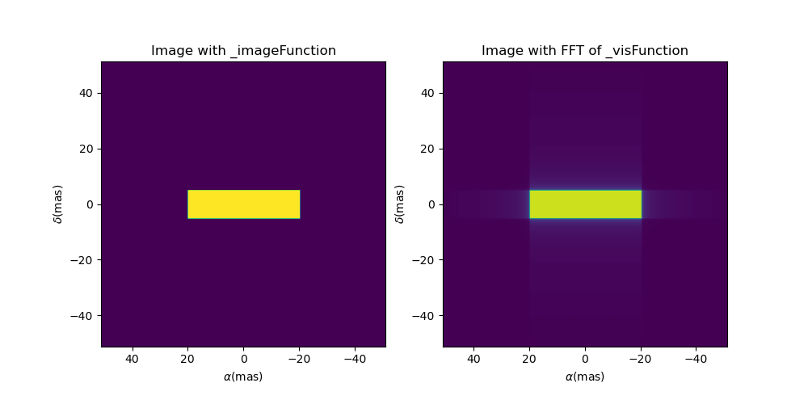
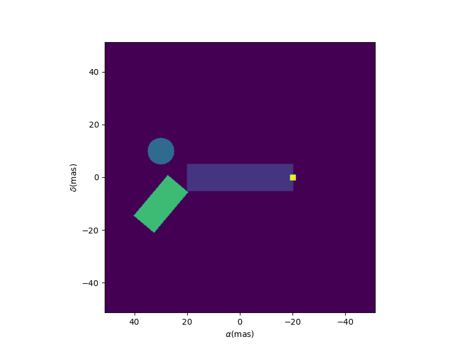
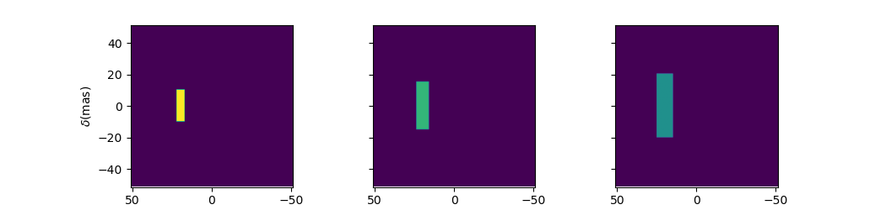
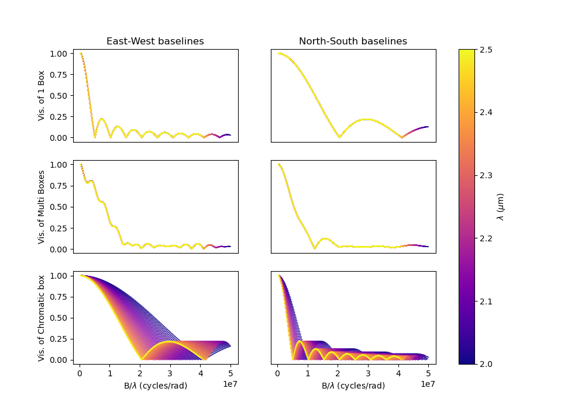
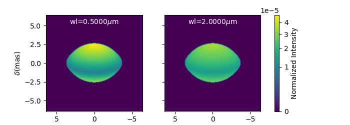
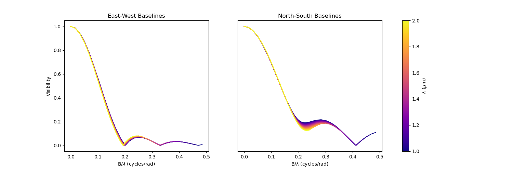
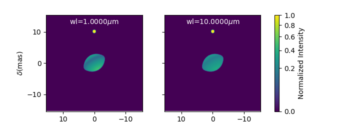
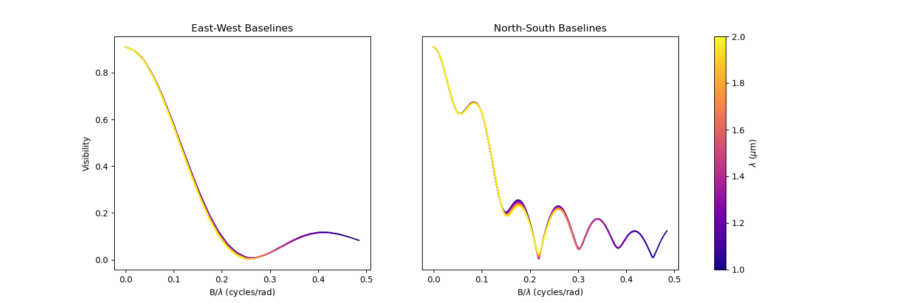
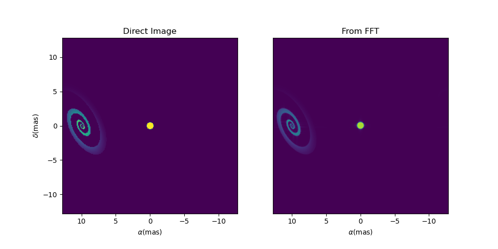
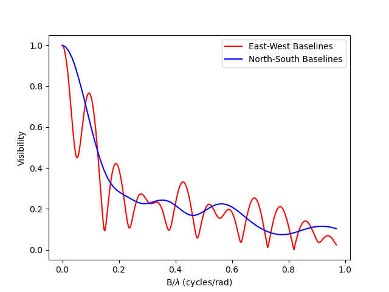

..  _expandingSoftware:
 
Expanding the Software
----------------------

In this section we present examples that show how to expand the functionalities of the oimodeler sofwate by creating customs objects : oimComponents, oimFilterComponents, oimFitters, and custom plotting function or utils.

Creating new Fourier Components
^^^^^^^^^^^^^^^^^^^^^^^^^^^^^^^

In the `createCustomComponentFourier.py <https://github.com/oimodeler/oimodeler/blob/main/examples/ExpandingSoftware/createCustomComponentFourier.py>`_ example we show how to implement a new model component using a formula in the Fourier plan. The component will inherit from the  **oimComponentFourier** class. The Fourier formula should be implemented in  ``_visFunction`` and optionally the formula in the image plan can be implemented using  ``_imageFunction``. 

For this example we will show how to implement a basic rectangular box component. We start by importing oimodeler and some other useful packages.

.. code-block:: python

    import oimodeler as oim
    import matplotlib.pyplot as plt
    import matplotlib.colors as colors
    import numpy as np
    import astropy.units as u

Our new component will be named **oimBox**, and it will have two parameters, ``dx`` and ``dy`` the size of the box in the x and y directions. Le'ts start to implement the oimBox class and its ``__init__`` method.

.. code-block:: python

    class box(oim.oimComponentFourier):
    name="2D Box"
    shortname = "BOX"
    def __init__(self,**kwargs): 
        
         super().__init__(**kwargs)
         self.params["dx"]=oim.oimParam(name="dx", value=1,description="Size in x",unit=u.mas)
         self.params["dy"]=oim.oimParam(name="dy", value=1,description="Size in y",unit=u.mas)       
         self._eval(**kwargs)
         

The class inherit from **oim.oimComponentFourier**. In the ``__init__`` method is called with the ``**kwargs`` arguments that allows to pass keyword arguments. To inherit from the parent class, we first call its  initialization method with ``super()__init__``. Then we define the two new parameters, dx and dy which are instances of the oimParam class. Finally we need to call the ``_eval`` method that allows the parameters to be processed.

Now that the new class is created, we need to implement the ``_visFunction`` method, with the Fourier transform formula of our component.  This method is called when using the getComplexCoherentFlux method of the oimComponent class. 

Note that the component parameters should be called with (wl,t) to allow parameter chromaticity and time dependence. The parameters have a unit and this should also be used to allow the use of other units when creating instances of the component.

In our case the complex visibilty of a rectangle is quite easy to write. It is a simple 2D-sinc function. Note that the x and y sizes are converted from the given unit (usually mas) to rad 

.. code-block:: python

    def _visFunction(self,ucoord,vcoord,rho,wl,t):
        
        x=self.params["dx"](wl,t)*self.params["dx"].unit.to(u.rad)*ucoord
        y=self.params["dy"](wl,t)*self.params["dy"].unit.to(u.rad)*vcoord
        
        return np.sinc(x)*np.sinc(y) 
    

We also need to implement the image method that will be called whenusing the getImage method. If not implemented the model will use the Fourier based formula to compute the image. It will also be the case if the keyword fromFT is set to True when the getImage is called. However it is always interesting to implement the image method, at least for debugging purpose, to check that the image compute for the image formula and using the fromFT option gives compatible results. We will check that later in that example.

For our box, we can implement the image method with logical operations

.. code-block:: python

    def _imageFunction(self,xx,yy,wl,t):
            
            return ((np.abs(xx)<=self.params["dx"](wl,t)/2) &
                    (np.abs(yy)<=self.params["dy"](wl,t)/2)).astype(float)

The full code of the oimBox component is quite short.

.. code-block:: python

    class oimBox(oim.oimComponentFourier):
    name="2D Box"
    shortname = "BOX"
    
    def __init__(self,**kwargs):       
         super().__init__(**kwargs)
         self.params["dx"]=oim.oimParam(name="dx", value=1,description="Size in x",unit=u.mas)
         self.params["dy"]=oim.oimParam(name="dy", value=1,description="Size in y",unit=u.mas)       
         self._eval(**kwargs)

    def _visFunction(self,ucoord,vcoord,rho,wl,t): 
        x=self.params["dx"](wl,t)*self.params["dx"].unit.to(u.rad)*ucoord
        y=self.params["dy"](wl,t)*self.params["dy"].unit.to(u.rad)*vcoord      
        return np.sinc(x)*np.sinc(y) 

    def _imageFunction(self,xx,yy,wl,t):            
            return ((np.abs(xx)<=self.params["dx"](wl,t)/2) &
                    (np.abs(yy)<=self.params["dy"](wl,t)/2)).astype(float)

We can now use it as any other oimodeler components. Let's build our first model with it.

.. code-block:: python
    
    b1=oimBox(dx=40,dy=10)
    m1=oim.oimModel([b1])
    
  
Now we can create images of our model: 

- with the _imageFunction
- with the FFT of the _visFunction

Both can be created with the ``showModel`` method of the oimComponent. To create the image from the FFT of the visibilty function, we just need to set the ``fromFT`` keyword to True.

.. code-block:: python

    fig, ax = plt.subplots(1,2,figsize=(10,5))
    m1.showModel(512,0.2,axe=ax[0],colorbar=False)
    m1.showModel(512,0.2,axe=ax[1],fromFT=True,colorbar=False)
    ax[0].set_title("Image with _imageFunction")
    ax[1].set_title("Image with FFT of _visFunction")

Of course as our oimBox inherit from the oimComponent, it has three addtionnal parameters : the positions ``x`` and ``y`` and the flux ``f``. All oimComponent can also be rotated using the ``pa`` parameter. Note that if not set at the component creation the ``pa`` parameters (and the ``elong`` one) are not added to the model.

Let's create a complex model with boxes and uniform disk.

.. code-block:: python

    b2=oimBox(dx=2,dy=2,x=20,y=0,f=0.5)
    b3=oimBox(dx=10,dy=20,x=-30,y=10,pa=50,f=10)
    c=oim.oimUD(d=10,x=-30,y=-10)
    m2=oim.oimModel([b1,b2,b3,c])
    m2.showModel(512,0.2,colorbar=False,figsize=(5,5))

  
We could also create a chromatic box component using the oimInterpWl class or link parameters with 

.. code-block:: python

    b4=oimBox(dx=oim.oimInterpWl([2e-6,2.4e-6],[5,10]),dy=2,x=20,y=0,f=0.5)
    b4.params['dy']=oim.oimParamLinker(b4.params['dx'],'mult',4)
    
    m3=oim.oimModel([b4])

    m3.showModel(512,0.2,wl=[2e-6,2.2e-6,2.4e-6],colorbar=False,swapAxes=True)

    

Let's finish this example by plotting the visibility of such models for a set of East-West and North-South baselines and wavelengths in the K band.

.. code-block:: python
     
    nB = 200  # number of baselines
    nwl = 50  # number of walvengths

    # Create some spatial frequencies
    wl = np.linspace(2e-6, 2.5e-6, num=nwl)
    B = np.linspace(1, 100, num=nB)
    Bs = np.tile(B, (nwl, 1)).flatten()
    wls = np.transpose(np.tile(wl, (nB, 1))).flatten()
    spf = Bs/wls
    spf0 = spf*0

    fig,ax=plt.subplots(3,2,figsize=(10,7))

    models=[m1,m2,m3]
    names =["1 Box", "Multi Boxes","Chromatic box"]

    for i,m in enumerate(models):
        
        visWest=np.abs(m.getComplexCoherentFlux(spf,spf0,wls)).reshape(nwl, nB)
        visWest /= np.outer(np.max(visWest, axis=1), np.ones(nB))
        visNorth=np.abs(m.getComplexCoherentFlux(spf0,spf,wls)).reshape(nwl, nB)
        visNorth /= np.outer(np.max(visNorth, axis=1), np.ones(nB))

        ax[i,0].scatter(spf, visWest, c=wls*1e6, s=0.2, cmap="plasma")
        ax[i,1].scatter(spf, visNorth, c=wls*1e6, s=0.2, cmap="plasma")
        ax[i,0].scatter(spf, visWest, c=wls*1e6, s=0.2, cmap="plasma")
        ax[i,1].scatter(spf, visNorth, c=wls*1e6, s=0.2, cmap="plasma")
        
        ax[i,0].set_ylabel("Vis. of {}".format(names[i]))
        
        if i!=2:
            ax[i,0].get_xaxis().set_visible(False)
            ax[i,1].get_xaxis().set_visible(False)
            
        ax[i,1].get_yaxis().set_visible(False)
            
    ax[2,0].set_xlabel("B/$\\lambda$ (cycles/rad)")
    ax[2,1].set_xlabel("B/$\\lambda$ (cycles/rad)")
    ax[0,0].set_title("East-West baselines")
    ax[0,1].set_title("North-South baselines")
                  

    
Of course, only the third model is chromatic.

Creating new Image Components : Fast Rotator
^^^^^^^^^^^^^^^^^^^^^^^^^^^^^^^^^^^^^^^^^^^^

In the `createCustomComponentImageFastRotator.py <https://github.com/oimodeler/oimodeler/blob/main/examples/ExpandingSoftware/createCustomComponentImageFastRotator.py>`_ example we will create a new component derived from the oimImageComponent using an external function that return a chromatic image cube.

The model is a simple implementation of a far rotating star flattened by rotation (Roche Model) and including gravity darkening (:math:`T_{eff}\propto g_{eff}^\beta`). The emission is a simple blackbody. The model is defined in the `fastRotator.py <https://github.com/oimodeler/oimodeler/blob/main/examples/ExpandingSoftware/fastRotator.py>`_ script.

First let's import a few packages used in this example:

.. code-block:: python

    import numpy as np
    import matplotlib.pyplot as plt
    import matplotlib.colors as colors
    import matplotlib.cm as cm
    from astropy import units as units
    import oimodeler as oim
    from fastRotator import fastRotator
    

Now we will define the new class for the FastRotator model. It will derived from the oimComponentImage as the model is defined in the image plane. We first write the __init__ method of the new class. It needs to includes all the model parameters. 

.. code-block:: python

    class oimFastRotator(oim.oimComponentImage):
        name="Fast Rotator"
        shortname="FRot"
        def __init__(self,**kwargs):
            super(). __init__(**kwargs)
            
            self.params["incl"]=oim.oimParam(name="incl",value=0,description="Inclination angle",unit=units.deg)
            self.params["rot"]=oim.oimParam(name="rot",value=0,description="Rotation Rate",unit=units.one)     
            self.params["Tpole"]=oim.oimParam(name="Tpole",value=20000,description="Polar Temperature",unit=units.K)
            self.params["dpole"]=oim.oimParam(name="dplot",value=1,description="Polar diameter",unit=units.mas)
            self.params["beta"]=oim.oimParam(name="beta",value=0.25,description="Gravity Darkening Exponent",unit=units.one)
           
            self._t = np.array([0]) 
            self._wl = np.linspace(0.5e-6,15e-6,num=10)  
            
            self._eval(**kwargs)
            
Unlike for models defined in the Fourier plan, you need to define the internal wavelength ``self._wl`` and time ``self._t`` grids. Here we set the time to a fixed value so that the model will be time independent. The wavelength dependence of the model is set to a vector of 10 reference walvenegth between 0.5 and 15 microns. This will be used to compute reference images and linear interpolation in wavelength will be used on the Fourier Trasnforms of the images. 

Together with the parameter ``dim`` (dimension of the image in x and y) ``self._wl`` and ``self._t`` set the length dimensions of the internal image hypercube (4-dimensional : x, y, wl, and t). 

Now we can implement the call to the fastRotator function. As it is an external function that computes its own spatial and spectral grid we need to implement it in the ``_internalImage`` method. 

.. code-block:: python

    def _internalImage(self):        
        dim=self.params["dim"].value
        incl=self.params["incl"].value        
        rot=self.params["rot"].value
        Tpole=self.params["Tpole"].value
        dpole=self.params["dpole"].value
        beta=self.params["beta"].value  
       
        im=fastRotator(dim,1.5,incl,rot,Tpole,self._wl,beta=beta)
        im=np.tile(np.moveaxis(im,-1,0)[None,:,:,:],(1,1,1,1))
       
        self._pixSize=1.5*dpole/dim*units.mas.to(units.rad)
        
        return im
        

Here we need to reshape the result of the ``fastRotator`` function to the proper shape for an internal image of the oimImageComponent class. FastRotator return a 3D image-cube (x,y,wl). We move axis and reshape it to a 4D image-hypercube (t,wl,x,y). 

Finally we need to set the pixel size (in radians) using the ``self._pixSize`` member variable. For our example, we compute a fastRotator on a grid of 1.5 polar diameter (because the equatorial diameter goes up to 1.5 polar diameter for a critically rotating star). The pixel size formula depends on ``dpole`` and ``dim`` parameters. 

Let's building our first model with this brand new component.

.. code-block:: python

    c=oimFastRotator(dpole=5,dim=128,incl=-70,rot=0.99,Tpole=20000,beta=0.25)
    m=oim.oimModel(c)
    
We can now plot the model images at various wavelengths as for any other oimModel. 

.. code-block:: python

    m.showModel(512,0.025,wl=[1e-6,10e-6 ],legend=True, normalize=True)
    

 
Let's create a some spatial frequencies, with some chromaticity. We create baselines in the East-West and North-South orientations.

.. code-block:: python

    nB=1000
    nwl=20
    wl=np.linspace(1e-6,2e-6,num=nwl)

    B=np.linspace(0,100,num=nB//2)
    Bx=np.append(B,B*0) # East-West 
    By=np.append(B*0,B) # North-South 

    Bx_arr=np.tile(Bx[None,:], (nwl, 1)).flatten()
    By_arr=np.tile(By[None,:], (nwl,  1)).flatten()
    wl_arr=np.tile(wl[:,None], (1, nB)).flatten()

    spfx_arr=Bx_arr/wl_arr
    spfy_arr=By_arr/wl_arr

We compute the complex coherent flux and then extract the visiblity for it. Note that the model is already normalized to one so that we don't need to divide the CCF by the zero frquency.

.. code-block:: python

    vc=m.getComplexCoherentFlux(spfx_arr,spfy_arr,wl_arr)
    v=np.abs(vc.reshape(nwl,nB))

Finally we plot the East-West and North-South visibliity with a colorscale for the wavelength.

.. code-block:: python

    fig,ax=plt.subplots(1,2,figsize=(15,5))
    titles=["East-West Baselines","North-South Baselines"]
    for iwl in range(nwl):
        cwl=iwl/(nwl-1)
        ax[0].plot(B/wl[iwl]/units.rad.to(units.mas),v[iwl,:nB//2],
                color=plt.cm.plasma(cwl))
        ax[1].plot(B/wl[iwl]/units.rad.to(units.mas),v[iwl,nB//2:],
               color=plt.cm.plasma(cwl))  

    for i in range(2):
        ax[i].set_title(titles[i])
        ax[i].set_xlabel("B/$\lambda$ (cycles/rad)")
    ax[0].set_ylabel("Visibility")    
    ax[1].get_yaxis().set_visible(False)   

    norm = colors.Normalize(vmin=np.min(wl)*1e6,vmax=np.max(wl)*1e6)
    sm = cm.ScalarMappable(cmap=plt.cm.plasma, norm=norm)
    fig.colorbar(sm, ax=ax,label="$\\lambda$ ($\\mu$m)")
 

  
  
The new ``oimfastRotator component can be rotated and used with other ``oimComponent`` to build more complex models. 

Here we add a uniform disk component ``oimUD``
   
.. code-block:: python

    c.params['f'].value=0.9
    c.params['pa'].value=45
    ud=oim.oimUD(d=1,f=0.1,y=10)
    m2=oim.oimModel(c,ud)
    
And finally, we produce the same plots as before for this new complex model.

.. code-block:: python

    m2.showModel(512,0.06,wl=[1e-6,10e-6],legend=True, normalize=True,normPow=1)

    vc=m2.getComplexCoherentFlux(spfx_arr,spfy_arr,wl_arr)
    v=np.abs(vc.reshape(nwl,nB))

    fig,ax=plt.subplots(1,2,figsize=(15,5))
    titles=["East-West Baselines","North-South Baselines"]
    for iwl in range(nwl):
        cwl=iwl/(nwl-1)
        ax[0].plot(B/wl[iwl]/units.rad.to(units.mas),v[iwl,:nB//2],
                color=plt.cm.plasma(cwl))
        ax[1].plot(B/wl[iwl]/units.rad.to(units.mas),v[iwl,nB//2:],
               color=plt.cm.plasma(cwl))  

    for i in range(2):
        ax[i].set_title(titles[i])
        ax[i].set_xlabel("B/$\lambda$ (cycles/rad)")
    ax[0].set_ylabel("Visibility")    
    ax[1].get_yaxis().set_visible(False)   

    norm = colors.Normalize(vmin=np.min(wl)*1e6,vmax=np.max(wl)*1e6)
    sm = cm.ScalarMappable(cmap=plt.cm.plasma, norm=norm)
    fig.colorbar(sm, ax=ax,label="$\\lambda$ ($\\mu$m)")
    

  

  
Creating new Image Components : Spiral
^^^^^^^^^^^^^^^^^^^^^^^^^^^^^^^^^^^^^^

In the `createCustomComponentImageSpiral.py <https://github.com/oimodeler/oimodeler/blob/main/examples/ExpandingSoftware/createCustomComponentImageSpiral>`_ example we will create a new component derived from the oimImageComponent which describe a logarithmic spiral. Unlike with the previous example, we will write the equation defining the intensity distribution of such model in the oimImageComponent derived class.

But first let's import a few packages used in this example:

.. code-block:: python

    import numpy as np
    import matplotlib.pyplot as plt
    import matplotlib.colors as colors
    import matplotlib.cm as cm
    import oimodeler as oim
    from astropy import units as units

Now we will define the new class for the spiral model. Again will derived from the oimComponentImage as the model is defined in the image plane. We first write the __init__ method of the new class. It needs to includes all the model parameters. 

.. code-block:: python

    class oimSpiral(oim.oimComponentImage):      
        name="Spiral component"
        shorname="Sp"      
        elliptic=True
        
        def __init__(self,**kwargs):
            super(). __init__(**kwargs)
                    
            self.params["fwhm"]=oim.oimParam(**oim._standardParameters["fwhm"])
            self.params["P"]=oim.oimParam(name="P",value=1,description="Period in mas",unit=units.mas)
            self.params["width"]=oim.oimParam(name="width",value=0.01,description="Width as filling factor",unit=units.one)
           
            self._pixSize=0.05*units.mas.to(units.rad)
            
            self._t = np.array([0]) # constant value <=> static model
            self._wl = np.array([0])  # constant value <=> achromatic model
            
            self._eval(**kwargs)

Here we chose to fix the pixel size in the __init__ method. As we don't intent to have chromaticity, we fixed the internal time and wavelength arrays.

Unlike in the previous example, as we don't use externally computed image, we can implement the ``_imageFunction`` of the class instead of the ``_internaImage`` one. The main difference is that the ``_imageFunction`` directly provide the 4D-grid in time, walnvegth and x and y.

.. code-block:: python

    def _imageFunction(self,xx,yy,wl,t):
        
        r=np.sqrt(xx**2+yy**2)  
        phi=np.arctan2(yy,xx)
        
        p=self.params["P"](wl,t)
        sig=self.params["fwhm"](wl,t)/2.35
        w=self.params["width"](wl,t)
        
        im=1 + np.cos(-phi-2*np.pi*np.log(r/p+1))
        im=(im<2*w)*np.exp(-r**2/(2*sig**2))
        return im
        
.. note::
    As xx and yy are transformed coordinates, r and phi takes into account the ellipticity and orientation using the ``pa`` and ``elong`` keywords
    
We create a model consisting of two components: the newly defined oimSpiral class and a uniform disk (oimUD).

.. code-block:: python

    ud=oim.oimUD(d=2,f=0.2)
    c=oimSpiral(dim=256,fwhm=5,P=0.1,width=0.2,pa=30,elong=2,x=10,f=0.8)
    m=oim.oimModel(c,ud)
    
Then we plot the image of the model (using the direct image formula and going back and forth to the Fourier plan).

.. code-block:: python

    fig,ax=plt.subplots(1,2,figsize=(10,5))
    m.showModel(256,0.1,swapAxes=True,fromFT=False,normPow=1,axe=ax[0],colorbar=False)
    m.showModel(256,0.1,swapAxes=True,fromFT=True,normPow=1,axe=ax[1],colorbar=False)
    ax[1].get_yaxis().set_visible(False)
    ax[0].set_title("Direct Image")
    ax[1].set_title("From FFT")

And finally the visibility from the models for a fixed walvength and a series of baselines in two perpendicular orientations.

.. code-block:: python

    nB=5000
    nwl=1
    wl=0.5e-6

    B=np.linspace(0,100,num=nB//2)
    Bx=np.append(B,B*0)
    By=np.append(B*0,B)

    spfx=Bx/wl
    spfy=By/wl

    vc=m.getComplexCoherentFlux(spfx,spfy)
    v=np.abs(vc/vc[0])

    fig,ax=plt.subplots(1,1)
    label=["East-West Baselines",]

    ax.plot(B/wl/units.rad.to(units.mas),v[:nB//2],color="r",label="East-West Baselines")
    ax.plot(B/wl/units.rad.to(units.mas),v[nB//2:],color="b",label="North-South Baselines")  

    ax.set_xlabel("B/$\lambda$ (cycles/rad)")
    ax.set_ylabel("Visibility")    
    ax.legend()

Creating new Radial profile Components
^^^^^^^^^^^^^^^^^^^^^^^^^^^^^^^^^^^^^^
.. warning::
    Example will be added when te oimComponentRadialProfile will be fully implemented