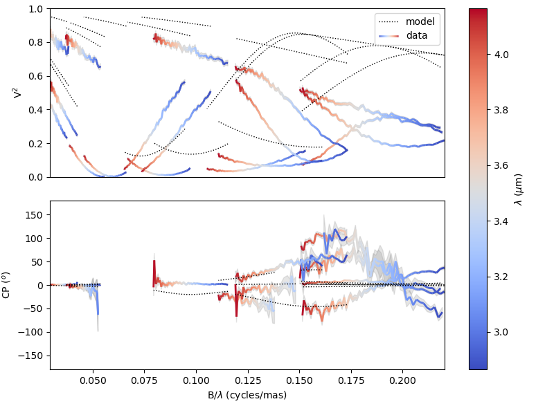
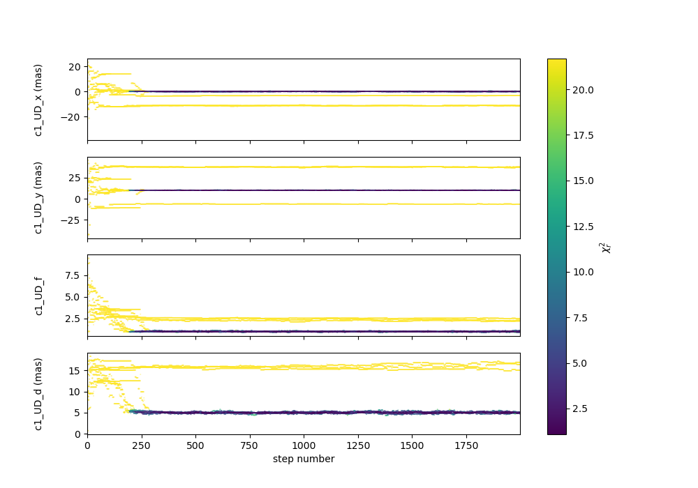
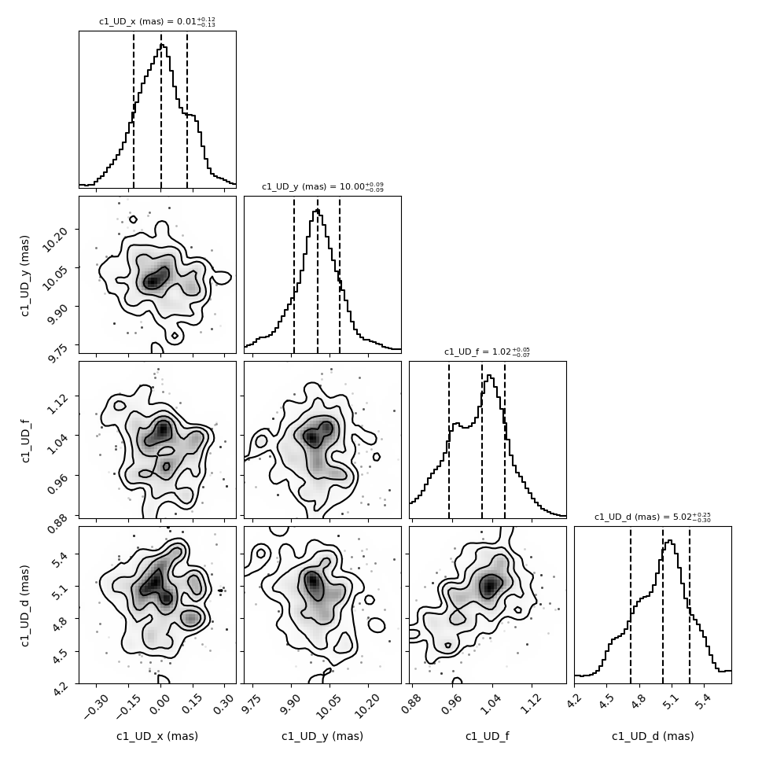
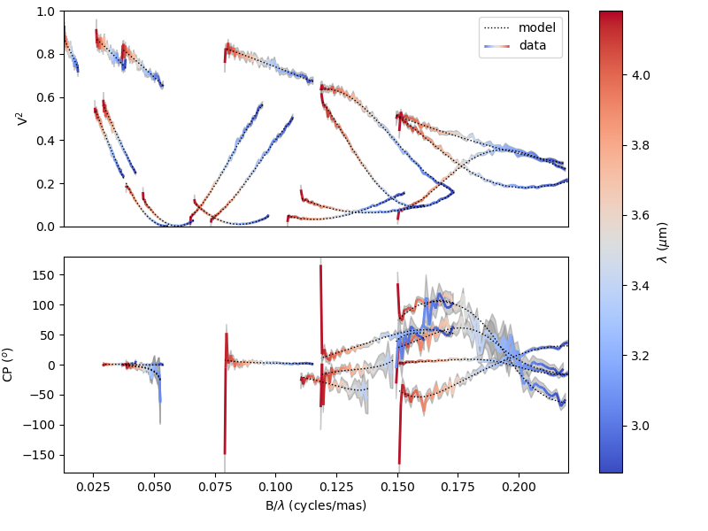
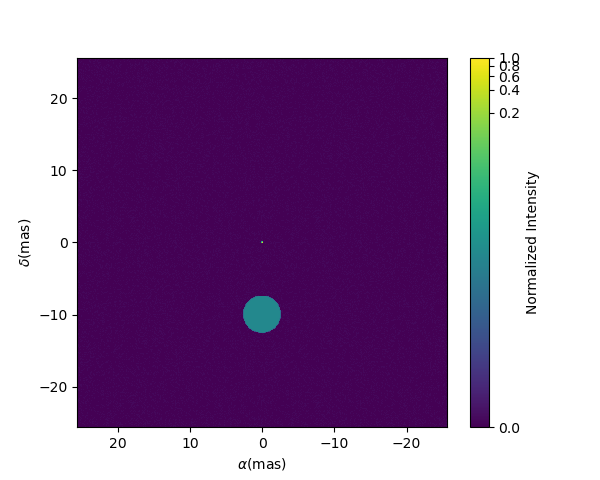

.. _getting_started:

Getting Started
===============

Let's start by importing the oimodeler library. 

.. code-block:: python

    import oimodeler as oim
    

For this example we will use some oifits files located in the examples/testData/ASPRO_MATISSE2 subdirectory of the oimodeler github repository.
These  data are actUally a "fake" dataset simulated with the `APSRO <https://www.jmmc.fr/english/tools/proposal-preparation/aspro/>`_ software from the `JMMC <http://www.jmmc.fr/>`_. ASPRO aws used to create three MATISSE observations of a binary star with one resolved component. ASPRO allow to add realistic noise on the interferometric quantities.  

.. code-block:: python

    import os
    path = os.path.dirname(oim.__file__)
    pathData=os.path.join(path,os.pardir,"examples","testData","ASPRO_MATISSE2")
    files=[os.path.abspath(os.path.join(pathData,fi)) for fi in os.listdir(pathData)]
    
If the path is corretly set ``files`` should be a list of the path to the three oifits files.

Let's create a simple binary model with one resolved component. It consist on two components: an point source (oimPt) and a uniform disk (oimUD). The oimPt has only three parameters, its coordinates x and y (in mas by default) and it flux (f). Note that all components parameters are instances of the oimParam class. The second component, the uniform disk has four parameters: x, y, f, and the disk diameter (d) which is alos in mas by default. If parameters are not set explicitely when the component are created they are set to their defazult value (e.g. 0 for x and y, and 1 for f).

.. code-block:: python

    ud=oim.oimUD(d=3,f=0.5,x=5,y=-5)
    pt=oim.oimPt(f=1)
    
We can print the description of the component easily

.. code-block:: python

    print(ud)

.. code-block::
    
    >>Uniform Disk x=5.00 y=-5.00 f=0.50 d=3.00

Or if we want to print the details of a parameter:

.. code-block:: python

    print(ud.params['d'])
    
.. code-block:: 
    
    >>oimParam d = 3 ± 0 mas range=[-inf,inf] free 

.. code-block:: python

    print(ud.params['x'])

.. code-block:: 
    
    >>oimParam x = 5 ± 0 mas range=[-inf,inf] fixed 

Note that the x parameter is fixed by default (for model fitting) whereas the diameter d is free. The oimParams instance also contains the unit (oimParam.unit as a astropy.units),  uncertainties(oimParam.error), and range  for model fitting (oimParam.mini and oimParam.maxi). There are various way of accessing and modify the value of the parameter or one of its other quantities. 

For our example, we want to set the coordinates of the uniform disk to free and set them to a range of 50 mas. We will explore the diameter between 0.01 and 20 mas. and the flux between 0 and 10. On the other hand flux of the point source will be left to ta fixed value of one.

.. code-block:: python
    
    ud.params['d'].set(min=0.01,max=20)
    ud.params['x'].set(min=-50,max=50,free=True)
    ud.params['y'].set(min=-50,max=50,free=True)
    ud.params['f'].set(min=0.,max=10.)
    pt.params['f'].free=False

Finally we can build our model consisting of these two components.

.. code-block:: python

    model=oim.oimModel([ud,pt])
    
We can print all model parameters:

.. code-block:: python

    model.getParameters()
    
.. code-block:: 
    
    >>{'c1_UD_x': oimParam at 0x1670462cca0 : x=5 ± 0 mas range=[-50,50] free=True ,
    'c1_UD_y': oimParam at 0x1670462cac0 : y=-5 ± 0 mas range=[-50,50] free=True ,
    'c1_UD_f': oimParam at 0x1670462cd60 : f=0.5 ± 0  range=[0.0,10.0] free=True ,
    'c1_UD_d': oimParam at 0x1670462ca90 : d=3 ± 0 mas range=[0.01,20] free=True ,
    'c2_Pt_x': oimParam at 0x1670462cc70 : x=0 ± 0 mas range=[-inf,inf] free=False ,
    'c2_Pt_y': oimParam at 0x1670462cb80 : y=0 ± 0 mas range=[-inf,inf] free=False ,
    'c2_Pt_f': oimParam at 0x167055de490 : f=1 ± 0  range=[-inf,inf] free=False }
   
Or only the free paremters:

.. code-block:: python

    print(model.getFreeParameters())
    
.. code-block:: 
    
    >>{'c1_UD_x': oimParam at 0x167055ded30 : x=5 ± 0 mas range=[-50,50] free=True ,
    'c1_UD_y': oimParam at 0x167055deca0 : y=-5 ± 0 mas range=[-50,50] free=True ,
    'c1_UD_f': oimParam at 0x167055dec70 : f=0.5 ± 0  range=[0.0,10.0] free=True ,
    'c1_UD_d': oimParam at 0x167055de850 : d=3 ± 0 mas range=[0.01,20] free=True }
   
   
Let's now compare our data and our model. We will use the class oimSimulator. 

.. code-block:: python

    sim=oim.oimSimulator(data=files,model=model)
    sim.compute(computeChi2=True,computeSimulatedData=True)
    

let's print the reduced chi2 from our data/model comparison:

.. code-block:: python

    print("Chi2r = {}".format(sim.chi2r))

.. code-block:: python
    
    Chi2r = 11245.589571274892

Obviously, our model is quite bad. Let's plot a model/data comparison for the square visibility (VIS2DATA) and closure phase (T3PHI):

.. code-block:: python

    fig0,ax0= sim.plot(["VIS2DATA","T3PHI"])
    
    
    

  
 
The figure and axes list are returned so that you can modify them after creation. You can directly save the figure using the savefig=`filename` option.

Let's do a simple model fitting using the oimFitterEmcee class. This class encapsulate the famous `emcee <https://emcee.readthedocs.io/en/stable/>`_  implementation of Goodman & Weare’s Affine Invariant Markov chain Monte Carlo (MCMC) Ensemble sampler. 

Here we create a simple emcee fitter with 10 independant walkers. We can give it either our oimSimulator or the our data (oimData or list of filenames) and oimModel.
   
.. code-block:: python
   
    fit=oim.oimFitterEmcee(files,model,nwalkers=10)
    

Then we prepare our fitter for the mcmc run. Here we chose to initialize the array of walkers to random positions within the range given in the model parameters.
   
.. code-block:: python
    
    fit.prepare(init="random")

The initial parameters are stored in the ``initialParams`` member variable of the fitter.

.. code-block:: python

    print(fit.initialParams)
    
    
.. code-block:: python

    >>[[-30.26628081  26.02405335   7.23061417  19.19829182]
     [ 23.12647935  44.07636861   3.39149131  17.29408761]
     [ -9.311772    47.50156564   9.49185499   4.79198633]
     [-24.05134905 -12.45653228   5.36560382   0.29631924]
     [-28.13992968 -25.25330839   9.64101194   6.21004462]
     [  5.13551292  25.3735599    4.82365667   0.53696176]
     [  3.6240551  -41.03297919   4.79235224   7.12035193]
     [-10.57430397 -40.19561341   6.0687408   11.22285079]
     [ 12.76468252  16.83390367   4.40925502   5.64248841]
     [ 29.12590452  -0.20420277   4.21541399  13.16022251]]

.. code-block:: python

    fit.run(nsteps=2000,progress=True)
    

.. code-block:: 

    >>17%|█        | 349/2000 [00:10<00:48, 34.29it/s]

Let's plot the parameters of the 20 walkers as a function of the steps of the mcmc run.

.. code-block:: python

    figWalkers,axeWalkers=fit.walkersPlot()
    
    

  
  
After a few hundred steps most walkers converge to a position with a good reduced chi2. However, from that figure will clearly see that:

- not all walkers have converge after 2000 steps
- some walkers converge to a solution that gives significantly worst chi2

In optical interferometry there are often local minimas in the chi2 and it seems that some of our walkers are locked there. In our case, this minimum is due to the fact that object is close be symmetrical if not for the fact than one of the component is resolved. Neverless, the chi2 of the local minimum is about 20 times worst the one of the global minimum.

We can plot the famous corner plot with the 1D and 2D density distribution. oimodel use the `corner.py <https://corner.readthedocs.io/en/latest/>`_ library for that purpose. We will discard the 1000 first steps as most of the walkers have converge after that. By default, the corner plot remove also the data with a chi2 greater than 20 times those of the best model. This option can be changed using the keyword ``chi2limfact`` 

.. code-block:: python

    figCorner,axeCorner=fit.cornerPlot(discard=1000)
    

    

We now can get the result of our fit. The oimFitterEmcee fitter can either return the ``best``, the ``mean`` or the ``median`` model. It return uncertainties estimated from the density distribution (see emcee for more details on the statistics). 

.. code-block:: python
    
    median,err_l,err_u,err=fit.getResults(mode='median',discard=1000)

To compute the median and mean model we have to remove, as in the corner plot, the walkers that didn't converge with the ``chi2limitfact`` keyword (default in 20) and remove the steps of the bruning phase with the ``discard`` option.

When asking for the results, the simulatedData with these value are also produced in the fitter internal simulator. We can plot again the data/model and compute the final reduced chi2:

.. code-block:: python 
    
    figSim,axSim=fit.simulator.plot(["VIS2DATA","T3PHI"])
    print("Chi2r = {}".format(fit.simulator.chi2r))
    

.. code-block:: python 

    Chi2r = 0.5329892520666781

That's better.

.. warning::
    Note that the reduced chi2 is about 0.5 instead of 1 as ASPRO overestimated the MATISSE noise.

We can also show an image of the model with the best paramaters. Here we generate a 512x512 image with a 0.1 mas pixel size and a 0.1 power law colorscale:

.. code-block:: python 

    figImg,axImg,im=model.showModel(512,0.1,normPow=0.1)
       

Here is our nice binary! 

That's all for this short introduction. 

If you want to go further you can look at the :ref:`examples` or :ref:`api` sections.

