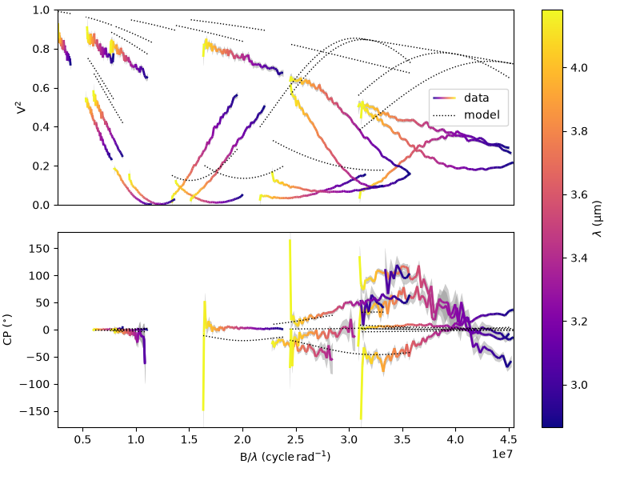
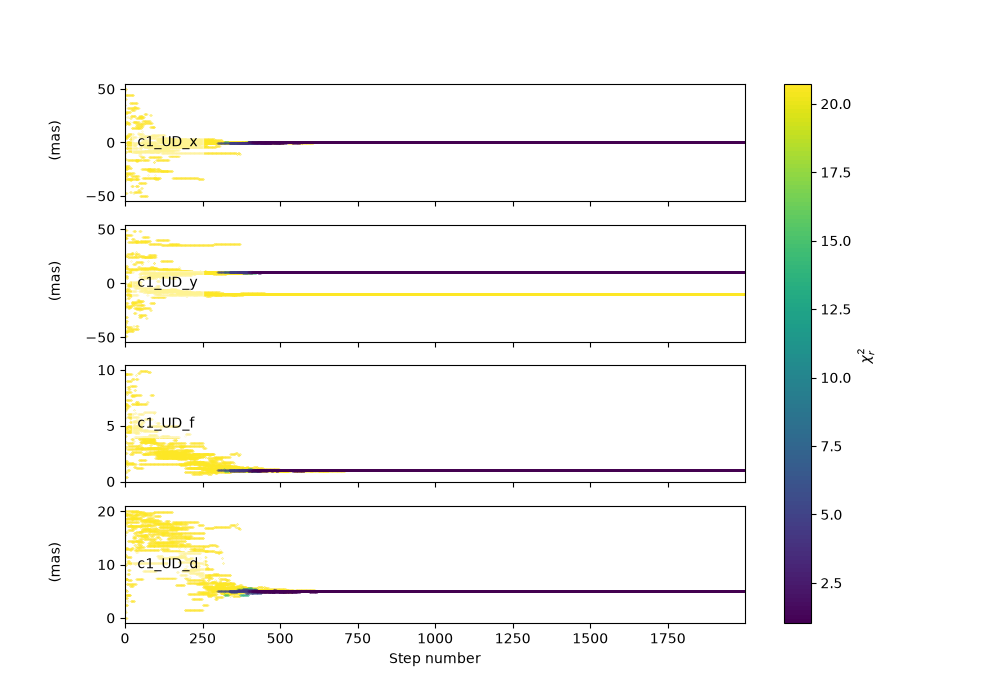
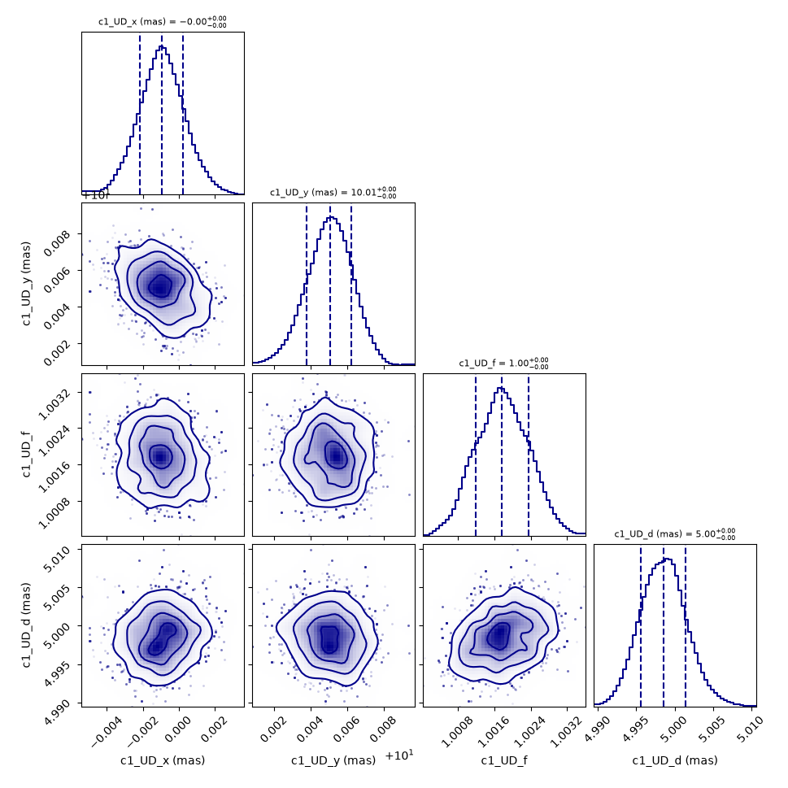
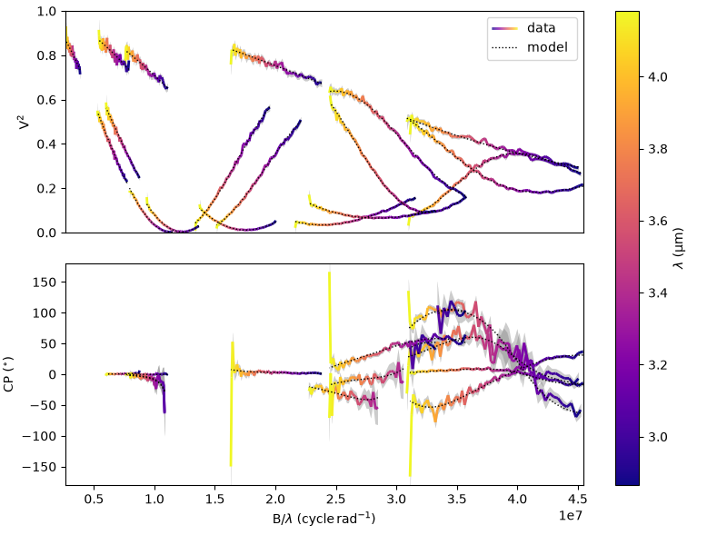
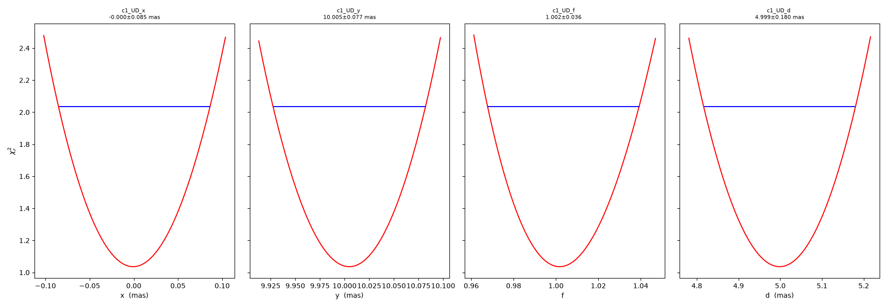
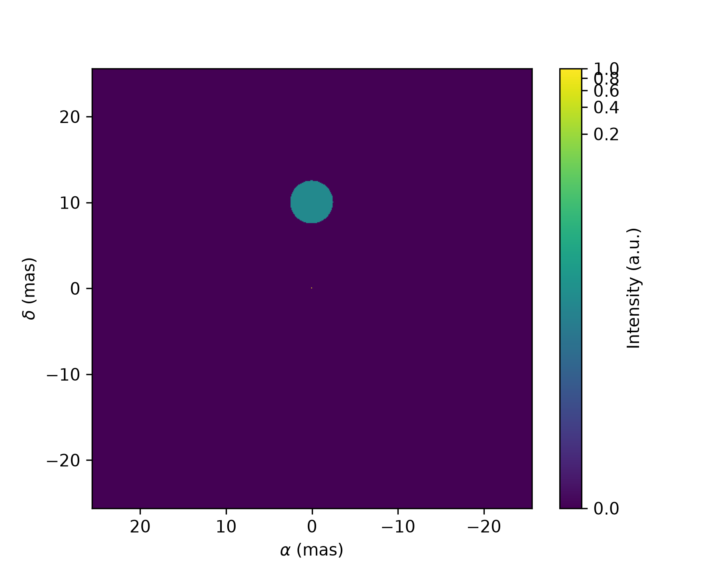

.. _getting_started:

Getting Started
===============

The example below is available as 
`gettingStarted.py <https://github.com/oimodeler/oimodeler/tree/main/examples/BasicExamples/gettingStarted.py>`_ 
in the **oimodeler** repository.

.. note::
   
   This example uses OIFITS files located in the 
   `examples/data/ASPRO_MATISSE2 <https://github.com/oimodeler/oimodeler/tree/main/examples/data/ASPRO_MATISSE2>`_ 
   subdirectory of the **oimodeler** `GitHub repository <https://github.com/oimodeler/oimodeler>`_.

   If you did not clone the repository, you will need to manually download the 
   entire `examples/ <https://github.com/oimodeler/oimodeler/tree/main/examples/>`_ directory.

   These data are a simulated "fake" dataset generated with the 
   `ASPRO <https://www.jmmc.fr/english/tools/proposal-preparation/aspro/>`_ software from the 
   `JMMC <http://www.jmmc.fr/>`_. ASPRO created three MATISSE observations of a binary star with one resolved component,
   including realistic noise on the interferometric quantities.

Let's start by importing **oimodeler** and specifying the paths/directories.

.. code-block:: ipython3

    from pprint import pprint
    from pathlib import Path

    import oimodeler as oim

    path = Path(__file__).parent.parent.parent
    data_dir = path / "examples" / "data" / "ASPRO_MATISSE2"
    save_dir = path / "images"
    if not save_dir.exists():
        save_dir.mkdir(parents=True)

    files = list(map(str, data_dir.glob("*.fits")))

If ``data_dir`` is correctly set, ``files`` should be a list of three OIFITS file paths.

.. warning::

   Writing to a write-protected directory will raise an error. Change ``save_dir`` to 
   a writable location if needed.

   Some examples also use a second ``product_dir`` which might need changing similarly.

We will now create a simple binary model with one resolved component using two components:

- A point source created with the :func:`oimPt <oimodeler.oimBasicFourierComponents.oimPt>` class
- A uniform disk created with the :func:`oimUD <oimodeler.oimBasicFourierComponents.oimUD>` class

The point source has three parameters: coordinates `x` and `y` (mas by default) and flux `f`. 
All component parameters are instances of the :func:`oimParam <oimodeler.oimParam.oimParam>` class.

The uniform disk has four parameters: `x`, `y`, `f`, and diameter `d` (mas by default). 
If not explicitly set, parameters default to 0 for `x`, `y`, and `d`, and 1 for `f`.

.. code-block:: ipython3

    ud = oim.oimUD(d=3, f=0.5, x=5, y=-5)
    pt = oim.oimPt(f=1)

We can print a description of the uniform disk component:

.. code-block:: ipython3

    pprint(ud)

.. code-block::

    Uniform Disk x=5.00 y=-5.00 f=0.50 d=3.00

To access a specific parameter, use the ``params`` dictionary. For example, the diameter `d`:

.. code-block:: ipython3

    pprint(ud.params['d'])

.. code-block::

    oimParam d = 3 ± 0 mas range=[-inf,inf] free 

Similarly, for the `x` coordinate:

.. code-block:: ipython3

    pprint(ud.params['x'])

.. code-block::

    oimParam x = 5 ± 0 mas range=[-inf,inf] fixed 

.. note::

   Starting with **oimodeler** version V0.9, component parameters are also directly accessible without passing by the `params` list.
   
For instance you can access the UD diameter and positions typing

.. code-block:: ipython3

    pprint(ud.d)
    pprint(ud.x)

.. code-block::

    oimParam x = 5 ± 0 mas range=[-inf,inf] fixed 
    oimParam d = 3 ± 0 mas range=[-inf,inf] free  
    
    
The `x` parameter is fixed by default for fitting, while `d` is free. The :func:`oimParam` instance also stores units 
(via ``unit`` as an ``astropy.units`` object), uncertainties (``error``), and fitting bounds 
(``mini`` and ``maxi``).

Parameter values and attributes can be accessed and modified in various ways (see the :ref:`models` section for details).

For this example, let's free the uniform disk coordinates with ranges ±50 mas, allow the diameter 
between 0 and 20 mas, and flux between 0 and 10. The point source flux remains fixed at 1.

.. code-block:: ipython3

    ud.d.set(min=0, max=20)
    ud.x.set(min=-50, max=50, free=True)
    ud.y.set(min=-50, max=50, free=True)
    ud.f.set(min=0., max=10.)
    pt.f.free = False

Now, we build the model with these two components:

.. code-block:: ipython3

    model = oim.oimModel(ud, pt)

To print all model parameters inherited from components we type:

.. code-block:: ipython3

    model.getParameters()

.. code-block::

    {'c1_UD_x': oimParam at 0x1670462cca0 : x=5 ± 0 mas range=[-50,50] free=True,
        'c1_UD_y': oimParam at 0x1670462cac0 : y=-5 ± 0 mas range=[-50,50] free=True,
        'c1_UD_f': oimParam at 0x1670462cd60 : f=0.5 ± 0  range=[0.0,10.0] free=True,
        'c1_UD_d': oimParam at 0x1670462ca90 : d=3 ± 0 mas range=[0.01,20] free=True,
        'c2_Pt_x': oimParam at 0x1670462cc70 : x=0 ± 0 mas range=[-inf,inf] free=False,
        'c2_Pt_y': oimParam at 0x1670462cb80 : y=0 ± 0 mas range=[-inf,inf] free=False,
        'c2_Pt_f': oimParam at 0x167055de490 : f=1 ± 0  range=[-inf,inf] free=False}

Or only the free parameters:

.. code-block:: ipython3

    pprint(model.getFreeParameters())

.. code-block::

    {'c1_UD_x': oimParam at 0x167055ded30 : x=5 ± 0 mas range=[-50,50] free=True,
        'c1_UD_y': oimParam at 0x167055deca0 : y=-5 ± 0 mas range=[-50,50] free=True,
        'c1_UD_f': oimParam at 0x167055dec70 : f=0.5 ± 0  range=[0.0,10.0] free=True,
        'c1_UD_d': oimParam at 0x167055de850 : d=3 ± 0 mas range=[0.01,20] free=True}

Let's now compare our data and model using :func:`oimSimulator <oimodeler.oimSimulator.oimSimulator>`. 
It computes simulated data at the spatial (and optionally spectral/temporal) frequencies from our data.

.. code-block:: ipython3

    sim = oim.oimSimulator(data=files, model=model)
    sim.compute(computeChi2=True, computeSimulatedData=True)

Here we print the reduced chi-square :math:`\chi^2_r` from the data/model comparison:

.. code-block:: ipython3

    pprint("Chi2r = {}".format(sim.chi2r))

.. code-block::

    Chi2r = 22510.099167065073

Clearly, the initial model is a poor fit. Let's plot model/data comparison for square visibility (VIS2DATA) and closure phase (T3PHI):

.. code-block:: ipython3

    fig0, ax0 = sim.plot(["VIS2DATA", "T3PHI"])

The ``fig0`` figure and ``ax0`` axes list are returned by :func:`oimSimulator.plot`. You can save the figure directly by passing 
the ``savefig=file_name`` keyword, or afterward using matplotlib `Figure.savefig <https://matplotlib.org/stable/api/_as_gen/matplotlib.figure.Figure.savefig.html>`_ method.

The :func:`oimSimulator <oimodeler.oimSimulator.oimSimulator>` class only compares model and data; it does not fit the model. 
To fit, we use :func:`oimFitterEmcee <oimodeler.oimFitter.oimFitterEmcee>`, which wraps the 
`emcee <https://emcee.readthedocs.io/en/stable/>`_ implementation of Goodman & Weare’s Affine Invariant MCMC sampler.

Now we create a simple MCMC fitter with 10 walkers. We can provide either an :func:`oimSimulator <oimodeler.oimSimulator.oimSimulator>` object or data (list of filenames or :func:`oimData <oimodeler.oimData.oimData>`  object) and a :func:`oimModel <oimodeler.oimModel.oimModel>` class.

.. code-block:: ipython3

    fit = oim.oimFitterEmcee(files, model, nwalkers=10)

Before running the fit, we prepare the fitter by initializing walkers uniformly randomly within the parameter bounds:

.. code-block:: ipython3

    fit.prepare(init="random")

.. note::

    Alternatively, initialization can be "gaussian", where walkers start near current parameter values 
    with Gaussian spreads defined by the parameter errors.

The initial parameters are stored in ``fit.initialParams``:

.. code-block:: ipython3

    pprint(fit.initialParams)

   
.. code-block::

    [[30.26628081  26.02405335   7.23061417  19.19829182]
       [ 23.12647935  44.07636861   3.39149131  17.29408761]
       [ -9.311772    47.50156564   9.49185499   4.79198633]
       [-24.05134905 -12.45653228   5.36560382   0.29631924]
       [-28.13992968 -25.25330839   9.64101194   6.21004462]
       [  5.13551292  25.3735599    4.82365667   0.53696176]
       [  3.6240551  -41.03297919   4.79235224   7.12035193]
       [-10.57430397 -40.19561341   6.0687408   11.22285079]
       [ 12.76468252  16.83390367   4.40925502   5.64248841]
       [ 29.12590452  -0.20420277   4.21541399  13.16022251]]

Now we run the fit on 2000 steps. It will compute 20000  models (i.e., ``nsteps`` x
``nwalkers``).

.. code-block:: ipython3

    fit.run(nsteps=2000, progress=True)

    
.. code-block:: 

    17%|█        | 349/2000 [00:10<00:48, 34.29it/s]

After the run we can plot the values of the 4 free-parameters for the 10 walkers
as a function of the steps of the mcmc run.

.. code-block:: ipython3

    figWalkers, axeWalkers = fit.walkersPlot()
    
    

  
  
After a few hundred steps most walkers converge to the same position having a
good :math:`\chi^2_r`. However, from that figure will clearly see that:

- Not all walkers have converged after 2000 steps.
- Some walkers converge to a solution that gives significantly worse :math:`\chi^2`.

In optical interferometry there are often local minima in the :math:`\chi^2` and it
seems that some of our walkers are locked there.
In our case, this minima are due to the fact that object is close be symmetrical if not
for the fact than one of the component is resolved.
Neverless, the :math:`\chi^2` of the local minimum is about 20 times worse than the one
of the global minimum.

We can plot the `famous` corner plot with the 1D and 2D density distributions.
For this purpose, the **oimodeler** package uses the `corner <https://corner.readthedocs.io/en/latest/>`_
package often associeted with **emcee**.
We will discard the 1000 first steps as most of the walkers have
converged after that. By default, the corner plot also removes the data with a
:math:`\chi^2` greater than 20 times those of the best model.
This option can be changed using the ``chi2limfact`` keyword in the
:func:`oimFitterEmcee.cornerPlot <oimodler.oimFitter.oimFitterEmcee.cornerPlot>` method.

.. code-block:: ipython3

    figCorner, axeCorner = fit.cornerPlot(discard=1000)
    

    

We now can retrieve the result of our fit. 
The :func:`oimFitterEmcee <oimodeler.oimFitter.oimFitterEmcee>` fitter can either
return the ``"best"``, the ``"mean"`` or the ``"median"`` model. It also returns
uncertainties estimated from the density distribution (see emcee's
`documentation <https://emcee.readthedocs.io/en/stable/>`_ for more details on the
statistics). 

.. code-block:: ipython3
    
    median, err_l, err_u, err = fit.getResults(mode='median', discard=1000)

To compute the median and mean models we use the
:func:`oimFitterEmcee.getResults <oimodler.oimFitter.oimFitterEmcee.getResults>` method
and remove, as in the corner plot, the walkers that didn't converge within the limit
set by the ``chi2limitfact`` keyword (default is 20).
Furthermore, we also remove the steps of the burn-in phase with the ``discard`` keyword.

 
When procuring the fit's results, the simulated data with these values are also produced
simultaneously in the fitter's internal simulator.
We can plot the data/model and compute the final :math:`\chi^2_r`.

.. code-block:: ipython3 
    
    figSim, axSim = fit.simulator.plot(["VIS2DATA", "T3PHI"])
    pprint("Chi2r = {}".format(fit.simulator.chi2r))

.. code-block:: 

    ... Chi2r = 1.0833528313932081

    

That's better.

Alternatively we can use the :func:`oimFitterEmcee.printResults <oimodler.oimFitter.oimFitterEmcee.printResults>` 
method that will print the results in the console with the final :math:`\chi^2_r`.

.. code-block:: ipython3
    
    median, err_l, err_u, err = fit.printResults(mode='median', discard=1000)

.. code-block:: 

    c1_UD_x = -0.00094 ± 0.00121 mas
    c1_UD_y = 10.00507 ± 0.00122 mas
    c1_UD_f = 1.00177 ± 0.00059 
    c1_UD_d = 4.99854 ± 0.00291 mas
    chi2r = 1.03604

In the case of the MCMC-based fitter, uncertainties are computed with the posterior probably function 
as explain in `emcee documentation <https://emcee.readthedocs.io/en/stable/tutorials/line/>`_.

However, interferometric observations are often highly correlated and the previous estimation is not taking into account such 
correlation. A simple yet efficient way to obtain more reliable uncertainties use the :math:`\chi^2_r + 1`  values.

It is implemenbted in **oimodeler** through the `oimComputeChi2PlusOneUncertainties <oimodeler.oimFitter.oimComputeChi2PlusOneUncertainties>` 
function. This function can return the estimation of the parameter uncertainties and plot the resulting :math:`\chi^2_r` cuts.

.. code-block:: ipython3

    err2, figErr,axErr = oim.oimComputeChi2PlusOneUncertainties(fit,plot=True)
    print(err2)

.. code-block:: 

    [0.08502787 0.0767241  0.03575369 0.1798372 ]
    

.. note: 
    
    In our simple case with "fake" LOW resolution VLTI/MATISSE observation, the correlation between the spectral channel 
    is total and the **emcee** estimated errors are smaller by a factor 62 compared to the more realistic :math:`\chi^2_r + 1` 
    ones.

Finally, let's plot an image of the model with the best parameters. Here, we generate
a ``512x512`` image with a 0.1 mas pixel size and a 0.1 power-law colorscale:

.. code-block:: ipython3 

    figImg, axImg, im=model.showModel(512, 0.1, normPow=0.1)

       

Here is our nice binary! 

That's all for this short introduction. 

If you want to go further you can have a look at the :ref:`notebooks`, :ref:`Modules description <data>` or
:ref:`api` sections.
