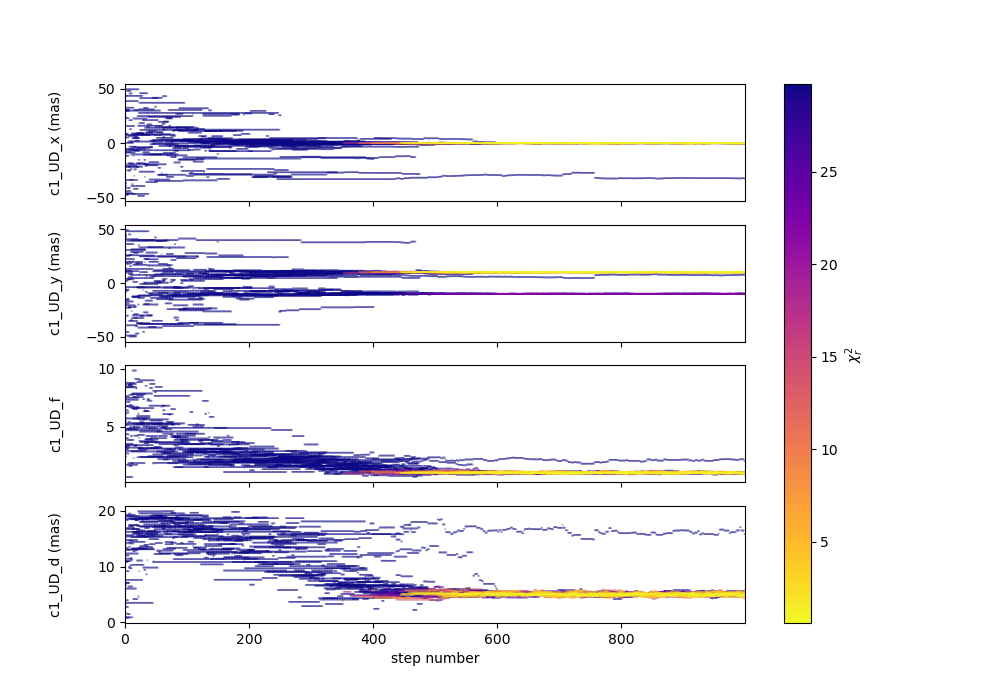
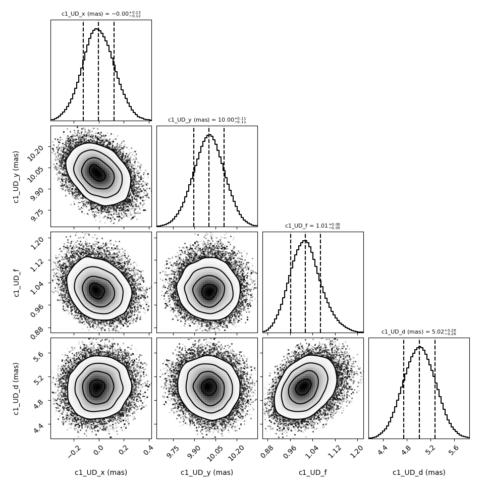

.. oimodeler documentation master file, created by
   sphinx-quickstart on Wed Nov 24 16:00:55 2021.
   You can adapt this file completely to your liking, but it should at least
   contain the root `toctree` directive.

The oimodeler project aims at developping a modular and easily expandable python-based modelling software for optical interferometry. The project started end of 2021, and the software is currently at an early stage of development. 

It allows to manipulate data in the oifits format, build complex models from various components, simulate data from the model at the spatial frequencies of your observations, computed chi2, perform model fitting (using mcmc or other fitters), and plot results easily. Components can be defined in the image or Fourier plan using analytcal formula or precomputed images. They can include chromaticity and time dependence. As the software is modular and object oriented, it is easy to expand it by creating new components by deriving abstract classes. 

.. warning::

    The software is in early development. Current implementation:  
    
    - Models : Gray and chromatic models defined in Fourier and image plan.
    - Data : interferometric data only (with basic filtering) no photometric or spectroscopic data.
    - Data Filters : Filtering wavelength range, and data type (VIS2DATA, VISAMP...)    
    - Fitters : Implementation of a basic emcee-based fitter with plots for results
    - Plots : Basics plots of oifits data and uv-plan plot
    - Utils : miscs utilities for oifits data (creating and modifying array, getting info..)   

    No module is complete and have been fully verified up to now!

A Few examples
--------------

Here are some plots for the `createModelChromatic.py <https://github.com/oimodeler/oimodeler/blob/main/examples/BasicExamples/createModelChromatic.py>`_ example showing various chromatic-geometric models and the corresponding simulated Visibilities.

.. image:: ../../images/createModelChromatic.png
  :alt: Alternative text

Here is an example from the :ref:`createSimulator.py <createSimulator>` script showing high-end plots of some MATISSE LM-band data and a model create with oimodeler . In that case the data were simulated using the `APSRO <https://www.jmmc.fr/english/tools/proposal-preparation/aspro/>`_ software from `JMMC <http://www.jmmc.fr/>`_.

.. image:: ../../images/oimodel_Create_simulator_data.png
  :alt: Alternative text

Here is an example from the :ref:`simpleFitEmcee.py <createSimulator>` script showing :

- the parameters values (and corresponding chi2 as a colorscale) for walkers from a emcee run on a binary model
- the famous corners plots for the 4 free parameters: x and y positions of the binary, diameter and flux

 Again, the data is simulated with `APSRO <https://www.jmmc.fr/english/tools/proposal-preparation/aspro/>`_.

  

.. toctree::
    overview
    installation
    getting_started
    examples
    api
    :maxdepth: 2
   
Indices and tables
==================

* :ref:`genindex`
* :ref:`modindex`
* :ref:`search`
