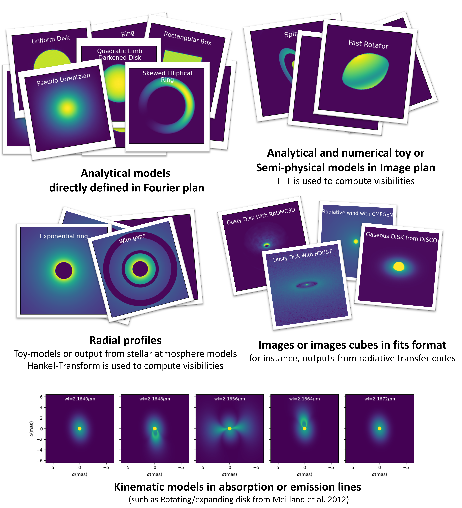
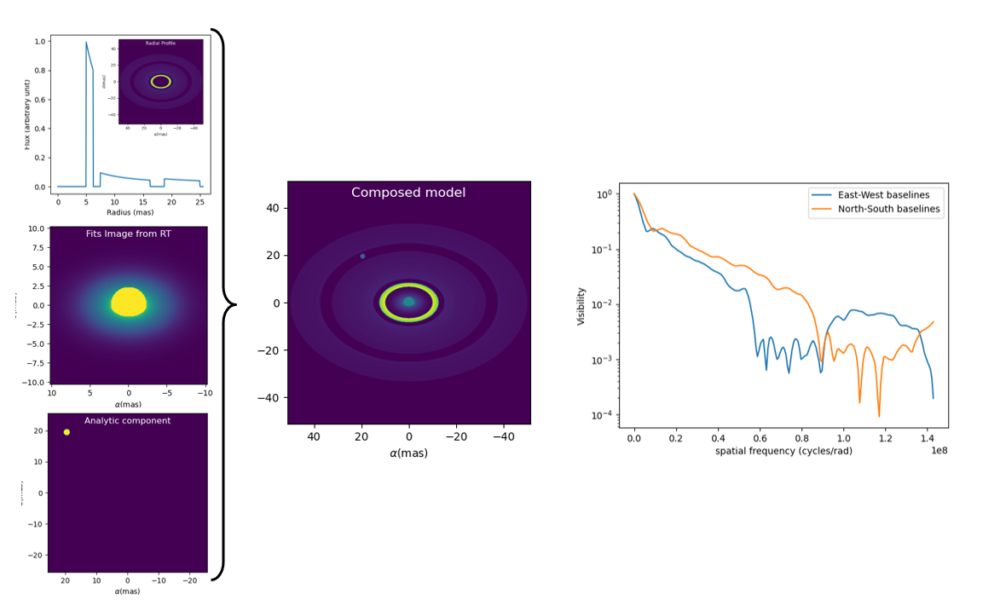
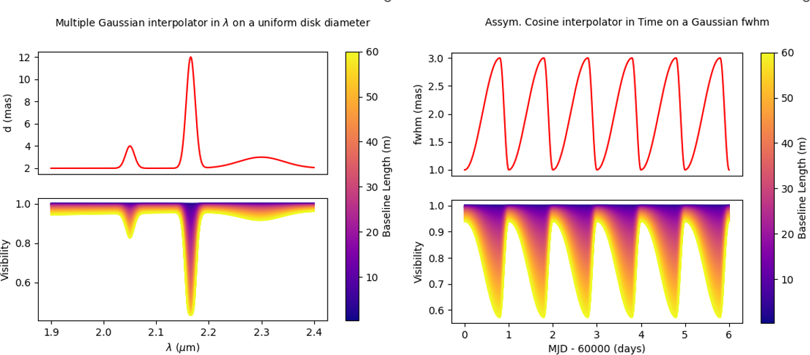
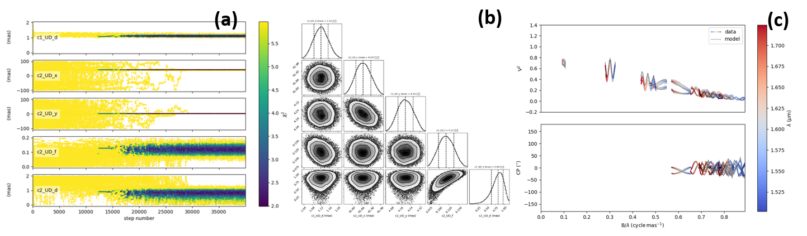
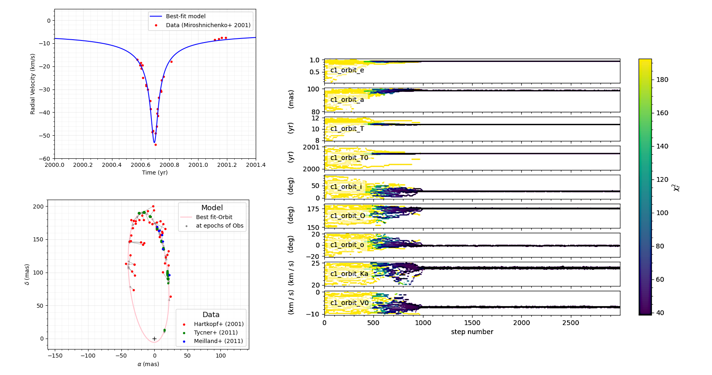

 

The **oimodeler** project aims at developing an open-source, modular and easily expandable 
python-based library for optical interferometry. Initiated in 2022, it now offers a fully 
functional version.

.. _overview:

Overview
========

Main Functionalities :

- Build **models from components** defined in **Fourier** or **Image** plan 
- Add **chromaticity** and **time-dependence** to any model-parameters
- Import **images, image-cubes**, and **radial profiles** from **RT-models**
- Manipulate and modify data in the **OIFITS2 format**: smooth, bin, cut…
- Add non-OIFITS2 format **flux and spectra measurements** to your fit as well as **RV for binaries**
- Simulate **all possible data compatible to the OIFITS2 format**
- Easy **data/models comparison** and **χ² computation**
- Perform **model-fitting** and **error estimation** with various methods 
- Easily **plot results** and produce **high quality figures for publication**

The software is modular and object-oriented, facilitating expansion by creating new components or
features from abstract classes.

**oimodeler** was presented at the 2024 SPIE conference in Yokohama (paper on
(`HAL <https://cnrs.hal.science/hal-04797236>`_, `ADS <https://ui.adsabs.harvard.edu/abs/2024SPIE13095E..2WM/abstract>`_,
`BibTeX <https://ui.adsabs.harvard.edu/abs/2024SPIE13095E..2WM/exportcitation>`_).

Some of the components available to build models
------------------------------------------------

Combining components
--------------------

Basic components can be combined to build more complex models regardless of their nature: 
fits images, radial profiles, analytical functions…

In the example below, we combine an output from the semi-physical code DISCO, a uniform disk 
defined in the Fourier plan and an ad-hoc radial profile of an exponential law with gaps and 
simulate its visibility function

Adding time-dependence or chromaticy 
------------------------------------

Parameter interpolators can be used to :

- simulate chromatic changes of an object intensity distribution
- simulate time dependence : pulsation, binarity …

Many interpolators are available in oimodeler: 
- Gaussian 
- multi-Gaussians
- polynomial temperature laws
- cosine and asymmetric cosine …

New interpolators can easily be implemented by users.

  
   **Chromatic multi-lines (left) and assymetric cosine time (right) Interpolators** 
   used on a uniform disk diameter (left) and a Gaussian FWHM (right)
   Bottom: corresponding  visibility variations for 0 to 60m baselines

  

Computing synthetic OIFITS2 quantities
--------------------------------------

Taking **OIFITS2** data from any interferometric instrument and a model, 
**oimodeler** can simulate any quantities at the OIFITS2 format:

- **VIS2DATA**: square visibility
- **VISAMP**: absolute visibility, differential visibility or correlated flux
- **VISPHI**: absolute phase or differential phase
- **T3AMP**: amplitude of the triple product
- **T3PHI**: Closure phase
- **FLUXDATA**: absolute flux, or normalized flux

oimodeler can also simulate directly complex coherent fluxes or visibility 
based on a vectors of spatial, spectral and temporal coordinates

External flux measurements and spectrum can also be imported 
and converted to FLUXDATA to be added to the simulation.

Performing model-fitting using various methods
----------------------------------------------

In the current version oimodeler includes 4 model-fitting algorithms:
- **MCMC sampler** based on the emcee python module 
- *Dynamic Nested (DN) sampler** based on the dynesty python module 
- **Levenberg-Marquardt (LM)** χ² minimizer
- *Regular grid** χ² explorer

Uncertainties can be estimated using the posterior probability function 
(MCMC or DN sampler) or the covariant matrix (LM)

   **Emcee-based fitter used on CHARA/MIRCX data of the binary star β Ari**: (a) Plot of the walkers versus the simulation steps with a χ² colour-scale showing convergence of the 5-free parameters, (b) corner plot of the posterior probability estimated on the last 5000 steps, (c) fit of MIRCX square-visibility and closure phase

Adding external contraints using custom prior 
---------------------------------------------

External constraints can also be added by writting user priors functions. For instance, this can be used with :

- Gaia parallaxes measurements
- separation measurement and radial-velocities for binary orbit fit
- stellar parameters from evolution models
- vsini measurements for rotating disks or stars

   **Constraining binary orbit with oimodeler external prior** using no interferometric data but only radial velocity and separation measurements taken from litterature for the star :math:`\delta` Scorpii. See full example `here   <https://github.com/oimodeler/oimodeler/blob/main/examples/notebooks/CustomComponents/ExampleOimBinaryOrbitFit.ipynb>`_ 

.. toctree::
   :hidden: 
   :caption: Introduction 

   overview
   afewexamples
   modularity
   installation
   getting_started
   oimodeler-app

.. toctree::
   :hidden: 
   :caption: Examples   
   
   notebooks
    
.. toctree:: 
   :hidden:
   :caption: Modules Description
   
   data
   models
   simulator
   fitter
   plot
   utils

.. toctree::
   :hidden:
   :caption: Expanding oimodeler

   expanding

   
.. toctree:: 
   :hidden: 
   :caption: References
   
   api   
   news
   ackn

