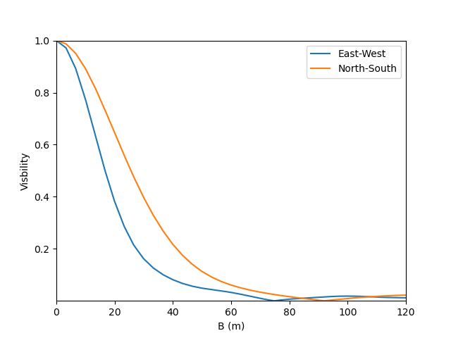
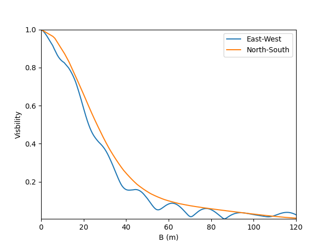
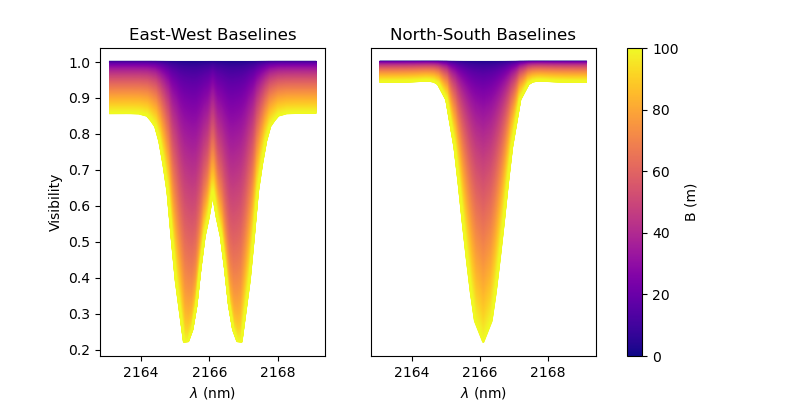

:tocdepth: 2

..  _models:

Building and using models
=========================

.. _basics of models:

The basics of models
--------------------

This complete code corresponding to this section is available in `TheBasicsOfModels.py <https://github.com/oimodeler/oimodeler/blob/main/examples/Modules/TheBasicsOfModels.py>`_ 

Models, Components and Parameters
~~~~~~~~~~~~~~~~~~~~~~~~~~~~~~~~~

In the **oimodeler** framework, a model is and instance of the :func:`oimModel <oimodeler.oimModel.oimModel>` class. 
It contains a collection of components, which all derived from the :func:`oimComponent <oimodeler.oimComponent.oimComponent>` 
semi-abstract class. The components may be described in the image plane, by their 1D or 2D intensity distribution,
or directly in the Fourier plane, for the most simple components with known analytical Fourier transforms. 
Each components is described by a set of parameters which are instances of the :func:`oimParam <oimodeler.oimParam.oimParam>` class.

Thus, building models in **oimodeler** relies on three classes:

- :func:`oimModel <oimodeler.oimModel.oimModel>`: the model class 

- :func:`oimComponent <oimodeler.oimComponent.oimComponent>`: the abstract class from which all components derive

- :func:`oimParam <oimodeler.oimParam.oimParam>`: the parameter class


To create models we must first create some components.
Let's create a few simple components.

.. code-block:: ipython3

    pt = oim.oimPt(f=0.1)
    ud = oim.oimUD(d=10, f=0.5)
    g  = oim.oimGauss(fwhm=5, f=1)
    r  = oim.oimIRing(d=5, f=0.5)

Here, we have create a point source, a 10 mas uniform disk, a Gaussian distribution 
with a 5 mas fwhm and a 5 mas infinitesimal ring. 
The comprehensive list of components available is **oimodeler** is given in the next section. 

The model parameters which are not set explicitly during the components creation
are set to their default values (i.e., f=1, x=y=0).

We can print the description of the component easily:

.. code:: ipython3

    print(ud.params)

.. parsed-literal::
    
    Uniform Disk x=0.00 y=0.00 f=0.50 d=10.00

Or if you want to print the details of a parameter:

.. code-block:: ipython3

    print(ud.params['d'])

 
.. parsed-literal::
    
    oimParam d = 10 ± 0 mas range=[-inf,inf] free


Note that the components parameters are instances of the
:func:`oimParam <oimodeler.oimParam.oimParam>` class which hold not only the
parameter value stored in the ``oimParam.value`` attribute, but in addition to it
the following attributes: 

- ``oimParam.error``: the parameters uncertainties (for model fitting).
- ``oimParam.unit``: the unit as a ``astropy.units`` object.
- ``oimParam.min``: minimum possible value (for model fitting).
- ``oimParam.max``: minimum possible value (for model fitting).
- ``oimParam.free``: Describes a free parameter for ``True``
  and a fixed parameter for ``False`` (for model fitting).
- ``oimParam.description``: A string that describes the model parameter.


Building Models
~~~~~~~~~~~~~~~

We can now create our first models using the
:func:`oimModel <oimodeler.oimModel.oimModel>` class.

.. code-block:: ipython3

    mPt   = oim.oimModel(pt)
    mUD   = oim.oimModel(ud)
    mG    = oim.oimModel(g)
    mR    = oim.oimModel(r)
    mUDPt = oim.oimModel(ud, pt)
    

Now, we have four one-component models and one two-component model.

We can get the parameters of our models using the 
:func:`oimModel.getParameters <oimodeler.oimModel.oimModel.getParameters>`
method.


.. code-block:: ipython3
    
    params = mUDPt.getParameters()
    print(params)
        

.. parsed-literal::

    {'c1_UD_x': oimParam at 0x23de5c62fa0 : x=0 ± 0 mas range=[-inf,inf] free=False ,
     'c1_UD_y': oimParam at 0x23de5c62580 : y=0 ± 0 mas range=[-inf,inf] free=False , 
     'c1_UD_f': oimParam at 0x23de5c62400 : f=0.5 ± 0  range=[-inf,inf] free=True ,
     'c1_UD_d': oimParam at 0x23debc1abb0 : d=10 ± 0 mas range=[-inf,inf] free=True , 
     'c2_Pt_x': oimParam at 0x23debc1a8b0 : x=0 ± 0 mas range=[-inf,inf] free=False , 
     'c2_Pt_y': oimParam at 0x23debc1ab80 : y=0 ± 0 mas range=[-inf,inf] free=False , 
     'c2_Pt_f': oimParam at 0x23debc1ac10 : f=0.1 ± 0  range=[-inf,inf] free=True }

The method returns a dict of all parameters of the model components.
The keys are defined as 

    ``x{num of component}_{short Name of component}_{param name}``.

Alternatively, we can get the free parameters using the
:func:`getFreeParameters <oimodeler.oimModel.oimModel.getFreeParameters>` method:

.. code-block:: ipython3
    
    freeParams = mUDPt.getParameters()
    print(freeParams)
    
.. parsed-literal::

    {'c1_UD_f': oimParam at 0x23de5c62400 : f=0.5 ± 0  range=[-inf,inf] free=True ,
     'c1_UD_d': oimParam at 0x23debc1abb0 : d=10 ± 0 mas range=[-inf,inf] free=True ,
     'c2_Pt_f': oimParam at 0x23debc1ac10 : f=0.1 ± 0  range=[-inf,inf] free=True }

The two main methods of an :func:`oimModel <oimodeler.oimModel.oimModel>` object are:

- :func:`getImage <oimodeler.oimModel.oimModel.getImage>`: which returns an image of the model 
- :func:`oimModel.getComplexCoherentFlux <oimodeler.oimModel.oimModel.getComplexCoherentFlux>` which returns the complex Coherent Flux of the model 

Althought the :func:`getImage <oimodeler.oimModel.oimModel.getImage>`  is only used to vizualize the model intensity 
distribution and is not used for  model-fitting, :func:`getComplexCoherentFlux <oimodeler.oimModel.oimModel.getComplexCoherentFlux>` is
at the base of the computation of all interferometric observables and thus of the data-model comparison.


Getting the model image
~~~~~~~~~~~~~~~~~~~~~~~

Let's first have a look at the :func:`oimModel.getImage <oimodeler.oimModel.oimModel.getImage>` method.

It takes two arguments, the image's size in pixels and the pixel size in mas.

.. code-block:: ipython3
    
    im = mUDPt.getImage(512, 0.1)
    plt.figure()
    plt.imshow(im**0.2)

.. image:: ../../images/basicModel_imshow.png
  :alt: Alternative text   
  
We plot the image with a 0.2 power-law to make the uniform disk components visible:
Both components have the same total flux but the uniform disk is spread on many more
pixels.

The image can also be returned as an ``astropy hdu`` object (instead of a ``numpy array``)
setting the ``toFits`` keyword to ``True``.
The image will then contained a header with the proper fits image keywords
(NAXIS, CDELT, CRVAL, etc.).

.. code-block:: ipython3
    
    im = mUDPt.getImage(256, 0.1, toFits=True)
    print(im)
    print(im.header)
    print(im.data.shape)


.. parsed-literal::
  
    ... <astropy.io.fits.hdu.image.PrimaryHDU object at 0x000002610B8C22E0>
    
    SIMPLE  =                    T / conforms to FITS standard                      
    BITPIX  =                  -64 / array data type                                
    NAXIS   =                    2 / number of array dimensions                     
    NAXIS1  =                  256                                                  
    NAXIS2  =                  256                                                  
    EXTEND  =                    T                                                  
    CDELT1  = 4.84813681109536E-10                                                  
    CDELT2  = 4.84813681109536E-10                                                  
    CRVAL1  =                    0                                                  
    CRVAL2  =                    0                                                  
    CRPIX1  =                128.0                                                  
    CRPIX2  =                128.0                                                  
    CUNIT1  = 'rad     '                                                            
    CUNIT2  = 'rad     '                                                            
    CROTA1  =                    0                                                  
    CROTA2  =                    0                                                 
    
    (256, 256)
    

.. note::

    Currently only **regular** grids in wavelength and time are allowed when exporting
    to fits-image format. If specified, the **wl** and **t** vectors need to be regularily
    sampled. The easiest way is to use the 
    `numpy.linspace <https://numpy.org/doc/stable/reference/generated/numpy.linspace.html>`_
    function.

    If their sampling is irregular an error will be raised.


    
Using the :func:`oimModel.saveImage <oimodeler.oimModel.oimModel.saveImage>` method
will also return an image in the fits format and save it to the specified fits file. 

.. code-block:: ipython3
   
    im = mUDPt.saveImage("modelImage.fits", 256, 0.1)


.. note::

    The returned image in fits format will be 2D, if  time and wavelength are not
    specified, or if they are numbers, 3D if one of them is an array, and 4D if both
    are arrays.


Alternatively, we can use the :func:`oimModel.showModel <oimodeler.oimModel.oimModel.showModel>`
method which take the same argument as the getImage, but directly create a plot with
proper axes and colorbar.

.. code-block:: ipython3

    figImg, axImg = mUDPt.showModel(512, 0.1, normPow=0.2)


.. image:: ../../images/basicModel_showModel.png
  :alt: Alternative text  

Getting the model Complex Coherent Flux
~~~~~~~~~~~~~~~~~~~~~~~~~~~~~~~~~~~~~~~

In most of the cases the user won't use directly the :func:`oimModel.getComplexCoherentFlux <oimodeler.oimModel.oimModel.getComplexCoherentFlux>` 
method to retrieve the model complex coherent flux for a set of coordinates but will create  :func:`oimSimulator <oimodeler.oimSimulator.oimSimulator>`
or a  :func:`oimSimulator <oimodeler.oimFitter.oimFitter>` that will contain the instance of :func:`oimModel <oimodeler.oimModel.oimModel>`
and some interferometric data in an :func:`oimData <oimodeler.oimData.oimData>` to simulate interferometric quantities from the model at the 
spatial frequenciesfrom our data.  This will be covered in the XXXXXXXXXXX section.

Nevertheless, in some cases and for explanatory purposes we will directly use this methods in the following example.
Without the :func:`oimSimulator <oimodeler.oimSimulator.oimSimulator>` class, the :func:`oimModel <oimodeler.oimModel.oimModel>`
can only produce complex coherent flux (i.e., non normalized complex visibility) for a vector of spatial frequecies and wavelengths. 

.. code-block:: ipython3

    wl = 2.1e-6
    B = np.linspace(0.0, 300, num=200)
    spf = B/wl


Here, we have created a vector of 200 spatial frequencies, for baselines ranging from 0 to 300 m at an observing wavelength of 2.1 microns.

We can now use this vector to get the complex coherent flux (CCF) from our model. 
    

.. code-block:: ipython3

    ccf = mUDPt.getComplexCoherentFlux(spf, spf*0) 

    
The :func:`oimModel.getComplexCoherentFlux <oimodeler.oimModel.oimModel.getComplexCoherentFlux>`
method takes four parameters: 

- the spatial frequencies along the East-West axis (u coordinates in cycles/rad), 
- the spatial frequencies along the North-South axis (v coordinates in cycles/rad), 

and optionally,

- the wavelength (in meters)
- time (mjd)

Here, we are dealing with grey and time-independent models so we don't need to specify the wavelength. 
Additionnally, as our models are circular, we don't care about the baseline orientation.
That why we set the North-South component of the spatial frequencies to zero.

We can now plot the visibility from the CCF as the function of the spatial frequencies:

.. code-block:: ipython3

    v = np.abs(ccf)
    v = v/v.max()
    plt.figure()
    plt.plot(spf, v)
    plt.xlabel("spatial frequency (cycles/rad)")
    plt.ylabel("Visbility")


.. image:: ../../images/basicModel_vis0.png
  :alt: Alternative text  


Let's finish this example by creating a figure with the image and visibility
for all the previously created models.

.. code-block:: ipython3

    models = [mPt, mUD, mG, mR, mUDPt]
    mNames = ["Point Source", "Uniform Disk", "Gausian", "Ring",
              "Uniform Disk + Point Source"]

    fig, ax = plt.subplots(2, len(models), figsize=(
        3*len(models), 6), sharex='row', sharey='row')

    for i, m in enumerate(models):
        m.showModel(512, 0.1, normPow=0.2, axe=ax[0, i], colorbar=False)
        v = np.abs(m.getComplexCoherentFlux(spf,  spf*0))
        v = v/v.max()
        ax[1, i].plot(spf, v)
        ax[0, i].set_title(mNames[i])
        ax[1, i].set_xlabel("sp. freq. (cycles/rad)")

.. image:: ../../images/basicModel_all.png
  :alt: Alternative text 

Building complex models
-----------------------

Here we will create more complex models which will include:

- chromaticity for some parameters
- flatenning of components
- linking parameters together
- normalizing the total flux

 The code for this section is available at `BuildingComlplexModels.py <https://github.com/oimodeler/oimodeler/blob/main/examples/Modules/BuildingComlplexModels.py>`_

Chromatic models using parameter interpolators
~~~~~~~~~~~~~~~~~~~~~~~~~~~~~~~~~~~~~~~~~~~~~~

Let's create our first chromatic components. A linearly chromatic parameter
can added to grey component by using the :func:`oimInterp <oimodeler.oimParam.oimInterp>`
macro with the parameter ``"wl"`` when creating a new component.

.. code-block:: ipython3

    g = oim.oimGauss(fwhm=oim.oimInterp("wl",wl=[3e-6, 4e-6], values=[2, 8]))
    mg = oim.oimModel(g)

We have created a Gaussian component with a ``fwhm`` growing from 2 mas at 3 microns
to 8 mas at 4 microns.

.. Note::
    Parameter interpolators are described in details in the :ref:`parameterInterpolators`.

We can access to the interpolated value of the parameters using the ``__call__``
operator of the :func:`oimParam <oimodeler.oimParam.oimParam>` class with values
passed for the wavelengths to be interpolated:

.. code-block:: ipython3

    pprint(g.params['fwhm'](wl=[3e-6, 3.5e-6, 4e-6, 4.5e-6]))


.. parsed-literal::

    ... [2. 5. 8. 8.]

The values are interpolated within the wavelength range [3e-6, 4e-6] and fixed beyond
this range (see :ref:`parameterInterpolators` for more options such as extrapolation).


Let's plot images of this model at various wavelengths using the :func:`showModel <oimodeler.oimModel.oimModel.showModel>`
method. Unlike for grey models, the wavelength need to be specified.

.. code-block:: ipython3

    mg.showModel(256, 0.1, wl=[3e-6, 3.5e-6, 4e-6, 4.5e-6],legend=True)

.. image:: ../../images/complexModel_chromaticGaussian.png
  :alt: Alternative text


Let's now create some spatial frequencies and wavelengths to be used to generate visibilities.

.. code-block:: ipython3

    nB = 500  # number of baselines
    nwl = 100  # number of walvengths

    wl = np.linspace(3e-6, 4e-6, num=nwl)
    B = np.linspace(1, 400, num=nB)

    spf =
    Bs = np.tile(B, (nwl, 1)).flatten()
    wls = np.transpose(np.tile(wl, (nB, 1))).flatten()
    spf = Bs/wls
    spf0 = spf*0


Unlike in the previous example with the grey data, we create a 2D-array for the spatial
frequencies of ``nB`` baselines by ``nwl`` wavelengths. The wavlength vector is tiled
itself to have the same length as the spatial frequency vector. Finally, we flatten the
vector to be passed to the
:func:`getComplexCoherentFlux <oimodeler.oimModel.oimModel.getComplexCoherentFlux>`method.

We can now plot the visibilities for these baselines with a colorscale corresponding
to the wavelength. As expected the visibility decreases with the wavelength as the
fwhm of our object grows with it.

.. code-block:: ipython3

    vis = np.abs(mg.getComplexCoherentFlux(
        spf, spf*0, wls)).reshape(len(wl), len(B))
    vis /= np.outer(np.max(vis, axis=1), np.ones(nB))

    figGv, axGv = plt.subplots(1, 1, figsize=(14, 8))
    sc = axGv.scatter(spf, vis, c=wls*1e6, s=0.2, cmap="plasma")
    figGv.colorbar(sc, ax=axGv, label="$\\lambda$ ($\\mu$m)")
    axGv.set_xlabel("B/$\\lambda$ (cycles/rad)")
    axGv.set_ylabel("Visiblity")
    axGv.margins(0, 0)

.. image:: ../../images/complexModel_chromaticGaussianVis.png
  :alt: Alternative text

Let's add a second component: An uniform disk with a chromatic flux.

.. code-block:: ipython3

    ud = oim.oimUD(d=0.5, f=oim.oimInterp("wl", wl=[3e-6, 4e-6], values=[2, 0.2]))
    m2 = oim.oimModel([ud, g])

    m2.showModel(256, 0.1, wl=[3e-6, 3.25e-6, 3.5e-6, 4e-6],normPow=0.2)

    vis = np.abs(m2.getComplexCoherentFlux(spf, spf*0, wls)).reshape(len(wl), len(B))
    vis /= np.outer(np.max(vis, axis=1), np.ones(nB))

    fig2v, ax2v = plt.subplots(1, 1, figsize=(14, 8))
    sc = ax2v.scatter(spf, vis, c=wls*1e6, s=0.2, cmap="plasma")
    fig2v.colorbar(sc, ax=ax2v, label="$\\lambda$ ($\\mu$m)")
    ax2v.set_xlabel("B/$\\lambda$ (cycles/rad)")
    ax2v.set_ylabel("Visiblity")
    ax2v.margins(0, 0)
    ax2v.set_ylim(0, 1)


.. image:: ../../images/complexModel_UDAndGauss.png
  :alt: Alternative text


.. image:: ../../images/complexModel_UDAndGaussVis.png
  :alt: Alternative text


Going from circular to elliptical models
~~~~~~~~~~~~~~~~~~~~~~~~~~~~~~~~~~~~~~~~

Let's create a similar model but with elongated components. We will replace the
uniform disk by an ellipse and the Gaussian by an elongated Gaussian.

.. code-block:: ipython3

    eg = oim.oimEGauss(fwhm=oim.oimInterp(
        "wl", wl=[3e-6, 4e-6], values=[2, 8]), elong=2, pa=90)
    el = oim.oimEllipse(d=0.5, f=oim.oimInterp(
        "wl", wl=[3e-6, 4e-6], values=[2, 0.2]), elong=2, pa=90)

    m3 = oim.oimModel([el, eg])
    fig3im, ax3im, im3 = m3.showModel(256, 0.1, wl=[3e-6,  4e-6],legend=True, normPow=0.1)


.. image:: ../../images/complexModel_Elong.png
  :alt: Alternative text


Now that our model is no more circular, we need to take care of the baselines
orientations. Let's plot both North-South and East-West baselines.

.. code-block:: ipython3

    fig3v, ax3v = plt.subplots(1, 2, figsize=(14, 5), sharex=True, sharey=True)

    # East-West
    vis = np.abs(m3.getComplexCoherentFlux(
        spf, spf*0, wls)).reshape(len(wl), len(B))
    vis /= np.outer(np.max(vis, axis=1), np.ones(nB))
    ax3v[0].scatter(spf, vis, c=wls*1e6, s=0.2, cmap="plasma")
    ax3v[0].set_title("East-West Baselines")
    ax3v[0].margins(0, 0)
    ax3v[0].set_ylim(0, 1)
    ax3v[0].set_xlabel("B/$\\lambda$ (cycles/rad)")
    ax3v[0].set_ylabel("Visiblity")

    # North-South
    vis = np.abs(m3.getComplexCoherentFlux(
        spf*0, spf, wls)).reshape(len(wl), len(B))
    vis /= np.outer(np.max(vis, axis=1), np.ones(nB))
    sc = ax3v[1].scatter(spf, vis, c=wls*1e6, s=0.2, cmap="plasma")
    ax3v[1].set_title("North-South Baselines")
    ax3v[1].set_xlabel("B/$\\lambda$ (cycles/rad)")
    fig3v.colorbar(sc, ax=ax3v.ravel().tolist(), label="$\\lambda$ ($\\mu$m)")


.. image:: ../../images/complexModel_ElongVis.png
  :alt: Alternative text

Linking parameters
~~~~~~~~~~~~~~~~~~

Let's have a look at our last model's free parameters.

.. code-block:: ipython3

    pprint(m3.getFreeParameters())


.. parsed-literal::

    ... {'c1_eUD_f_interp1': oimParam at 0x23d9e7194f0 : f=2 ± 0  range=[-inf,inf] free=True ,
         'c1_eUD_f_interp2': oimParam at 0x23d9e719520 : f=0.2 ± 0  range=[-inf,inf] free=True ,
         'c1_eUD_elong': oimParam at 0x23d9e7192e0 : elong=2 ± 0  range=[-inf,inf] free=True ,
         'c1_eUD_pa': oimParam at 0x23d9e719490 : pa=90 ± 0 deg range=[-inf,inf] free=True ,
         'c1_eUD_d': oimParam at 0x23d9e7193a0 : d=0.5 ± 0 mas range=[-inf,inf] free=True ,
         'c2_EG_f': oimParam at 0x23d9e7191c0 : f=1 ± 0  range=[-inf,inf] free=True ,
         'c2_EG_elong': oimParam at 0x23d9e7191f0 : elong=2 ± 0  range=[-inf,inf] free=True ,
         'c2_EG_pa': oimParam at 0x23d9e719220 : pa=90 ± 0 deg range=[-inf,inf] free=True ,
         'c2_EG_fwhm_interp1': oimParam at 0x23d9e7192b0 : fwhm=2 ± 0 mas range=[-inf,inf] free=True ,
         'c2_EG_fwhm_interp2': oimParam at 0x23d9e719340 : fwhm=8 ± 0 mas range=[-inf,inf] free=True }


We see here that for the Ellipse (``C1_eUD``) the f parameter has been replaced by two
independent parameters called ``c1_eUD_f_interp1`` and ``c1_eUD_f_interp2``. They
represent the value of the flux at 3 and 4 microns. We could have added more reference
wavelengths in our model and would have ended with more parameters. The same happens for
the elongated Gaussian (``C2_EG``) fwhm.


Currently our model has 10 free parameters. In certain cases we might want to link or
share two or more parameters. In our case, we might consider that the two components have
the same ``pa`` and ``elong``. This can be done easily. To share a parameter you can just
replace one parameter by another.

.. code-block:: ipython3

    eg.params['elong'] = el.params['elong']
    eg.params['pa'] = el.params['pa']

    pprint(m3.getFreeParameters())

.. parsed-literal::

    ... {'c1_eUD_f_interp1': oimParam at 0x23d9e7194f0 : f=2 ± 0  range=[-inf,inf] free=True ,
         'c1_eUD_f_interp2': oimParam at 0x23d9e719520 : f=0.2 ± 0  range=[-inf,inf] free=True ,
         'c1_eUD_elong': oimParam at 0x23d9e7192e0 : elong=2 ± 0  range=[-inf,inf] free=True ,
         'c1_eUD_pa': oimParam at 0x23d9e719490 : pa=90 ± 0 deg range=[-inf,inf] free=True ,
         'c1_eUD_d': oimParam at 0x23d9e7193a0 : d=0.5 ± 0 mas range=[-inf,inf] free=True ,
         'c2_EG_f': oimParam at 0x23d9e7191c0 : f=1 ± 0  range=[-inf,inf] free=True ,
         'c2_EG_fwhm_interp1': oimParam at 0x23d9e7192b0 : fwhm=2 ± 0 mas range=[-inf,inf] free=True ,
         'c2_EG_fwhm_interp2': oimParam at 0x23d9e719340 : fwhm=8 ± 0 mas range=[-inf,inf] free=True }


That way we have reduced our number of free parameters to 8. If you change  ``params['elong']`` value
it will also change ``el.params['elong']`` values are they are actually the same instance of the
:func:`oimParam <oimodeler.oimParam.oimParam>` class.

A more advance way to link parameters is the use :func:`oimParamLinker <oimodeler.oimParam.oimParamLinker>`
class. This class allow to define a simple mathematically formulat between the value of two parameters.

Let's create a new model which include a elongated ring perpendicular to the Gaussian
and Ellipse ``pa`` and with a inner and outer radii equals to 2 and 4 times the ellipse
diameter, respectively.

.. code-block:: ipython3

    er = oim.oimERing()
    er.params['elong'] = eg.params['elong']
    er.params['pa'] = oim.oimParamLinker(eg.params["pa"], "add", 90)
    er.params['din'] = oim.oimParamLinker(el.params["d"], "mult", 2)
    er.params['dout'] = oim.oimParamLinker(el.params["d"], "mult", 4)

    m4 = oim.oimModel([el, eg, er])

    m4.showModel(256, 0.1, wl=[3e-6, 3.25e-6, 3.5e-6, 4e-6],normPow=0.2)


.. image:: ../../images/complexModel_link.png
  :alt: Alternative text


Although quite complex this models only have 9 free parameters. If we change the ellipse
diameter and its position angle, the components will scale (except the Gaussian whose fwhm
is independent) and rotate.

.. code-block:: ipython3

    el.params['d'].value = 4
    el.params['pa'].value = 45

    m4.showModel(256, 0.1, wl=[3e-6, 3.25e-6, 3.5e-6, 4e-6], normPow=0.2)


.. image:: ../../images/complexModel_linkRotScale.png
  :alt: Alternative text

Flux normalization
~~~~~~~~~~~~~~~~~~

In most cases, the user will want to have the total flux of the model to be normalized to 1.
The allows to remove one of the flux parameter of the model and remove degenracy unless actual
fluxes measurement are available.

Here we build a triple-system model with one uniform disk and to point sources.

.. code-block:: ipython3

    star1 = oim.oimUD(f=0.8,d=1)
    star2 = oim.oimPt(f=0.15,x=5,y=5)
    star3 = oim.oimPt(x=15,y=12)
    mtriple = oim.oimModel(star1,star2,star3)
    star2.params["x"].free=True
    star2.params["y"].free=True
    star3.params["x"].free=True
    star3.params["y"].free=True


    print(mtriple.getFreeParameters())

.. parsed-literal::

    {'c1_UD_d': oimParam at 0x26f1f656480 : d=1 ± 0 mas range=[0,inf] free=True ,
     'c1_UD_f': oimParam at 0x26f0c6d0da0 : f=0.8 ± 0  range=[0,1] free=True ,
     'c2_Pt_f': oimParam at 0x26f0cb21fa0 : f=0.15 ± 0  range=[0,1] free=True ,
     'c2_Pt_x': oimParam at 0x26f20520590 : x=5 ± 0 mas range=[-inf,inf] free=True ,
     'c2_Pt_y': oimParam at 0x26f752cde80 : y=5 ± 0 mas range=[-inf,inf] free=True ,
     'c3_Pt_f': oimParam at 0x26f0cb20560 : f=1 ± 0  range=[0,1] free=True ,
     'c3_Pt_x': oimParam at 0x26f0cb21ac0 : x=15 ± 0 mas range=[-inf,inf] free=True ,
     'c3_Pt_y': oimParam at 0x26f0cb23020 : y=12 ± 0 mas range=[-inf,inf] free=True }

In order to normalize the three fluxes of this model (a remove the last flux as a parameter)
we can use the :func:`oimParamNorm <oimodeler.oimParam.oimParamNorm>` class.

.. code-block:: ipython3

    star3.params["f"] = oim.oimParamNorm([star1.params["f"],star2.params["f"]])

Alternatively, we can  use the :func:`normalizeFlux <oimodeler.oimModel.oimModel.normalizeFlux>`
method of the :func:`oimModel <oimodeler.oimModel.oimModel>` class.

.. code-block:: ipython3

    mtriple.normalizeFlux()

Both methods set the flux of the third star to 1 minus the flux of the two other ones.
These flux will be updated if the other are modified.

.. code-block:: ipython3

   print(star3.params["f"]())
   star1.params["f"].value = 0.5
   print(star3.params["f"]())

.. parsed-literal::

    0.05
    0.35

Time-dependent model
~~~~~~~~~~~~~~~~~~~~

You can also add time dependent parameters to your model using
:func:`oimInterpTime <oimodeler.oimParam.oimInterp` class which works similarly to the
:func:`oimInterpWl <oimodeler.oimParam.oimInterpWl>` class.

Here is a small example that mix both time dependence and chromaticy of a binary model.

.. code-block:: ipython3

    gd1 = oim.oimGauss(fwhm=oim.oimInterp('time', mjd=[0, 1, 3], values=[1, 4, 1]))
    ud1 = oim.oimUD(d=oim.oimInterp("wl", wl=[1e-6, 3e-6], values=[0.5, 2]), x=-4, y=0, f=0.1)

    m6 = oim.oimModel(gd1, ud1)

    wls=np.array([1,2,3])*1e-6
    times=[0,1,2,3,4]

    m6.showModel(256, 0.04, wl=wls, t=times, legend=True)


.. image:: ../../images/complexModel_time.png
  :alt: Alternative text

Types of components
-------------------

The code corresponding to this section is available in `TypesOfComponents.py <https://github.com/oimodeler/oimodeler/blob/main/examples/Modules/TypesOfComponents.py>`_

**oimodeler** components are of three different types:

| 1. the components defined in the Fourier space by an analytical formula.
| They inherit from the  :func:`oimComponentFourier <oimodeler.oimcomponent.oimComponentFourier>` class.

| 2. the components defined by their 2D intensity map in the image space.
| They inherit from the  :func:`oimComponentImage <oimodeler.oimcomponent.oimComponentImage>` class.

| 3. the components defined by their 1D intensity profile in the image space.
| They inherit from the  :func:`oimComponentRadialProfile <oimodeler.oimcomponent.oimComponentRadialProfile>` class.


Fourier components
------------------

In the table below is a list of the current Fourier-based components, which all derived from
the :func:`oimComponentFourier <oimodeler.oimComponent.oimComponentFourier>` semi-abstract class.

.. csv-table:: Available Fourier based components
   :file: table_components_fourier.csv
   :header-rows: 1  
   :delim: |
   :widths: auto

To print the comprehensive list of Fourier-based compnents you can type:

.. code-block:: ipython3

    print(oim.listComponents(componentType="fourier"))


    ['oimComponentFourier', 'oimPt', 'oimBackground', 'oimUD', 'oimEllipse', 'oimGauss', 'oimEGauss', 'oimIRing',
     'oimEIRing', 'oimRing', 'oimRing2', 'oimERing', 'oimERing2', 'oimESKIRing', 'oimESKGRing', 'oimESKRing', 'oimLorentz',
     'oimELorentz', 'oimLinearLDD', 'oimQuadLDD', 'oimPowerLawLDD', 'oimSqrtLDD', 'oimAEIRing', 'oimAERing', 'oimBox',
     'oimGaussLorentz', 'oimStarHaloGaussLorentz', 'oimStarHaloIRing']
     
If you want to have more information on a component (for instance, on its paramaters) you can use python **help** function.

.. code-block:: ipython3

    help(oim.oimUD)

.. parsed-literal::

    class oimUD(oimodeler.oimComponent.oimComponentFourier)
     |  oimUD(**kwargs)
     |
     |  Uniform Disk component defined in the fourier space
     |
     |  Parameters
     |  ----------
     |  x: u.mas | oimInterp
     |      x pos of the component (in mas). The default is 0.
     |  y: u.mas | oimInterp
     |      y pos of the component (in mas). The default is 0.
     |  f: u.dimensionless_unscaled | oimInterp
     |      flux of the component. The default is 1.
     |  d: u.mas | oimInterp
     |      diameter of the disk (in mas). The default is 0.
     |


Although simple, these components can allow to build complex models, For instance, Chromaticity and/or time-dependency 
can be added to any parameters of these components to build more complex models.
We will see this in details in the :ref:`Advanced parameters` section.

.. note:: 
    Models using Fourier-based components are usually faster to run as they use a simple function to compute the 
    complex Coherent Flux whereas imaged-based used FFT or Hankel-Transform (for radial profile) 


Image components
----------------

**oimodeler** allows to use components described in the image space. This can be done by subclassing the semi-abstract
:func:`oimComponentImage <oimodeler.oimcomponent.oimComponentImage>` class.

In the table below is a list of the current image-plan components:

.. csv-table:: Available Image plane components
   :file: table_components_image.csv
   :header-rows: 1  
   :delim: |
   :widths: auto

To print the comprehensive list of image-based compnents you can type:

.. code-block:: ipython3

    print(oim.listComponents(componentType="image"))


Describing an object by its intensity distribution instead of its Fourier transform can be useful in three cases:

1. the component cannot be described using an analytical formula in the Fourier space but can be described by an analytical formula in the image plan
2. the component cannot be described by a simple analytical formula even in the image space but an image can easily be computed, for instance with a iterative code
3. the user want to use external code such as images from a radiative transfert model


Here are three examples of these three kind of image components implemented in **oimodeler**.

.. image:: ../../images/componentImages_images.png
  :alt: Alternative text

The first one is a spiral implemented as :func:`oimSpiral <oimodeler..oimCustomComponents.oimSpiral.oimSpiral>`.

Its implementation is descrbided in details in the section :ref:`spiral`.

.. code-block:: ipython3

    spiral = oim.oimSpiral(dim=256, fwhm=20, P=0.1, width=0.2, pa=30, elong=2)
    mspiral = oim.oimModel(spiral)


The second one is a simple simulation of a fast-rotator using the Roche model and a beta-law gravity-darkening.
It is implemented in oimodeler as :func:`oimFastRotator <oimodeler..oimCustomComponents.oimFastRotator.oimFastRotator>`
and a full description is given in :ref:`fastrot`.

.. code-block:: ipython3

    frot = oim.oimFastRotator(dpole=5, dim=128, incl=-50,rot=0.99, Tpole=20000, beta=0.25,pa=20)
    mfrot = oim.oimModel(frot)

Finally, the last one is an output from the radiative transfer code  `RADMC3D <https://www.ita.uni-heidelberg.de/~dullemond/software/radmc-3d/>`_
simulating the inner part of a dusty disk around the B[e] star FS CMa.
The simulation was made from 1.5 to 13μm. and the output was saved as a chromatic image-cube in the fits format with proper axes descruibed
in the header (size of pixel in x, y and wavelength). We use the :func:`oimComponentFitsImage <oimodeler.oimComponents.oimComponentFitsImage>`
class described in the next section to load the image as a image-components.

.. code-block:: ipython3

    radmc3D_fname = product_dir / "radmc3D_model.fits"
    radmc3D = oim.oimComponentFitsImage(radmc3D_fname,pa=180)
    mradmc3D = oim.oimModel(radmc3D)

Unlike when using Fourier-based components, the determination of the complex coherent flux (and the other interferometric observables) from an image
requires the computation of the image Fourier Transform (FT) at the spatial frequency (and optionnally spectral and time) coordinates of the data.

In **oimodeler** such computation relies on the :func:`oimFTBackends <oimodeler.oimFTBackends>` module which contains various algorithms to compute
the Fourier trasnform. Currently implemented are the following:

.. csv-table:: Available Fourier Transform Backends
   :file: table_ftbackends.csv
   :header-rows: 1
   :delim: |
   :widths: auto

By default the standard **numpy FFT backend** will be used. The FFTW backend which is significantly faster can be
actived if `pyFFTW <https://pypi.org/project/pyFFTW/>`_ is installed on your system. To check which backend is
available on your installation, type:

.. code-block:: ipython3

    print(oim.oimOptions.ft.backend.available)

.. parsed-literal::

    [<class 'oimodeler.oimFTBackends.numpyFFTBackend'>,
     <class 'oimodeler.oimFTBackends.FFTWBackend'>]

The current FT backend is given by :

.. code-block:: ipython3

    print(oim.oimOptions.ft.backend.active)

.. parsed-literal::

    <class 'oimodeler.oimFTBackends.numpyFFTBackend'>

To change it you can modify directly  :func:`oimOptions <oimodeler.oimOptions>` namespace:

.. code-block:: ipython3

    oim.oimOptions.ft.backend.active = oim.FFTWBackend

Or you can use the FT backend alias with the function :func:`setFTBackend <oimodeler.oimFTBackends.setFTBackend>`

.. code-block:: ipython3

    oim.setFTBackend("fftw")

The FFT backends (numpy or FFTW) are significantly faster than a normal DFT, but its precision depends on the
zero-padding of the image. The default zero padding factor is set to 4 which means the the the image will be zero-padded
in a 4 times bigger array (rounded to the closest power of 2). The user can access and change the zero padding using the
:func:`oimOptions <oimodeler.oimOptions>` namespace :

.. code-block:: ipython3

    oim.oimOptions.ft.padding = 8

Depending on the sharpness of the object image and its cropping lowering the zero-padding might lead to important errors.

Here is a ample script illustrating the accuracy of the FFT as the function of the padding factor using the
:func:`oimSpiral <oimodeler..oimCustomComponents.oimSpiral.oimSpiral>` component as example.

.. code-block:: ipython3

    #creating the spiral model
    spiral = oim.oimSpiral(dim=128, fwhm=20, P=1, width=0.1, pa=0, elong=1)
    mspiral = oim.oimModel(spiral)

    #creating a set of baselines from 0 to 100m in K band
    wl = 2.1e-6
    B = np.linspace(0, 100, num=200)
    spf = B/wl

    #computing the reference model with padding of 32
    oim.oimOptions.ft.padding = 32
    ccf01 = mspiral.getComplexCoherentFlux(spf, spf*0)
    v01 = np.abs(ccf01/ccf01[0])

    start = time.time()
    ccf02 = mspiral.getComplexCoherentFlux(spf*0, spf)
    v02 = np.abs(ccf02/ccf02[0])
    end = time.time()
    dt0 = end -start

    #%%  computing FFT with different padding
    padding=[16,8,4,2,1]
    figpad,axpad = plt.subplots(2,2, figsize=(10,5),sharey="row",sharex=True)

    axpad[0,0].plot(spf, v01, color="k",lw=4)
    axpad[0,1].plot(spf, v02, color="k",lw=4,label=f"padding=32x ({dt0*1000:.0f}ms)")

    for pi in padding :
        oim.oimOptions.ft.padding = pi
        ccf1 = mspiral.getComplexCoherentFlux(spf, spf*0)
        v1 = np.abs(ccf1/ccf1[0])
        start = time.time()
        ccf2 = mspiral.getComplexCoherentFlux(spf*0, spf)
        v2 = np.abs(ccf2/ccf2[0])
        end = time.time()
        dt = end -start
        axpad[0,0].plot(spf, v1)
        axpad[0,1].plot(spf, v2,label=f"padding={pi}x ({dt*1000:.0f}ms)")
        axpad[1,0].plot(spf, (v1-v01)/v01*100,marker=".",ls="")
        axpad[1,1].plot(spf, (v2-v02)/v02*100,marker=".",ls="")

    for i in range(2):
        axpad[1,i].set_xlabel("spatial frequency (cycles/rad)")
        axpad[1,i].set_yscale("symlog")
    axpad[0,0].set_title("East-West baselines")
    axpad[0,1].set_title("North-South baselines")
    axpad[0,0].set_ylabel("Visbility")
    axpad[0,1].legend()
    axpad[1,0].set_ylabel("Residual (%)")

.. image:: ../../images/componentImages_padding.png
  :alt: Alternative text

In the case of the :func:`oimSpiral <oimodeler..oimCustomComponents.oimSpiral.oimSpiral>` component, reducing the
zero-padding below the default value of 4 leads to mean errors of the order of 30% (with values up to 500%). The default
padding reduce mean errors to a few percents (with maximum of the order of 10%).

However, as the FFT computation time grows like :math:`n log(n)`, where n is the number of pixels in the image,
increasing the padding increase significantly the computation time of the model (see the example above).

Another way to reduce the computation time of the FFT (and the DFT) is to reduce the size of the image and increase the
pixel size of the image while keeping the field of view fixed.

Finally, when dealing with image-component, the user show determine the good trade-off between image resolution and size,
zero-padding and computation time.

Loading fits images
-------------------
One special and very useful image based component is the
:func:`oimComponentFitsImage <oimodeler.oimComponents.oimComponentFitsImage>` that allows the loading precomputed images
and use them as normal **oimodeler** components.

To illustrate the functionalities of this component we will use two fits files representing a classical Be star
and its circumstellar disk:

1. a H-band continuum image generated using the DISCO semi-physical code as described in
`Vieira et al. (2015) <https://ui.adsabs.harvard.edu/abs/2015MNRAS.454.2107V/abstract>`_

2. a chromatic image-cube computed around the :math:`Br\,\gamma` emission line using the Kinematic Be disk model as
described in `Meilland et al. (2012) <https://ui.adsabs.harvard.edu/abs/2012A%26A...538A.110M/abstract>`_

.. note::
    Both models were generated using the `AMHRA <https://amhra.oca.eu/AMHRA/disco-gas/input.htm>`_ service of the JMMC.

    AMHRA develops and provides various astrophysical models online, dedicated to the
    scientific exploitation of high-angular and high-spectral facilities. Currently available models are:

    - Semi-physical gaseous disk of classical Be stars and dusty
      disk of YSO.
    - Red-supergiant and AGB.
    - Binary spiral for WR stars.
    - Physical limb darkening models.
    - Kinematics gaseous disks.
    - A grid of supergiant B[e] stars models.

Monochromatic image
~~~~~~~~~~~~~~~~~~~

The code corresponding to this section is available in
`LoadingFitsImage.py <https://github.com/oimodeler/oimodeler/blob/main/examples/Modules/LoadingFitsImage.py>`_


The fits-formatted image ``BeDisco.fits`` that we will use is located in **oimodeler** ``data\IMAGES`` directory.

There are two ways to load a fits image into a
:func:`oimComponentFitsImage <oimodeler.oimComponentFourier.oimComponentFitsImage>` object. The first one is to open
the fits file using the ``astropy.io.fits`` module of the ``astropy`` package and then passing it to the
:func:`oimComponentFitsImage <oimodeler.oimBasicFourierComponents.oimComponentFitsImage>` class.

.. code-block:: ipython3

    im = fits.open(file_name)
    c = oim.oimComponentFitsImage(im)

However, if the user doesn’t need to directly access the content of the image, the filename can be passed directly to
the :func:`oimComponentFitsImage <oimodeler.oimBasicFourierComponents.oimComponentFitsImage>` class.

.. code-block:: ipython3

    c = oim.oimComponentFitsImage(file_name)

Finally, we can build our model with this unique component and plot the model image with an arbitrary pixel size and
dimension:

.. code-block:: ipython3

    m = oim.oimModel(c)
    m.showModel(512, 0.05, legend=True, normalize=True, normPow=1, cmap="hot")

.. image:: ../../images/FitsImage_Disco_image.png
  :alt: Alternative text

When using the image-component, the image shown by the :func:`showModel <oimodeler.oimModel.oimModel.showModel>`
method is interpolated and crop or zero-padded depending on the internal image dimension and pixel size and the
dimension and pixel size used in the :func:`showModel <oimodeler.oimModel.oimModel.showModel>` method.

One can retrieve the component internal image (the one loaded from the fits file) using the ._internalImage() function

.. code-block:: ipython3

    im_disco = cdisco._internalImage()
    print(im_disco.shape)

.. parsed-literal::

    (1, 1, 256, 256)

The first two dimensions are the time and the wavelength but they are 1 as our model is static and grey.

.. note::
    The internal image can be modify that way if needed.

The internal pixel size in rad can also be retrieved using the ```_pixSize`` variable. This can be used to plot the
image using the showModel method without rescaling. Here we use astropy.units to convert the radians in mas.

.. code-block:: ipython3

    import astropy.units as u
    pixSize = cdisco._pixSize*u.rad.to(u.mas)
    dim = im_disco.shape[-1]
    mdisco.showModel(dim, pixSize, legend=True, normalize=True, normPow=1, cmap="hot")

.. image:: ../../images/FitsImage_Disco_internal_image.png
  :alt: Alternative text

We now create spatial frequencies for a thousand baselines ranging from 0 to 120 m,
in the North-South and East-West orientation and at an observing wavlength of 1.5 microns.

.. code-block:: ipython3

   wl, nB = 1.5e-6, 1000
   B = np.linspace(0, 120, num=nB)

   spfx = np.append(B, B*0)/wl # 1st half of B array are baseline in the East-West orientation
   spfy = np.append(B*0, B)/wl # 2nd half are baseline in the North-South orientation

We compute the complex coherent flux and then the absolute visibility

.. code-block:: ipython3

   ccf = m.getComplexCoherentFlux(spfx, spfy)
   v = np.abs(ccf)
   v = v/v.max()

and, finally, we can plot our results:

.. code-block:: ipython3

    plt.figure()
    plt.plot(B , v[0:nB],label="East-West")
    plt.plot(B , v[nB:],label="North-South")
    plt.xlabel("B (m)")
    plt.ylabel("Visbility")
    plt.legend()
    plt.margins(0)



Let's now have a look at the model's parameters:

.. code-block:: ipython3

    pprint(m.getParameters())

.. parsed-literal::

    ... {'c1_Fits_Comp_dim': oimParam at 0x19c6201c820 : dim=128 ± 0  range=[1,inf] free=False ,
         'c1_Fits_Comp_f': oimParam at 0x19c6201c760 : f=1 ± 0  range=[0,1] free=True ,
         'c1_Fits_Comp_pa': oimParam at 0x19c00b9bbb0 : pa=0 ± 0 deg range=[-180,180] free=True ,
         'c1_Fits_Comp_scale': oimParam at 0x19c6201c9d0 : scale=1 ± 0  range=[-inf,inf] free=True ,
         'c1_Fits_Comp_x': oimParam at 0x19c6201c6a0 : x=0 ± 0 mas range=[-inf,inf] free=False ,
         'c1_Fits_Comp_y': oimParam at 0x19c6201c640 : y=0 ± 0 mas range=[-inf,inf] free=False }


In addition to the `x`, `y`, and `f` parameters, common to all components,
the
:func:`oimComponentFitsImage <oimodeler.oimComponent.oimComponentFitsImage>`
have three additional parameters:

* `dim`: The fixed size of the internal fits image (currently only square images are
  compatible).
* `pa`: The position of angle of the component (used for rotating the component).
* `scale`: A scaling factor for the component.

The position angle `pa` and the `scale` are both free parameters (as default) and
can be used for model fitting.

Let's try to rotate and scale our model and plot the image again.

.. code-block:: ipython3

    c.params['pa'].value = 45
    c.params['scale'].value = 2
    m.showModel(256, 0.04, legend=True, normPow=0.4, colorbar=False)


.. image:: ../../images/FitsImage_Disco_image2.png
  :alt: Alternative text

The :func:`oimComponentFitsImage <oimodeler.oimBasicFourierComponents.oimComponentFitsImage>`
can be combined with any kind of other component. Let's add a companion
(i.e., uniform disk) for our Be star model.

.. code-block:: ipython3

    c2 = oim.oimUD(x=20, d=1, f=0.03)
    m2 = oim.oimModel(c, c2)

We add a 1 mas companion located at 20 mas East of the central object with a flux
of 0.03. We can now plot the image of our new model.

.. code-block:: ipython3

    m2.showModel(256, 0.2, legend=True, normalize=True, fromFT=True, normPow=1, cmap="hot")

.. image:: ../../images/FitsImage_Disco_image3.png
  :alt: Alternative text

To finish this example, let's plot the visibility along North-South and East-West
baseline for our binary Be-star model.

.. code-block:: ipython3

    ccf = m2.getComplexCoherentFlux(spfx, spfy)
    v = np.abs(ccf)
    v = v/v.max()

    plt.figure()
    plt.plot(B, v[0:nB], label="East-West")
    plt.plot(B, v[nB:], label="North-South")
    plt.xlabel("B (m)")
    plt.ylabel("Visbility")
    plt.legend()
    plt.margins(0)




Using a chromatic image-cube
~~~~~~~~~~~~~~~~~~~~~~~~~~~~

The :func:`oimComponentFitsImage <oimodeler.oimComponent.oimComponentFitsImage>` can also be used to import fits files containing
chromatic image-cubes into oimodeler.

In this example we will use a chromatic image-cube computed around the :math:`Br\,\gamma` emission line for a classical Be star
circumstellar disk. The model, detailed in `Meilland et al. (2012) <https://ui.adsabs.harvard.edu/abs/2012A%26A...538A.110M/abstract>`_
was computed using the `AMHRA <https://amhra.oca.eu/AMHRA/bedisk/input.htm>`_ service of the JMMC.

The fits-formatted image-cube we will use, `KinematicsBeDiskModel.fits`, is located in the `data/IMAGES` directory.

The code corresponding to this section is available in
`LoadingFitsImageCube.py <https://github.com/oimodeler/oimodeler/blob/main/examples/Modules/LoadingFitsImageCube.py>`_

We build our chromatic model the same way as for a monochromatic image.

.. code-block:: ipython3

    c = oim.oimComponentFitsImage(file_name)
    m = oim.oimModel(c)

However, unlike for the monochromatic image, our model is now chromatic. The internal image-cube can be accessed through the private variable
``c._image`` of the :func:`oimComponentFitsImage <oimodeler.oimComponent.oimComponentFitsImage>` and the wavelength table using ``_wl``

.. code-block:: ipython3

    print(c._image.shape)
    print(c._wl)

.. parsed-literal::

    (1, 25, 256, 256)
    [2.16286e-06 2.16313e-06 2.16340e-06 2.16367e-06 2.16394e-06 2.16421e-06
     2.16448e-06 2.16475e-06 2.16502e-06 2.16529e-06 2.16556e-06 2.16583e-06
     2.16610e-06 2.16637e-06 2.16664e-06 2.16691e-06 2.16718e-06 2.16745e-06
     2.16772e-06 2.16799e-06 2.16826e-06 2.16853e-06 2.16880e-06 2.16907e-06
     2.16934e-06]

The image-cube contains 256x256 pixels images at 25 wavelength ranging from 2.16286 to 2.16934:math:`\mu`m.


We can now plot some images through the :math:`Br\gamma` emission line (21661 :math:`\mu`m)using the
:func:`oimModel.showModel <oimodeler.oimModel.oimModel.showModel>` method. We need to specify some wavelengths.
Images will be interpolated between the internal image-cubve wavelengths.

.. code-block:: ipython3

    wl0, dwl, nwl = 2.1661e-6, 60e-10, 5
    wl = np.linspace(wl0-dwl/2, wl0+dwl/2, num=nwl)
    fig, ax, im  = m.showModel(256, 0.04, wl=wl, legend=True, normPow=0.4,colorbar=False)

.. image:: ../../images/FitsImageCube_BeDiskKinematicsModel_images.png
  :alt: Alternative text

Here is a small piece of code to compute visibility for a series of 500 North-South and 500
East-West baselines ranging between 0 and 100m and with 51 wavelengths through the emission line.

.. code-block:: ipython3

    nB = 1000
    nwl = 51

    wl = np.linspace(wl0-dwl/2, wl0+dwl/2, num=nwl)
    B = np.linspace(0, 100, num=nB//2)

    # The 1st half of B array are baseline in the East-West orientation
    # and the 2nd half are baseline in the North-South orientation
    Bx = np.append(B, B*0)
    By = np.append(B*0, B)

    #creating the spatial frequencies and wls arrays nB x nwl by matrix multiplication
    spfx = (Bx[np.newaxis,:]/wl[:,np.newaxis]).flatten()
    spfy = (By[np.newaxis,:]/wl[:,np.newaxis]).flatten()
    wls  = (wl[:,np.newaxis]*np.ones([1,nB])).flatten()

    #computing the complex coherent flux and visbility
    vc = m.getComplexCoherentFlux(spfx, spfy, wls)
    v = np.abs(vc.reshape(nwl, nB))
    v = v/np.tile(v[:, 0][:, None], (1, nB))

    #plotting the results
    fig, ax = plt.subplots(1, 2, figsize=(8, 4))
    titles = ["East-West Baselines", "North-South Baselines"]

    for iB in range(nB):
        cB = (iB % (nB//2))/(nB//2-1)
        ax[2*iB//nB].plot(wl*1e9, v[:, iB],
                          color=plt.cm.plasma(cB))

    for i in range(2):
        ax[i].set_title(titles[i])
        ax[i].set_xlabel(r"$\lambda$ (nm)")
    ax[0].set_ylabel("Visibility")
    ax[1].get_yaxis().set_visible(False)

    norm = colors.Normalize(vmin=np.min(B), vmax=np.max(B))
    sm = cm.ScalarMappable(cmap=plt.cm.plasma, norm=norm)
    fig.colorbar(sm, ax=ax, label="B (m)")





As expected, for a rotating disk (see
`Meilland et al. (2012) <https://ui.adsabs.harvard.edu/abs/2012A%26A...538A.110M/abstract>`_
for more details), the visibility for the baselines along the major-axis show a W-shaped
profile through the line, whereas the visibliity along the minor-axis of the disk show
a V-shaped profile.


Radial-Profile components
-------------------------

.. warning::
    **oimodeler** radial profile component is not yet fully tested. Use at your own risk!

Although not fully implemented and optimize, **oimodeler** allow to use 1D intensity radial profile
for circular or intensity distributions. Radial-profile components are derived from the semi-abstract class
:func:`oimComponentRadialProfile <oimodeler.oimComponent.oimComponentRadialProfile>` .This class implement
complex-coherent-flux computation using Hankel transform which take into account flattening for elliptic components.

The code corresponding to this section is available in
`radialProfileComponents.py <https://github.com/oimodeler/oimodeler/blob/main/examples/Modules/radialProfileComponents.py>`_

Here is the list of radial-profile components currently implemented in **oimodeler**

.. csv-table:: Available radial profile components
   :file: table_components_radial.csv
   :header-rows: 1  
   :delim: |
   :widths: auto

You can get this list using the :func:`listComponents <oimodeler.oimUtils.listComponents>` function.

.. code-block:: ipython3

    print(oim.listComponents(componentType="radial"))

.. parsed-literal::

    ['oimComponentRadialProfile', 'oimExpRing', 'oimRadialRing',
     'oimRadialRing2', 'oimTempGrad', 'oimAsymTempGrad']

Let's build a model with the exponential ring.

.. code-block:: ipython3

    c = oim.oimExpRing(d=10,fwhm=1,elong=1.5,pa=90)
    m = oim.oimModel(c)
    fig, ax, im = m.showModel(256,0.5)

.. image:: ../../images/radialProfile_image_exp.png
  :alt: Alternative text

Let's compare the visibility from this model to that of two other rings defined using the Fourier-based components:

- a 10 mas infinitesimal ring
- a 10 mas uniform ring with a 5 mas width

.. code-block:: ipython3

    c1 = oim.oimIRing(d=10,elong=1.5,pa=90)
    m1 = oim.oimModel(c1)

    c2 = oim.oimRing(din=10,dout=13,elong=1.5,pa=90)
    m2 = oim.oimModel(c2)

    fig, ax = plt.subplots(1,3,figsize=(15,5))

    m.showModel(256,0.15,figsize=(5,4),axe=ax[0],colorbar=False)
    m1.showModel(256,0.15,figsize=(5,4),axe=ax[1],fromFT=True,colorbar=False)
    m2.showModel(256,0.15,figsize=(5,4),axe=ax[2],fromFT=True,colorbar=False)

.. image:: ../../images/radialProfile_image_comp.png
  :alt: Alternative text

We will simulated visibilities for 1000 East-West baselines in the K-band.

.. code-block:: ipython3

    wl = 2.1e-6
    B = np.linspace(0, 100, num=10000)
    spf = B/wl

    start = time.time()
    ccf = m.getComplexCoherentFlux(spf, spf*0)
    v = np.abs(ccf/ccf[0])
    dt = (time.time() - start)*1000


    start = time.time()
    ccf1 = m1.getComplexCoherentFlux(spf, spf*0)
    v1 = np.abs(ccf1/ccf1[0])
    dt1 = (time.time() - start)*1000

    start = time.time()
    ccf2 = m2.getComplexCoherentFlux(spf, spf*0)
    v2 = np.abs(ccf2/ccf2[0])
    dt2 = (time.time() - start)*1000

    plt.figure()
    plt.plot(B, v, label=f"Exponential Ring ({dt:.1f}ms)")
    plt.plot(B, v1, label=f"Infinitesimal Ring ({dt1:.1f}ms)")
    plt.plot(B, v2, label=f"Uniform Ring ({dt2:.1f}ms)")
    plt.xlabel("B (m)")
    plt.ylabel("Visbility")
    plt.legend()
    plt.margins(0)


.. image:: ../../images/radialProfile_visi_comp.png
  :alt: Alternative text


.. note::
    Remember that, as for Image-based model, the computation time of visibility from radial profiles
    is much longer than that of the basic Fourier-based components as show in the figure above.

.. _parameterInterpolators:

Parameter interpolators
-----------------------

 Here we present in more details the parameter
interpolators.
This example can be found in the  `paramInterpolators.py <https://github.com/oimodeler/examples/Modules/paramInterpolators.py>`_ script.

The following table summarize the available interpolators and their parameters. Most of
them will be presented in this example.

.. csv-table:: Available parameter interpolators
   :file: table_interpolators.csv
   :header-rows: 1
   :delim: |
   :widths: auto


In order to simplify plotting the various interpolators we define a plotting
function that can works for either a chromatic or a time-dependent model. With some
baseline length, wavelength, time vectors passed and some model and interpolated
parameter, the function will plot the interpolated parameters as a function of the
wavelength or time, and the corresponding visibilities.

.. code-block:: ipython3

    def plotParamAndVis(B, wl, t, model, param, ax=None, colorbar=True):
        nB = B.size

        if t is None:
            n = wl.size
            x = wl*1e6
            y = param(wl, 0)
            xlabel = r"$\lambda$ ($\mu$m)"
        else:
            n = t.size
            x = t-60000
            y = param(0, t)
            xlabel = "MJD - 60000 (days)"

        Bx_arr = np.tile(B[None, :], (n, 1)).flatten()
        By_arr = Bx_arr*0

        if t is None:
            t_arr = None
            wl_arr = np.tile(wl[:, None], (1, nB)).flatten()
            spfx_arr = Bx_arr/wl_arr
            spfy_arr = By_arr/wl_arr
        else:
            t_arr = np.tile(t[:, None], (1, nB)).flatten()
            spfx_arr = Bx_arr/wl
            spfy_arr = By_arr/wl
            wl_arr = None

        v = np.abs(model.getComplexCoherentFlux(
            spfx_arr, spfy_arr, wl=wl_arr, t=t_arr).reshape(n, nB))

        if ax is None:
            fig, ax = plt.subplots(2, 1)
        else:
            fig = ax.flatten()[0].get_figure()

        ax[0].plot(x, y, color="r")

        ax[0].set_ylabel("{} (mas)".format(param.name))
        ax[0].get_xaxis().set_visible(False)

        for iB in range(1, nB):
            ax[1].plot(x, v[:, iB]/v[:, 0], color=plt.cm.plasma(iB/(nB-1)))

        ax[1].set_xlabel(xlabel)
        ax[1].set_ylabel("Visibility")

        if colorbar == True:
            norm = colors.Normalize(vmin=np.min(B[1:]), vmax=np.max(B))
            sm = cm.ScalarMappable(cmap=plt.cm.plasma, norm=norm)
            fig.colorbar(sm, ax=ax, label="Baseline Length (m)")

        return fig, ax, v


We will need a baseline length vector (here 200 baselines between 0 and 60m) and we will
build for each model either a length 1000 wavelength or time vector.

.. code-block:: ipython3

    nB = 200
    B = np.linspace(0, 60, num=nB)

    nwl = 1000
    nt = 1000


Now, let's start with our first interpolator: A Gaussian in wavelength (also available
for time). It can be used to model spectral features like atomic lines or molecular bands
in emission or absorption.

It has 4 parameters :

- A central wavelength ``x0``
- A value outside the Gaussian (or offset) : ``val0``
- A value at the maximum of the Gaussian : ``value``
- A full width at half maximum : ``fwhm``

To create such an interpolator, we use the class
:func:`oimInterp <oimodeler.oimParam.oimInterp>` class and specify
``GaussWl`` as the type of interpolator. In our example below we create a Uniform Disk
model with a diameter interpolated between 2 mas (outside the Gaussian range) and 4 mas
at the top of the Gaussian. The central wavelength is set to 2.1656 microns (Brackett
Gamma hydrogen line) and the fwhm to 10nm.

.. code-block:: ipython3

    c1 = oim.oimUD(d=oim.oimInterp('GaussWl', val0=2, value=4, x0=2.1656e-6, fwhm=1e-8))
    m1 = oim.oimModel(c1)

Finally, we can define the wavelength range and use our custom plotting function.

.. code-block:: ipython3

    wl = np.linspace(2.1e-6, 2.3e-6, num=nwl)
    fig, ax, im = plotParamAndVis(B, wl, None, m1, c1.params['d'])
    fig.suptitle("Gaussian interpolator in $\lambda$ on a uniform disk diameter", fontsize=10)


.. image:: ../../images/interp1.png
  :alt: Alternative text


The parameters of the interpolator can be accessed using the ``params`` attribute of the
:func:`oimParamInterpolator <oimodeler.oimParam.oimParamInterpolator>`:

.. code-block:: ipython3

    pprint(c1.params['d'].params)


.. parsed-literal::

    ... [oimParam at 0x2610e25e220 : x0=2.1656e-06 ± 0 m range=[0,inf] free=True ,
         oimParam at 0x2610e25e250 : fwhm=1e-08 ± 0 m range=[0,inf] free=True ,
         oimParam at 0x2610e25e280 : d=2 ± 0 mas range=[-inf,inf] free=True ,
         oimParam at 0x2610e25e2b0 : d=4 ± 0 mas range=[-inf,inf] free=True ]

Each one can also be accessed using their name as an attribute:

.. code-block:: ipython3

    pprint(c1.params['d'].x0)


.. parsed-literal::

    ... oimParam x0 = 2.1656e-06 ± 0 m range=[0,inf] free


These parameters will behave like normal free or fixed parameters when performing model
fitting. We can get the full list of parameters from our model using the
``getParameter`` method.

.. code-block:: ipython3

    pprint(m1.getParameters())

.. parsed-literal::

    ... {'c1_UD_x': oimParam at 0x2610e25e100 : x=0 ± 0 mas range=[-inf,inf] free=False ,
         'c1_UD_y': oimParam at 0x2610e25e130 : y=0 ± 0 mas range=[-inf,inf] free=False ,
         'c1_UD_f': oimParam at 0x2610e25e160 : f=1 ± 0  range=[-inf,inf] free=True ,
         'c1_UD_d_interp1': oimParam at 0x2610e25e220 : x0=2.1656e-06 ± 0 m range=[0,inf] free=True ,
         'c1_UD_d_interp2': oimParam at 0x2610e25e250 : fwhm=1e-08 ± 0 m range=[0,inf] free=True ,
         'c1_UD_d_interp3': oimParam at 0x2610e25e280 : d=2 ± 0 mas range=[-inf,inf] free=True ,
         'c1_UD_d_interp4': oimParam at 0x2610e25e2b0 : d=4 ± 0 mas range=[-inf,inf] free=True }

In the dictionary returned by the ``getParameters`` method, the four interpolator parameters
are called ``c1_UD_d_interpX``.

The second interpolator presented here is the multiple Gaussian in wavelength (also
available for time). It is a generalisation of the first interpolator but with
multiple values for ``x0``, ``fwhm`` and ``values``.

.. code-block:: ipython3

    c2 = oim.oimUD(f=0.5, d=oim.oimInterp("mGaussWl", val0=2, values=[4, 0, 0],
                                          x0=[2.05e-6, 2.1656e-6, 2.3e-6],
                                          fwhm=[2e-8, 2e-8, 1e-7]))
    pt = oim.oimPt(f=0.5)
    m2 = oim.oimModel(c2, pt)

    c2.params['d'].values[1] = oim.oimParamLinker(
        c2.params['d'].values[0], "*", 3)
    c2.params['d'].values[2] = oim.oimParamLinker(
        c2.params['d'].values[0], "+", -1)

    wl = np.linspace(1.9e-6, 2.4e-6, num=nwl)

    fig, ax, im = plotParamAndVis(B, wl, None, m2, c2.params['d'])
    fig.suptitle(
        "Multiple Gaussian interpolator in $\lambda$ on a uniform disk diameter", fontsize=10)


.. image:: ../../images/interp2.png
  :alt: Alternative text


Here, to reduce the number of free parameters of the model with have linked the second
and third ``values`` of the interpolator to the first one.

Let's look at our third interpolator: An asymmetric cosine interpolator in time. As it
is cyclic it might be used to simulated a cyclic variation, for example a pulsating star.

It has 5 parameters :

- The Epoch (mjd) of the minimum value: ``T0``.
- The period of the variation in days ``P``.
- The mini and maximum values of the parameter as a two-elements array : ``value``.
- Optionally, the asymmetry : ``x0``  (x0=0.5 means no assymetry, x0=0 or 1 maximum asymmetry).


.. code-block:: ipython3

    c3 = oim.oimGauss(fwhm=oim.oimInterp(
        "cosTime", T0=60000, P=1, values=[1, 3], x0=0.8))
    m3 = oim.oimModel(c3)

    t = np.linspace(60000, 60006, num=nt)
    wl = 2.2e-6

    fig, ax, im = plotParamAndVis(B, wl, t, m3, c3.params['fwhm'])
    fig.suptitle(
        "Assym. Cosine interpolator in Time on a Gaussian fwhm", fontsize=10)


.. image:: ../../images/interp3.png
  :alt: Alternative text


Now, let's have a look at the classic wavelength interpolator (also available for time).
jIt has two parameters:

- A list of reference wavelengths: ``wl``.
- A list of values at the reference wavelengths: ``values``.

Values will be interpolated in the range, using either linear (default), quadratic, or
cubic interpolation set by the keyword ``kind``. Outside the range of defined wavelengths
the values will be either fixed (default)  or extrapolated depending on the value of the
``extrapolate`` keyword.

Here, we present examples with the three kind of interpolation and with or without
extrapolation.

.. code-block:: ipython3

    c4 = oim.oimIRing(d=oim.oimInterp("wl", wl=[2e-6, 2.4e-6, 2.7e-6, 3e-6], values=[2, 6, 5, 6],
                                      kind="linear", extrapolate=True))
    m4 = oim.oimModel(c4)
    wl = np.linspace(1.8e-6, 3.2e-6, num=nwl)
    fig, ax = plt.subplots(2, 6, figsize=(18, 6), sharex=True, sharey="row")

    plotParamAndVis(B, wl, None, m4, c4.params['d'], ax=ax[:, 0], colorbar=False)
    c4.params['d'].extrapolate = False
    plotParamAndVis(B, wl, None, m4, c4.params['d'], ax=ax[:, 1], colorbar=False)

    c4.params['d'].extrapolate = True
    c4.params['d'].kind = "quadratic"
    plotParamAndVis(B, wl, None, m4, c4.params['d'], ax=ax[:, 2], colorbar=False)
    c4.params['d'].extrapolate = False
    plotParamAndVis(B, wl, None, m4, c4.params['d'], ax=ax[:, 3], colorbar=False)

    c4.params['d'].extrapolate = True
    c4.params['d'].kind = "cubic"
    plotParamAndVis(B, wl, None, m4, c4.params['d'], ax=ax[:, 4], colorbar=False)
    c4.params['d'].extrapolate = False
    plotParamAndVis(B, wl, None, m4, c4.params['d'], ax=ax[:, 5], colorbar=False)

    plt.subplots_adjust(left=0.05, bottom=0.1, right=0.99, top=0.9,
                        wspace=0.05, hspace=0.05)
    for i in range(1, 6):
        ax[0, i].get_yaxis().set_visible(False)
        ax[1, i].get_yaxis().set_visible(False)

    fig.suptitle("Linear, Quadratic and Cubic interpolators (with extrapolation"
                 r" or fixed values outside the range) in $\lambda$ on a uniform"
                 " disk diameter", fontsize=18)


.. image:: ../../images/interp4.png
  :alt: Alternative text


Finally, we can also use a polynominal interpolator in time (also available for
wavelength). Its free parameters are the coefficients of the polynomial. The parameter
``x0`` allows to shift the reference time (in mjd) from 0 to an arbitrary date.

.. code-block:: ipython3

    c5 = oim.oimUD(d=oim.oimInterp('polyTime', coeffs=[1, 3.5, -0.5], x0=60000))
    m5 = oim.oimModel(c5)

    wl = 2.2e-6
    t = np.linspace(60000, 60006, num=nt)

    fig, ax, im = plotParamAndVis(B, wl, t, m5, c5.params['d'])
    fig.suptitle(
        "Polynomial interpolator in Time on a uniform disk diameter", fontsize=10)


.. image:: ../../images/interp5.png
  :alt: Alternative text


As for other part of the oimodeler software, **oimParamInterpolator** was designed so that users can easily create their own interoplators using inheritage. See the :ref:`create_interp` example.


