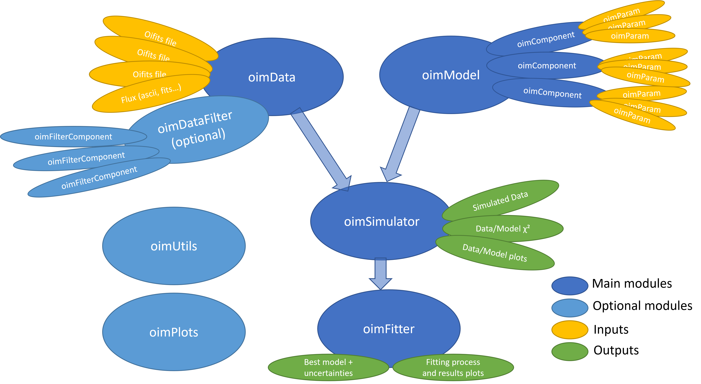

:tocdepth: 1

Modularity & Expandability
==========================

Description of the oimodeler modules
------------------------------------

As described below and illustrated in the diagram, **oimodeler** is a modular software package:

- Models are created using the :mod:`oimModel <oimodeler.oimModel>` module and are built from components defined in the :mod:`oimComponent <oimodeler.oimComponent>` module. These components include model parameters provided by the :mod:`oimParam <oimodeler.oimParam>` module.

- Interferometric data can be loaded from standard OIFITS files using the :mod:`oimData <oimodeler.oimData>` module. This module also supports loading flux and spectral data in various formats through the :func:`oimData.oimFluxData <oimodeler.oimFluxData>` class. Data can optionally be filtered using the :func:`oimData.oimDataFilter <oimodeler.oimData.oimDataFilter>` class and filters from the :mod:`oimDataFilter <oimodeler.oimDataFilter>` module.

- Data simulation and model evaluation are handled by the :mod:`oimSimulator <oimodeler.oimSimulator>` module. It takes :func:`oimData.oimData <oimodeler.oimData.oimData>` and :func:`oimModel.oimModel <oimodeler.oimModel.oimModel>` objects as input and simulates data at the same spatial and spectral coordinates as the observations. It also computes the model-to-data :math:`\chi^2`.

- Model fitting is performed by fitters implemented in the :mod:`oimFitter <oimodeler.oimFitter>` module. These fitters take :func:`oimData.oimData <oimodeler.oimData.oimData>` and :func:`oimModel.oimModel <oimodeler.oimModel.oimModel>` objects as input.

- The :mod:`oimPlots <oimodeler.oimPlots>` module provides plotting tools for OIFITS data and **oimodeler** objects.

- The :mod:`oimUtils <oimodeler.oimUtils>` module provides various utility functions for manipulating OIFITS data.

oimModel
^^^^^^^^

The :mod:`oimModel <oimodeler.oimModel>` module is dedicated to creating models for optical interferometry.

Models are modular and consist of one or more :func:`oimComponent.oimComponent <oimodeler.oimComponent.oimComponent>` objects. They can generate complex coherent fluxes and images, which can then be used by an :func:`oimSimulator <oimodeler.oimSimulator.oimSimulator>` object and/or any fitter from the :mod:`oimFitter <oimodeler.oimFitter>` module for data analysis and model fitting.

See the :ref:`model` section for more details.

oimComponent
^^^^^^^^^^^^

The :mod:`oimComponent <oimodeler.oimComponent>` module manages model components that can be defined either analytically in the Fourier plane (e.g., uniform disks or 2D Gaussian distributions) or in the image plane, which is useful when no analytical Fourier-domain expression is available.

An :mod:`oimComponent <oimodeler.oimComponent>` can also wrap external code, such as functions that compute images, radial profiles, or hyperspectral cubes, as well as image-fitting files (e.g., from radiative transfer models).

Components can also be easily subclassed to create new custom components.

oimParam
^^^^^^^^

The :mod:`oimParam <oimodeler.oimParam>` module contains the basic building blocks for model parameters.

Its :func:`oimParam.oimParam <oimodeler.oimParam.oimParam>` class defines component parameters, based on base classes from the :mod:`oimComponent <oimodeler.oimComponent>` module.

The module also provides parameter linkers (:func:`oimParam.oimParamLinker <oimodeler.oimParam.oimParamLinker>`), normalizers (:func:`oimParam.oimParamNormalize <oimodeler.oimParam.oimParamNormalize>`), and advanced interpolators (:func:`oimParam.oimParamInterpolator <oimodeler.oimParam.oimParamInterpolator>`), enabling the construction of chromatic and time-dependent models.

oimData
^^^^^^^^

The :mod:`oimData <oimodeler.oimData>` module provides a framework for handling interferometric, photometric, and spectroscopic data.

The :func:`oimData.oimData <oimodeler.oimData.oimData>` class stores the original OIFITS data as a list of `astropy.io.fits.hdulist <https://docs.astropy.org/en/stable/io/fits/api/hdulists.html>`_ objects. It also provides optimized vector and structured data representations for faster model evaluation and fitting.

oimFluxData
^^^^^^^^^^^

The :func:`oimData.oimFluxData <oimodeler.oimFluxData>` class provides a convenient way to handle flux and spectral data in various formats. It complements the interferometric data management provided by the :mod:`oimData <oimodeler.oimData>` module.

oimDataFilter
^^^^^^^^^^^^^

The :mod:`oimDataFilter <oimodeler.oimDataFilter>` module provides tools for filtering and modifying data stored in :func:`oimData.oimData <oimodeler.oimData.oimData>` objects.

It supports data selection and removal (e.g., truncation, array removal, and flagging) based on criteria such as wavelength or signal-to-noise ratio (SNR). It also provides data-processing operations such as smoothing, binning, and error estimation.

oimSimulator
^^^^^^^^^^^^

The :mod:`oimSimulator <oimodeler.oimSimulator>` module is the core module for comparing models (:func:`oimModel.oimModel <oimodeler.oimModel.oimModel>`) with data (:func:`oimData.oimData <oimodeler.oimData.oimData>`).

It simulates datasets with the same observables and spatial and spectral coordinates as the input data and model. It also computes the reduced chi-squared, :math:`\chi^2_r`, for comparison.

The :func:`oimSimulator.oimSimulator <oimodeler.oimSimulator.oimSimulator>` class is fully compatible with OIFITS2 and can simulate any observable supported by an OIFITS file, such as VIS2DATA, VISAMP, and correlated flux, including absolute and differential quantities.

oimFitter
^^^^^^^^^

The :mod:`oimFitter <oimodeler.oimFitter>` module is dedicated to model fitting.

The parent class :func:`oimFitter.oimFitter <oimodeler.oimFitter.oimFitter>` is an abstract class intended to be subclassed to implement different fitting algorithms.

Current implementations include an MCMC sampler based on the popular `emcee <https://emcee.readthedocs.io/en/stable/>`_ library, a Dynamic Nested Sampling (DNS) sampler based on the `dynesty <https://dynesty.readthedocs.io/en/stable/>`_ library, a simple grid search, and a minimizer based on the ``scipy.optimize.minimize`` function.

oimPlots
^^^^^^^^

The :mod:`oimPlots <oimodeler.oimPlots>` module provides plotting tools for OIFITS data and **oimodeler** objects.

The :func:`oimPlots.oimAxes <oimodeler.oimPlots.oimAxes>` subclass extends `matplotlib.pyplot.Axes <https://matplotlib.org/stable/api/_as_gen/matplotlib.pyplot.axes.html>`_ with methods specifically designed for plotting OIFITS data stored in the `astropy.io.fits.hdulist <https://docs.astropy.org/en/stable/io/fits/api/hdulists.html>`_ format.

oimUtils
^^^^^^^^

The :mod:`oimUtils <oimodeler.oimUtils>` module provides utility functions for manipulating OIFITS data, including:

- Retrieving baseline names, lengths, orientations, and spatial frequencies
- Creating new OIFITS arrays in `astropy.io.fits.hdulist <https://docs.astropy.org/en/stable/io/fits/api/hdulists.html>`_ format
- And many other utility functions

Expandability
-------------

**oimodeler** is designed to make it easy to implement new model components, fitters, data filters, parameter interpolators, data importers (e.g., for non-OIFITS formats), and plotting tools.

If you develop custom features and would like to have them included in the **oimodeler** distribution, feel free to contact `Anthony Meilland <mailto://ame@oca.eu>`_. Alternatively, you can submit a pull request to the `GitHub repository <https://github.com/oimodeler/oimodeler>`_ and become an **oimodeler** contributor.

For bug reports and feature requests, please use the `GitHub issue tracker <https://github.com/oimodeler/oimodeler/issues>`_.