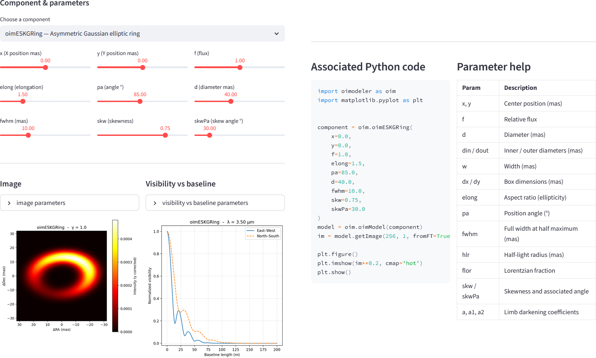
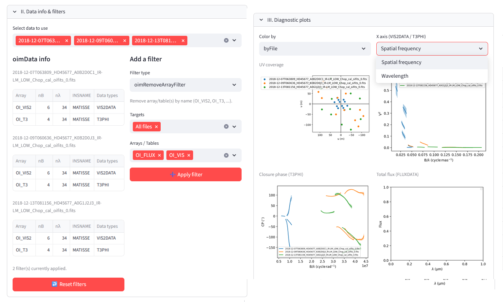
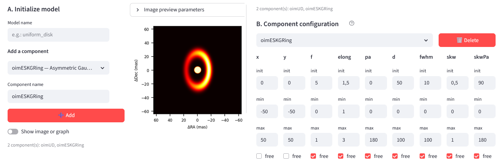
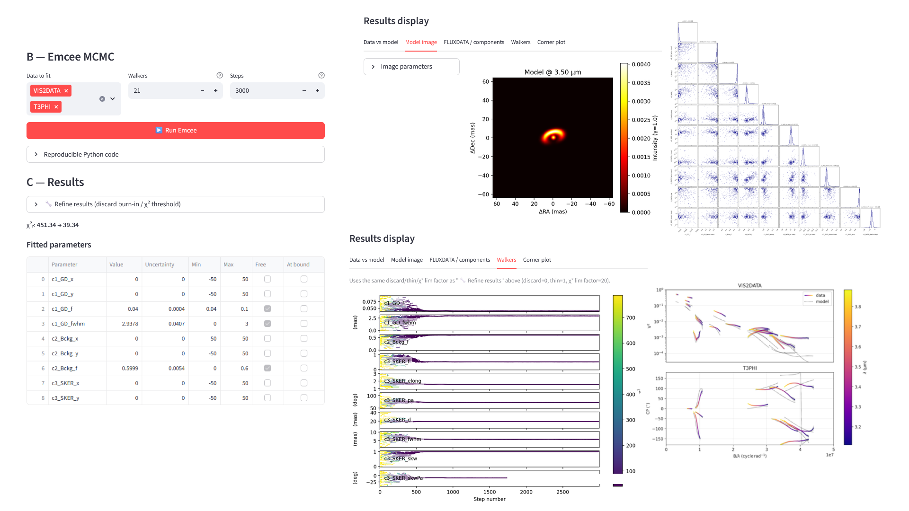

:tocdepth: 1
.. raw:: html

   

..  _oimodelerapp:

oimodeler-app
=============

**oimodeler-app** is a `Streamlit <https://streamlit.io/>`_-based interactive graphical interface built on
**oimodeler**, designed to model OIFITS interferometric data without requiring any coding. It is developed
by Valentin Fleury and is available on `GitHub <https://github.com/vdhpfleury/oimodeler_App>`_.

.. note::

    The application is currently in an open beta-testing phase, and we welcome feedback, which can be sent to
    `Valentin Fleury <mailto:valentin.fleury@oca.eu>`_.

The application can also be run `on Streamlit Cloud <https://oimodeler-app.streamlit.app/>`_ without requiring
the installation of any Python libraries.

.. warning::

    The Streamlit Cloud version is significantly slower than the local version.

The application provides an intuitive environment in which users can:

- explore **oimodeler** components;
- load, plot, and filter OIFITS2 datasets;
- construct multi-component parametric models;
- perform model fitting and visualize the results.

**oimodeler-app** also generates Python code, allowing users to learn how to use **oimodeler** through scripting.

A few Screenshots for oimodeler-app
-----------------------------------

|

    **Exploring oimodeler components**

|
|

    **Loading, plotting, and filtering datasets**

|
|

    **Constructing multi-component parametric models**

|
|

    **Performing model fitting and visualizing the results**

