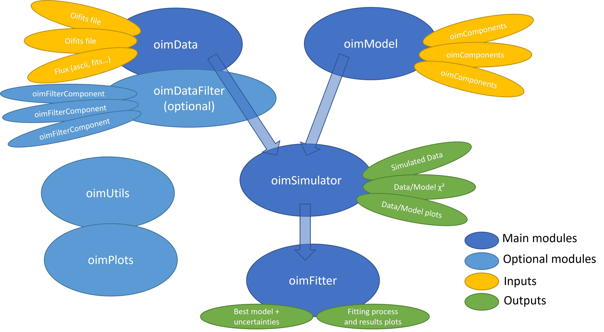

Overview
========

The ``oimodeler`` package is a project aiming at developing a modular and easily
expandable python-based modelling software for optical interferometry.

.. note::

   The project started end of 2021, and the software, although fully functional,
   is currently in an early stage of development.

Software modularity
-------------------

As described in the following and shown in the diagram below, ``oimodeler`` is a
modular software:

- Models can be created with the :mod:`oimModel <oimodeler.oimModel>` module and various
  base components contained in the :mod:`oimComponent <oimodeler.oimComponent>` module
  which contain model parameters from the :mod:`oimParam <oimodeler.oimParam>` module.
- Interferometric data can be loaded with functionality from the :mod:`oimData <oimodeler.oimData>`
  module from standard OIFITS files. This module also allows to load flux/spectra in
  various formats with the :func:`oimData.oimData <oimodeler.oimData>` class that can
  optionallly be filtered using the :func:`oimData.oimDataFilter <oimodeler.oimData.oimDataFilter>`
  class with various filters from the :mod:`oimDataFilter <oimodeler.oimDataFilter>` module.
- Data simulation/calculation can be done with the :mod:`oimSimulator <oimodeler.oimSimulator>` module
  that takes :func:`oimData.oimData <oimodeler.oimData.oimData>` and
  :func:`oimModel.oimModel <oimodeler.oimModel.oimModel>` classes as input to simulate
  data from the model at the same spatial/spectral coordinates as the data. The module
  also allows to compute the model/data chi2.
- The fitting is done with fitters contained in the :mod:`oimFitter <oimodeler.oimFitter>`
  module that as its input also takes the :func:`oimData.oimData <oimodeler.oimData.oimData>`
  and :func:`oimModel.oimModel <oimodeler.oimModel.oimModel>` classes to perform model
  fitting.

  .. note::

    Currently only a simple `emcee <https://emcee.readthedocs.io/en/stable/>`__ fitter is
    implemented.

- The :mod:`oimPlots <oimodeler.oimPlots>` module contains plotting functions for
  OIFITS data and ``oimodeler`` objects.
- The :mod:`oimUtils <oimodeler.oimUtils>` module contains various functions to
  manipulate OIFITS data.

Modules 
-------

oimModel
^^^^^^^^

The :mod:`oimModel <oimodeler.oimModel>` module is dedicated to the creation of
models for optical interferometry. The models are modular and composed of one or many
:func:`oimComponent.oimComponent <oimodeler.oimComponent.oimComponent>` objects.
They can produce complex coherent flux and images and can subsequently be plugged into 
an :func:`oimSimulator <oimodeler.oimSimulator.oimSimulator>` object and/or
any of the fitters contained in the :mod:`oimFitter <oimodeler.oimFitter>`
for data analysis and/or modelling.

oimComponent
^^^^^^^^^^^^^

The :mod:`oimComponent <oimodeler.oimComponent>` module deals with model components
that can be defined analytically in the Fourier plane (e.g., Uniform Disks, 
2D-Gaussian distribution, etc.) or image plane (useful if there exists no analytical
formula in the Fourier plane). An :mod:`oimComponent <oimodeler.oimComponent>`
can also be used to wrap external code (functions computing images,
radial profiles, and hyperspectral cubes), or image-fit files (for instance
produced using a radiative transfer model). An :mod:`oimComponent <oimodeler.oimComponent>`
can, in addition, be easily inherited from to create new custom components.

oimParam
^^^^^^^^

The :mod:`oimParam <oimodeler.oimParam>` module contains basic model parameters. It :func:`oim.Param.oimParam <oimodeler.oimParam.oimParam>` class is used for the
definition of components' parameters (Built from any of the base classes from the
:mod:`oimComponent <oimodeler.oimComponent>` module). There are also parameter linkers
(:func:`oimParam.oimParamLinker <oimodeler.oimParam.oimParamLinker>`) as well as
normalizers (:func:`oimParam.oimParamNormalize <oimodeler.oimParam.oimParamNormalize>`),
and advanced parameter interpolators (:func:`oimParam.oimParamInterpolator <oimodeler.oimParam.oimParamInterpolator>`)
that allow to build chromatic and time dependent models.

oimData
^^^^^^^

The :mod:`oimData<oimodeler.oimData>` module allows to encapsulate interferometric
(also photometric and spectroscopic) data. The :func:`oimData.oimData <oimodeler.oimData.oimData>`
class allows to retrieve the original data as a list of `astropy.io.fits.hdulist <https://docs.astropy.org/en/stable/io/fits/api/hdulists.html>`_
(via the ``oimData.data`` attribute), but also provide optimization of the data as vector/structure
for faster model fitting.

.. warning::

    Photometric and spectroscopic data not yet implemented!

oimDataFilter
^^^^^^^^^^^^^

The :mod:`oimDataFilter <oimodeler.oimDataFilter>` module is dedicated to filtering and
modifying data contained in :func:`oimData.oimData <oimodeler.oimData.oimData>` classes.
It allows data selection (truncating, removing arrays, and flagging)
based on various criteria (wavelengths, SNR ...), and other data manipulation, such as
smoothing and binning of the data.

oimSimulator
^^^^^^^^^^^^

The :mod:`oimSimulator <oimodeler.oimSimulator>` module is the basic module for model
(:func:`oimModel.oimModel <oimodeler.oimModel.oimModel>`) and data 
(:func:`oimData.oimData <oimodeler.oimData.oimData>`) comparison. It allows to
simulate a new dataset (stored in the ``oimSimulator.simulatedData`` attribute) with
the same quantities and spatial/spectral coordinates of the data and a model. It also allows to compute ``chi2``
for data and model comparison. The :func:`oimSimulator.oimSimulator <oimodeler.oimSimulator.oimSimulator>`
class is fully compatible with the OIFITS2 format and can simulated any kind of data type
from an OIFITS file (VIS2DATA, VISAMP in absolute, differential and correlated
flux).

oimFitter
^^^^^^^^^

The :mod:`oimFitter <oimodeler.oimFitter>` module is dedicated to model fitting. The
parent class :func:`oimFitter.oimFitter <oimodeler.oimFitter.oimFitter>` is an abstract
class that can be inherited from to implement various fitters. Currently. only a simple
`emcee <https://emcee.readthedocs.io/en/stable>`__-based fitter is implemented
with :func:`oimFitter.oimEmceeFitter <oimodeler.oimFitter.oimEmceeFitter>`.

oimPlots
^^^^^^^^

The :mod:`oimPlots <oimodeler.oimPlots>` module contains various plotting tools for
OIFITS data and ``oimodeler`` objects. The :func:`oimPlots.oimAxes <oimodeler.oimPlots.oimAxes>`
is a subclass of the `matplotlib.pyplot.Axes <https://matplotlib.org/stable/api/_as_gen/matplotlib.pyplot.axes.html>`_
class with methods dedicated to produce plotted OIFITS data from the `astropy.io.fits.hdulist <https://docs.astropy.org/en/stable/io/fits/api/hdulists.html>`_
format.

oimUtils
^^^^^^^^

The :mod:`oimUtils <oimodeler.oimUtils>` module contains various functions to
manipulate OIFITS data such as,

- Retrieving baselines names, length, orientation, getting spatial frequencies
- Creating new OIFITS arrays in 
  `astropy.io.fits.hudlist <https://docs.astropy.org/en/stable/io/fits/api/hdulists.html>`_
  format.

and more.

Expandability
-------------

``oimodeler`` is written to allow easy implementation of new model component,
fitters, data filters, parameter intepolators, data loader (e.g., for non-OIFITS
format data), and plots. Feel free to contact 
`Anthony Meilland <mailto://ame@oca.eu>`_ if you developped custom features and want
them to be included in the ``oimodeler`` distribution or make a pull-request
on the `Github repository <https://github.com/oimodeler/oimodeler>`_
and become a ``oimodeler`` **contributer**. For bug-reports and feature requests,
please use the `GitHub issue tracker <https://github.com/oimodeler/oimodeler/issues>`_.

