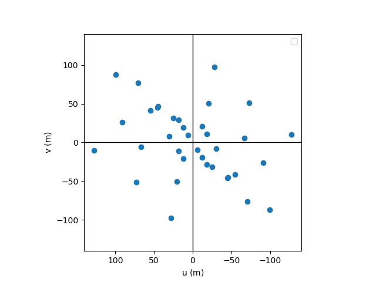
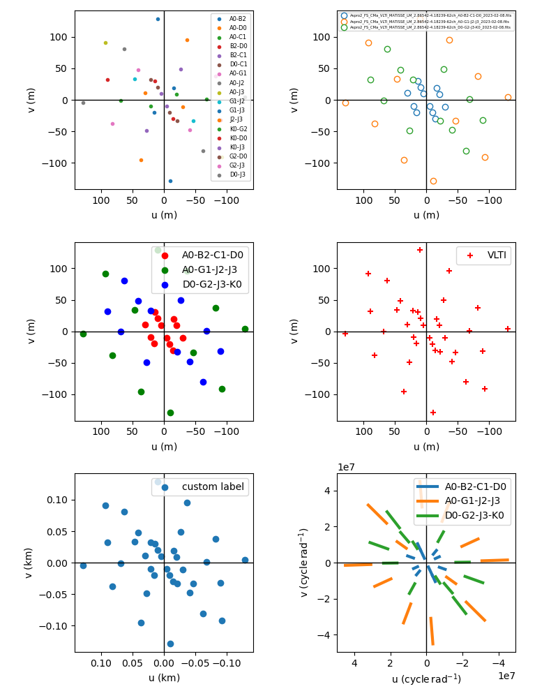
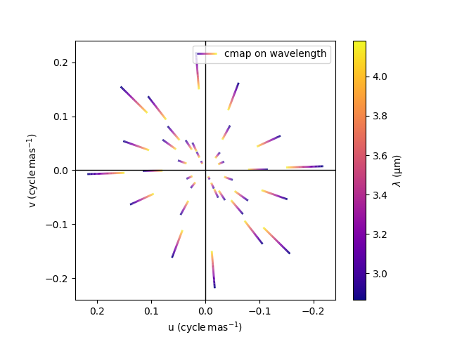
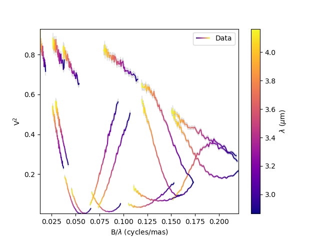
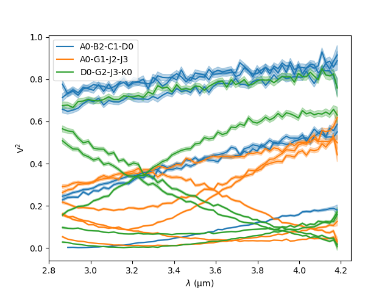
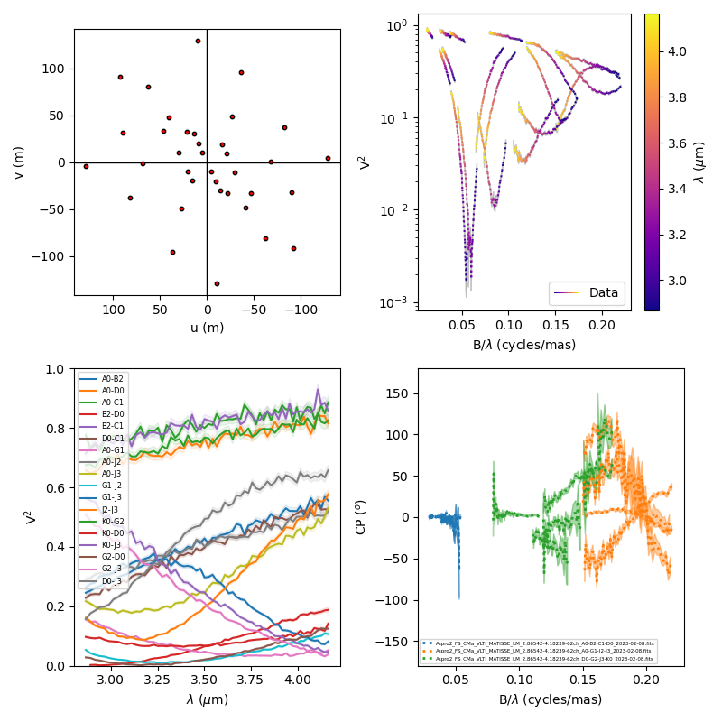
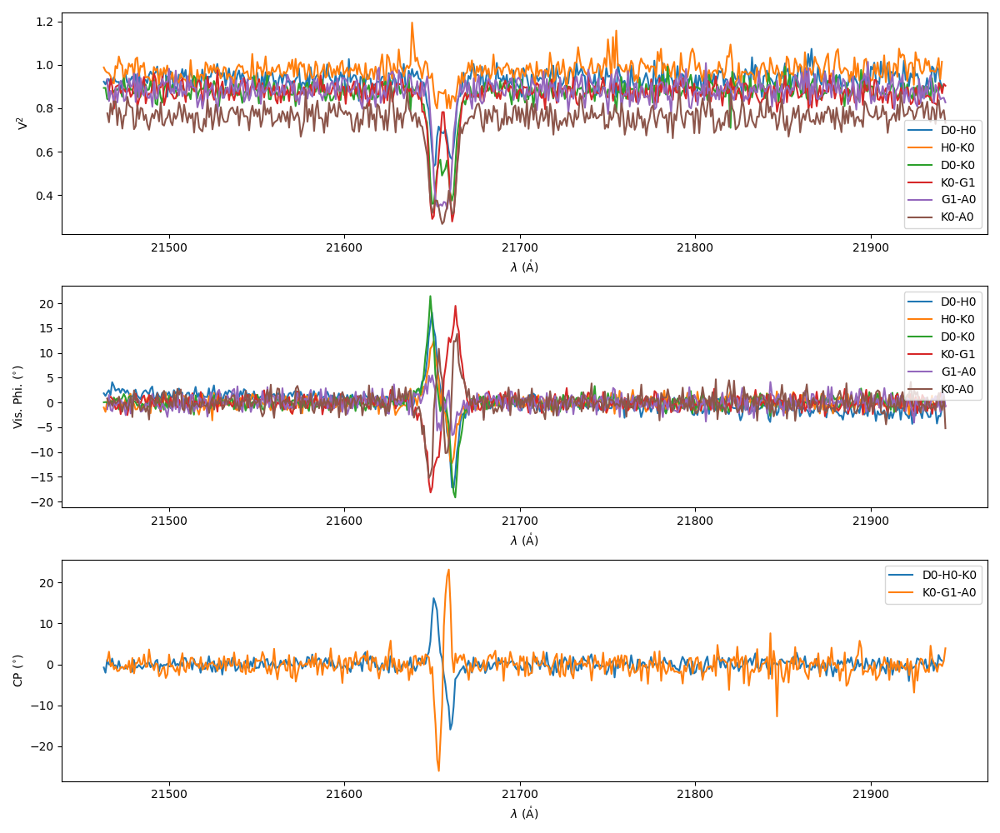
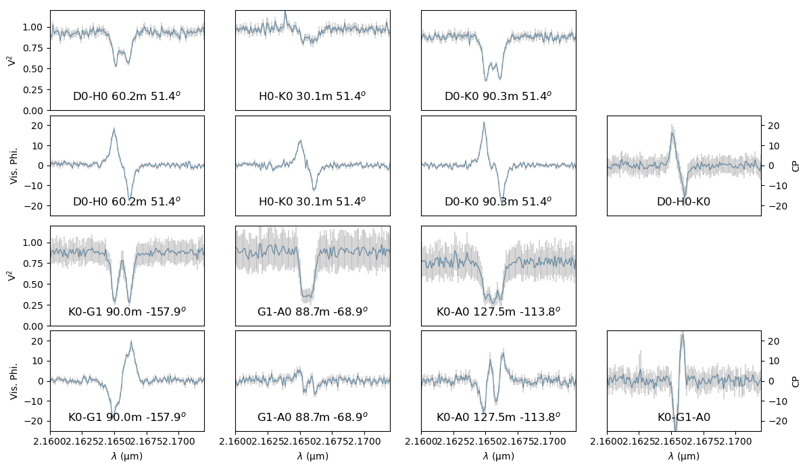

..  _plot:

Plotting data
=============

Beyond the specific plots shown in the previous section, the
:func:`oimPlot <oimodeler.oimPlot.oimPlot>` module allows to plot most of the
OIFITS data in a very simple way. The example presented here comes from the
`exampleOimPlot.py <https://github.com/oimodeler/oimodeler/blob/main/examples/BasicExamples/exampleOimPlot.py>`_
script.

Let's start by setting up the project with imports, path, and some data.
 
.. code-block:: python

    from pathlib import Path

    import matplotlib.pyplot as plt
    import oimodeler as oim

    path = Path(__file__).parent.parent.parent
    data_dir = path / "examples" / "data" / "ASPRO_MATISSE2"
    save_dir = path / "images"
    if not save_dir.exists():
        save_dir.mkdir(parents=True)

    files = list(map(str, data_dir.glob("*.fits")))

.. note:
    The data consist in three OIFITS simulated with ASPRO as a MATISSE observation of a partly resolved binary star for the VLTI SMALL, MEDIUM and LARGE VLTI configurations of Auxiliary Telescopes (ATs).

The ``oimodeler`` package comes with the :func:`oimAxes <oimodeler.oimPlot.oimAxes>`
class that is a subclass of the standard `matplotlib.pytplot.Axes <https://matplotlib.org/stable/api/axes_api.html>`_
class (the base class for all matplotlib plots). To use it, you simply need to
specify it as a projection (actually this calls the subclass) when creating
an axe or axes.

.. code-block:: python

    fig1 = plt.figure()
    ax1 = plt.subplot(projection='oimAxes')

(u,v) plots
-----------

First, we can plot the simple uv coverage using the
:func:`oimAxes.uvplot <oimodeler.oimPlot.oimAxes.uvplot>` method by passing the
list of OIFITS files (filename or opened) or an instance of a :func:`oimData <oimodeler.oimData.oimData>`
class.

.. code-block:: ipython3

    ax1.uvplot(data)

There are several colouring options for the uvplot:

- ``color="byBaseline"`` : color the plots by baseline name
- ``color="byFile"`` : color the plots by oifits file name
- ``color="byConfiguration"`` : color the plots by Array configuration ("A0-B2-C1-D0" ...)
- ``color="byArray"`` : color the plots by Array name (VLTI, CHARA...)

The data can be plotted in unit of length (by default) or in unit of spatial frequency using the ``cunit`` keyword.

Here are a few examples of uv plots with different options. To use the :func:`oimAxes <oimodeler.oimPlot.oimAxes>`
in a multiple plot created by `matplotlib.pyplot.subplots <https://matplotlib.org/stable/api/_as_gen/matplotlib.pyplot.subplots.html>`_
method, one need to set the  projection  using the ``subplot_kw`` keyword in when creating the axes.

.. code-block:: python

    fig2, ax2 = plt.subplots(2, 3, subplot_kw=dict(projection='oimAxes'), figsize=(18, 9))

    ax2[0,0].uvplot(data.data,color="byBaseline",marker=".",legendkwargs=dict(fontsize=8))
    ax2[0,1].uvplot(data.data,color="byFile",facecolor="w",legendkwargs=dict(fontsize=5.))
    ax2[0,2].uvplot(data.data,color="byConfiguration",colorTab=["r","g","b"])
    ax2[1,0].uvplot(data.data,color="byArrname",colorTab=["r","g","b"],marker="+")
    ax2[1,1].uvplot(data.data,label="custom label",unit="km")
    ax2[1,2].uvplot(data.data,unit="cycle/rad",cunit="micron",lw=2,color="byConfiguration")
    fig2.tight_layout()

If the data is plotted in unit of spatial frequency without a color code specified, a colormap based on the wavelength will be used and a scalorscale will be added to the figure.

.. code-block:: python

    fig3 = plt.figure()
    ax3 = plt.subplot(projection='oimAxes')
    ax3.uvplot(data.data,unit="cycle/mas",cunit="micron",
               label="cmap on wavelength",lw=3,cmap="plasma")

Data plots
----------

We can use the :func:`oiplot <oimodeler.oimPlot.oimAxes.oiplot>` method of
the :func:`oimAxes <oimodeler.oimPlot.oimAxes>` to produce plots of the following quantities:

.. csv-table:: Quantities plottable with oiplot method
   :file: table_plotData.csv
   :header-rows: 1
   :delim: ;
   :widths: auto

For instance, let's plot the square visibilities (and corresponding errors) as a
function of the spatial frequency with the wavelength (converted in microns)
as a colorscale.

.. code-block:: python

    fig4 = plt.figure()
    ax4 = plt.subplot(projection='oimAxes')
    ax4.oiplot(data, "SPAFREQ", "VIS2DATA", xunit="cycle/mas", label="Data",
                    cname="EFF_WAVE",cunit="micron", errorbar=True)
    ax4.legend()

As for ``uvplot``, the color code can alternatively set using the ``color`` keyword.
Here we plot the square visibility as the function of the wavelength while
colouring it by interferometer configurations (i.e., the list of all
telescopes). Note that here,  we are passing parameters to the error plot function
using the ``kwargs_error`` keyword.

.. code-block:: python

    fig5 = plt.figure()
    ax5 = plt.subplot(projection='oimAxes')
    ax5.oiplot(data, "EFF_WAVE", "VIS2DATA", xunit="micron",color="byConfiguration",
               errorbar=True,kwargs_error={"alpha": 0.3})
    ax5.legend()

.. note::
    Special values of the color option are ``"byFile"``, ``"byConfiguration"``,
    ``"byArrname"``, or ``"byBaseline"``. Other values will be interpreted as a
    standard `matplotlib colorname <https://matplotlib.org/stable/gallery/color/named_colors.html>`_.
    When using one of these values, the corresponding labels are added to the plots.
    Using the :func:`oimAxes.legend <oimodeler.oimPlot.oimAxes.legend>` method
    will automatically add the proper names.

Let's create a figure with multiple oiplots. As for uvplot, the projection keyword
has to be set for all :func:`oimAxes <oimodeler.oimPlot.oimAxes>`
using the ``subplot_kw`` keyword in the
`matplotlib.pyplot.subplots <https://matplotlib.org/stable/api/_as_gen/matplotlib.pyplot.subplots.html>`_
method.

.. code-block:: python

    fig6, ax6 = plt.subplots(2, 2, subplot_kw=dict(
    projection='oimAxes'), figsize=(8, 8))

    ax6[0, 0].oiplot(data, "SPAFREQ", "VIS2DATA", xunit="cycle/mas", label="Data",
                              cname="EFF_WAVE", cunit="micron", ls=":", errorbar=True)
    ax6[0, 0].legend()
    ax6[0, 0].set_yscale('log')

    ax6[0, 1].oiplot(data, "EFF_WAVE", "VIS2DATA", xunit="nm",color="byBaseline",
                     errorbar=True, kwargs_error={"alpha": 0.1})
    ax6[0, 1].legend(fontsize=6)

    ax6[1, 0].oiplot(data, "SPAFREQ", "T3PHI", xunit="cycle/rad", errorbar=True,
                     lw=2, ls=":", color="byFile")
    ax6[1, 0].legend(fontsize=4)

    ax6[1, 1].oiplot(data, "EFF_WAVE", "T3PHI", xunit="m",cname="LENGTH",
                     errorbar=True, kwargs_error={"alpha": 0.1})

Template plots
--------------

Let's have a look at another data set: two VLTI/AMBER observations of the classical Be star Alpha Col.
Observation were centered on the BrGamma Emission line.

.. code-block:: python

    data_path = path / "examples" / "data" / "AMBER_AlphaCol"
    files = [data_path / "ALPHACOL_2010-01-09T00_58.fits",
              data_path / "ALPHACOL_2010-01-20T10_36.fits"]
    data=oim.oimData(files)

We can plot VIS2DATA, VISPHI, T3PHI as a function of the wavelength throught the emission line.

.. code-block:: python

    fig7, ax7 = plt.subplots(3, 1, subplot_kw=dict(projection='oimAxes'), figsize=(12, 10))
    ax7[0].oiplot(data, "EFF_WAVE", "VIS2DATA", xunit="Angstrom",color="byBaseline")
    ax7[0].legend()
    ax7[1].oiplot(data, "EFF_WAVE", "VISPHI", xunit="Angstrom",color="byBaseline")
    ax7[1].legend()
    ax7[2].oiplot(data, "EFF_WAVE", "T3PHI", xunit="Angstrom",color="byBaseline")
    ax7[2].legend()

We clearly see some interesting signal in the emission line but it is hard to disantangle
signal from each baseline.

We have included in **oimodeler** a new template to produce easily per-baseline plots: :func:`oimWlTemplatePlots <oimodeler.oimPlot.oimWlTemplatePlots>`. It derives from the matplotlib.figure. Figure class and can be used by specifiying
``FigureClass = oim.oimWlTemplatePlot`` in the figure creation.

.. code-block:: python

    fig=plt.figure(FigureClass=oim.oimWlTemplatePlots, figsize=(12, 7))

First we need to define what we want to plot by passing the oimData (or list of oifits files) to the :func:`autoshape <oimodeler.oimPlot.oimWlTemplatePlots.autoshape>` method of the newly created figure. The function also require a shape with a list
of what data types we want to include in the figure. For instance, to create a figure with the VIS2DATA on the first row and the VISPHI and T3PHI on the second one :

.. code-block:: python

    fig.autoShape(data.data, shape=[["VIS2DATA",None],["VISPHI","T3PHI"]])
    fig.set_xunit("micron")

Here we have also specified that we sant the plots x-axis to be in microns. We can now plot the data using the basic plot function from matplotlib or custom one. We can pass keyword to the plotting function using the  ``plotFunctionkwarg`` dictionary. Here we use the standard errorbar and plot functions of matplotlib.

.. code-block:: python

    fig.plot(data.data, plotFunction=plt.Axes.errorbar,
             plotFunctionkwarg=dict(color="gray", alpha=0.3))
    fig.plot(data.data, plotFunctionkwarg=dict(color="tab:blue",lw=0.5))

Finally we can set the plot limits and legends. Legends text can include per baseline information such as $BASELINE$, $LENGTH$ or $PA$ which respectively return the baseline name, length and position angle.

.. code-block:: python

    fig.set_ylim(["VISPHI","T3PHI"],-25,25)
    fig.set_ylim(["VIS2DATA"],0,1.2)
    fig.set_xlim(2.16,2.172)
    fig.set_legends(0.5,0.1, "$BASELINE$ $LENGTH$m $PA$$^o$", ["VIS2DATA","VISPHI"],
                    fontsize=12, ha="center")
    fig.set_legends(0.5,0.1, "$BASELINE$", ["T3PHI"], fontsize=12, ha="center")

Note that the :func:`oimodel <oimodeler.oimModel.oimModel>`, :func:`oimSimulator <oimodeler.oimSimulator.oimSimulator>` and  :func:`oimFitter <oimodeler.oimFitter.oimFitter>` classes also contain plotting methods of their own that are described in their respective section of this documentation.

