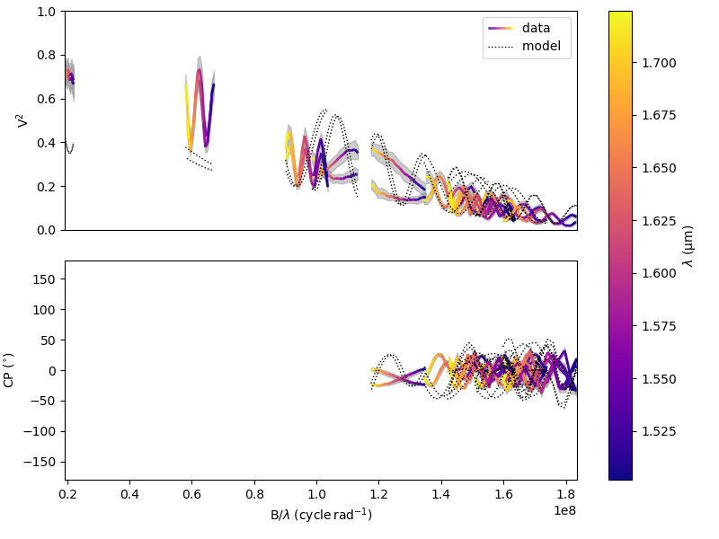
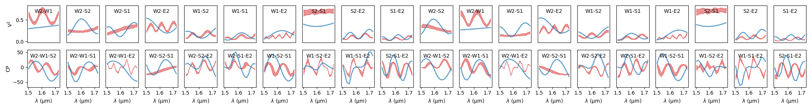
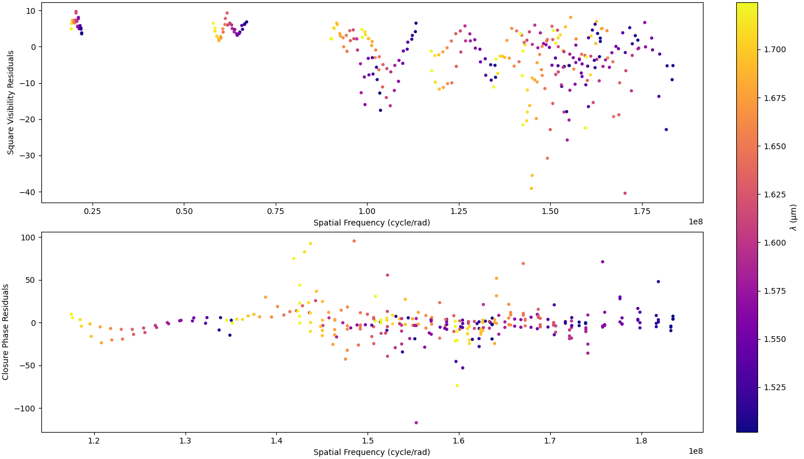

..  _simulator:

Data/Model comparison
=====================

In **oimodeler** the :func:`oimSimulator <oimodeler.oimSimulator.oimSimulator>` class is the main class to do data/model
comparison. In these section we will present:

- the basics use and functionalities of this class
- some details on how the simluated interferometric data are computed
- a description of the available plotting methods of the :func:`oimSimulator <oimodeler.oimSimulator.oimSimulator>` class

The code for this section is in
`SimulatingData.py <https://github.com/oimodeler/oimodeler/tree/main/examples/Modules/SimulatingData.py>`_

The basics of the simulator
---------------------------

To demonstrate the use of the :func:`oimSimulator <oimodeler.oimSimulator.oimSimulator>` class we will first
use a single `MIRCX <http://www.astro.ex.ac.uk/people/kraus/mircx.html>`_ observation of the binary star
:math:`\beta` Ari.

The oifits file of this observations can be found in the data directory of the oimodeler github website (
`here <https://github.com/oimodeler/oimodeler/blob/main/data/RealData/MIRCX/Beta%20Ari/MIRCX_L2.2023Oct14._bet_Ari.MIRCX_IDL.nn.AVG10m.fits>`_).

We first get the path to the oifits file:

.. code-block:: ipython3

    file = data_dir / "MIRCX_L2.2023Oct14._bet_Ari.MIRCX_IDL.nn.AVG10m.fits"

First, we need to build a model of a binary star where both of the components can be partly resolved.
To do so, we use two uniform disks.

.. code-block:: ipython3

    ud1 = oim.oimUD(d=1, f=0.8)
    ud2 = oim.oimUD(d=0.8, f=0.2, x=5, y=15)
    model = oim.oimModel([ud1, ud2])

We now create an :func:`oimSimulator <oimodeler.oimSimulator.oimSimulator>` object and feed it
with the data and our model.

The data can either be:

- A previously created :func:`oimData <oimodeler.oimData.oimData>`.
- A list of previously opened `astropy.io.fits.hdulist <https://docs.astropy.org/en/stable/io/fits/api/hdulists.html#astropy.io.fits.HDUList>`_.
- A list of paths to the OIFITS files (list of strings).

.. code-block:: ipython3

    sim = oim.oimSimulator(data=file, model=model)

If the data is given a filename or a list of filenames, the simulator automatically create an
:func:`oimData <oimodeler.oimData.oimData>` instance containing the data as explained in the :ref:`data` section of
this manual.

The loaded data can be directly accessed in the simulator using the :func:`data <oimodeler.oimSimulator.oimSimulator.data>`
member variable. We can, for instance use the :func:`info <oimodeler.oimData.oimData.info>` to get the description of the
data we have loaded into our simulator

.. code-block:: ipython3

    sim.data.info()

.. parsed-literal::

    ════════════════════════════════════════════════════════════════════════════════
    file 0: MIRCX_L2.2023Oct14._bet_Ari.MIRCX_IDL.nn.AVG10m.fits
    ────────────────────────────────────────────────────────────────────────────────
    4)	 OI_VIS  :	 (nB,nλ) = (270, 15) 	 dataTypes = ['VISAMP', 'VISPHI']
    5)	 OI_VIS2 :	 (nB,nλ) = (20, 15) 	 dataTypes = ['VIS2DATA']
    6)	 OI_T3   :	 (nB,nλ) = (20, 15) 	 dataTypes = ['T3AMP', 'T3PHI']
    ════════════════════════════════════════════════════════════════════════════════

Here we see that our data contains one file with one instance of OI_VIS, OI_VIS2 and OI_T3 tables.

Similarly, we can access to our model within the simulator:

.. code-block:: ipython3

    print(sim.model)

.. parsed-literal::

    Model with
    Uniform Disk: x=0.00 y=0.00 f=0.80 d=1.00
    Uniform Disk: x=5.00 y=15.00 f=0.20 d=0.80

We can now simulate data using our model and the spatial coordinates of  our loaded oifits files. This is done using the
:func:`oimSimulator.compute <oimodeler.oimSimulator.oimSimulator.compute>` method of the simulator instance.

This method have two boolean options:

- computeSimulatedData: compute the simulated data
- computeChi2: compute the :math:`\chi^2`between the data and the model

.. code-block:: ipython3

    sim.compute(computeChi2=True, computeSimulatedData=True)

The simulator will first call the :func:`oimModel.getComplexCoherentFlux <oimodeler.oimModel.oimModel.getComplexCoherentFlux>`
method with  optimized vectors of spatial, spectral and time coordinates.

If computeSimulatedData is True, the results of the
:func:`oimModel.getComplexCoherentFlux <oimodeler.oimModel.oimModel.getComplexCoherentFlux>`
is converted into a :func:`oimData <oimodeler.oimData.oimData>` instance accessible through the
:func:`data <oimodeler.oimSimulator.oimSimulator.simulatedData>` member variable of the simulator.

.. code-block:: ipython3

    sim.simulatedData.info()

.. parsed-literal::

    ════════════════════════════════════════════════════════════════════════════════
    file 0: MIRCX_L2.2023Oct14._bet_Ari.MIRCX_IDL.nn.AVG10m.fits
    ────────────────────────────────────────────────────────────────────────────────
    4)	 OI_VIS  :	 (nB,nλ) = (270, 15) 	 dataTypes = ['VISAMP', 'VISPHI']
    5)	 OI_VIS2 :	 (nB,nλ) = (20, 15) 	 dataTypes = ['VIS2DATA']
    6)	 OI_T3   :	 (nB,nλ) = (20, 15) 	 dataTypes = ['T3AMP', 'T3PHI']
    ════════════════════════════════════════════════════════════════════════════════

Or course, such instance have the same format (number of files, oi arrays, shape,...) as the original data.

.. note::

    **oimodeler** can compute all data type from the OIFITS2 format.

The simulatedData can used to plot the data/model comparison. We this, we can used standard **oimodeler** plotting function
or the :func:`oimSimulator.compute <oimodeler.oimSimulator.oimSimulator.plot>` method fro mthe simulator. In that case,
the user just need to pass the data types to be plotted, for instance, to plot the square visibility and closure phase:

.. code-block:: ipython3

    fig0, ax0 = sim.plot(["VIS2DATA", "T3PHI"])

If the computeChi2 option is set to True, the user can retrieve the following quantities related to the :math:`\chi^2`
as member variables of the :func:`oimSimulator <oimodeler.oimSimulator.oimSimulator>` instance:

- **chi2**: the  :math:`\chi^2`
- **chi2r**: the :math:`\chi^2_r` (i.e., the reduced :math:`\chi^2`)
- **chi2List**: a list of the residuals on all data and datatypes
- **nelChi2**: the number of data-points used to compute the  :math:`\chi^2`

.. code-block:: ipython3

    pprint("Chi2r = {}".format(sim.chi2r))

.. parsed-literal::

    ... Chi2r = 2710.412886555833

.. warning::

    By default the simulator uses all data types to compute the chi2. In the case of our ASPRO simulated data, this is OK as all
    datatypes are computed. But for most real interferometric instruments, some data type should be ignore. It is often the case
    of the closure-ampltiude (T3AMP). For some instruments like MATISSE, one should choose between using VISAMP or VIS2DATA.

We can force the :math:`\chi^2` computation to only a subset of datatypes using the dataTypes option of :func:`oimSimulator.compute
<oimodeler.oimSimulator.oimSimulator.compute>`  method. For instance, in the following we only compute the chi2r
on the square visibliity and closure-phase.

.. code-block:: ipython3

    sim.compute(computeChi2=True, dataTypes=["VIS2DATA","T3PHI"])
    pprint(f"Chi2r = {sim.chi2r}")

.. parsed-literal::

    ... Chi2r = 232.12015864012497

We could now try to fit the model "by hand", or by making a loop on some parameters and looking at the :math:`\chi^2_r`.
But **oimodeler** implement various fitter class to perform automatic model fitting as described in :ref:`fitter` section.

Simulating data
---------------

Here, give a bit more details on how each of OIFITS2 compatible data type is computed from the complex coherent
flux (CCF) return by the :func:`oimModel.getComplexCoherentFlux <oimodeler.oimModel.oimModel.getComplexCoherentFlux>` method.
To learn more about the data vectorization and optimization in **oimodeler** go back to the :ref:`fitter`
section.

In the table below is the complete list of OIFITS2 data type, their corresponding fits extension, data name, and
additional keyword needed to disentangle between some quantities. The formula used to extract these quantities from the
CCF is also given in the table.

.. csv-table:: OIFITS2 quantities
   :file: table_oifits2_quantities.csv
   :header-rows: 1
   :delim: !
   :widths: auto

TP is the triple product :

.. math::
    TP = \frac{CCF[u1,v1,\lambda,t] \cdot CCF[u2,v2,\lambda,t] \cdot CCF^*[u3,v3,\lambda,t]}{CF[0,0,\lambda,t]}

Where u1,u2,u3 and v1,v2,v3 are the (u,v) coordinates of the three baselines used to compute the triple product, closure
phase and amplitude. The term :math:`<CCF>_B` is the per baseline average of the CCF used to compute differential
visibility and phase.

The :math:`chi^2` computation

Plotting methods
----------------

Currently, three plotting methods are implemented in the :func:`oimSimulator <oimodeler.oimSimulator.oimSimulator>` class
for direct data/model comparison.

In the previous section we already described the :func:`plot <oimodeler.oimSimulator.oimSimulator.plot>` that can be used
to plot any OIFITS2 quantities as the function of the spatial frequency.

.. code-block:: ipython3

    fig0, ax0 = sim.plot(["VIS2DATA", "T3PHI"])

One can also produce per baseline plot as a function of the wavelength using the
:func:`plotWlTemplate <oimodeler.oimSimulator.oimSimulator.plotWlTemplate>` method.

.. code-block:: ipython3

    fig1 = sim.plotWlTemplate([["VIS2DATA"],["T3PHI"]],xunit="micron",figsize=(22,3))
    fig1.set_legends(0.5,0.8,"$BASELINE$",["VIS2DATA","T3PHI"],fontsize=10,ha="center")

This method uses the :func:`oimWlTemplatePlots <oimodeler.oimPlots.oimWlTemplatePlots>` class as described more in details
in the :ref:`plot` section.

Such plot are very useful to plot high spectral resolution observation center on atomic lines such as for the Be star
:math:`alpha` Col VLTI/AMBER observation and modelling with a rotating disk model as described in the examples section.

Finally, residuals can be plotted using the :func:`plot_residuals <oimodeler.oimSimulator.oimSimulator.plot_residuals>`
method.

.. code-block:: ipython3

    fig2, ax2 = sim.plot_residuals(["VIS2DATA", "T3PHI"])

