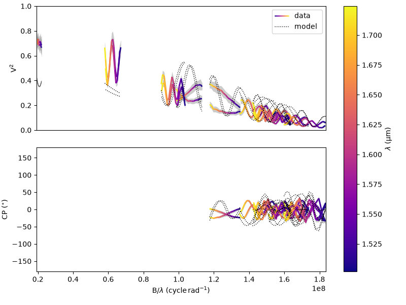
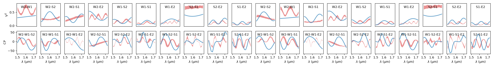
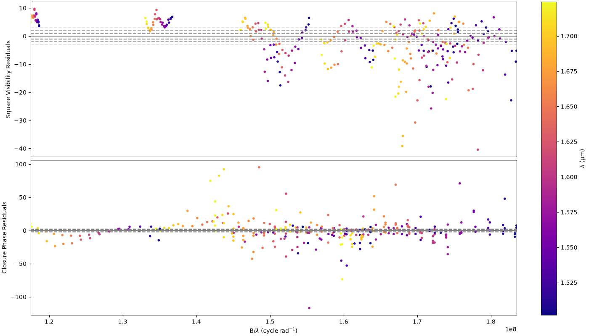

..  _simulator:

Data/Model comparison
=====================

In **oimodeler** the :func:`oimSimulator <oimodeler.oimSimulator.oimSimulator>` class is the main class to do data/model
comparison. In these section we will present:

- the basics use and functionalities of this class
- some details on how the simluated interferometric data are computed
- how the data/model :math:`\chi^2` is computed
- how to add external priors on the :math:`\chi^2`
- a description of the available plotting methods of the :func:`oimSimulator <oimodeler.oimSimulator.oimSimulator>` class

The code for this section is in
`SimulatingData.py <https://github.com/oimodeler/oimodeler/tree/main/examples/Modules/SimulatingData.py>`_

The basics of the simulator
---------------------------

To demonstrate the use of the :func:`oimSimulator <oimodeler.oimSimulator.oimSimulator>` class we will first
use a single `MIRCX <http://www.astro.ex.ac.uk/people/kraus/mircx.html>`_ observation of the binary star
:math:`\beta` Ari.

The oifits file of this observations can be found in the data directory of the oimodeler github website
(`here <https://github.com/oimodeler/oimodeler/blob/main/data/RealData/MIRCX/Beta%20Ari/MIRCX_L2.2023Oct14._bet_Ari.MIRCX_IDL.nn.AVG10m.fits>`_).

We first set the path to the oifits file:

.. code-block:: ipython3

    file = data_dir / "MIRCX_L2.2023Oct14._bet_Ari.MIRCX_IDL.nn.AVG10m.fits"

We want to build a model of a binary star in which both components are partially resolved. To do so, we use two
uniform disks.

.. code-block:: ipython3

    ud1 = oim.oimUD(d=1, f=0.8)
    ud2 = oim.oimUD(d=0.8, f=0.2, x=5, y=15)
    model = oim.oimModel([ud1, ud2])

We now create an :func:`oimSimulator <oimodeler.oimSimulator.oimSimulator>` object and provide it with the data and our
model.

The data can either be:

- A previously created :func:`oimData <oimodeler.oimData.oimData>`.
- A list of previously opened `astropy.io.fits.hdulist <https://docs.astropy.org/en/stable/io/fits/api/hdulists.html#astropy.io.fits.HDUList>`_.
- A list of paths to the OIFITS files (list of strings).

.. code-block:: ipython3

    sim = oim.oimSimulator(data=file, model=model)

If the data is given a filename or a list of filenames, the simulator automatically create a
:func:`oimData <oimodeler.oimData.oimData>` instance containing the data as explained in the :ref:`data` section of
this documentation.

The loaded data can be accessed directly through the simulator's :func:`data <oimodeler.oimSimulator.oimSimulator.data>`
member variable. For instance, we can use :func:`info <oimodeler.oimData.oimData.info>` to display a description of the
data loaded into the simulator.

.. code-block:: ipython3

    sim.data.info()

.. parsed-literal::

    ════════════════════════════════════════════════════════════════════════════════
    file 0: MIRCX_L2.2023Oct14._bet_Ari.MIRCX_IDL.nn.AVG10m.fits
    ────────────────────────────────────────────────────────────────────────────────
    4)	 OI_VIS  :	 (nB,nλ) = (270, 15) 	 dataTypes = ['VISAMP', 'VISPHI']
    5)	 OI_VIS2 :	 (nB,nλ) = (20, 15) 	 dataTypes = ['VIS2DATA']
    6)	 OI_T3   :	 (nB,nλ) = (20, 15) 	 dataTypes = ['T3AMP', 'T3PHI']
    ════════════════════════════════════════════════════════════════════════════════

Here we see that our data contains one file with one instance of OI_VIS, OI_VIS2 and OI_T3 tables.

Similarly, we can access to our model within the simulator:

.. code-block:: ipython3

    print(sim.model)

.. parsed-literal::

    Model with
    Uniform Disk: x=0.00 y=0.00 f=0.80 d=1.00
    Uniform Disk: x=5.00 y=15.00 f=0.20 d=0.80

We can now simulate data using our model and the spatial coordinates of our loaded OIFITS files. This is done using the
:func:`oimSimulator.compute <oimodeler.oimSimulator.oimSimulator.compute>` method of the simulator.

This method have two boolean options:

- computeSimulatedData: compute the simulated data
- computeChi2: compute the :math:`\chi^2`between the data and the model

.. code-block:: ipython3

    sim.compute(computeChi2=True, computeSimulatedData=True)

If we want to compute both, we can use the
:func:`oimSimulator.computeAll <oimodeler.oimSimulator.oimSimulator.computeAll>` method instead, so that the code above
is equivalent to:

.. code-block:: ipython3

    sim.computeAll()

The simulator first calls the :func:`oimModel.getComplexCoherentFlux <oimodeler.oimModel.oimModel.getComplexCoherentFlux>`
method with optimized vectors of spatial, spectral and time coordinates.

If ``computeSimulatedData`` is ``True``, the results of the
:func:`oimModel.getComplexCoherentFlux <oimodeler.oimModel.oimModel.getComplexCoherentFlux>` method
is converted into a :func:`oimData <oimodeler.oimData.oimData>` instance accessible through the
:func:`data <oimodeler.oimSimulator.oimSimulator.simulatedData>` member variable of the simulator.

.. code-block:: ipython3

    sim.simulatedData.info()

.. parsed-literal::

    ════════════════════════════════════════════════════════════════════════════════
    file 0: MIRCX_L2.2023Oct14._bet_Ari.MIRCX_IDL.nn.AVG10m.fits
    ────────────────────────────────────────────────────────────────────────────────
    4)	 OI_VIS  :	 (nB,nλ) = (270, 15) 	 dataTypes = ['VISAMP', 'VISPHI']
    5)	 OI_VIS2 :	 (nB,nλ) = (20, 15) 	 dataTypes = ['VIS2DATA']
    6)	 OI_T3   :	 (nB,nλ) = (20, 15) 	 dataTypes = ['T3AMP', 'T3PHI']
    ════════════════════════════════════════════════════════════════════════════════

Or course, such instance have the same format (number of files, oi arrays, shape,...) as the original data.

.. note::

    **oimodeler** can compute all data types from the OIFITS2 format.

The simulated data can be used to plot a data/model comparison. To do so, we can either use the standard **oimodeler**
plotting methods or the :func:`oimSimulator.plot <oimodeler.oimSimulator.oimSimulator.plot>` method of the simulator.
In the latter case, the user only needs to specify the data types to be plotted. For example, to plot the squared
visibility and closure phase:

.. code-block:: ipython3

    fig0, ax0 = sim.plot(["VIS2DATA", "T3PHI"])

Simulating data
---------------

Here, we provide more details on how each OIFITS2-compatible data type is computed from the complex coherent flux (CCF)
returned by the :func:`oimModel.getComplexCoherentFlux <oimodeler.oimModel.oimModel.getComplexCoherentFlux>` method.
To learn more about data vectorization and optimization in **oimodeler**, refer to the :ref:`data` section.

The table below provides the complete list of OIFITS2 data types, their corresponding FITS extensions and data names,
as well as the additional keywords required to distinguish between some quantities. The formulas used to derive these
quantities from the CCF are also given in the table.

.. csv-table:: OIFITS2 quantities
   :file: table_oifits2_quantities.csv
   :header-rows: 1
   :delim: !
   :widths: auto

TP is the triple product :

.. math::
    TP = \frac{CCF[u1,v1,\lambda,t] \cdot CCF[u2,v2,\lambda,t] \cdot CCF^*[u3,v3,\lambda,t]}{CF[0,0,\lambda,t]}

Where u1,u2,u3 and v1,v2,v3 are the (u,v) coordinates of the three baselines used to compute the triple product, closure
phase and amplitude. The term :math:`<CCF>_B` is the per baseline average of the CCF used to compute differential
visibility and phase.

Computing Chi2
--------------

If the ``computeChi2`` option is set to ``True``, the user can retrieve the following quantities related to the
:math:`\chi^2` as member variables of the :func:`oimSimulator <oimodeler.oimSimulator.oimSimulator>` instance:

- **chi2**: the  :math:`\chi^2`
- **chi2r**: the :math:`\chi^2_r` (i.e., the reduced :math:`\chi^2`)
- **chi2List**: a list of the residuals on all data and datatypes
- **nelChi2**: the number of data-points used to compute the :math:`\chi^2`

.. code-block:: ipython3

    pprint("Chi2r = {}".format(sim.chi2r))

.. parsed-literal::

    ... Chi2r = 2710.412886555833

.. warning::

    By default the simulator uses all data types to compute the chi2. For most real interferometric instruments, some
    data type should be ignore. It is often the case of the closure-ampltiude (T3AMP), For some instruments like MATISSE,
    one should choose between using VISAMP or VIS2DATA.

In our case, we want to force the :math:`\chi^2` computation to only a subset of datatypes using the dataTypes option
of :func:`oimSimulator.compute <oimodeler.oimSimulator.oimSimulator.compute>` method. For instance, in the following
we only compute the :math:`\chi^2` on the square visibliity and closure-phase.

.. code-block:: ipython3

    sim.compute(computeChi2=True, dataTypes=["VIS2DATA","T3PHI"])
    pprint(f"Chi2r = {sim.chi2r}")

.. parsed-literal::

    ... Chi2r = 232.12015864012497

We could now try to fit the model “by hand” by iterating over a range of parameter values and examining the resulting
:math:`\chi^2_r`. However, **oimodeler** provides several fitter classes for performing automatic model fitting,
as described in the :ref:`fitter` section.

External Priors
---------------

**oimodeler** allows users to incorporate external prior information into the model through user-defined prior functions.
The prior contribution is expressed as an additional :math:`\chi^2` term and combined with the :math:`\chi^2` associated
with the data/model comparison. The relative contribution of the prior information can be controlled through a
user-defined weight :math:`\alpha`:

.. math::

    \chi^2_{\mathrm{tot}} =
    \chi^2_{\mathrm{data}} +
    \alpha\,\chi^2_{\mathrm{prior}}.

Such priors can be used to impose constraints on individual model parameters or on combinations of parameters, based on external information.

Typical examples include:

* distances inferred from **Gaia** parallaxes or other sources;
* effective temperatures, stellar radii... derived from evolutionary models;
* :math:`v\sin i` for fast rotators, combining the rotational velocity and inclination angle;
* radial velocities and visual separations for binary-star models (see an example `here <https://github.com/oimodeler/oimodeler/blob/main/examples/notebooks/CustomComponents/ExampleOimBinaryOrbitFit.ipynb>`_).

* fluxes measurements without transforming the data to the OIFLUX format

Priors can also be used to constrain combinations of model parameters when the constraint cannot be expressed as
independent bounds on individual parameters.

For example, let us consider the binary :math:`\beta` Ari presented in this example. Suppose that, based on external
information, we know that the projected separation of the secondary component cannot exceed 50 mas.

A simple way to constrain the position of the secondary component would be to independently limit its `x` and `y`
coordinates:

.. code-block:: ipython3

    ud2.x.set(min=-50, max=50)
    ud2.y.set(min=-50, max=50)

However, these independent bounds do not directly constrain the projected separation. The projected separation is given by

.. math::

    \rho = \sqrt{x^2 + y^2}

and the condition we want to impose is :math:`\rho \leq 50` mas. Independent bounds on `x` and `y` would therefore still
allow positions for which the projected separation exceeds 50 mas.

We can instead define a custom prior function that directly evaluates this constraint:

.. code-block:: ipython3

    def positionPrior():
        sep = np.sqrt(ud2.x.value**2 + ud2.y.value**2)
        return 1e99 * (sep > 50)

.. note::

    A prior function does not require any input arguments. Within the function, model parameters and other relevant
    information can be accessed directly.

Let's test our prior before adding it to the simulator.

.. code-block:: ipython3

    ud2.x.value = 5
    ud2.y.value = 5
    print(positionPrior())

    ud2.x.value = 80
    ud2.y.value = 30
    print(positionPrior())

.. code-block::

    0.0
    1e+99

The prior works as expected. We can now add it to our :func:`oimSimulator <oimodeler.oimSimulator.oimSimulator>`
instance by setting its `cprior` variable to the prior function.

.. code-block:: ipython3

    sim.cprior = positionPrior

From now on, each time the simulator computes :math:`\chi^2`, it will add the quantity returned by the prior function.
Let's examine the results for different companion positions.

.. code-block:: ipython3

    for prior in [None,positionPrior]:
        for x,y in zip([5,80],[5,30]):
            ud2.x.value = x
            ud2.y.value = y
            sim.cprior = prior
            sim.computeAll()
            txt = (prior!=None)*"with"+(prior==None)*"without"
            print(f"Chi2 {txt} prior and x={x} y={y} => {sim.chi2}")

.. code-block::

    Chi2 without prior and x=5 y=5 => 21010601.684398536
    Chi2 without prior and x=80 y=30 => 18354935.34738331
    Chi2 with prior and x=5 y=5 => 21010601.684398536
    Chi2 with prior and x=80 y=30 => 6.3e+102

The effect of the prior on :math:`\chi^2` is clearly visible.

We can modify the prior weight using the ``priorWeight`` variable. By default the weight is set to 1 so that the prior
will have a same weight as the model :math:`\chi^2`.

.. code-block:: ipython3

    print(sim.priorWeight)

.. code-block::

    1

We can modify that value directly.

.. code-block:: ipython3

    sim.priorWeight = 10

More examples, including the use of external priors,
are provided in the :ref:`notebooks` section.

Plotting methods
----------------

Although :func:`oimSimulator.data <oimodeler.oimSimulator.oimSimulator.data>` and
:func:`oimSimulator.simulatedData <oimodeler.oimSimulator.oimSimulator.simulatedData>` are both instances of the
:func:`oimData <oimodeler.oimData.oimData>` class and can be used manually to produce data/model comparisons using
the plotting functions introduced in the :ref:`plot` section, the :func:`oimSimulator <oimodeler.oimSimulator.oimSimulator>`
class provides several methods to simplify the plotting process and produce publication-quality figures.

The main method is :func:`oimSimulator.plot <oimodeler.oimSimulator.oimSimulator.plot>`, which can be used to plot one
or multiple OIFITS2 quantities as a function of spatial frequency.

.. code-block:: ipython3

    fig0, ax0 = sim.plot(["VIS2DATA", "T3PHI"])

One can also produce per baseline plot as a function of the wavelength using the
:func:`plotWlTemplate <oimodeler.oimSimulator.oimSimulator.plotWlTemplate>` method.

.. code-block:: ipython3

    fig1 = sim.plotWlTemplate([["VIS2DATA"],["T3PHI"]],xunit="micron",figsize=(22,3))
    fig1.set_legends(0.5,0.8,"$BASELINE$",["VIS2DATA","T3PHI"],fontsize=10,ha="center")

This method uses the :func:`oimWlTemplatePlots <oimodeler.oimPlots.oimWlTemplatePlots>` class as described more in
details in the :ref:`plot` section.

Such plot are very useful to plot high spectral resolution observation center on atomic lines such as for the Be star
:math:`\alpha` Col VLTI/AMBER observation and modelling with a rotating disk model as described in the :ref:`notebooks`
section.

Fitting-Residuals can be plotted using the :func:`plot_residuals <oimodeler.oimSimulator.oimSimulator.plotResiduals>`
method.

.. code-block:: ipython3

    fig2, ax2 = sim.plotResiduals(["VIS2DATA", "T3PHI"])

