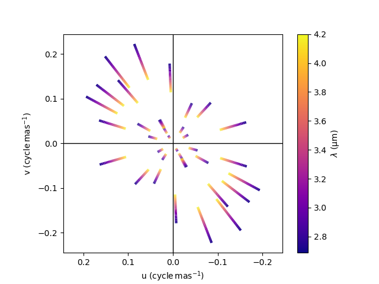
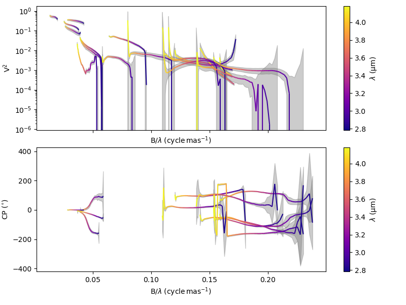
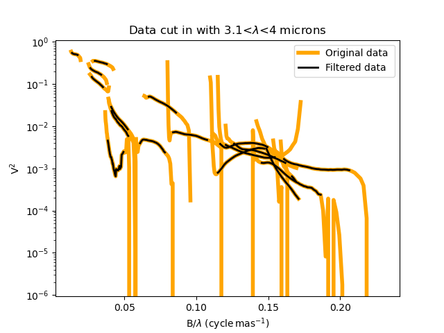
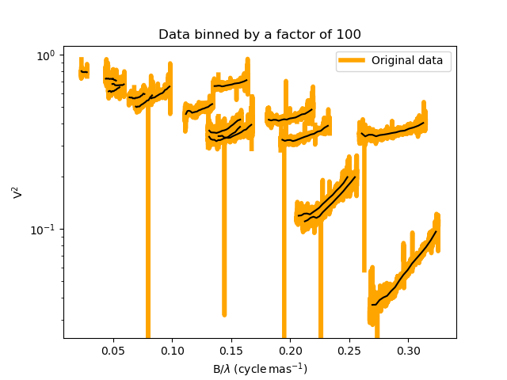
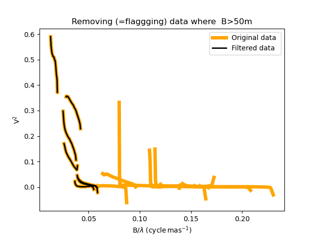
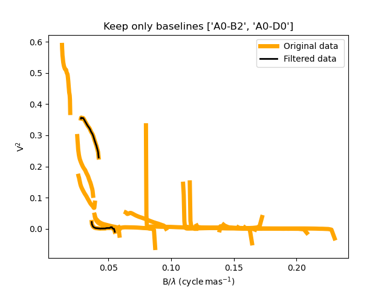
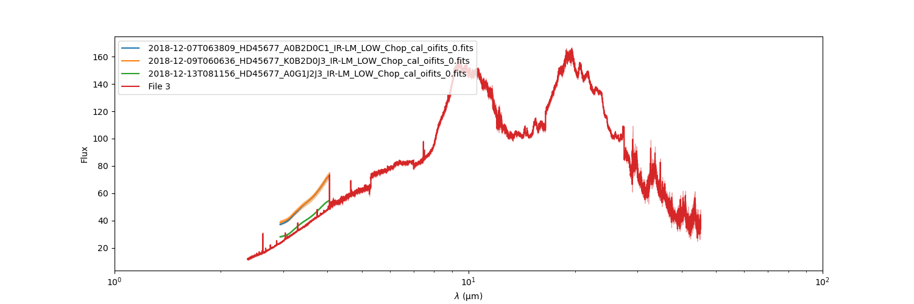

:tocdepth: 2

..  _data:
Loading & manipulating data
===========================

Interferometric data from all modern optical-infrared interferometric instruments are stored in FITS files following the OIFITS2 (Optical Interferometry FITS) standard defined in `Duvert et al. (2017) <https://www.aanda.org/articles/aa/pdf/2017/01/aa26405-15.pdf>`_. 

In oimodeler optical-interferometry data are stored in an :func:`oimData <oimodeler.oimData.oimData>` object. This object uses `astropy.io.fits <https://docs.astropy.org/en/stable/io/fits/index.html>`_ , the  standard  module to 
load, save and manipulated FITS files. 

Non-interferometric photometric or spectroscopic data can be added to an **oimData** object using the **oimFluxData** class.

Finally data can be filtered using the **oimDataFilter** class.

..  _data_oimData:
Interferometric data
--------------------

In **oimodeler**, data are stored in a :func:`oimData <oimodeler.oimData.oimData>` object. Other modules that requires access to data such as the :func:`oimSimulator <oimodeler.oimSimulator.oimSimulator>` and
:func:`oimFitter <oimodeler.oimFitter.oimFitter>` are all working with an instance of :func:`oimData <oimodeler.oimData.oimData>`.

The initialisation method of the :func:`oimData <imodeler.oimData.oimData>` class allows to pass either a filename (in standard string or pathlib.Path), a list of filenames, a hdulist or a list of hdulist.

.. code:: ipython3

    filenames = list(data_dir.glob("*.fits"))
    data = oim.oimData(filenames)
    

Data in astropy format
^^^^^^^^^^^^^^^^^^^^^^

The OIFITS data stored as a list of ``astropy.io.fits.hdulist`` can be accessed using the :func:`oimData.data <oimodeler.oimData.oimData.data>` attribute of the oimData object.

.. code:: ipython3

    data.data

.. parsed-literal::

    [[<astropy.io.fits.hdu.image.PrimaryHDU object at 0x0000017847722D10>, <astropy.io.fits.hdu.table.BinTableHDU object at 0x0000017847677490>, <astropy.io.fits.hdu.table.BinTableHDU object at 0x000001784767F6D0>, <astropy.io.fits.hdu.table.BinTableHDU object at 0x0000017847677DD0>, <astropy.io.fits.hdu.table.BinTableHDU object at 0x0000017847689AD0>, <astropy.io.fits.hdu.table.BinTableHDU object at 0x0000017847697D10>, <astropy.io.fits.hdu.table.BinTableHDU object at 0x0000017847689950>, <astropy.io.fits.hdu.table.BinTableHDU object at 0x0000017847573210>],
     [<astropy.io.fits.hdu.image.PrimaryHDU object at 0x000001784783BCD0>, <astropy.io.fits.hdu.table.BinTableHDU object at 0x0000017847689310>, <astropy.io.fits.hdu.table.BinTableHDU object at 0x000001784755A410>, <astropy.io.fits.hdu.table.BinTableHDU object at 0x0000017847554E10>, <astropy.io.fits.hdu.table.BinTableHDU object at 0x00000178475571D0>, <astropy.io.fits.hdu.table.BinTableHDU object at 0x000001784754BC10>, <astropy.io.fits.hdu.table.BinTableHDU object at 0x00000178475385D0>, <astropy.io.fits.hdu.table.BinTableHDU object at 0x0000017847556690>],
     [<astropy.io.fits.hdu.image.PrimaryHDU object at 0x00000178476BC710>, <astropy.io.fits.hdu.table.BinTableHDU object at 0x000001784752E3D0>, <astropy.io.fits.hdu.table.BinTableHDU object at 0x0000017847522410>, <astropy.io.fits.hdu.table.BinTableHDU object at 0x00000178474B8E10>, <astropy.io.fits.hdu.table.BinTableHDU object at 0x000001784752CE90>, <astropy.io.fits.hdu.table.BinTableHDU object at 0x00000178474C58D0>, <astropy.io.fits.hdu.table.BinTableHDU object at 0x00000178474C4450>, <astropy.io.fits.hdu.table.BinTableHDU object at 0x00000178474D4E10>]]

In this  example, we loaded 3 oifits files so that our data variable is a list of three `hdulist  <https://docs.astropy.org/en/stable/io/fits/api/hdulists.html>`_.

.. code:: ipython3

    len(data.data)
    

.. parsed-literal::

    3

We can have more readable informations calling the :func:`oimData.info <oimodeler.oimData.oimData.info>` method. 

.. code:: ipython3

    data.info()

.. parsed-literal::

    ════════════════════════════════════════════════════════════════════════════════
    file 0: 2018-12-07T063809_HD45677_A0B2D0C1_IR-LM_LOW_Chop_cal_oifits_0.fits
    ────────────────────────────────────────────────────────────────────────────────
    4)	 OI_VIS2 :	 (nB,nλ) = (6, 64) 	 dataTypes = ['VIS2DATA']
    5)	 OI_T3   :	 (nB,nλ) = (4, 64) 	 dataTypes = ['T3PHI']
    6)	 OI_VIS  :	 (nB,nλ) = (6, 64) 	 dataTypes = ['VISAMP', 'VISPHI']
    7)	 OI_FLUX :	 (nB,nλ) = (1, 64) 	 dataTypes = ['FLUXDATA']
    ════════════════════════════════════════════════════════════════════════════════
    file 1: 2018-12-07T063809_HD45677_A0B2D0C1_IR-LM_LOW_Chop_cal_oifits_0.fits
    ────────────────────────────────────────────────────────────────────────────────
    4)	 OI_VIS2 :	 (nB,nλ) = (6, 64) 	 dataTypes = ['VIS2DATA']
    5)	 OI_T3   :	 (nB,nλ) = (4, 64) 	 dataTypes = ['T3PHI']
    6)	 OI_VIS  :	 (nB,nλ) = (6, 64) 	 dataTypes = ['VISAMP', 'VISPHI']
    7)	 OI_FLUX :	 (nB,nλ) = (1, 64) 	 dataTypes = ['FLUXDATA']
    ════════════════════════════════════════════════════════════════════════════════
    file 2: 2018-12-07T063809_HD45677_A0B2D0C1_IR-LM_LOW_Chop_cal_oifits_0.fits
    ────────────────────────────────────────────────────────────────────────────────
    4)	 OI_VIS2 :	 (nB,nλ) = (6, 64) 	 dataTypes = ['VIS2DATA']
    5)	 OI_T3   :	 (nB,nλ) = (4, 64) 	 dataTypes = ['T3PHI']
    6)	 OI_VIS  :	 (nB,nλ) = (6, 64) 	 dataTypes = ['VISAMP', 'VISPHI']
    7)	 OI_FLUX :	 (nB,nλ) = (1, 64) 	 dataTypes = ['FLUXDATA']
    ════════════════════════════════════════════════════════════════════════════════
    
    
In our case the OIFITS files contains the data extension OI_VIS2, OI_VIS, OI_T3 and OI_FLUX.

For each element of the list, we can call the ``info``  method of 
the  `hdulist  <https://docs.astropy.org/en/stable/io/fits/api/hdulists.html>`_. class which  lists all 
extensions and gives some basics infos on what they contain.

.. code:: ipython3

    data.data[0].info()

.. parsed-literal::

    Filename: C:\travail\GitHub\oimodeler\data\FSCMa_MATISSE\2018-12-07T063809_HD45677_A0B2D0C1_IR-LM_LOW_Chop_cal_oifits_0.fits
    No.    Name      Ver    Type      Cards   Dimensions   Format
      0  PRIMARY       1 PrimaryHDU    1330   ()      
      1  OI_TARGET     1 BinTableHDU     60   1R x 18C   [1I, 7A, 1D, 1D, 1E, 1D, 1D, 1D, 8A, 8A, 1D, 1D, 1D, 1D, 1E, 1E, 7A, 3A]   
      2  OI_ARRAY      1 BinTableHDU     35   4R x 7C   [3A, 2A, 1I, 1E, 3D, 1D, 6A]   
      3  OI_WAVELENGTH    1 BinTableHDU     20   64R x 2C   ['1E', '1E']   
      4  OI_VIS2       1 BinTableHDU     41   6R x 10C   ['1I', '1D', '1D', '1D', '64D', '64D', '1D', '1D', '2I', '64L']   
      5  OI_T3         1 BinTableHDU     53   4R x 14C   ['1I', '1D', '1D', '1D', '64D', '64D', '64D', '64D', '1D', '1D', '1D', '1D', '3I', '64L']   
      6  OI_VIS        1 BinTableHDU     49   6R x 12C   ['1I', '1D', '1D', '1D', '64D', '64D', '64D', '64D', '1D', '1D', '2I', '64L']   
      7  OI_FLUX       1 BinTableHDU     37   1R x 8C   ['I', 'D', 'D', 'D', '64D', '64D', 'I', '64L']   
    

If needed, the user can access and modify the data directly. 

For instance the following code double the errors on the VIS2DATA from the last  OIFITS file:

.. code:: ipython3

    data.data[2]["OI_VIS2"].data["VIS2ERR"]*= 2

Optimized data
^^^^^^^^^^^^^^

In order to reduce the computation time when simulating data during model fitting, 
the oim:func:`oimData.data <oimodeler.oimData.oimData>` class also contain the 
data coordinates as single vectors and the logic to pass from optimized data 
(in a  single vector) to unoptimized form (as a list of hdulist) as more complex 
structures (stored as lists of lists) 

The data coordinates are stored in the following vectors: 

- The u-axis of the spatial frequencies ``data.vect_u``
- The v-axis of the spatial frequencies ``data.vect_v``
- The wavelength  ``data.vect_wl``
- The time (as MJD) data ``data.vect_mjd``

Let's print their shape for our example:

.. code:: ipython3

    print(data.vect_u.shape)
    print(data.vect_v.shape)
    print(data.vect_wl.shape)
    print(data.vect_mjd.shape)

.. parsed-literal::

    (5376,)
    (5376,)
    (5376,)
    (5376,)

They contains all the coordinates of all the baselines at all wavelengths plus 
some zeros spatial frequencies data (used to computes flux and normaized visiblity).

On the other hand, to pass from the  optimized data to unoptimized data are stored 
in members called ``struct_XXXX``. For instance, in the followin we print the 
structures containing :

- the number of baselines (including zero-frequency ones)
- the number of wavelengths
- the name of the extension 
- a code specifying which data type to compute: VIS2DATA, T3PHI, VIPHI (asbolute or differential) ...

.. code:: ipython3

    print(data.struct_nB)
    print(data.struct_nwl)
    print(data.struct_arrType)
    print(data.struct_dataType)

.. parsed-literal::

    [[7, 13, 7, 1], [7, 13, 7, 1], [7, 13, 7, 1]]
    [[64, 64, 64, 64], [64, 64, 64, 64], [64, 64, 64, 64]]
    [['OI_VIS2', 'OI_T3', 'OI_VIS', 'OI_FLUX'], ['OI_VIS2', 'OI_T3', 'OI_VIS', 'OI_FLUX'], 
    ['OI_VIS2', 'OI_T3', 'OI_VIS', 'OI_FLUX']]
    [[<oimDataType.VIS2DATA: 1>, <oimDataType.T3PHI: 128>, <oimDataType.VISAMP_ABS|VISPHI_DIF: 34>, <oimDataType.FLUXDATA: 256>],
    [<oimDataType.VIS2DATA: 1>, <oimDataType.T3PHI: 128>, <oimDataType.VISAMP_ABS|VISPHI_DIF: 34>, <oimDataType.FLUXDATA: 256>],
    [<oimDataType.VIS2DATA: 1>, <oimDataType.T3PHI: 128>, <oimDataType.VISAMP_ABS|VISPHI_DIF: 34>, <oimDataType.FLUXDATA: 256>]]

.. note::
    The step of creating the optimized vectors and structures is done automatically 
    when creating or updating an oimData object. However if you modify the data 
    manually as shown above, you should call the 
    :func:`oimData.prepareData <oimodeler.oimData.oimData.prepareData>` method. 
    

The oimData object also contains two methods to plot : 

- :func:`oimData.uvplot <oimodeler.oimData.oimData.uvplot>`: the (u,v) plan coverage

- :func:`oimData.plot <oimodeler.oimData.oimData.plot>`:   any data type (VIS2DATA, VISPHI ...)
 as a function of the spatial frequency, baseline length, position angle, or wavelength.

.. code:: ipython3
    figuv, axuv = data.uvplot(color="byConfiguration")

    figdata,axdata = data.plot("SPAFREQ",["VIS2DATA","T3PHI"],cname="EFF_WAVE",
                               cunit="micron",errorbar=True,xunit="cycle/mas")
    axdata[0].set_yscale("log")

  

  
  
These pltting methods are based on the :func:`uvplot <oimodeler.oimPlots.oimAxes.uvplot>`
 and :func:`oiplot <oimodeler.oimPlots.oimAxes.oiplot>`  methods of the 
 :func:`omiAxes <oimodeler.oimPlots.oimAxes>` class. See the 
 :ref:`plotting section <plot>` for details and option in plotting oifits data with oimodeler.

..  _data_oimDataFilter:
Data Filtering
--------------

Data filtering can be performed on :func:`oimData <oimodeler.oimData.oimData>` 
instances using the many filters that derived from the abstract 
:func:`oimDataFilterComponent <oimodeler.oimDataFilter.oimDataFilterComponent>`

The available data filters
^^^^^^^^^^^^^^^^^^^^^^^^^^^

Here is the compherensive list of filters  implemented in **oimodeler**

.. csv-table:: Available filter components
   :file: table_dataFilter.csv
   :header-rows: 1  
   :delim: |
   :widths: auto
   
Applying filters to oimData
^^^^^^^^^^^^^^^^^^^^^^^^^^^
   
We first need to create a filter using one of the above function. For instance,
here we a simple filter to remove the edge of our MATISSE data with
the :func:`oimWavelengthRangeFilter <oimodeler.oimDataFilter.oimWavelengthRangeFilter>`.
class. 

.. code-block:: python 
    
    filt_wl = oim.oimWavelengthRangeFilter(wlRange=[3.1e-6, 4e-6])
  

The :func:`oimWavelengthRangeFilter <oimodeler.oimDataFilter.oimWavelengthRangeFilter>`
has two keywords:

- ``targets``: Which is common to all filter components: It specifies the targeted
  files within the data structure to which the filter applies. Possible values are: 
  - ``"all"`` for all files (which we use in this example).
  - A single file specify by its index.
  - Or a list of indexes.

- ``wlRange``: The wavelength range to cut as a two elements list
  (min wavelength and max wavelength), or a list of multiple two-elements lists
  if you want to cut multiple wavelengths ranges simultaneously. In our example
  you have selected wavelength between 3 and 4 microns. Wavelengths outside this
  range will be removed from the data.
    

We then apply the filter using th :func:`oimData.setFilter <oimodeler.oimData.setFilter>` method

.. code-block:: python 

    data.setFilter(filt_wl)
    
After applying a filter on an :func:`oimData <oimodeler.oimData.oimData>` instance, 
this object will contain both the filtered and unfiltered data as two private members:

- :func:`oimData._data <oimodeler.oimData.oimData._data>`: the unfiltered data
- :func:`oimData._filteredData <oimodeler.oimData.oimData._filteredData>`: the filtered data

:func:`oimData.data <oimodeler.oimData.oimData.data>` will be point toward the filtered
 data unless the member :func:`oimData.data <oimodeler.oimData.oimData>.data`

We can temporary remove the filter by setting the 
:func:`oimData.useFilter <oimodeler.oimData.oimData.useFilter>` member to **False**

.. code-block:: python 

   data.useFilter = False
   
or we can remove the filter once and for all using the the 
:func:`oimData.setFilter <oimodeler.oimData.oimData.setFilter>` method without argument.

.. code-block:: python 

   data.setFilter()
   
Finally let's plot the square visibility as the function of the spatial frequency for :

- the unfiltered data in light grey.
- the filtered data with a colorscale based on the wavlelength (in μm)

To plot the unfiltered data without removing the filter we can use the ``removeFilter=True``
 option of the :func:`oimData.plot <oimodeler.oimData.oimData.plot>` method.

.. code-block:: python 

    figcut,axcut = data.plot("SPAFREQ","VIS2DATA",yscale="log",xunit="cycle/mas",removeFilter=True,
                              label="Original data",color="orange",lw=4)
    data.plot("SPAFREQ","VIS2DATA",axe=axcut,xunit="cycle/mas",label="Filtered data",color="k",lw=2)
    axcut.legend()
    axcut.set_title("Data cut in with 3.1<$\lambda$<4 microns")
    
    

  

A Few examples of filters
^^^^^^^^^^^^^^^^^^^^^^^^^

Spectral binning
""""""""""""""""

Spectral binning can be applied easily using the 
:func:`oimWavelengthBinningFilter <oimodeler.oimDataFilter.oimWavelengthBinningFilter>` 
class. This might be useful to enhance the SNR on some noisy data or to reduce the
 number data points in order to gain computing-time for model fitting.

Here we are binning some HIGH resolution YSO data from GRAVITY by a factor 100
 and plotting the raw and binned data.

.. code-block:: python 

    dir0 = Path(__file__).resolve().parents[2] / "data" / "RealData" / "GRAVITY" / "HD58647"
    filenames = list(dir0.glob("*.fits"))
    data = oim.oimData(filenames)

    filt_bin=oim.oimWavelengthBinningFilter(bin=100,normalizeError=False)
    data.setFilter(filt_bin)

    figbin,axbin = data.plot("SPAFREQ","VIS2DATA",yscale="log",xunit="cycle/mas",removeFilter=True,
                             label="Original data",color="orange",lw=4)
    data.plot("SPAFREQ","VIS2DATA",axe=axbin,xunit="cycle/mas",label="Filtered data",color="k",lw=2)
    axbin.legend()
    axbin.set_title("Data binned by a factor of 100")

  
  
Flagging with expressions 
"""""""""""""""""""""""""

The :func:`oimFlagWithExpressionFilter <oimodeler.oimDataFilter.oimFlagWithExpressionFilter>`
 class can be used to remove data based on an expression based on standard OIFITS2 
 keywords (e.g. VIS2DATA, VIS2ERR, EFF_WAVE, UCOORD, MJD ...) and a few additionnal 
 quantities computed by oimodeler such as the baseline length (LENGTH) or orientation (PA).

.. note::
    In the OIFITS2 format, all data extensions (OI_VIS2, OI_VIS, OI_T3, and OI_FLUX) contain
    a boolean column **FLAG** used to flag bad data. The flagged data are not used in 
    **oimodeler** when computing :math:`chi^2`.
    
Typical use of the class 
:func:`oimFlagWithExpressionFilter <oimodeler.oimDataFilter.oimFlagWithExpressionFilter>` are :

- flagging baselines based on length or orientation to perform specific model-fitting
- flagging data based on relative errors

For instance in the following we flag data with baselines longer than 50m for the MATISSE.
 This can be useful to determine the caracterist size of object using simple models such 
 as Gaussian or uniform disk and avoid being biased by longer baselines than would contain 
 information on smaller structures.

.. code-block:: python 

    path = Path(__file__).parent.parent.parent
    dir0 = path / "data"  / "RealData" / "MATISSE"/ "FSCMa"
    filenames = list(data_dir.glob("*.fits"))
    data = oim.oimData(filenames)

    filt_length=oim.oimFlagWithExpressionFilter(expr="LENGTH>50")
    data.setFilter(filt_length)

    figflag,axflag = data.plot("SPAFREQ","VIS2DATA",xunit="cycle/mas",removeFilter=True,
                                color="orange",label="Original data",lw=5)
    data.plot("SPAFREQ","VIS2DATA",axe=axflag,xunit="cycle/mas",label="Filtered data",color="k",lw=2)
    axflag.legend()
    axflag.set_title("Removing (=flaggging) data where  B>50m")
    

    

  
  
Selection by baseline name(s)
"""""""""""""""""""""""""""""

The :func:`oimKeepBaselinesFilter <oimodeler.oimDataFilter.oimKeepBaselinesFilter>`
class can be used to select data by baseline name. For instance in the following we 
keep the data for the MATISSE data for the A0-B2 and A0-D0 baselines. Other data are 
flagged and ths will not be used for chi2 computation and model fitting.
 This can be useful to determine the caracterist size of object using simple models such 
 as Gaussian or uniform disk and avoid being biased by longer baselines than would contain 
 information on smaller structures.

.. code-block:: python 

    path = Path(__file__).parent.parent.parent
    dir0 = path / "data"  / "RealData" / "MATISSE"/ "FSCMa"
    filenames = list(dir0.glob("*.fits"))
    data = oim.oimData(filenames)

    baselines=["A0-B2","A0-D0"]
    filt_baselines=oim.oimKeepBaselinesFilter(baselines=baselines,arr="OI_VIS2")
    data.setFilter(filt_baselines)
    figflag,axflag = data.plot("SPAFREQ","VIS2DATA",xunit="cycle/mas",removeFilter=True,
                               color="orange",label="Original data",lw=5)
    data.plot("SPAFREQ","VIS2DATA",axe=axflag,xunit="cycle/mas",
              label="Filtered data",color="k",lw=2)
    axflag.legend()
    axflag.set_title(f"Keep only baselines {baselines}")

  
  
..  _data_oimFluxData:
Photometric and spectroscopic data
----------------------------------

The `OIFITS2 <https://www.aanda.org/articles/aa/pdf/2017/01/aa26405-15.pdf>`_ format 
allow to use flux or spectrum measurements using the OI_FLUX extension.  
The :func:`oimFluxdata <oimodeler.oimFluxdata.oimFluxdata>` class allows to convert flux 
or spectroscopic measurement into and OIFITS file containing the OI_FLUX and extension as 
well as the compulsory OI_WAVELENGTH, OI_TARGET and OI_ARRAY extensions.

To build some flux data you need to provide the :func:`oimFluxdata <oimodeler.oimFluxdata.oimFluxdata>`  with:

- ``oitarget``: a OI_TARGET extension with the proper target name (can be copied from a OIFITS file)
- ``wl`` : the spectral channel central wavelengths for your flux/spectrum (unit in meter).
- ``dwl``: the spectral channels width (can be put to some dummy values)
- ``flx``: the fluxes measurements. 
- ``flxerr``: the uncertainties on the fluxes measurements.

.. warnings::

    **oimodeler** is currently blind to flux unit. The users must assure that all data and model 
    components have the same unit.

Let's assume that we have a 3 columns ascii files (named `iso_spectrum_fname`) for a ISO spectrum with:
- the wavelengths in microns
- the flux in Jansky, 
- and the uncertainties on the fluxes in Jansky.

The following code allows to load the ascii file, using 
`astropy.io.ascii  <https://docs.astropy.org/en/stable/io/ascii/index.html>`_  
module, create a :func:`oimFluxdata <oimodeler.oimFluxdata.oimFluxdata>` object 
and add it to some previously created :func:`oimData <oimodeler.oimData.oimData>` 
object

.. code-block:: ipython3 

    isodata=ascii.read(iso_spectrum_fname)

    wl  = isodata.columns['col1'].data*1e-6 # in m
    dwl = 1e-9 #dwl is currently not used in oimodeler

    flx = isodata.columns['col2'].data      # in Jy
    err_flx = isodata.columns['col3'].data  # in Jy

    oitarget=data.data[0]["OI_TARGET"].copy()

    isoFluxData = oim.oimFluxData(oitarget,wl,dwl,flx,err_flx)
    data.addData(isoFluxData)
    
    
The data can then used as standard OIFITS2 format data in **oimodeler**

We can print the content of the data showing our ISO fluxes added as the third unamed file.

.. code-block:: ipython3 

    data.info()
    
.. parsed-literal::

    ════════════════════════════════════════════════════════════════════════════════
    file 0: 2018-12-07T063809_HD45677_A0B2D0C1_IR-LM_LOW_Chop_cal_oifits_0.fits
    ────────────────────────────────────────────────────────────────────────────────
    4)	 OI_VIS2 :	 (nB,nλ) = (6, 64) 	 dataTypes = ['VIS2DATA']
    5)	 OI_T3   :	 (nB,nλ) = (4, 64) 	 dataTypes = ['T3PHI']
    6)	 OI_VIS  :	 (nB,nλ) = (6, 64) 	 dataTypes = ['VISAMP', 'VISPHI']
    7)	 OI_FLUX :	 (nB,nλ) = (1, 64) 	 dataTypes = ['FLUXDATA']
    ════════════════════════════════════════════════════════════════════════════════
    file 1: 2018-12-09T060636_HD45677_K0B2D0J3_IR-LM_LOW_Chop_cal_oifits_0.fits
    ────────────────────────────────────────────────────────────────────────────────
    4)	 OI_VIS2 :	 (nB,nλ) = (6, 64) 	 dataTypes = ['VIS2DATA']
    5)	 OI_T3   :	 (nB,nλ) = (4, 64) 	 dataTypes = ['T3PHI']
    6)	 OI_VIS  :	 (nB,nλ) = (6, 64) 	 dataTypes = ['VISAMP', 'VISPHI']
    7)	 OI_FLUX :	 (nB,nλ) = (1, 64) 	 dataTypes = ['FLUXDATA']
    ════════════════════════════════════════════════════════════════════════════════
    file 2: 2018-12-13T081156_HD45677_A0G1J2J3_IR-LM_LOW_Chop_cal_oifits_0.fits
    ────────────────────────────────────────────────────────────────────────────────
    4)	 OI_VIS2 :	 (nB,nλ) = (6, 64) 	 dataTypes = ['VIS2DATA']
    5)	 OI_T3   :	 (nB,nλ) = (4, 64) 	 dataTypes = ['T3PHI']
    6)	 OI_VIS  :	 (nB,nλ) = (6, 64) 	 dataTypes = ['VISAMP', 'VISPHI']
    7)	 OI_FLUX :	 (nB,nλ) = (1, 64) 	 dataTypes = ['FLUXDATA']
    ════════════════════════════════════════════════════════════════════════════════
    file 3: 
    ────────────────────────────────────────────────────────────────────────────────
    4)	 OI_FLUX :	 (nB,nλ) = (1, 29510) 	 dataTypes = ['FLUXDATA']
    ════════════════════════════════════════════════════════════════════════════════
   
We can plot the spectrum of the MATISSE and ISO data to compare them (note that they are both in Jansky).
 
.. code-block:: ipython3 

    data.plot("EFF_WAVE","FLUXDATA",color="byFile",xunit="micron",errorbar=True)
   
   

  