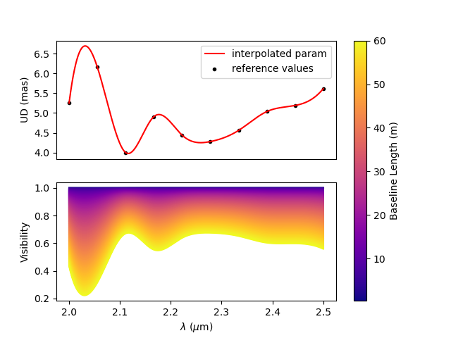

:tocdepth: 2

.. _expanding:
 
Expanding oimodeler
-------------------

In this section we present examples that show how to expand the functionality
of the ``oimodeler`` software by creating customs objects: 
:func:`oimComponents <oimodeler.oimComponent.oimComponent>`,
:func:`oimFilters <oimodeler.oimFilter.oimFilter>`,
:func:`oimFitters <oimodeler.oimFitter.oimFitter>`, and custom plotting
functions or utils.

Creating New Components
~~~~~~~~~~~~~~~~~~~~~~~

Box (Fourier plan formula)
^^^^^^^^^^^^^^^^^^^^^^^^^^

In the `createCustomComponentFourier.py <https://github.com/oimodeler/oimodeler/blob/main/examples/ExpandingSoftware/createCustomComponentFourier.py>`_
example we show how to implement a new model component using a formula in the Fourier plane.
The component will inherit from the  :func:`oimComponentFourier <oim.oimComponent.oimComponentFourier>`
class. The Fourier formula should be implemented as the
:func:`oimComponentFourier._visFunction <oimodeler.oimComponent.oimComponentFourier._visFunction>`
method and, optionally, the formula in the image plan can be implemented using the
:func:`oimComponentFourier._imageFunction <oimodeler.oimComponent.oimComponentFourier._imageFunction>`
method.

For this example we will show how to implement a basic rectangular box component.
We start by importing the required packages:

.. code-block:: python

    from pathlib import Path

    import astropy.units as u
    import matplotlib.pyplot as plt
    import numpy as np
    import oimodeler as oim

Our new component will be named ``oimBox``, and it will have two parameters,
`dx` and `dy` the size of the box in the x and y directions. Let's start to
implement the oimBox class and its ``__init__`` method.

.. code-block:: python

    class oimBox(oim.oimComponentFourier):
        name = "2D Box"
        shortname = "BOX"

        def __init__(self, **kwargs):
            super().__init__(**kwargs)
            self.params["dx"] = oim.oimParam(
                name="dx", value=1, description="Size in x", unit=u.mas)
            self.params["dy"] = oim.oimParam(
                name="dy", value=1, description="Size in y", unit=u.mas)
            self._eval(**kwargs)
         

The class inherits from :func:`oimComponentFourier <oimodeler.oimComponent.oimComponentFourier>`.
The ``__init__`` method is called with the ``**kwargs`` to allow the passing of keyword
arguments. To inherit from the parent class, we first call its
initialization method with ``super().__init__``. Then, we define the two new parameters,
`dx` and `dy`, which are instances of the
:func:`oimParam <oimodeler.oimParam.oimParam>` class. Finally, we need to call the
:func:`oimComponent._eval <oimodeler.oimComponent.oimComponent._eval>` method that allows
the parameters to be processed.

Now that the new class is created, we need to implement its
:func:`oimComponent._visFunction <oimodeler.oimComponent.oimComponentFourier._visFunction>` method,
with the Fourier transform formula of our component. This method is called when using
the :func:`oimComponent.getComplexCoherentFlux <oimodeler.oimComponent.oimComponent.getComplexCoherentFlux>`
method.

Note that the component parameters should be called with (`wl`, `t`), to allow parameter
chromaticity and time dependence. The parameters have a unit. This unit should also be
used to allow the use of other units (via `unit conversion <https://docs.astropy.org/en/stable/units/index.html>`_)
when creating instances of the component.

In our case, the complex visibilty of a rectangle is quite easy to write.
It is a simple 2D-sinc function. Note that the x and y sizes are converted from
the given unit (usually mas) to rad.

.. code-block:: python

    def _visFunction(self, ucoord, vcoord, rho, wl, t):
        x = self.params["dx"](wl, t)*self.params["dx"].unit.to(u.rad)*ucoord
        y = self.params["dy"](wl, t)*self.params["dy"].unit.to(u.rad)*vcoord
        return np.sinc(x)*np.sinc(y)
    

We also need to implement the image that will be created when using the
:func:`oimComponent.getImage <oimodeler.oimComponent.oimComponent.getImage>` method.
If not implemented, the model will use the Fourier based formula to compute the image.
It will also be the case if the keyword ``fromFT`` is set to ``True``, when calling
the :func:`getImage <oimodeler.oimComponent.oimComponent.getImage>` method.
However, it is always interesting to implement the image method, at least for
debugging purposes, to check that the image computed with the image formula and
using the ``fromFT`` option gives compatible results. We will see that a bit later
in an example.

For our box, we can implement the image method with logical operations

.. code-block:: python

    def _imageFunction(self, xx, yy, wl, t):
        return ((np.abs(xx) <= self.params["dx"](wl, t)/2) &
                (np.abs(yy) <= self.params["dy"](wl, t)/2)).astype(float)

The full code of the ``oimBox`` component is quite short.

.. code-block:: python

    class oimBox(oim.oimComponentFourier):
        name = "2D Box"
        shortname = "BOX"

        def __init__(self, **kwargs):
            super().__init__(**kwargs)
            self.params["dx"] = oim.oimParam(
                name="dx", value=1, description="Size in x", unit=u.mas)
            self.params["dy"] = oim.oimParam(
                name="dy", value=1, description="Size in y", unit=u.mas)
            self._eval(**kwargs)

        def _visFunction(self, ucoord, vcoord, rho, wl, t):
            x = self.params["dx"](wl, t)*self.params["dx"].unit.to(u.rad)*ucoord
            y = self.params["dy"](wl, t)*self.params["dy"].unit.to(u.rad)*vcoord
            return np.sinc(x)*np.sinc(y)

        def _imageFunction(self, xx, yy, wl, t):
            return ((np.abs(xx) <= self.params["dx"](wl, t)/2) &
                    (np.abs(yy) <= self.params["dy"](wl, t)/2)).astype(float)

We can now use it as we do with any other ``oimodeler`` component. Let's build our first
model with it.

.. code-block:: python
    
    b1 = oimBox(dx=40, dy=10)
    m1 = oim.oimModel([b1])
    
  
Now we can create images of our model: 

- In the image plane with the ``_imageFunction``.
- In the Fourier plane with the ``_visFunction`` (with the FFT).

Both can be plotted with the :func:`oimModel.showModel <oim.oimModel.oimModel.showModel>`
method. To create the image from the FFT of the visibilty function, we just need to set
the ``fromFT`` keyword to ``True``.

.. code-block:: python

    fig, ax = plt.subplots(1, 2, figsize=(10,5))
    m1.showModel(512, 0.2, axe=ax[0], colorbar=False)
    m1.showModel(512, 0.2, axe=ax[1], fromFT=True, colorbar=False)
    ax[0].set_title("Image with _imageFunction")
    ax[1].set_title("Image with FFT of _visFunction")

.. image:: ../../images/customCompBox1Image.png
  :alt: Alternative text   

Of course, as our ``oimBox`` inherits from the 
:func:`oimComponent <oimodeler.oimComponent.oimComponent>` class,
it has three addtional parameters available: Its position described by `x` and `y`,
and the flux `f`. All components can also be rotated using the position angle `pa`
parameter. Note, that if ``elliptic=True`` is not set at the component creation
as a class variable, the postion angle `pa` parameters (and the `elong` parameter)
are not added to the model.

Let's create a complex model with boxes and uniform disk.

.. code-block:: python

    b2 = oimBox(dx=2, dy=2, x=-20, y=0, f=0.5)
    b3 = oimBox(dx=10, dy=20, x=30, y=10, pa=-40, f=10)
    c = oim.oimUD(d=10, x=30, y=10)
    m2 = oim.oimModel([b1, b2, b3, c])
    m2.showModel(512, 0.2, colorbar=False, figsize=(5, 5))

.. image:: ../../images/customCompBoxesImage.png
  :alt: Alternative text  

  
We could also create a chromatic box component using the
:func:`oimInterpWl <oimodeler.oimParam.oimInterpWl>` class or link parameters with
the :func:`oimParamLinker <oimodeler.oimParam.oimParamLinker>` class.

.. code-block:: python

    b4 = oimBox(dx=oim.oimInterpWl([2e-6, 2.4e-6], [5, 10]), dy=2, x=20, y=0, f=0.5)
    b4.params['dy'] = oim.oimParamLinker(b4.params['dx'], 'mult', 4)
    
    m3 = oim.oimModel([b4])
    m3.showModel(512, 0.2, wl=[2e-6, 2.2e-6, 2.4e-6], colorbar=False, swapAxes=True)

.. image:: ../../images/customCompChromBoxImages.png
  :alt: Alternative text   
    

Let's finish this example by plotting the visibility of such models for a set
of East-West and North-South baselines and wavelengths in the K-band.

.. code-block:: python
     
    nB = 200  # number of baselines
    nwl = 50  # number of walvengths

    # Create some spatial frequencies
    wl = np.linspace(2e-6, 2.5e-6, num=nwl)
    B = np.linspace(1, 100, num=nB)
    Bs = np.tile(B, (nwl, 1)).flatten()
    wls = np.transpose(np.tile(wl, (nB, 1))).flatten()
    spf = Bs/wls
    spf0 = spf*0

    fig, ax=plt.subplots(3, 2, figsize=(10, 7))

    models=[m1, m2, m3]
    names =["1 Box", "Multi Boxes","Chromatic box"]

    for i, m in enumerate(models):
        visWest = np.abs(m.getComplexCoherentFlux(spf, spf0, wls)).reshape(nwl, nB)
        visWest /= np.outer(np.max(visWest, axis=1), np.ones(nB))
        visNorth = np.abs(m.getComplexCoherentFlux(
            spf0, spf, wls)).reshape(nwl, nB)
        visNorth /= np.outer(np.max(visNorth, axis=1), np.ones(nB))

        cb = ax[i, 0].scatter(spf, visWest, c=wls*1e6, s=0.2, cmap="plasma")
        ax[i, 1].scatter(spf, visNorth, c=wls*1e6, s=0.2, cmap="plasma")
        ax[i, 0].set_ylabel(f"Vis. of {names[i]}")

        if i != 2:
            ax[i, 0].get_xaxis().set_visible(False)
            ax[i, 1].get_xaxis().set_visible(False)

        ax[i, 1].get_yaxis().set_visible(False)
            
    ax[2,0].set_xlabel("B/$\\lambda$ (cycles/rad)")
    ax[2,1].set_xlabel("B/$\\lambda$ (cycles/rad)")
    ax[0,0].set_title("East-West baselines")
    ax[0,1].set_title("North-South baselines")
                  

.. image:: ../../images/customCompMultiBoxesVis.png
  :alt: Alternative text   
    
Of course, only the third model is chromatic.

Fast Rotator (External model)
^^^^^^^^^^^^^^^^^^^^^^^^^^^^^

In the `createCustomComponentImageFastRotator.py <https://github.com/oimodeler/oimodeler/blob/main/examples/ExpandingSoftware/createCustomComponentImageFastRotator.py>`_
example, we will create a new component derived from the 
:func:`oimImageComponent <oimodeler.oimImageComponent.oimImageComponent>`, using an
external function that return a chromatic image cube.

The model is a simple implementation of a fast rotating star flattened by
rotation (Roche Model) including gravity darkening (:math:`T_{eff}\propto g_{eff}^\beta`). The emission is a simple blackbody. 

First, let's import a few packages used in this example:

.. code-block:: python

    from pathlib import Path

    import matplotlib.colors as colors
    import matplotlib.cm as cm
    import matplotlib.pyplot as plt
    import numpy as np
    import oimodeler as oim
    from astropy import units as units

Here is the code of the ``fastRotator`` external function that we want to
encapsulate into a :func:`oimComponent <oim.oimComponent.,oimComponent>`
to be used in ``oimodeler``.

.. code-block:: python

    def fastRotator(dim0, size, incl, rot, Tpole, lam, beta=0.25):
        h = 6.63e-34
        c = 3e8
        kb = 1.38e-23

        a = 2./3*(rot)**0.4+1e-9
        K = np.sin(1./3.)*np.pi

        K1 = h*c/kb
        nlam = np.size(lam)
        incl = np.deg2rad(incl)

        x0 = np.linspace(-size, size, num=dim0)
        idx = np.where(np.abs(x0) <= 1.5)
        x = np.take(x0, idx)
        dim = np.size(x)
        unit = np.ones(dim)
        x = np.outer(x, unit)
        x = np.einsum('ij, k->ijk', x, unit)

        y = np.swapaxes(x, 0, 1)
        z = np.swapaxes(x, 0, 2)

        yp = y*np.cos(incl)+z*np.sin(incl)
        zp = y*np.sin(incl)-z*np.cos(incl)

        r = np.sqrt(x**2+yp**2+zp**2)
        theta = np.arccos(zp/r)

        x0 = (1.5*a)**1.5*np.sin(1e-99)
        r0 = a*np.sin(1/3.)*np.arcsin(x0)/(1.0/3.*x0)

        x2 = (1.5*a)**1.5*np.sin(theta)
        rin = a*np.sin(1/3.)*np.arcsin(x2)/(1.0/3.*x2)

        rhoin = rin*np.sin(theta)/a/K
        dr = (rin/r0-r) >= 0
        Teff = Tpole*(np.abs(1-rhoin*a)**beta)

        if nlam == 1:
            flx = 1./(np.exp(K1/(lam*Teff))-1)

            im = np.zeros([dim, dim])

            for iz in range(dim):
                im = im*(im != 0)+(im == 0) * \
                    dr[:, :, iz]*flx[:, :, iz]  # *limb[:,:,iz]

            im = np.rot90(im)

            tot = np.sum(im)
            im = im/tot
            im0 = np.zeros([dim0, dim0])

            im0[dim0//2-dim//2:dim0//2+dim//2, dim0//2-dim//2:dim0//2+dim//2] = im
        else:
            unit = np.zeros(nlam)+1
            dr = np.einsum('ijk, l->ijkl', dr, unit)
            flx = 1./(np.exp(K1/np.einsum('ijk, l->ijkl', Teff, lam))-1)
            im = np.zeros([dim, dim, nlam])

            for iz in range(dim):
                im = im*(im != 0)+dr[:, :, iz, :]*flx[:, :, iz, :]*(im == 0)

            im = np.rot90(im)
            tot = np.sum(im, axis=(0, 1))
            for ilam in range(nlam):
                im[:, :, ilam] = im[:, :, ilam]/tot[ilam]

            im0 = np.zeros([dim0, dim0, nlam])
            im0[dim0//2-dim//2:dim0//2+dim//2, dim0//2-dim//2:dim0//2+dim//2, :] = im
            return im0
    

Now, we will define the new class for the fast rotator model. It will be derived
from the :func:`oimComponentImage <oimodeler.oimComponent.oimComponentImage>` class
as the model is defined in the image plane. We first write the ``__init__`` method
of the new class. It needs to includes all the model parameters. 

.. code-block:: python

    class oimFastRotator(oim.oimComponentImage):
        name = "Fast Rotator"
        shortname = "FRot"

        def __init__(self, **kwargs):
            super(). __init__(**kwargs)

            self.params["incl"] = oim.oimParam(
                name="incl", value=0, description="Inclination angle", unit=units.deg)
            self.params["rot"] = oim.oimParam(
                name="rot", value=0, description="Rotation Rate", unit=units.one)
            self.params["Tpole"] = oim.oimParam(
                name="Tpole", value=20000, description="Polar Temperature", unit=units.K)
            self.params["dpole"] = oim.oimParam(
                name="dplot", value=1, description="Polar diameter", unit=units.mas)
            self.params["beta"] = oim.oimParam(
                name="beta", value=0.25, description="Gravity Darkening Exponent", unit=units.one)

            self._t = np.array([0])
            self._wl = np.linspace(0.5e-6, 15e-6, num=10)
            self._eval(**kwargs)

            
.. note:: 

    Unlike for models defined in the Fourier plane, you need to define the internal
    wavelength ``self._wl`` and time ``self._t`` grids with their respective class
    attributes.

Here, we set the time to a fixed value so that the model will be time independent.
The wavelength dependence of the model
is set to a vector of 10 reference wavelengths between 0.5 and 15 microns. This will be
used to compute reference images and linear interpolation in wavelength will be used on
the Fourier transforms of the images. 

Together with the parameter `dim` (dimension of the image in x and y), the ``self._wl``
and the ``self._t`` set the length dimensions of the internal image hypercube
(4-dimensional: `x`, `y`, `wl`, and `t`). 

Now we can implement the call to the ``fastRotator`` function. As it is an external
function that computes its own spatial and spectral grid we need to implement
it in the :func:`oimComponentImage._internalImage <oimodeler.oimComponent.oimComponentImage>`
method. 

.. code-block:: python

    def _internalImage(self):
        dim = self.params["dim"].value
        incl = self.params["incl"].value
        rot = self.params["rot"].value
        Tpole = self.params["Tpole"].value
        dpole = self.params["dpole"].value
        beta = self.params["beta"].value

        im = fastRotator(dim, 1.5, incl, rot, Tpole, self._wl, beta=beta)
        im = np.tile(np.moveaxis(im, -1, 0)[None, :, :, :], (1, 1, 1, 1))
        self._pixSize = 1.5*dpole/dim*units.mas.to(units.rad)
        return im
        

Here we need to reshape the result of the ``fastRotator`` function to the proper
shape for an internal image of the :func:`oimImageComponent <oimodeler.oimComponent.oimImageComponent>`
class. The ``FastRotator`` returns a 3D image-cube (`x`, `y`, `wl`). We move its axis and
reshape it to a 4D image-hypercube (`t`, `wl`, `x`, `y`). 

Finally, we need to set the pixel size (in rad) using the ``self._pixSize``
private attribute. For our example, we compute a ``fastRotator`` on a grid of
1.5 polar diameter (because the equatorial diameter goes up to 1.5 polar diameter
for a critically rotating star). The pixel size formula depends on the `dpole` and
`dim` parameters. 

Let's build our first model with this brand new component.

.. code-block:: python

    c = oimFastRotator(dpole=5, dim=128, incl=-70, rot=0.99, Tpole=20000, beta=0.25)
    m = oim.oimModel(c)
    

We can now plot the model images at various wavelengths as we do for any other 
:func:`oimModel <oimodeler.oimModel.oimModel>`. 

.. code-block:: python

    m.showModel(512, 0.025, wl=[1e-6, 10e-6 ], legend=True, normalize=True)
    

.. image:: ../../images/customCompImageFastRotator.png
  :alt: Alternative text       

 
Let's create a some spatial frequencies, with some chromaticity.
For that we create baselines in the East-West and North-South orientations.

.. code-block:: python

    nB = 1000
    nwl = 20
    wl = np.linspace(1e-6, 2e-6, num=nwl)

    B = np.linspace(0, 100, num=nB//2)

    # 1st half of B array are baseline in the East-West orientation
    Bx = np.append(B, B*0)
    By = np.append(B*0, B)  # 2nd half are baseline in the North-South orientation

    Bx_arr = np.tile(Bx[None, :], (nwl, 1)).flatten()
    By_arr = np.tile(By[None, :], (nwl,  1)).flatten()
    wl_arr = np.tile(wl[:, None], (1, nB)).flatten()

    spfx_arr = Bx_arr/wl_arr
    spfy_arr = By_arr/wl_arr

We now compute the complex coherent flux and then extract the visiblity from it.
Note that the model is already normalized to one so that we don't need to divide the
complex coherent flux by the zero frequency.

.. code-block:: python

    vc = m.getComplexCoherentFlux(spfx_arr, spfy_arr, wl_arr)
    v = np.abs(vc.reshape(nwl, nB))

Finally, we plot the East-West and North-South visiblity with a colorscale for
the wavelength.

.. code-block:: python

    fig, ax = plt.subplots(1, 2, figsize=(15, 5))
    titles = ["East-West Baselines", "North-South Baselines"]
    for iwl in range(nwl):
        cwl = iwl/(nwl-1)
        ax[0].plot(B/wl[iwl]/units.rad.to(units.mas), v[iwl, :nB//2],
                   color=plt.cm.plasma(cwl))
        ax[1].plot(B/wl[iwl]/units.rad.to(units.mas), v[iwl, nB//2:],
                   color=plt.cm.plasma(cwl))

    for i in range(2):
        ax[i].set_title(titles[i])
        ax[i].set_xlabel("B/$\lambda$ (cycles/rad)")
    ax[0].set_ylabel("Visibility")
    ax[1].get_yaxis().set_visible(False)

    norm = colors.Normalize(vmin=np.min(wl)*1e6, vmax=np.max(wl)*1e6)
    sm = cm.ScalarMappable(cmap=plt.cm.plasma, norm=norm)
    fig.colorbar(sm, ax=ax, label="$\\lambda$ ($\\mu$m)")
 

.. image:: ../../images/customCompImageFastRotatorVis.png
  :alt: Alternative text      
  
  
This new ``oimfastRotator`` component can be rotated and used together with other
:func:`oimComponent <oimodeler.oimComponent.oimComponent>` classes to build more
complex models. 

Here, we add a uniform disk component
:func:`oimUD <oimodeler.oimBasicFourierComponents.oimUD>`:
   
.. code-block:: python

    c.params['f'].value = 0.9
    c.params['pa'].value = 30
    ud = oim.oimUD(d=1, f=0.1, y=10)
    m2 = oim.oimModel(c, ud)
    
And finally, we produce the same plots as before for this new complex model.

.. code-block:: python

    m2.showModel(512, 0.06, wl=[1e-6, 10e-6], legend=True, normalize=True, normPow=0.5,
                 savefig=save_dir / "customCompImageFastRotator2.png")
    vc = m2.getComplexCoherentFlux(spfx_arr, spfy_arr, wl_arr)
    v = np.abs(vc.reshape(nwl, nB))

    fig, ax = plt.subplots(1, 2, figsize=(15, 5))
    titles = ["East-West Baselines", "North-South Baselines"]
    for iwl in range(nwl):
        cwl = iwl/(nwl-1)
        ax[0].plot(B/wl[iwl]/units.rad.to(units.mas), v[iwl, :nB//2],
                   color=plt.cm.plasma(cwl))
        ax[1].plot(B/wl[iwl]/units.rad.to(units.mas), v[iwl, nB//2:],
                   color=plt.cm.plasma(cwl))

    for i in range(2):
        ax[i].set_title(titles[i])
        ax[i].set_xlabel("B/$\lambda$ (cycles/rad)")
    ax[0].set_ylabel("Visibility")
    ax[1].get_yaxis().set_visible(False)

    norm = colors.Normalize(vmin=np.min(wl)*1e6, vmax=np.max(wl)*1e6)
    sm = cm.ScalarMappable(cmap=plt.cm.plasma, norm=norm)
    fig.colorbar(sm, ax=ax, label="$\\lambda$ ($\\mu$m)")
    

.. image:: ../../images/customCompImageFastRotator2.png
  :alt: Alternative text   

  
.. image:: ../../images/customCompImageFastRotatorVis2.png
  :alt: Alternative text   

  
Spiral (Image plan formula)
^^^^^^^^^^^^^^^^^^^^^^^^^^^

In the `createCustomComponentImageSpiral.py <https://github.com/oimodeler/oimodeler/blob/main/examples/ExpandingSoftware/createCustomComponentImageSpiral>`_
example we will create a new component derived from the
:func:`oimImageComponent <oimodeler.oimImageComponent.oimImageComponent>` class,
which describes a logarithmic spiral.

But first let's import a few packages used in this example:

.. code-block:: python

    from pathlib import Path

    import matplotlib.pyplot as plt
    import numpy as np
    import oimodeler as oim
    from astropy import units as units

Now we will define the new class for the spiral model. Again, it will be derived from
the :func:`oimComponentImage <oim.oimComponentImage>` class as the model is defined
in the image plane. We first write the ``__init__`` method of the new class.
It needs to includes all the model's parameters. 

.. code-block:: python

    class oimSpiral(oim.oimComponentImage):
        name = "Spiral component"
        shorname = "Sp"
        elliptic = True

        def __init__(self, **kwargs):
            super(). __init__(**kwargs)
            self.params["fwhm"] = oim.oimParam(**oim._standardParameters["fwhm"])
            self.params["P"] = oim.oimParam(name="P",
                                            value=1, description="Period in mas", unit=units.mas)
            self.params["width"] = oim.oimParam(name="width",
                                                value=0.01, description="Width as filling factor", unit=units.one)

            self._pixSize = 0.05*units.mas.to(units.rad)
            self._t = np.array([0])  # constant value <=> static model
            self._wl = np.array([0])  # constant value <=> achromatic model
            self._eval(**kwargs)

Here we chose to fix the pixel size in the ``__init__`` method. As we don't
intend to have chromaticity, we fixed the internal time and wavelength arrays.

Unlike in the previous example, as we don't use an externally computed image,
so we can implement the :func:`oimComponentImage._imageFunction <oimodeler.oimComponent.oimComponentImage._imageFunction>`
of the class instead of the 
:func:`oimComponentImage._internaImage <oimodeler.oimComponent.oimComponentImage._internalImage>`
one.

The main difference is that the 
:func:`oimComponentImage._imageFunction <oimodeler.oimComponent.oimComponentImage._imageFunction>`
directly provides the 4D-grid in time, wavelength and x and y.

.. code-block:: python

    def _imageFunction(self, xx, yy, wl, t):
        # As xx and yy are transformed coordinates, r and phi takes into account
        # the ellipticity and orientation using the pa and elong keywords
        r = np.sqrt(xx**2+yy**2)
        phi = np.arctan2(yy, xx)

        p = self.params["P"](wl, t)
        sig = self.params["fwhm"](wl, t)/2.35
        w = self.params["width"](wl, t)

        im = 1 + np.cos(-phi-2*np.pi*np.log(r/p+1))
        im = (im < 2*w)*np.exp(-r**2/(2*sig**2))
        return im
        

.. note::
    As `xx` and `yy` are transformed coordinates, `r` and `phi` takes into account
    the ellipticity and orientation using the `pa` and `elong` keywords.

    
We create a model consisting of two components: The newly defined
``oimSpiral`` class and a uniform disk (:func:`oimUD <oim.oimBasicFourierComponents,oimUD>`).

.. code-block:: python

    ud = oim.oimUD(d=2, f=0.2)
    c = oimSpiral(dim=256, fwhm=5, P=0.1, width=0.2, pa=30, elong=2, x=10, f=0.8) 
    m = oim.oimModel(c, ud)

    
Then, we plot the image of the model (using the direct image formula and going back
and forth to and from the Fourier plane).

.. code-block:: python

    fig, ax = plt.subplots(1, 2, figsize=(10, 5))
    m.showModel(256, 0.1, swapAxes=True, fromFT=False,
                normPow=1, axe=ax[0], colorbar=False)
    m.showModel(256, 0.1, swapAxes=True, fromFT=True,
                normPow=1, axe=ax[1], colorbar=False)
    ax[1].get_yaxis().set_visible(False)
    ax[0].set_title("Direct Image")
    ax[1].set_title("From FFT")

.. image:: ../../images/customCompImageSpiral.png
  :alt: Alternative text  

And finally, the visibility from the models for a fixed wavelength and a series
of baselines in two perpendicular orientations.

.. code-block:: python

    nB = 5000
    nwl = 1
    wl = 0.5e-6

    B = np.linspace(0, 100, num=nB//2)
    Bx = np.append(B, B*0)
    By = np.append(B*0, B)

    spfx = Bx/wl
    spfy = By/wl

    vc = m.getComplexCoherentFlux(spfx, spfy)
    v = np.abs(vc/vc[0])

    fig, ax = plt.subplots(1, 1)
    label = ["East-West Baselines",]

    ax.plot(B/wl/units.rad.to(units.mas),
            v[:nB//2], color="r", label="East-West Baselines")
    ax.plot(B/wl/units.rad.to(units.mas),
            v[nB//2:], color="b", label="North-South Baselines")

    ax.set_xlabel("B/$\lambda$ (cycles/mas)")
    ax.set_ylabel("Visibility")
    ax.legend()

.. image:: ../../images/customCompImageSpiralVis.png
  :alt: Alternative text  

Exp. Ring (Radial profile)
^^^^^^^^^^^^^^^^^^^^^^^^^^

.. note::
    Examples will be added when the ``oimComponentRadialProfile`` is implemented.

    
..  _create_interp:
  
Creating New Interpolators
~~~~~~~~~~~~~~~~~~~~~~~~~~

In the `createCustomParamInterpolator.py <https://github.com/oimodeler/oimodeler/blob/main/examples/ExpandingSoftware/createCustomParamInterpolator.py>`_
example we will create a new parameter interpolator derived from the 
:func:`oimParaminterpolator <oimodeler.oimParam.oimParamInterpolator>` class.
The new class will allow chromatic interpolation with a vector of evenly spaced values
in a range of wavelengths.

First we load some useful package and also set the `random seed <https://numpy.org/doc/stable/reference/random/generated/numpy.random.seed.html>`_
to a fixed value as we will use it to initalize our vector.

.. code-block:: python

    from pathlib import Path
    from pprint import pprint

    import matplotlib.colors as colors
    import matplotlib.cm as cm
    import matplotlib.pyplot as plt
    import numpy as np
    import oimodeler as oim
    from scipy.interpolate import interp1d

    np.random.seed(1)

As for the components, we derive our interpolator from a base class, this time
:func:`oimParamInterpolator <oimodeler.oimParam.oimParamInterpolator>`.
We need to implement the, for this class unique :func:`oimParamInterpolator._init <oim.oimParam.oimParamInterpolator._init>`
method that will be called by the ``__init__`` method of the base class.
This method should contain information on the interpolator parameters.

.. code-block:: python
    
    class oimParamLinearRangeWl(oim.oimParamInterpolator):
        def _init(self, param, wl0=2e-6, dwl=1e-9, values=[], kind="linear", **kwargs):

            self.kind = kind

            n = len(values)
            self.wl0 = (oim.oimParam(**oim._standardParameters["wl"]))
            self.wl0.name = "wl0"
            self.wl0.description = "Initial wl of the range"
            self.wl0.value = wl0
            self.wl0.free = False

            self.dwl = (oim.oimParam(**oim._standardParameters["wl"]))
            self.dwl.name = "dwl"
            self.dwl.description = "wl step in range"
            self.dwl.value = dwl
            self.dwl.free = False

            self.values = []

            for i in range(n):
                self.values.append(oim.oimParam(name=param.name, value=values[i],
                                                mini=param.min, maxi=param.max,
                                                description=param.description,
                                                unit=param.unit, free=param.free,
                                                error=param.error))

                                        
The first argument of the class, ``param`` is the
:func:`oimParam <oim.oimParam.oimParam>` on which the new interpolator will be
built.

The next arguments are the interpolator parameters, here :

- The initial wavelength of the range ``wl0``
- The wavelength step in the range of interpolation : ``dwl``
- The values at the reference wavelength : ``values``
- The method for interpolation (from scipy interp1d) ``kind``

The ``**kwargs`` is added for backward-compatibility.

The parameters ``wl0``, ``dwl`` are created from the ``_standardParameters["wl"]``
dictionary (contained in the :mod:`oimParam <oimodeler.oimParam>` module) for the
wavelength.
Their name, descriptions, and value are updated, and they are set as fixed parameter
by default (``free=False``). 

The values vector of parameters is created from the input parameter ``param``.
For each parameter in the vector the value is set to the proper one given as input
parameter.

The second method to implement is the
:func:`oimParamInterpolator._interpFunction <oimodeler.oimParam.oimParamInterpolator._interpFunction>`
which is the core function of the interpolation. It has two input parameters: The
wavelength `wl` and the time `t` for which the parameter shoud be interpolated.
As our interoplator is not time dependent, we can ignore `t`. 

.. code-block:: python

    def _interpFunction(self, wl, t):
        vals = np.array([vi.value for vi in self.values])
        nwl = vals.size
        wl0 = np.linspace(self.wl0.value, self.wl0.value +
                          self.dwl.value*nwl, num=nwl)
        return interp1d(wl0, vals, kind=self.kind, fill_value="extrapolate")(wl)

In this method we:

- Create a numpy array from the values of the ``self.values`` vector
  from the :func:`oimParam <oimodeler.oimParam.oimParam>` class.
- A second numpy array for the regular grid of walvengths  from the ``self.wl0``
  and ``self.dwl`` parameters.
- Interpolate the values at `wl` using the scipy interp1d function.
- Return the resulting interpolated values of the parameter.

For model-fitting purposes, we also need to tell ``oimodeler`` what
are the parameters of our interpolator. This is done by implementing
the :func:`oimParamInterpolator._getParams <oimodeler.oimParams.oimParamInterpolator._getParams>`
method. This method is called by a property ``params`` of
the base class :func:`oimParamInterpolator <oim.oimParam.oimParamInterpolator>`.

.. code-block:: python

    def _getParams(self):
        params = []
        params.extend(self.values)
        params.append(self.wl0)
        params.append(self.dwl)
        return params

This method simply returns the list of the interpolator parameters.
Here, the list of the reference values ``self.values``, the initial wavelength ``self.wl0`` and the wavelength step ``self.dwl``. We omit the ``kind`` parameter as we consider it more as an option than a real parameter.

Finally, if we want to use our interpolator using the 
:func:`oimInterp <oim.oimParam.oimInterp>` macro, we need to reference it
in the ``_interpolator`` dictionary contained in the :mod:`oimParam <oim.oimParam>`
module.

.. code-block:: python

    oim._interpolator["rangeWl"] = oimParamLinearRangeWl

Now, we can use our new interpolator to build a component and a model.
Let's build a chromatic uniform disk with 10 reference wavelengths between
2 and 2.5 microns. For the example, we will fill the ``values`` vector with
random diameters from 4 to 7 mas. 

.. code-block:: python

    nref = 10
    c = oim.oimUD(d=oim.oimInterp('rangeWl', wl0=2e-6, kind="cubic",
                                  dwl=5e-8, values=np.random.rand(nref)*3+4))
    m = oim.oimModel(c)

We can print the parameters of our model:

.. code-block:: python

    pprint(m.getParameters())
    

.. code-block::

    ... {'c1_UD_x': oimParam at 0x17829999e80 : x=0 ± 0 mas range=[-inf,inf] free=False ,
         'c1_UD_y': oimParam at 0x17829999fd0 : y=0 ± 0 mas range=[-inf,inf] free=False ,
         'c1_UD_f': oimParam at 0x17829999f40 : f=1 ± 0  range=[-inf,inf] free=True ,
         'c1_UD_d_interp1': oimParam at 0x178253c9250 : d=5.251066014107722 ± 0 mas range=[-inf,inf] free=True ,
         'c1_UD_d_interp2': oimParam at 0x178253c9280 : d=6.160973480326474 ± 0 mas range=[-inf,inf] free=True ,
         'c1_UD_d_interp3': oimParam at 0x178253c92b0 : d=4.000343124452034 ± 0 mas range=[-inf,inf] free=True ,
         'c1_UD_d_interp4': oimParam at 0x178253c92e0 : d=4.9069977178955195 ± 0 mas range=[-inf,inf] free=True ,
         'c1_UD_d_interp5': oimParam at 0x178253c9310 : d=4.4402676724513395 ± 0 mas range=[-inf,inf] free=True ,
         'c1_UD_d_interp6': oimParam at 0x178253c9340 : d=4.277015784306394 ± 0 mas range=[-inf,inf] free=True ,
         'c1_UD_d_interp7': oimParam at 0x178253c9370 : d=4.558780634133012 ± 0 mas range=[-inf,inf] free=True ,
         'c1_UD_d_interp8': oimParam at 0x178253c93a0 : d=5.036682181129143 ± 0 mas range=[-inf,inf] free=True ,
         'c1_UD_d_interp9': oimParam at 0x178253c93d0 : d=5.19030242269201 ± 0 mas range=[-inf,inf] free=True ,
         'c1_UD_d_interp10': oimParam at 0x178253c9400 : d=5.616450202010071 ± 0 mas range=[-inf,inf] free=True ,
         'c1_UD_d_interp11': oimParam at 0x178253c9220 : wl0=2e-06 ± 0 m range=[0,inf] free=False ,
         'c1_UD_d_interp12': oimParam at 0x178253b5df0 : dwl=5e-08 ± 0 m range=[0,inf] free=False }

The interpolator replaced the single :func:`oimParam <oimodeler.oimParam.oimParam>`
for the diameter `c1_UD_d` by 12 :func:`oimParam <oimodeler.oimParam.oimParam>`:
10 for the reference values of the diameter (filled by random in our initialization),
one for the initial wavelength ``wl0`` and another for the wavèlength step ``dwl``.

We can also get the free parameters:

.. code-block:: python

    pprint(m.getFreeParameters())
    

.. code-block::

    ... {'c1_UD_f': oimParam at 0x17829999f40 : f=1 ± 0  range=[-inf,inf] free=True ,
         'c1_UD_d_interp1': oimParam at 0x178253c9250 : d=5.251066014107722 ± 0 mas range=[-inf,inf] free=True ,
         'c1_UD_d_interp2': oimParam at 0x178253c9280 : d=6.160973480326474 ± 0 mas range=[-inf,inf] free=True ,
         'c1_UD_d_interp3': oimParam at 0x178253c92b0 : d=4.000343124452034 ± 0 mas range=[-inf,inf] free=True ,
         'c1_UD_d_interp4': oimParam at 0x178253c92e0 : d=4.9069977178955195 ± 0 mas range=[-inf,inf] free=True ,
         'c1_UD_d_interp5': oimParam at 0x178253c9310 : d=4.4402676724513395 ± 0 mas range=[-inf,inf] free=True ,
         'c1_UD_d_interp6': oimParam at 0x178253c9340 : d=4.277015784306394 ± 0 mas range=[-inf,inf] free=True ,
         'c1_UD_d_interp7': oimParam at 0x178253c9370 : d=4.558780634133012 ± 0 mas range=[-inf,inf] free=True ,
         'c1_UD_d_interp8': oimParam at 0x178253c93a0 : d=5.036682181129143 ± 0 mas range=[-inf,inf] free=True ,
         'c1_UD_d_interp9': oimParam at 0x178253c93d0 : d=5.19030242269201 ± 0 mas range=[-inf,inf] free=True ,
         'c1_UD_d_interp10': oimParam at 0x178253c9400 : d=5.616450202010071 ± 0 mas range=[-inf,inf] free=True }

Here the ``x`` and ``y`` parameters are removed as they are fixed by default,
as well as ``wl0`` and ``dwl``.

Let's plot the interpolated values of the parameters in the 2-2.5 micron range with
1000 values as well as the corresponding visibility for 200 East-West baselines ranging
from 0 to 60m.

First, we create the wavelength vector and the spatial frequencies and wavelength arrays.

.. code-block:: python

    nB = 200
    B = np.linspace(0, 60, num=nB)
    nwl = 1000
    wl = np.linspace(2.0e-6, 2.5e-6, num=nwl)
    Bx_arr = np.tile(B[None, :], (nwl, 1)).flatten()
    wl_arr = np.tile(wl[:, None], (1, nB)).flatten()
    spfx_arr = Bx_arr/wl_arr
    spfy_arr = spfx_arr*0
    

Finally, we compute the visibilty using the
:func:`oimModel.getComplexCoherentFlux <oimodeler.oimModel.getComplexCoherentFlux>` method
and plot everything together.

.. code-block:: python
 
    v = np.abs(m.getComplexCoherentFlux(spfx_arr, spfy_arr, wl_arr).reshape(nwl, nB))

    fig, ax = plt.subplots(2, 1)
    ax[0].plot(wl*1e6, c.params['d'](wl, 0), color="r", label="interpolated param")
    ax[0].scatter(wl0*1e6, vals, marker=".", color="k", label="reference values")
    ax[0].set_ylabel("UD (mas)")
    ax[0].get_xaxis().set_visible(False)
    ax[0].legend()

    for iB in range(1,nB):
        ax[1].plot(wl*1e6, v[:, iB]/v[:, 0], color=plt.cm.plasma(iB/(nB-1)))
       
    ax[1].set_xlabel("$\lambda$ ($\mu$m)")   
    ax[1].set_ylabel("Visibility")

    norm = colors.Normalize(vmin=np.min(B[1:]), vmax=np.max(B))
    sm = cm.ScalarMappable(cmap=plt.cm.plasma, norm=norm)
    fig.colorbar(sm, ax=ax, label="Baseline Length (m)")

