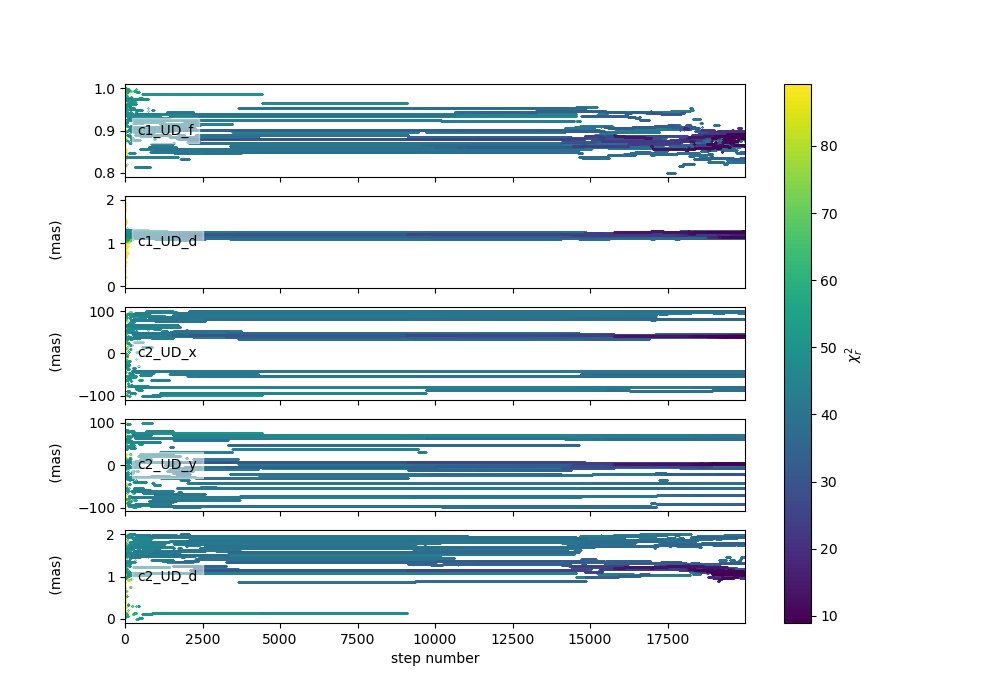
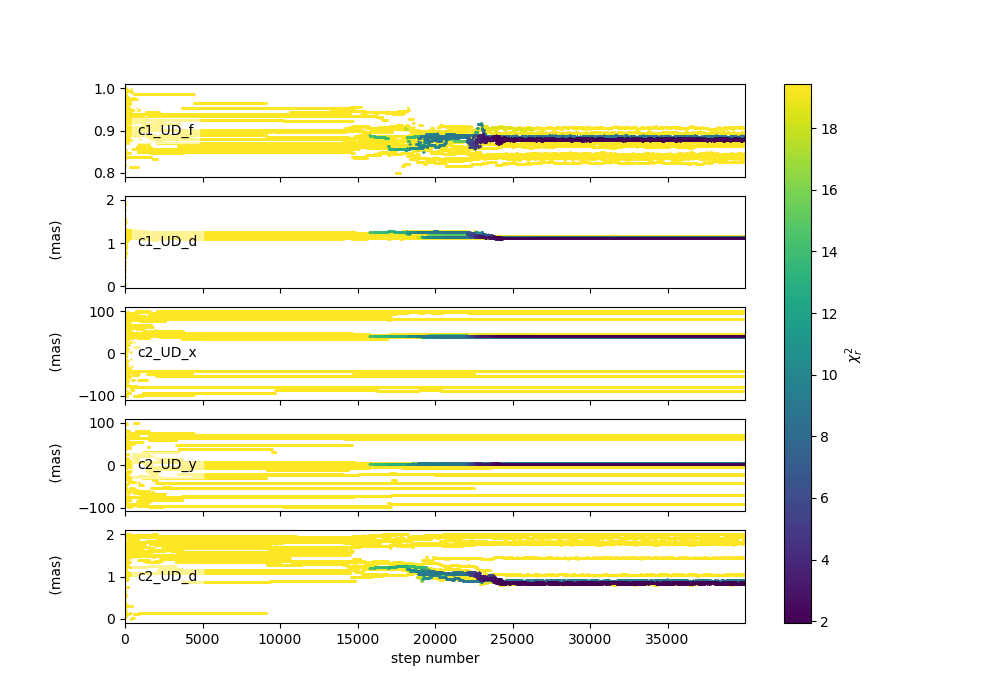
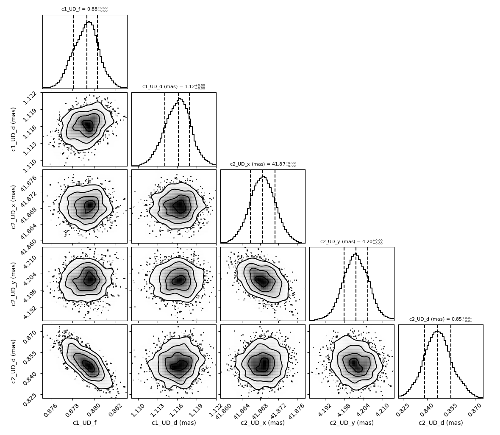
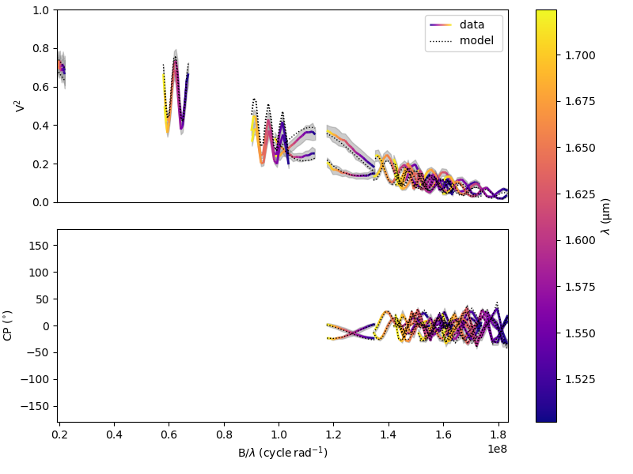
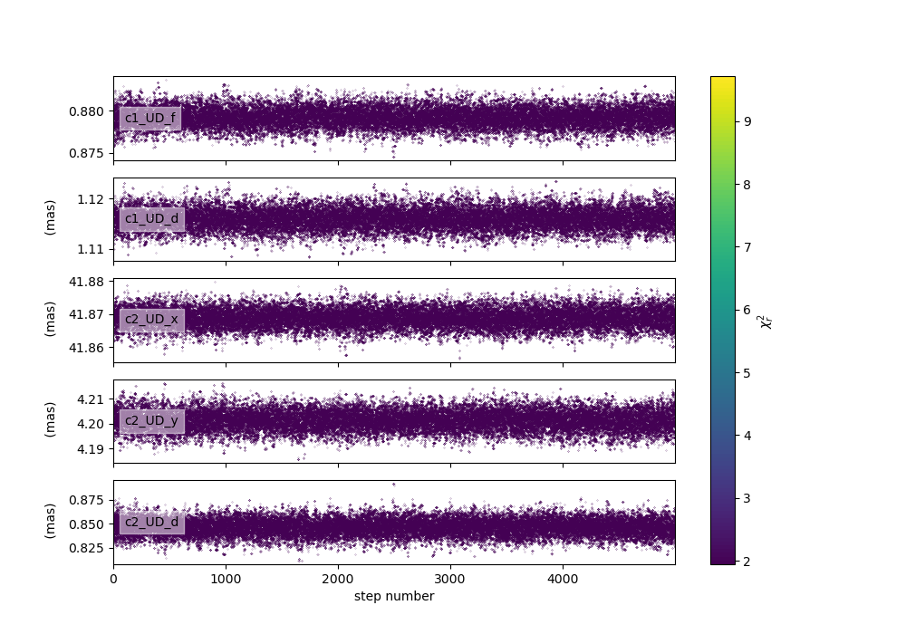
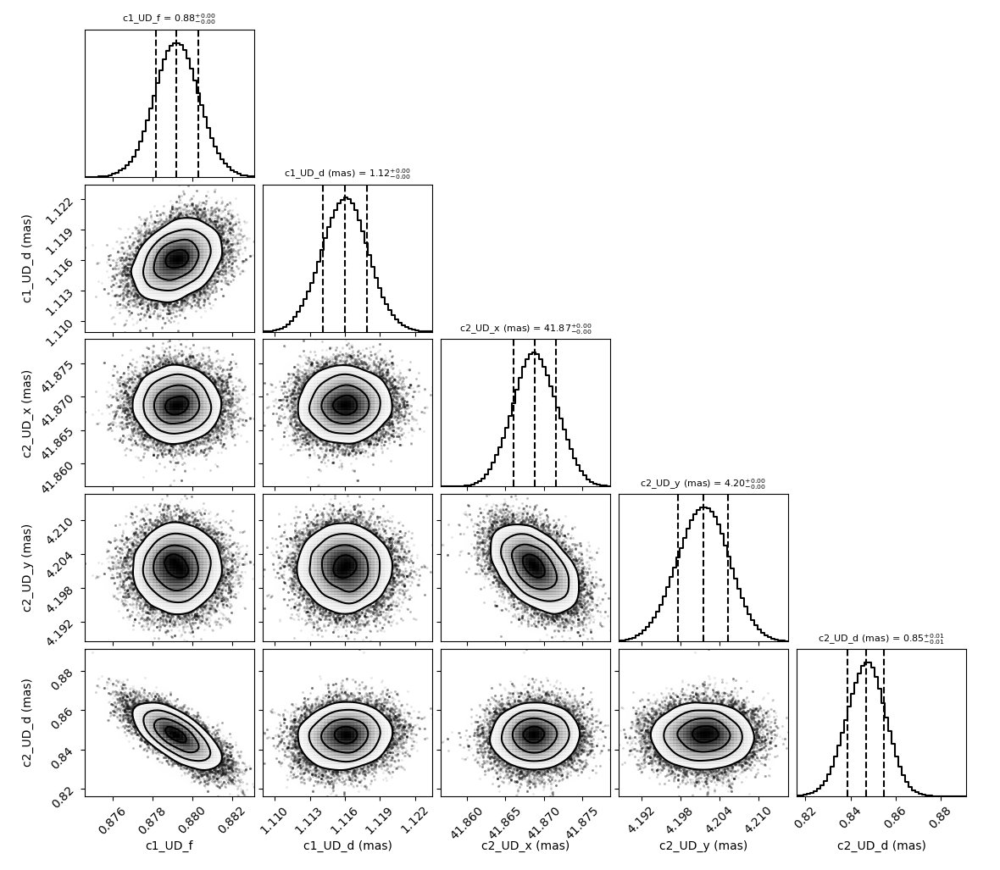
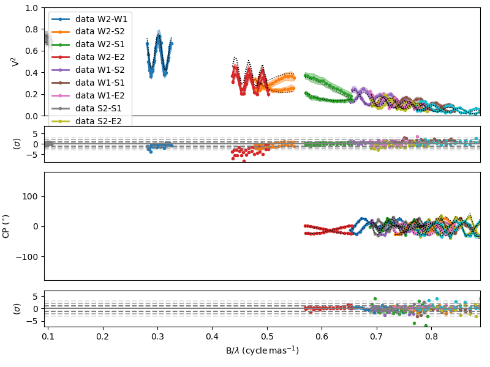
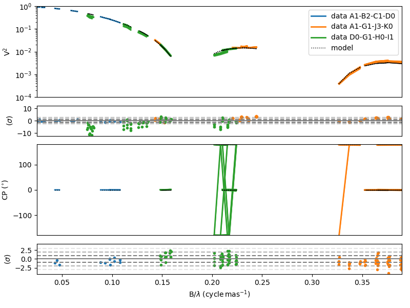
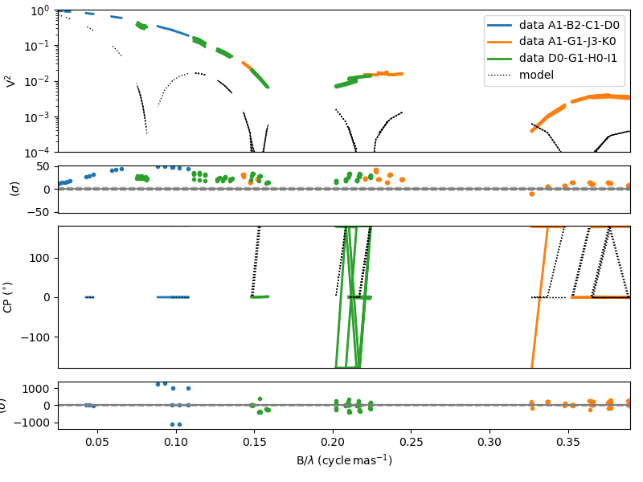

..  _fitter:

Model fitting
=============

In the **oimodeler** framework, model-fitting is performed by classes deriving from the abstract class
:func:`oimFitter <oimodeler.oimFitter.oimFitter>`. Here we describe the common functionalities and methods 
of these fitting classes. 

Theses classes encapsulate an :func:`oimSimulator <oimodeler.oimSimulator.oimSimulator>` instance, which determines
the :math:`\chi^2` value between the data and the model as seen in the :ref:`simulator` section. As for the simulator 
class, :math:`\chi^2` can be computed only on a subset of datatypes setting the ``dataTypes`` kewyord. 

When creating a :func:`oimFitter <oimodeler.oimFitter.oimFitter>` the user should either pass an instance 
of :func:`oimSimulator <oimodeler.oimSimulator.oimSimulator>` 

.. code:: ipython3

      fit = oimFitter(sim)

or an instance of :func:`oimData <oimodeler.oimData.oimData>` and  :func:`oimModel <oimodeler.oimModel.oimModel>`  

.. code:: ipython3

         fit = oimFitter(data, model)

The fitting classes have four common methods:

   - :func:`prepare <oimodeler.oimFitter.oimFitter.prepare>` : prepare the fitter: defining the parameter space...
   - :func:`run <oimodeler.oimFitter.oimFitter.run>` : launch the model-fitting run
   - :func:`getResults <oimodeler.oimFitter.oimFitter.getResults>` : return the best-fit parameters and uncertainties 
   - :func:`printResults <oimodeler.oimFitter.oimFitter.printResults>` : print the result of the model-fitting

.. warning::
   After calling the :func:`getResults <oimodeler.oimFitter.oimFitter.getResults>` or  
   :func:`printResults <oimodeler.oimFitter.oimFitter.printResults>`  the parameters of the 
   :func:`oimModel <oimodeler.oimModel.oimModel>` is set to their best-fit values.

The various classes of model-fitting also includes specific plotting functions that will be described 
in details in their recpective sub-sections.

In the current version, **oimodeler** includes four model-fitting algorithms.

.. csv-table:: Available Model-Fitters
   :file: table_fitters.csv
   :header-rows: 1
   :delim: |
   :widths: auto

These various algorithms allow the user to find the best-fit values of all free parameters of the model
(minimum of :math:`\chi^2`) and, depending on their nature, to evaluate their statistic. 

For instance, uncertainties can be estimated using :
   - the posterior probability function in the case of MCMC or DNS
   - the covariant matrix for the gradient-descent methods such as Minimize one

.. warning::
   It should be noted that no model fitting algorithm can guarantee convergence to the global minimum 
   of the chi-squared statistic.

Emcee fitter
------------

**A few words about the MCMC algorithm**

The Markov Chain Monte Carlo (MCMC) algorithm is a method used to sample from complex probability distributions
when direct sampling is difficult. It works by constructing a Markov chain, a sequence of random variables
where each variable depends only on the previous one.

Unlike optimization algorithms that seek the global minimum, MCMC methods do not directly aim to find it.
Instead, they converge toward a probability distribution, which may be concentrated near the global minimum
if that region has high probability. 

The burn-in phase refers to the initial iterations of the MCMC process, during which the chain has not yet reached 
the target distribution and the samples may not be representative
of the true posterior.

After a burning phase, the chain "wanders" over time through the sample space in such a way that the frequency 
of visits to each region reflects the target distribution, allowing for approximate estimation of expectations
and probabilities. 

**Description of the oimFitterEmcee class**

To implement a MCMC sampler, oimodeler use the python library **emcee**. 
If you are not confident with this package, you should have a look at the documentation 
`here <https://emcee.readthedocs.io/en/stable/>`_.

The **emcee** sampler is encapsulated into the :func:`oimFitterEmcee <oimodeler.oimFitter.oimFitterEmcee>` class.

At the creation of the fitter the number of desired walker exploring the paramter space can be specified using the 
keyword ``nwalkers``. The default number is 20.

.. code:: ipython3

   fit = oim.oimFitterEmcee(data,model, nwalkers=10, dataTypes=["VIS2DATA","T3PHI"])

The :func:`prepare <oimodeler.oimFitter.oimFitterEmcee.prepare>` method should then be called to set the initial 
walkers positions. Two options are available depending on the value of the keyword ``init``:
   - **random** : (default) Uniformly random positions within the parameter space limited by the values of :func:`oimParam.min <oimodeler.oimParam.oimParam.min>` and :func:`oimParam.max <oimodeler.oimParam.oimParam.max>`
   - **gaussian** : random positions from a normal (Gaussian) distribution around the current position defined by the :func:`oimParam.value <oimodeler.oimParam.oimParam.value>`  with standard deviation of :func:`oimParam.error <oimodeler.oimParam.oimParam.error>`

The :func:`oimFitterEmcee <oimodeler.oimFitter.oimFitterEmcee>` class offers two additionnal functionalities 
of the **emcee** package. 

The first one is the possiblity of changing the walker 
`moves <https://emcee.readthedocs.io/en/stable/user/moves/>`_ to optimize the parameter space exploration.

The user can also load and save the sampler using the `HDF5 backend <https://emcee.readthedocs.io/en/stable/user/backends/>`_.
This can be done by specifying an hdf5 file with the ``samplerFile`` keyword. If the file exists, it is 
loaded into the sampler. Its probability distribution can be explored and the best-fit parameters determined.
If the file doesn't exist, it will be created and the results of the MCMC run will be saved in this file.

.. code:: ipython3

   fit.prepare(init="gaussian", moves = moves.StretchMove, samplerFile=mySampler.h5)

After initializing the walkers, the MCMC run can be performed using the :func:`run <oimodeler.oimFitter.oimFitterEmcee.run>`
method. The number of iterations of the run is set by the ``nsteps`` keyword. The ``progress`` keyword can be used to show a 
progress bar.

.. code:: ipython3

   fit.run(nsteps=5000, progress=True)

After the MCMC run, the results can be plotted with three methods:

**Example on MIRCX data of a binary star**

To demonstrate the use of the :func:`oimFitterEmcee <oimodeler.oimFitter.oimFitterEmcee>` class we will use a single
`MIRCX <http://www.astro.ex.ac.uk/people/kraus/mircx.html>`_ observation of the binary star :math:`\beta` Ari. 
The code for this section is in `emceeFitting.py <https://github.com/oimodeler/oimodeler/tree/main/examples/Modules/emceeFitting.py>`_

We start by creating a binary star model conissting of two uniform disk components.

.. code:: ipython3

   ud1 = oim.oimUD()
   ud2 = oim.oimUD()
   model = oim.oimModel([ud1, ud2])

Before starting the run, we need to specify which parameters are free and what their ranges are. By default, all 
parameters are free, but the components `x` and `y` coordinates. For a binary, we need to release them for one 
of the components. As we only deal with relative fluxes, we can normalize the total flux to one.

.. code:: ipython3

   ud1.params["d"].set(min=0, max=2)
   ud1.params["f"].set(min=0.8, max=1)
   ud2.params["d"].set(min=0, max=2)
   ud2.params["x"].set(min=-100, max=100, free=True)
   ud2.params["y"].set(min=-100, max=100, free=True)
   model.normalizeFlux()
  
We can print the list of free paramaters of our binary model:

.. code:: ipython3   

   model.getFreeParameters()

.. parsed-literal::

   {'c1_UD_d': oimParam at 0x2031db6e7e0 : d=0 ± 0 mas range=[0,2] free=True ,
   'c1_UD_f': oimParam at 0x2031ee86db0 : f=1 ± 0  range=[0.8,1] free=True ,
   'c2_UD_d': oimParam at 0x2031f530d40 : d=0 ± 0 mas range=[0,2] free=True ,
   'c2_UD_x': oimParam at 0x2031bf4ae40 : x=0 ± 0 mas range=[-100,100] free=True ,
   'c2_UD_y': oimParam at 0x2031f4bf1d0 : y=0 ± 0 mas range=[-100,100] free=True }

We load the MIRCX data and filter out the OI_VIS table to reduce computation time.

.. code:: ipython3   

   data=oim.oimData(file)
   filt=oim.oimRemoveArrayFilter(arr="OI_VIS")
   data.setFilter(filt)

We then create the emcee fitter. We set of number of walkers to 12 and specify that theonly the VIS2DATA and T3PHI we
will be used to compute the :math:`\chi^2`.

.. note::

  **emcee** requires the number of walkers to be at least twice the number of free parameters.

We need to initialize the fitter using its :func:`oimFitterEmcee.prepare <oimodeler.oimFitter.oimFitterEmcee.prepare>`
method. This method is setting the initial values of the walkers either in Gaussian or uniform distribution 
(see previous section). The default method is to set them to random values within the parameters range.

.. code-block:: ipython3
    
    fit.prepare()

The variable :func:`initialParams <oimodeler.oimFitter.oimFitterEmcee.initialParams>` of the
:func:`oimFitterEmcee <oimodeler.oimFitter.oimFitterEmcee>` instance contains the initial values the parmaters 
for all walkers.

.. code-block:: ipython3

    print(fit.initialParams)

.. parsed-literal::

    array([[ 8.95841039e-01,  6.60835250e-01,  5.97499196e+01,
         7.54750698e+01,  1.34828828e+00],
       [ 9.90477053e-01,  1.18066929e+00,  7.42332565e+01,
        -7.74195309e+01,  1.01373315e+00],
       [ 8.61175261e-01,  9.73948406e-03,  8.41031622e+01,
         9.65519546e+01,  1.98837369e+00],
       [ 8.74741367e-01,  1.83656376e+00, -2.13259171e+01,
        -8.35083861e+01,  1.61472161e+00],
       [ 9.45848256e-01,  6.95701956e-01,  9.52905809e+01,
         4.21371881e+01,  8.68078468e-01],
       [ 8.15209564e-01,  6.63088192e-01,  3.81774226e+01,
        -5.21909577e+01,  1.63010167e+00],
       [ 8.62539242e-01,  1.41065537e+00,  7.72304319e+01,
        -3.98899413e+01,  1.91458275e+00],
       [ 9.20929111e-01,  1.90288993e-02, -5.30189260e+01,
         5.06516249e+01,  7.38609144e-01],
       [ 9.72689492e-01,  6.04406879e-01,  3.26247393e+01,
         6.20385451e+01,  2.59662765e-01],
       [ 8.32000110e-01,  7.87671717e-01, -7.31812757e+01,
         1.76352972e+01,  1.81975894e+00],
       [ 9.89702924e-01,  8.08596701e-01, -7.59071858e+01,
         8.88992214e+01,  1.13866453e-01],
       [ 9.24424779e-01,  9.79528699e-01,  7.12641054e+01,
         4.48065035e+00,  1.93515687e+00]])

We can now run the fit. We choose to run 20000 steps as a start and interactively show
the progress with a progress bar. The fit should take a few minutes on a standard computer
to compute around 240000 models (``nwalkers`` x ``nsteps``).

.. code-block:: ipython3

    fit.run(nsteps=20000, progress=True)

 
The :func:`oimFitterEmcee <oimodeler.oimFitter.oimFitterEmcee>` instance stores
the emcee sampler as an attribute: ``oimFitterEmcee.sampler``. You can, for example,
access the chain of walkers and the logrithmic of the probability directly.  

.. code-block:: ipython3

    sampler = fit.sampler
    chain   = fit.sampler.chain
    lnprob  = fit.sampler.lnprobability

    
We can directly manipulate or plot these data. However, the :func:`oimFitterEmcee <oimodeler.oimFitter.oimFitterEmcee>`
implements various methods to retrieve and plot the results of the mcmc run.

The walkers position as the function of the steps with a  :math:`\chi^2` color scale can be plotted 
using the :func:`oimFitterEmcee.walkersPlot <oimodeler.oimFitter.oimFitterEmcee.walkersPlot>`
method. This method have the following parameters (default in parenthesis):

- ``savefig`` (None) : path of the file to save the plot
- ``chi2limfact`` (20) : define the upper limit of the color scale in :math:`\chi^2`
- ``labelsize`` (10) : size of the label of the parameters name
- ``ncolors`` (128) : number of colors for the color scale (reduce if the function is too slow for large sample)

Let's plot the evolution of the walkers with a limit of 10 tiimes the minimum :math:`\chi^2`.

.. code-block:: ipython3

    figWalkers, axeWalkers = fit.walkersPlot(chi2limfact=10)

As evidenced in this figure 20000 steps is not enough for the MCMC run to converge aroun the globaml minimum of :math:`\chi^2` :
- not all walkers are around the same positions
- the :math:`\chi^2` is still quite high (but this could also be due to a choice of bad model)
- the positions are not yet stable as a function of time

Let's add 20000 steps by running again the same fitter.

.. note::
   By default the :func:`oimFitterEmcee.run <oimodeler.oimFitter.oimFitterEmcee.run>` method starts at the 
   current position of the walker. The option ``reset`` can be specified to reset the sampler to the initial 
   positions.

.. code-block:: ipython3

    fit.run(nsteps=20000, progress=True)

Let's plot the walkers positions for the 40000 steps.

.. code-block:: ipython3

    figWalkers2, axeWalkers2 = fit.walkersPlot(chi2limfact=10)

Although not all walkers have converged to the same position, a group of them has converged to a location 
yielding a significantly lower :math:`\chi^2`. Moreover, the positions of most walkers appear to have remained 
stable for at least 10,000 steps.

Although there is no mathematical test to determine whether the position corresponds to the global minimum 
of the :math:`\chi^2`, we will assume that the walkers clustered around this minimum have converged to the
global minimum, while the others are trapped in local minima. As we will see using the grid fitter, 
this behavior often occurs with binary data.

We can generate the well-known corner plot, which displays both 1D and 2D density distributions of the parameters. 
The **oimodeler** package uses the `corner <https://corner.readthedocs.io/en/latest/>`_ library for this purpose. 
To ensure we are analyzing only the converged part of the chains, we discard the first 35,000 steps, as most 
walkers have converged after that point.

By default, the corner plot also excludes samples with a :math:\chi^2 value more than 20 times higher than that
 of the best-fit model. This cutoff can be adjusted using the ``chi2limfact`` keyword of the 
:func:`oimFitter.cornerPlot <oimodeler.oimFitter.oimFitter.cornerPlot>` method.

However, since not all walkers have converged to the global minimum, we will use a lower value for this parameter 
to ensure that only the walkers clustered around the global minimum are included in the posterior distribution.

.. code-block:: ipython3

    figCorner, axeCorner=fit.cornerPlot(discard=35000, chi2limfact=3)

We can now retrieve the results of the fit. The :func:`oimFitterEmcee <oimodeler.oimFitter.oimFitterEmcee>` function 
can return the ``best``, ``mean``, or ``median`` model, depending on the selected option. It also provides 
uncertainties estimated from the posterior density distribution
 (see the `emcee <https://emcee.readthedocs.io/en/stable/>`_ documentation for more details).

.. code-block:: ipython3
    
    median, err_l, err_u, err = fit.getResults(mode='median', discard=35000, chi2limfact=3)

To compute the median and mean models, we must first exclude, as in the corner plot, the walkers that 
did not converge. This is done using the ``chi2limfact`` keyword (default is again 20). We also remove the 
burn-in phase using the ``discard`` option.

When retrieving the results, the simulated data is automatically generated using the fitter's internal 
simulator. We can then plot the data and model again, and compute the final reduced chi-squared 
:math:`\chi^2_r`:

.. code-block:: ipython3 
    
    figSim, axSim=fit.simulator.plot(["VIS2DATA", "T3PHI"])
    pprint("Chi2r = {}".format(fit.simulator.chi2r))

    

We can also plot the fit residuals using the :func:`plotResiduals <oimodeler.oimSimulator.oimSimulator.plotResiduals>` 
of the :func:`oimSimulator <oimodeler.oimSimulator.oimSimulator>` class.

.. code-block:: ipython3 

   fig2, ax2 = fit.simulator.plotResiduals(["VIS2DATA", "T3PHI"],levels=[1,2])
    
.. image:: ../../images/emceeFitting_residuals.png
  :alt: Alternative text 

We note that using a low value for the ``chi2limfact`` option is effective in removing walkers that 
have not converged but biases the posterior distribution.

 To obtain a more robust estimate, we can create a new :func:`oimFitterEmcee <oimodeler.oimFitter.oimFitterEmcee>` instance, 
 initialize the parameters using a Gaussian distribution around the putative global minimum (using the currently estimated 
 uncertainties on the parameters as the Gaussian sigma), and run it for several thousand steps.

To ensure that the initialization is properly performed, we first use the 
:func:`oimFitterEmcee.getResults <oimodeler.oimFitter.oimFitterEmcee.getResults>` method, which sets 
the model parameters and uncertainties according to the results from the first fitter.

.. code-block:: ipython3 

   fit.getResults(mode="best", discard=35000, chi2limfact=3)
   fit2 = oim.oimFitterEmcee(data, model, nwalkers=20,dataTypes=["VIS2DATA","T3PHI"])
   fit2.prepare(init="gaussian")
   fit2.run(nsteps=5000, progress=True)

We can then display the walker and corner plots.

.. code-block:: ipython3 

   figWalkers, axeWalkers = fit2.walkersPlot(chi2limfact=5)
   figCorner, axeCorner = fit2.cornerPlot(discard=2000)

We can also print the reuslts:

.. code-block:: ipython3 

   fit2.printResults(mode="best", discard=2000)

.. parsed-literal::

   c1_UD_f = 0.87928 ± 0.00106 
   c1_UD_d = 1.11597 ± 0.00191 mas
   c2_UD_x = 41.86875 ± 0.00276 mas
   c2_UD_y = 4.20204 ± 0.00383 mas
   c2_UD_d = 0.84589 ± 0.00811 mas
   chi2r = 1.95965

And, finally, we can then plot the data and model comparison and the residual simultaneously using the
:func:`plotWithResiduals <oimodeler.oimSimulator.oimSimulator.plotWithResiduals>` 
of the :func:`oimSimulator <oimodeler.oimSimulator.oimSimulator>` class.

.. code-block:: ipython3 

   fig2, ax2 = fit2.simulator.plotWithResiduals(["VIS2DATA", "T3PHI"],levels=[1,2,3],
                        xunit="cycle/mas",kwargsData=dict(color="byBaseline",marker="."))

:math:`\chi^2_r` Minimizer
--------------------------

**oimodeler** also implements :func:`oimFitterMinimize <oimodeler.oimFitter.oimFitterMinimize>`, 
a simple :math:`\chi^2_r` minimization fitter based on the 
`minimize <https://docs.scipy.org/doc/scipy/reference/generated/scipy.optimize.minimize.html>`_ 
function provided by the `scipy <https://docs.scipy.org/doc/scipy/>`_ Python package.

To demonstrate it's use o we will use three VLTI/PIONIER observations of the supergiant Canopus taken from 
`Domiciano de Souza et al. 2021 <https://ui.adsabs.harvard.edu/abs/2021A%26A...654A..19D/abstract>`_ paper. 
The code for this section is in 
`simpleMinimizerFitting.py <https://github.com/oimodeler/oimodeler/tree/main/examples/Modules/simpleMinimizerFitting.py>`_ .

First, we load the data into an  instance of :func:`oimData <oimodeler.oimData.oimData>`.

.. code-block:: ipython3 

   data_dir = path / "data" / "RealData" "/PIONIER" / "canopus"
   files = list(data_dir.glob("PION*.fits"))
   data=oim.oimData(files)

We create a model, here a single component of a powerlaw limb-darkened disk.

.. code-block:: ipython3 

   pldd = oim.oimPowerLawLDD(d=8, a=0)
   model = oim.oimModel(pldd)
   model.normalizeFlux()

We create an instance of the :func:`oimFitterMinimize <oimodeler.oimFitter.oimFitterMinimize>` class, 
prepare the fitter, run it, and finally print the results.

.. code-block:: ipython3

   lmfit = oim.oimFitterMinimize(data, model,dataTypes=["VIS2DATA", "T3PHI"])
   lmfit.prepare()
   lmfit.run()
   lmfit.printResults()

.. parsed-literal::

   c1_PLLDD_d = 7.24385 ± 0.00472 mas
   c1_PLLDD_a = 0.19947 ± 0.00310 
   chi2r = 6.06760

Finally, we can plot the comparison obetween our PIONIER data and our model and the residual.

.. code-block:: ipython3

   fig, ax = lmfit.simulator.plotWithResiduals(["VIS2DATA", "T3PHI"],xunit="cycle/mas",
                                             kwargsData=dict(color="byConfiguration"))

   ax[0].set_yscale("log")
   ax[0].set_ylim(1e-4,1)

.. warning::
   The minimize fitter only converge to the closest local minimum.

For instance, let's see what happens when we start with an initial diameter of 15 mas.
We can modify the 

.. code-block:: ipython3

   pldd.params["d"].value=10
   lmfit.prepare()
   lmfit.run()
   lmfit.printResults()

.. parsed-literal::

   c1_PLLDD_d = 14.78362 ± 1.43824 mas
   c1_PLLDD_a = 0.06933 ± 0.30199 
   chi2r = 35948.20365

The minimizer converge to a local minimum with a high value of the :math:`\chi^2_r`.

We can plot the data-to-model comparison to verify that the fit is poor.

.. code-block:: ipython3

   fig2, ax2 = lmfit.simulator.plotWithResiduals(["VIS2DATA", "T3PHI"],xunit="cycle/mas",
                                             kwargsData=dict(color="byConfiguration"))

   ax2[0].set_yscale("log")
   ax2[0].set_ylim(1e-4,1)

Note that the minimization method can be specified using the ``method`` keyword during instantiation. 
The list of available methods, along with their pros and cons, is described in
 `the SciPy minimize documentation <https://docs.scipy.org/doc/scipy/reference/generated/scipy.optimize.minimize.html>`_ .

For instance to use the Broyden–Fletcher–Goldfarb–Shanno (BFGS) algorithm:

.. code-block:: ipython3
      
   lmfit2 = oim.oimFitterMinimize(data, model, 
                     dataTypes=["VIS2DATA", "T3PHI"], method="BFGS")

. note::
   One of the main advantages of the minimizer fitter is that it provides an alternative 
   estimation of the uncertainties on the free parameters, i.e., based on the covariance matrix, 
   compared to the MCMC method, which relies on the statistics of the posterior probability function.

Regular Grid exploration
------------------------

Dynesty fitter
--------------

TODO

