:tocdepth: 2

..  _models:

Building and using models
=========================

.. _basics of models:

The basics of models
--------------------

This complete code corresponding to this section is available in `TheBasicsOfModels.py <https://github.com/oimodeler/oimodeler/blob/main/examples/Modules/TheBasicsOfModels.py>`_ 

Models, Components and Parameters
~~~~~~~~~~~~~~~~~~~~~~~~~~~~~~~~~

In the **oimodeler** framework, a model is and instance of the :func:`oimModel <oimodeler.oimModel.oimModel>` class. 
It contains a collection of components, which all derived from the :func:`oimComponent <oimodeler.oimComponent.oimComponent>` 
semi-abstract class. The components may be described in the image plane, by their 1D or 2D intensity distribution,
or directly in the Fourier plane, for the most simple components with known analytical Fourier transforms. 
Each components is described by a set of parameters which are instances of the :func:`oimParam <oimodeler.oimParam.oimParam>` class.

Thus, building models in **oimodeler** relies on three classes:

- :func:`oimModel <oimodeler.oimModel.oimModel>`: the model class 

- :func:`oimComponent <oimodeler.oimComponent.oimComponent>`: the abstract class from which all components derive

- :func:`oimParam <oimodeler.oimParam.oimParam>`: the parameter class

To create models we must first create some components.
Let's create a few simple components.

.. code-block:: ipython3

    pt = oim.oimPt(f=0.1)
    ud = oim.oimUD(d=10, f=0.5)
    g  = oim.oimGauss(fwhm=5, f=1)
    r  = oim.oimIRing(d=5, f=0.5)

Here, we have create a point source, a 10 mas uniform disk, a Gaussian distribution 
with a 5 mas fwhm and a 5 mas infinitesimal ring. 
The comprehensive list of components available is **oimodeler** is given in the next section. 

The model parameters which are not set explicitly during the components creation
are set to their default values (i.e., f=1, x=y=0).

We can print the description of the component easily:

.. code:: ipython3

    print(ud.params)

.. parsed-literal::
    
    Uniform Disk x=0.00 y=0.00 f=0.50 d=10.00

Or if you want to print the details of a parameter:

.. code-block:: ipython3

    print(ud.params['d'])

 
.. parsed-literal::
    
    oimParam d = 10 ± 0 mas range=[-inf,inf] free

Note that the components parameters are instances of the
:func:`oimParam <oimodeler.oimParam.oimParam>` class which hold not only the
parameter value stored in the ``oimParam.value`` attribute, but in addition to it
the following attributes: 

- ``oimParam.error``: the parameters uncertainties (for model fitting).
- ``oimParam.unit``: the unit as a ``astropy.units`` object.
- ``oimParam.min``: minimum possible value (for model fitting).
- ``oimParam.max``: minimum possible value (for model fitting).
- ``oimParam.free``: Describes a free parameter for ``True``
  and a fixed parameter for ``False`` (for model fitting).
- ``oimParam.description``: A string that describes the model parameter.

Building Models
~~~~~~~~~~~~~~~

We can now create our first models using the
:func:`oimModel <oimodeler.oimModel.oimModel>` class.

.. code-block:: ipython3

    mPt   = oim.oimModel(pt)
    mUD   = oim.oimModel(ud)
    mG    = oim.oimModel(g)
    mR    = oim.oimModel(r)
    mUDPt = oim.oimModel(ud, pt)
    

Now, we have four one-component models and one two-component model.

We can get the parameters of our models using the 
:func:`oimModel.getParameters <oimodeler.oimModel.oimModel.getParameters>`
method.

.. code-block:: ipython3
    
    params = mUDPt.getParameters()
    print(params)
        

.. parsed-literal::

    {'c1_UD_x': oimParam at 0x23de5c62fa0 : x=0 ± 0 mas range=[-inf,inf] free=False ,
     'c1_UD_y': oimParam at 0x23de5c62580 : y=0 ± 0 mas range=[-inf,inf] free=False , 
     'c1_UD_f': oimParam at 0x23de5c62400 : f=0.5 ± 0  range=[-inf,inf] free=True ,
     'c1_UD_d': oimParam at 0x23debc1abb0 : d=10 ± 0 mas range=[-inf,inf] free=True , 
     'c2_Pt_x': oimParam at 0x23debc1a8b0 : x=0 ± 0 mas range=[-inf,inf] free=False , 
     'c2_Pt_y': oimParam at 0x23debc1ab80 : y=0 ± 0 mas range=[-inf,inf] free=False , 
     'c2_Pt_f': oimParam at 0x23debc1ac10 : f=0.1 ± 0  range=[-inf,inf] free=True }

The method returns a dict of all parameters of the model components.
The keys are defined as 

    ``x{num of component}_{short Name of component}_{param name}``.

Alternatively, we can get the free parameters using the
:func:`getFreeParameters <oimodeler.oimModel.oimModel.getFreeParameters>` method:

.. code-block:: ipython3
    
    freeParams = mUDPt.getParameters()
    print(freeParams)
    
.. parsed-literal::

    {'c1_UD_f': oimParam at 0x23de5c62400 : f=0.5 ± 0  range=[-inf,inf] free=True ,
     'c1_UD_d': oimParam at 0x23debc1abb0 : d=10 ± 0 mas range=[-inf,inf] free=True ,
     'c2_Pt_f': oimParam at 0x23debc1ac10 : f=0.1 ± 0  range=[-inf,inf] free=True }

The two main methods of an :func:`oimModel <oimodeler.oimModel.oimModel>` object are:

- :func:`getImage <oimodeler.oimModel.oimModel.getImage>`: which returns an image of the model 
- :func:`oimModel.getComplexCoherentFlux <oimodeler.oimModel.oimModel.getComplexCoherentFlux>` which returns the complex Coherent Flux of the model 

Althought the :func:`getImage <oimodeler.oimModel.oimModel.getImage>`  is only used to vizualize the model intensity 
distribution and is not used for  model-fitting, :func:`getComplexCoherentFlux <oimodeler.oimModel.oimModel.getComplexCoherentFlux>` is
at the base of the computation of all interferometric observables and thus of the data-model comparison.

Getting the model image
~~~~~~~~~~~~~~~~~~~~~~~

Let's first have a look at the :func:`oimModel.getImage <oimodeler.oimModel.oimModel.getImage>` method.

It takes two arguments, the image's size in pixels and the pixel size in mas.

.. code-block:: ipython3
    
    im = mUDPt.getImage(512, 0.1)
    plt.figure()
    plt.imshow(im**0.2)

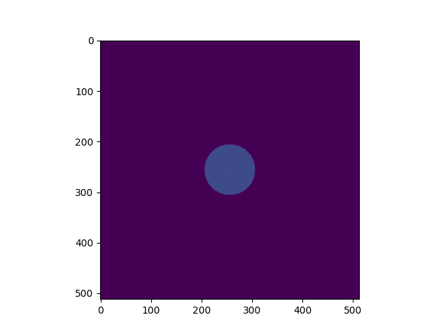
  
We plot the image with a 0.2 power-law to make the uniform disk components visible:
Both components have the same total flux but the uniform disk is spread on many more
pixels.

The image can also be returned as an ``astropy hdu`` object (instead of a ``numpy array``)
setting the ``toFits`` keyword to ``True``.
The image will then contained a header with the proper fits image keywords
(NAXIS, CDELT, CRVAL, etc.).

.. code-block:: ipython3
    
    im = mUDPt.getImage(256, 0.1, toFits=True)
    print(im)
    print(im.header)
    print(im.data.shape)

.. parsed-literal::
  
    ... <astropy.io.fits.hdu.image.PrimaryHDU object at 0x000002610B8C22E0>
    
    SIMPLE  =                    T / conforms to FITS standard                      
    BITPIX  =                  -64 / array data type                                
    NAXIS   =                    2 / number of array dimensions                     
    NAXIS1  =                  256                                                  
    NAXIS2  =                  256                                                  
    EXTEND  =                    T                                                  
    CDELT1  = 4.84813681109536E-10                                                  
    CDELT2  = 4.84813681109536E-10                                                  
    CRVAL1  =                    0                                                  
    CRVAL2  =                    0                                                  
    CRPIX1  =                128.0                                                  
    CRPIX2  =                128.0                                                  
    CUNIT1  = 'rad     '                                                            
    CUNIT2  = 'rad     '                                                            
    CROTA1  =                    0                                                  
    CROTA2  =                    0                                                 
    
    (256, 256)
    

.. note::

    Currently only **regular** grids in wavelength and time are allowed when exporting
    to fits-image format. If specified, the **wl** and **t** vectors need to be regularily
    sampled. The easiest way is to use the 
    `numpy.linspace <https://numpy.org/doc/stable/reference/generated/numpy.linspace.html>`_
    function.

    If their sampling is irregular an error will be raised.

    
Using the :func:`oimModel.saveImage <oimodeler.oimModel.oimModel.saveImage>` method
will also return an image in the fits format and save it to the specified fits file. 

.. code-block:: ipython3
   
    im = mUDPt.saveImage("modelImage.fits", 256, 0.1)

.. note::

    The returned image in fits format will be 2D, if  time and wavelength are not
    specified, or if they are numbers, 3D if one of them is an array, and 4D if both
    are arrays.

Alternatively, we can use the :func:`oimModel.showModel <oimodeler.oimModel.oimModel.showModel>`
method which take the same argument as the getImage, but directly create a plot with
proper axes and colorbar.

.. code-block:: ipython3

    figImg, axImg = mUDPt.showModel(512, 0.1, normPow=0.2)

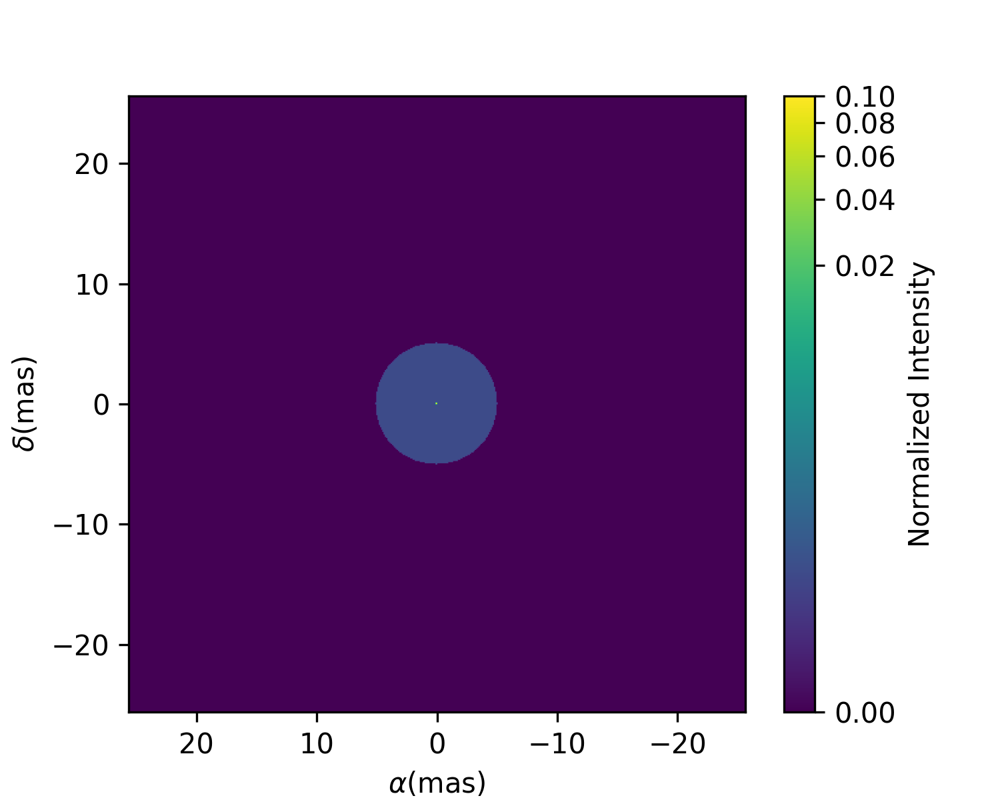

Getting the model Complex Coherent Flux
~~~~~~~~~~~~~~~~~~~~~~~~~~~~~~~~~~~~~~~

In most of the cases the user won't use directly the :func:`oimModel.getComplexCoherentFlux <oimodeler.oimModel.oimModel.getComplexCoherentFlux>` 
method to retrieve the model complex coherent flux for a set of coordinates but will create  :func:`oimSimulator <oimodeler.oimSimulator.oimSimulator>`
or a  :func:`oimSimulator <oimodeler.oimFitter.oimFitter>` that will contain the instance of :func:`oimModel <oimodeler.oimModel.oimModel>`
and some interferometric data in an :func:`oimData <oimodeler.oimData.oimData>` to simulate interferometric quantities from the model at the 
spatial frequenciesfrom our data.  This will be covered in the XXXXXXXXXXX section.

Nevertheless, in some cases and for explanatory purposes we will directly use this methods in the following example.
Without the :func:`oimSimulator <oimodeler.oimSimulator.oimSimulator>` class, the :func:`oimModel <oimodeler.oimModel.oimModel>`
can only produce complex coherent flux (i.e., non normalized complex visibility) for a vector of spatial frequecies and wavelengths. 

.. code-block:: ipython3

    wl = 2.1e-6
    B = np.linspace(0.0, 300, num=200)
    spf = B/wl

Here, we have created a vector of 200 spatial frequencies, for baselines ranging from 0 to 300 m at an observing wavelength of 2.1 microns.

We can now use this vector to get the complex coherent flux (CCF) from our model. 
    

.. code-block:: ipython3

    ccf = mUDPt.getComplexCoherentFlux(spf, spf*0) 

    
The :func:`oimModel.getComplexCoherentFlux <oimodeler.oimModel.oimModel.getComplexCoherentFlux>`
method takes four parameters: 

- the spatial frequencies along the East-West axis (u coordinates in cycles/rad), 
- the spatial frequencies along the North-South axis (v coordinates in cycles/rad), 

and optionally,

- the wavelength (in meters)
- time (mjd)

Here, we are dealing with grey and time-independent models so we don't need to specify the wavelength. 
Additionnally, as our models are circular, we don't care about the baseline orientation.
That why we set the North-South component of the spatial frequencies to zero.

We can now plot the visibility from the CCF as the function of the spatial frequencies:

.. code-block:: ipython3

    v = np.abs(ccf)
    v = v/v.max()
    plt.figure()
    plt.plot(spf, v)
    plt.xlabel("spatial frequency (cycles/rad)")
    plt.ylabel("Visbility")

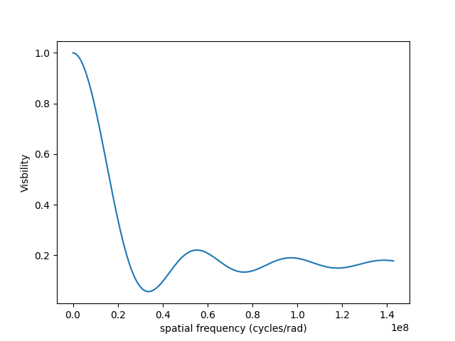

Let's finish this example by creating a figure with the image and visibility
for all the previously created models.

.. code-block:: ipython3

    models = [mPt, mUD, mG, mR, mUDPt]
    mNames = ["Point Source", "Uniform Disk", "Gausian", "Ring",
              "Uniform Disk + Point Source"]

    fig, ax = plt.subplots(2, len(models), figsize=(
        3*len(models), 6), sharex='row', sharey='row')

    for i, m in enumerate(models):
        m.showModel(512, 0.1, normPow=0.2, axe=ax[0, i], colorbar=False)
        v = np.abs(m.getComplexCoherentFlux(spf,  spf*0))
        v = v/v.max()
        ax[1, i].plot(spf, v)
        ax[0, i].set_title(mNames[i])
        ax[1, i].set_xlabel("sp. freq. (cycles/rad)")

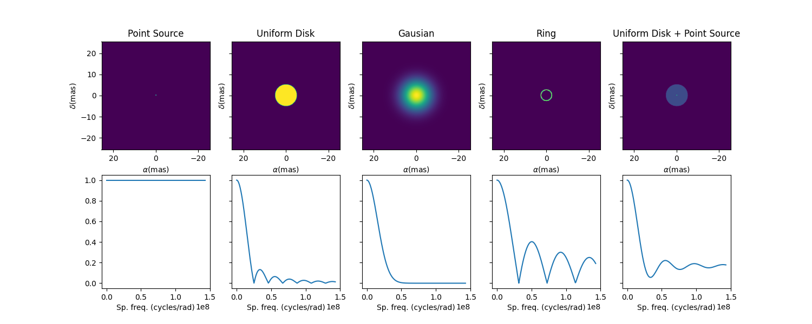

Types of components
-------------------

The code corresponding to this section is available in `TypesOfComponents.py <https://github.com/oimodeler/oimodeler/blob/main/examples/Modules/TypesOfComponents.py>`_

**oimodeler** components are of three different types:

| 1. the components defined in the Fourier space by an analytical formula.
| They inherit from the  :func:`oimComponentFourier <oimodeler.oimcomponent.oimComponentFourier>` class.

| 2. the components defined by their 2D intensity map in the image space.
| They inherit from the  :func:`oimComponentImage <oimodeler.oimcomponent.oimComponentImage>` class.

| 3. the components defined by their 1D intensity profile in the image space.
| They inherit from the  :func:`oimComponentRadialProfile <oimodeler.oimcomponent.oimComponentRadialProfile>` class.

Fourier components
------------------

In the table below is a list of the current Fourier-based components, which all derived from
the :func:`oimComponentFourier <oimodeler.oimComponent.oimComponentFourier>` semi-abstract class.

.. csv-table:: Available Fourier based components
   :file: table_components_fourier.csv
   :header-rows: 1  
   :delim: |
   :widths: auto

To print the comprehensive list of Fourier-based compnents you can type:

.. code-block:: ipython3

    print(oim.listComponents(componentType="fourier"))

    ['oimComponentFourier', 'oimPt', 'oimBackground', 'oimUD', 'oimEllipse', 'oimGauss', 'oimEGauss', 'oimIRing',
     'oimEIRing', 'oimRing', 'oimRing2', 'oimERing', 'oimERing2', 'oimESKIRing', 'oimESKGRing', 'oimESKRing', 'oimLorentz',
     'oimELorentz', 'oimLinearLDD', 'oimQuadLDD', 'oimPowerLawLDD', 'oimSqrtLDD', 'oimAEIRing', 'oimAERing', 'oimBox',
     'oimGaussLorentz', 'oimStarHaloGaussLorentz', 'oimStarHaloIRing']
     
If you want to have more information on a component (for instance, on its paramaters) you can use python **help** function.

.. code-block:: ipython3

    help(oim.oimUD)

.. parsed-literal::

    class oimUD(oimodeler.oimComponent.oimComponentFourier)
     |  oimUD(**kwargs)
     |
     |  Uniform Disk component defined in the fourier space
     |
     |  Parameters
     |  ----------
     |  x: u.mas | oimInterp
     |      x pos of the component (in mas). The default is 0.
     |  y: u.mas | oimInterp
     |      y pos of the component (in mas). The default is 0.
     |  f: u.dimensionless_unscaled | oimInterp
     |      flux of the component. The default is 1.
     |  d: u.mas | oimInterp
     |      diameter of the disk (in mas). The default is 0.
     |

Although simple, these components can allow to build complex models, For instance, Chromaticity and/or time-dependency 
can be added to any parameters of these components to build more complex models.
We will see this in details in the :ref:`Advanced parameters` section.

.. note:: 
    Models using Fourier-based components are usually faster to run as they use a simple function to compute the 
    complex Coherent Flux whereas imaged-based used FFT or Hankel-Transform (for radial profile) 

Image components
----------------

**oimodeler** allows to use components described in the image space. This can be done by subclassing the semi-abstract
:func:`oimComponentImage <oimodeler.oimcomponent.oimComponentImage>` class.

In the table below is a list of the current image-plan components:

.. csv-table:: Available Image plane components
   :file: table_components_image.csv
   :header-rows: 1  
   :delim: |
   :widths: auto

To print the comprehensive list of image-based compnents you can type:

.. code-block:: ipython3

    print(oim.listComponents(componentType="image"))

Describing an object by its intensity distribution instead of its Fourier transform can be useful in three cases:

1. the component cannot be described using an analytical formula in the Fourier space but can be described by an analytical formula in the image plan
2. the component cannot be described by a simple analytical formula even in the image space but an image can easily be computed, for instance with a iterative code
3. the user want to use external code such as images from a radiative transfert model

Here are three examples of these three kind of image components implemented in **oimodeler**.

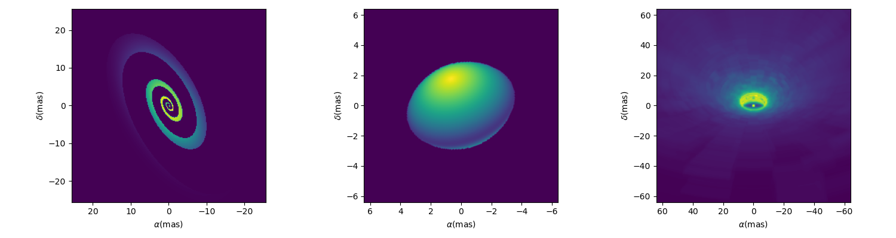

The first one is a spiral implemented as :func:`oimSpiral <oimodeler..oimCustomComponents.oimSpiral.oimSpiral>`.

Its implementation is descrbided in details in the section :ref:`spiral`.

.. code-block:: ipython3

    spiral = oim.oimSpiral(dim=256, fwhm=20, P=0.1, width=0.2, pa=30, elong=2)
    mspiral = oim.oimModel(spiral)

The second one is a simple simulation of a fast-rotator using the Roche model and a beta-law gravity-darkening.
It is implemented in oimodeler as :func:`oimFastRotator <oimodeler..oimCustomComponents.oimFastRotator.oimFastRotator>`
and a full description is given in :ref:`fastrot`.

.. code-block:: ipython3

    frot = oim.oimFastRotator(dpole=5, dim=128, incl=-50,rot=0.99, Tpole=20000, beta=0.25,pa=20)
    mfrot = oim.oimModel(frot)

Finally, the last one is an output from the radiative transfer code  `RADMC3D <https://www.ita.uni-heidelberg.de/~dullemond/software/radmc-3d/>`_
simulating the inner part of a dusty disk around the B[e] star FS CMa.
The simulation was made from 1.5 to 13μm. and the output was saved as a chromatic image-cube in the fits format with proper axes descruibed
in the header (size of pixel in x, y and wavelength). We use the :func:`oimComponentFitsImage <oimodeler.oimComponents.oimComponentFitsImage>`
class described in the next section to load the image as a image-components.

.. code-block:: ipython3

    radmc3D_fname = product_dir / "radmc3D_model.fits"
    radmc3D = oim.oimComponentFitsImage(radmc3D_fname,pa=180)
    mradmc3D = oim.oimModel(radmc3D)

Unlike when using Fourier-based components, the determination of the complex coherent flux (and the other interferometric observables) from an image
requires the computation of the image Fourier Transform (FT) at the spatial frequency (and optionnally spectral and time) coordinates of the data.

In **oimodeler** such computation relies on the :func:`oimFTBackends <oimodeler.oimFTBackends>` module which contains various algorithms to compute
the Fourier trasnform. Currently implemented are the following:

.. csv-table:: Available Fourier Transform Backends
   :file: table_ftbackends.csv
   :header-rows: 1
   :delim: |
   :widths: auto

By default the standard **numpy FFT backend** will be used. The FFTW backend which is significantly faster can be
actived if `pyFFTW <https://pypi.org/project/pyFFTW/>`_ is installed on your system. To check which backend is
available on your installation, type:

.. code-block:: ipython3

    print(oim.oimOptions.ft.backend.available)

.. parsed-literal::

    [<class 'oimodeler.oimFTBackends.numpyFFTBackend'>,
     <class 'oimodeler.oimFTBackends.FFTWBackend'>]

The current FT backend is given by :

.. code-block:: ipython3

    print(oim.oimOptions.ft.backend.active)

.. parsed-literal::

    <class 'oimodeler.oimFTBackends.numpyFFTBackend'>

To change it you can modify directly  :func:`oimOptions <oimodeler.oimOptions>` namespace:

.. code-block:: ipython3

    oim.oimOptions.ft.backend.active = oim.FFTWBackend

Or you can use the FT backend alias with the function :func:`setFTBackend <oimodeler.oimFTBackends.setFTBackend>`

.. code-block:: ipython3

    oim.setFTBackend("fftw")

The FFT backends (numpy or FFTW) are significantly faster than a normal DFT, but its precision depends on the
zero-padding of the image. The default zero padding factor is set to 4 which means the the the image will be zero-padded
in a 4 times bigger array (rounded to the closest power of 2). The user can access and change the zero padding using the
:func:`oimOptions <oimodeler.oimOptions>` namespace :

.. code-block:: ipython3

    oim.oimOptions.ft.padding = 8

Depending on the sharpness of the object image and its cropping lowering the zero-padding might lead to important errors.

Here is a ample script illustrating the accuracy of the FFT as the function of the padding factor using the
:func:`oimSpiral <oimodeler..oimCustomComponents.oimSpiral.oimSpiral>` component as example.

.. code-block:: ipython3

    #creating the spiral model
    spiral = oim.oimSpiral(dim=128, fwhm=20, P=1, width=0.1, pa=0, elong=1)
    mspiral = oim.oimModel(spiral)

    #creating a set of baselines from 0 to 100m in K band
    wl = 2.1e-6
    B = np.linspace(0, 100, num=200)
    spf = B/wl

    #computing the reference model with padding of 32
    oim.oimOptions.ft.padding = 32
    ccf01 = mspiral.getComplexCoherentFlux(spf, spf*0)
    v01 = np.abs(ccf01/ccf01[0])

    start = time.time()
    ccf02 = mspiral.getComplexCoherentFlux(spf*0, spf)
    v02 = np.abs(ccf02/ccf02[0])
    end = time.time()
    dt0 = end -start

    #%%  computing FFT with different padding
    padding=[16,8,4,2,1]
    figpad,axpad = plt.subplots(2,2, figsize=(10,5),sharey="row",sharex=True)

    axpad[0,0].plot(spf, v01, color="k",lw=4)
    axpad[0,1].plot(spf, v02, color="k",lw=4,label=f"padding=32x ({dt0*1000:.0f}ms)")

    for pi in padding :
        oim.oimOptions.ft.padding = pi
        ccf1 = mspiral.getComplexCoherentFlux(spf, spf*0)
        v1 = np.abs(ccf1/ccf1[0])
        start = time.time()
        ccf2 = mspiral.getComplexCoherentFlux(spf*0, spf)
        v2 = np.abs(ccf2/ccf2[0])
        end = time.time()
        dt = end -start
        axpad[0,0].plot(spf, v1)
        axpad[0,1].plot(spf, v2,label=f"padding={pi}x ({dt*1000:.0f}ms)")
        axpad[1,0].plot(spf, (v1-v01)/v01*100,marker=".",ls="")
        axpad[1,1].plot(spf, (v2-v02)/v02*100,marker=".",ls="")

    for i in range(2):
        axpad[1,i].set_xlabel("spatial frequency (cycles/rad)")
        axpad[1,i].set_yscale("symlog")
    axpad[0,0].set_title("East-West baselines")
    axpad[0,1].set_title("North-South baselines")
    axpad[0,0].set_ylabel("Visbility")
    axpad[0,1].legend()
    axpad[1,0].set_ylabel("Residual (%)")

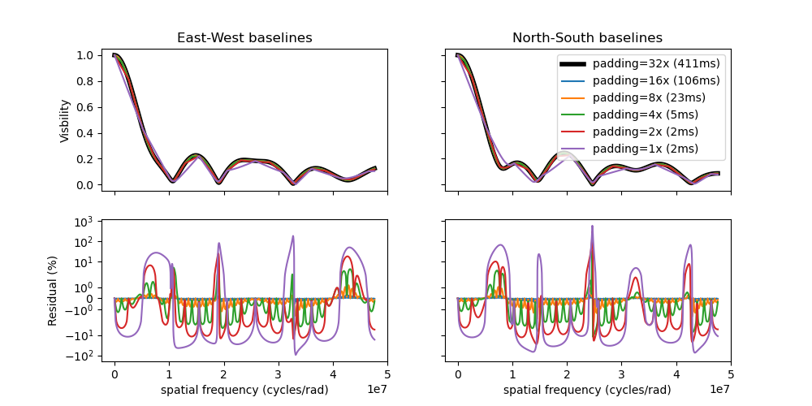

.. note::
    FFT computation time grows like :math:`n log(n)`, where n is the number of pixels in the image so the padding reduce
    significantly the computation of the model (see the example above)

In the case of the :func:`oimSpiral <oimodeler..oimCustomComponents.oimSpiral.oimSpiral>` component, reducing the
zero-padding below the default value of 4 leads to mean errors of the order of 30% (with values up to 500%). The default
padding reduce mean errors to a few precents (with maximum up to 10%).

Loading fits images
-------------------
One special and very useful image based component is the
:func:`oimComponentFitsImage <oimodeler.oimComponents.oimComponentFitsImage>` that allows the loading precomputed images
and use them as normal **oimodeler** components.

In this example, we will use a semi-physical model for a classical Be star and its circumstellar disk. The model,
detailed in `Vieira et al. (2015) <https://ui.adsabs.harvard.edu/abs/2015MNRAS.454.2107V/abstract>`_ was taken from the
`AMHRA <https://amhra.oca.eu/AMHRA/disco-gas/input.htm>`_ service of the JMMC.

.. note::

    AMHRA develops and provides various astrophysical models online, dedicated to the
    scientific exploitation of high-angular and high-spectral facilities.

    Currently available models are:

    - Semi-physical gaseous disk of classical Be stars and dusty
      disk of YSO.
    - Red-supergiant and AGB.
    - Binary spiral for WR stars.
    - Physical limb darkening models.
    - Kinematics gaseous disks.
    - A grid of supergiant B[e] stars models.

The fits-formatted image-cube ``BeDisco.fits`` that we will use is located in the ``examples/basicExamples`` directory.

There are two ways to load a fits image into a :func:`oimComponentFitsImage <oimodeler.oimComponentFourier.oimComponentFitsImage>`
object. The first one is to open the fits file using the ``astropy.io.fits`` module of the ``astropy`` package and then
passing it to the :func:`oimComponentFitsImage <oimodeler.oimBasicFourierComponents.oimComponentFitsImage>` class.

.. code-block:: ipython3

    im = fits.open(file_name)
    c = oim.oimComponentFitsImage(im)

A simplier way, if the user doesn’t need to directly access the content of ``im``, is to pass the filename to the
:func:`oimComponentFitsImage <oimodeler.oimBasicFourierComponents.oimComponentFitsImage>` class.

.. code-block:: ipython3

    c = oim.oimComponentFitsImage(file_name)

Finally, we can build our model with this unique component and plot the model image with an arbitrary pixel
size and dimension:

.. code-block:: ipython3

    m = oim.oimModel(c)
    m.showModel(512, 0.05, legend=True, normalize=True, normPow=1, cmap="hot")

.. note::

    Although the image was computed for a specific wavelength (i.e., 1.5 microns),
    our model is achromatic as we use a single image to generate it. We will discuss the chromatic image cube later
    is this section.

We now create spatial frequencies for a thousand baselines ranging from 0 to 120 m,
in the North-South and East-West orientation and at an observing wavlength of 1.5 microns.

.. code-block:: ipython3

   wl, nB = 1.5e-6, 1000
   B = np.linspace(0, 120, num=nB)

   spfx = np.append(B, B*0)/wl # 1st half of B array are baseline in the East-West orientation
   spfy = np.append(B*0, B)/wl # 2nd half are baseline in the North-South orientation

We compute the complex coherent flux and then the absolute visibility

.. code-block:: ipython3

   ccf = m.getComplexCoherentFlux(spfx, spfy)
   v = np.abs(ccf)
   v = v/v.max()

and, finally, we can plot our results:

.. code-block:: ipython3

    plt.figure()
    plt.plot(B , v[0:nB],label="East-West")
    plt.plot(B , v[nB:],label="North-South")
    plt.xlabel("B (m)")
    plt.ylabel("Visbility")
    plt.legend()
    plt.margins(0)

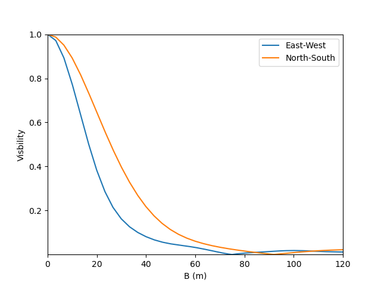

Let's now have a look at the model's parameters:

.. code-block:: ipython3

    pprint(m.getParameters())

.. code-block::

    ... {'c1_Fits_Comp_dim': oimParam at 0x19c6201c820 : dim=128 ± 0  range=[1,inf] free=False ,
         'c1_Fits_Comp_f': oimParam at 0x19c6201c760 : f=1 ± 0  range=[0,1] free=True ,
         'c1_Fits_Comp_pa': oimParam at 0x19c00b9bbb0 : pa=0 ± 0 deg range=[-180,180] free=True ,
         'c1_Fits_Comp_scale': oimParam at 0x19c6201c9d0 : scale=1 ± 0  range=[-inf,inf] free=True ,
         'c1_Fits_Comp_x': oimParam at 0x19c6201c6a0 : x=0 ± 0 mas range=[-inf,inf] free=False ,
         'c1_Fits_Comp_y': oimParam at 0x19c6201c640 : y=0 ± 0 mas range=[-inf,inf] free=False }

In addition to the `x`, `y`, and `f` parameters, common to all components,
the
:func:`oimComponentFitsImage <oimodeler.oimComponent.oimComponentFitsImage>`
have three additional parameters:

* `dim`: The fixed size of the internal fits image (currently only square images are
  compatible).
* `pa`: The position of angle of the component (used for rotating the component).
* `scale`: A scaling factor for the component.

The position angle `pa` and the `scale` are both free parameters (as default) and
can be used for model fitting.

Let's try to rotate and scale our model and plot the image again.

.. code-block:: ipython3

    c.params['pa'].value = 45
    c.params['scale'].value = 2
    m.showModel(256, 0.04, legend=True, normPow=0.4, colorbar=False)

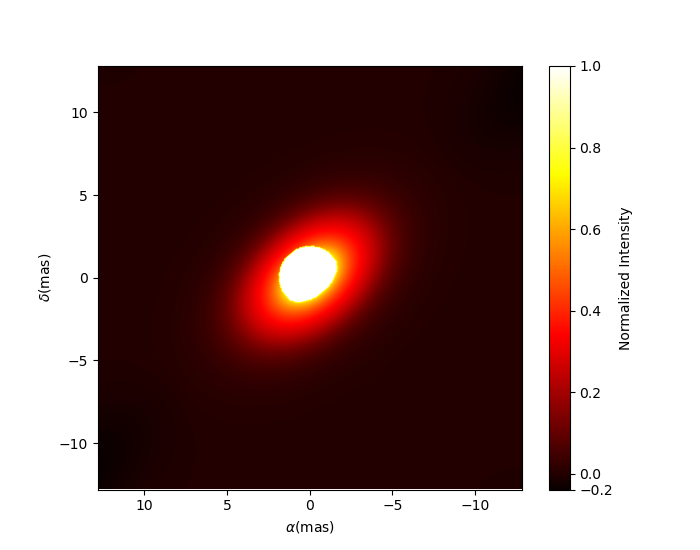

The :func:`oimComponentFitsImage <oimodeler.oimBasicFourierComponents.oimComponentFitsImage>`
can be combined with any kind of other component. Let's add a companion
(i.e., uniform disk) for our Be star model.

.. code-block:: ipython3

    c2 = oim.oimUD(x=20, d=1, f=0.03)
    m2 = oim.oimModel(c, c2)

We add a 1 mas companion located at 20 mas East of the central object with a flux
of 0.03. We can now plot the image of our new model.

.. code-block:: ipython3

    m2.showModel(256, 0.2, legend=True, normalize=True, fromFT=True, normPow=1, cmap="hot")

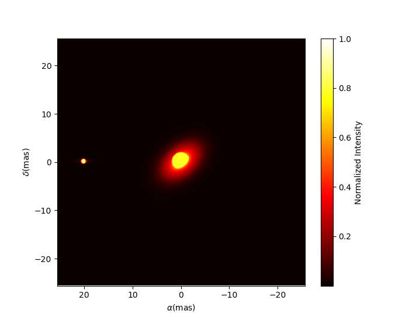

To finish this example, let's plot the visibility along North-South and East-West
baseline for our binary Be-star model.

.. code-block:: ipython3

    ccf = m2.getComplexCoherentFlux(spfx, spfy)
    v = np.abs(ccf)
    v = v/v.max()

    plt.figure()
    plt.plot(B, v[0:nB], label="East-West")
    plt.plot(B, v[nB:], label="North-South")
    plt.xlabel("B (m)")
    plt.ylabel("Visbility")
    plt.legend()
    plt.margins(0)

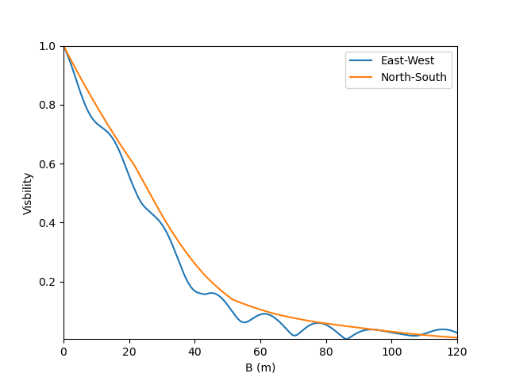

Using precomputed chromatic image-cube
~~~~~~~~~~~~~~~~~~~~~~~~~~~~~~~~~~~~~~

The :func:`oimComponentFitsImage <oimodeler.oimComponent.oimComponentFitsImage>` can als obe used to load chromatic
image-cubes in the fits format.

In this example we will use a chromatic image-cube computed around the
:math:`Br\,\gamma` emission line for a classical Be Star circumstellar disk. The model,
detailed in `Meilland et al. (2012) <https://ui.adsabs.harvard.edu/abs/2012A%26A...538A.110M/abstract>`_
was taken form the `AMHRA <https://amhra.oca.eu/AMHRA/bedisk/input.htm>`_ service of the JMMC.

The fits-formatted image-cube we will use, `KinematicsBeDiskModel.fits`, is located in the `./examples/AdvancedExamples`
directory.

.. code-block:: python

    path = Path(__file__).parent.parent.parent
    file_name = path / "examples" / "AdvancedExamples" / "KinematicsBeDiskModel.fits"

We build our model using a single component of the type
:func:`oimComponentFitsImage <oimodeler.oimComponent.oimComponentFitsImage>` which
allows to load fits images or image-cubes.

.. code-block:: python

    c = oim.oimComponentFitsImage(file_name)
    m = oim.oimModel(c)

We can now plot images of the model through the :math:`Br\gamma` emission line
(21661 :math:`\mu` m).

.. code-block:: python

    wl0, dwl, nwl = 2.1661e-6, 60e-10, 5
    wl = np.linspace(wl0-dwl/2, wl0+dwl/2, num=nwl)
    m.showModel(256, 0.04, wl=wl, legend=True, normPow=0.4, colorbar=False,
                figsize=(2, 2.5),
                savefig=save_dir / "FitsImageCube_BeDiskKinematicsModel_images.png")

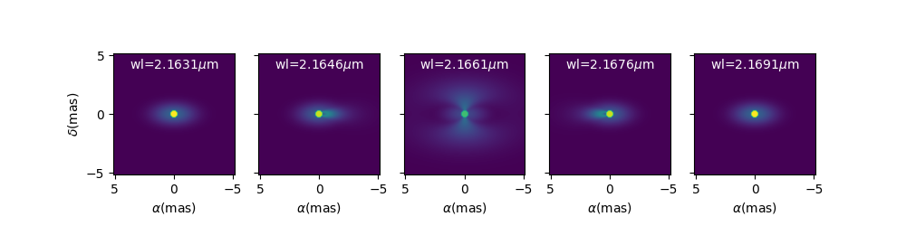

We now compute the visibility for a series of North-South and East-West baselines ranging
between 0 and 100m and with the wavelength ranging through the emission line.

.. code-block:: python

    nB = 1000
    nwl = 51
    wl = np.linspace(wl0-dwl/2, wl0+dwl/2, num=nwl)

    B = np.linspace(0, 100, num=nB//2)

    # 1st half of B array are baseline in the East-West orientation
    Bx = np.append(B, B*0)
    By = np.append(B*0, B)  # 2nd half are baseline in the North-South orientation

    Bx_arr = np.tile(Bx[None, :], (nwl, 1)).flatten()
    By_arr = np.tile(By[None, :], (nwl,  1)).flatten()
    wl_arr = np.tile(wl[:, None], (1, nB)).flatten()

    spfx_arr = Bx_arr/wl_arr
    spfy_arr = By_arr/wl_arr

    vc = m.getComplexCoherentFlux(spfx_arr, spfy_arr, wl_arr)
    v = np.abs(vc.reshape(nwl, nB))
    v = v/np.tile(v[:, 0][:, None], (1, nB))

Finally, we plot the results as a function of the wavelength and with a colorscale
in terms of the baseline length.

.. code-block:: python

    fig, ax = plt.subplots(1, 2, figsize=(8, 4))
    titles = ["East-West Baselines", "North-South Baselines"]

    for iB in range(nB):
        cB = (iB % (nB//2))/(nB//2-1)
        ax[2*iB//nB].plot(wl*1e9, v[:, iB],
                          color=plt.cm.plasma(cB))

    for i in range(2):
        ax[i].set_title(titles[i])
        ax[i].set_xlabel(r"$\lambda$ (nm)")
    ax[0].set_ylabel("Visibility")
    ax[1].get_yaxis().set_visible(False)

    norm = colors.Normalize(vmin=np.min(B), vmax=np.max(B))
    sm = cm.ScalarMappable(cmap=plt.cm.plasma, norm=norm)
    fig.colorbar(sm, ax=ax, label="B (m)")

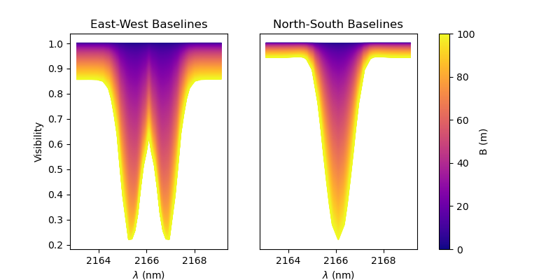

As expected, for a rotating disk (see `Meilland et al. (2012) <https://ui.adsabs.harvard.edu/abs/2012A%26A...538A.110M/abstract>`_
for more details), the visibility for the baselines along the major-axis show a W-shaped
profile through the line, whereas the visibliity along the minor-axis of the disk show
a V-shaped profile.

Radial-Profile components
-------------------------

.. csv-table:: Available radial profile components
   :file: table_ftbackends.csv
   :header-rows: 1  
   :delim: |
   :widths: auto

.. _Advanced parameters:

Advanced parameters
-------------------

Linking parameters
~~~~~~~~~~~~~~~~~~

chromatic & time-dependent Interpolator
~~~~~~~~~~~~~~~~~~~~~~~~~~~~~~~~~~~~~~~

